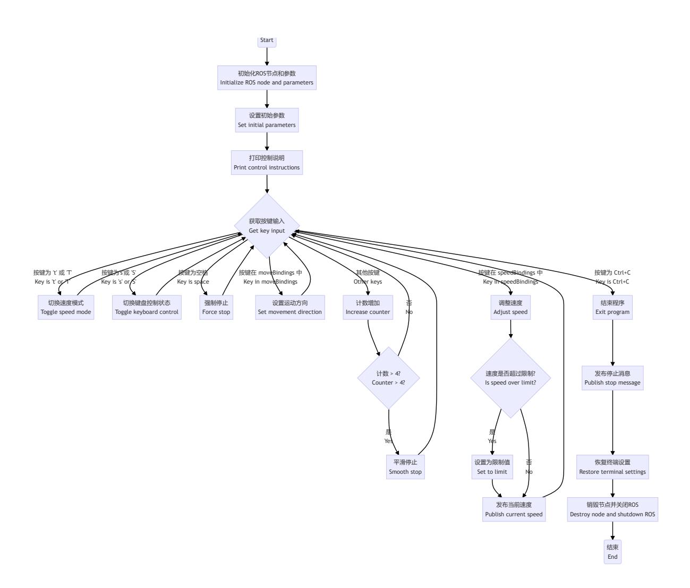

# **Keyboard Control**

#### **[Keyboard](#page-0-0) Control**

- <span id="page-0-0"></span>[1. Course](#page-0-1) Content
- [2. Preparation](#page-0-2)
  - 2.1 Content [Description](#page-0-3)
  - 2.2 [Starting](#page-0-4) the Agent
- [3. Running](#page-1-0) the Example
  - 3.1 Starting [Keyboard Control](#page-1-1)
  - 3.2 Key Control [Instructions](#page-1-2)
    - 3.2.1 [Direction](#page-2-0) Control
    - 3.2.2 [Speed Control](#page-2-1)
- [4. Source](#page-2-2) Code Analysis
  - 4.1 View the Node [Relationship Graph](#page-2-3)
  - 4.2 Viewing [Topic Messages](#page-3-0) and Message Types
  - 4.3 [Program Flowchart](#page-4-0)
  - 4.4 Source Code [Analysis](#page-6-0)
    - 4.41 [Published Topic: cmd\\_vel](#page-6-1)
    - 4.42 Movement Dictionary [and Speed Dictionary](#page-6-2)

# <span id="page-0-1"></span>**1. Course Content**

Learn how to control robot movement using the keyboard and its principles.

After running the program, use keyboard keys to publish speed topics to control the robot chassis' movement.

# <span id="page-0-2"></span>**2. Preparation**

### <span id="page-0-3"></span>**2.1 Content Description**

This course uses the Jetson Orin NX as an example. For Raspberry Pi and Jetson Nano boards, you need to open a terminal and enter the command to enter the Docker container. Once inside the Docker container, enter the commands mentioned in this course in the terminal. For instructions on entering the Docker container, refer to the product tutorial **[Configuration and Operation Guide] - [Entering the Docker (Jetson Nano and Raspberry Pi 5 users see here)]**. For Orin and NX boards, simply open a terminal and enter the commands mentioned in this course.

### <span id="page-0-4"></span>**2.2 Starting the Agent**

**Note: The Docker agent must be started before testing all examples. If it's already started, you don't need to restart it.**

Enter the command in the vehicle terminal:

```
sh start_agent.sh
```

The terminal prints the following message, indicating a successful connection.

## **3. Running the Example**

### **3.1 Starting Keyboard Control**

#### **Note:**

<span id="page-1-1"></span><span id="page-1-0"></span>The Jetson Nano and Raspberry Pi series controllers must first enter the Docker container (for steps, see the [Docker Course Section - Entering the Robot's Docker Container]).

Run the keyboard control node on the vehicle terminal or in the virtual machine:

```
ros2 run yahboomcar_ctrl yahboom_keyboard
```

### <span id="page-1-2"></span>**3.2 Key Control Instructions**

#### <span id="page-2-0"></span>**3.2.1 Direction Control**

| [i] or [I] | [linear, 0]   | [u] or [U] | [linear, angular]   |
|------------|---------------|------------|---------------------|
| [,]        | [-linear, 0]  | [o] or [O] | [linear, -angular]  |
| [j] or [J] | [0, angular]  | [m] or [M] | [-linear, -angular] |
| [l] or [L] | [0, -angular] | [.]        | [-linear, angular]  |

#### <span id="page-2-1"></span>**3.2.2 Speed Control**

| Key | Speed Change                                          | Key | Speed Change                                          |
|-----|-------------------------------------------------------|-----|-------------------------------------------------------|
| 【q】 | Increase both linear and angular<br>velocities by 10% | 【z】 | Decrease both linear and<br>angular velocities by 10% |
| 【w】 | Increase only linear velocity by<br>10%               | 【x】 | Decrease only linear velocity by<br>10%               |
| 【e】 | Increase only angular velocity by<br>10%              | 【c】 | Decrease only angular velocity<br>by 10%              |
| 【t】 | Switch linear velocity between X<br>axis and Y-axis   | 【s】 | Stop keyboard control                                 |

# <span id="page-2-2"></span>**4. Source Code Analysis**

Source code path:

jetson orin nano, jetson orin NX:

/home/jetson/yahboomcar\_ws/src/yahboomcar\_ctrl/yahboomcar\_ctrl/yahboom\_keyboard. py

Jetson Orin Nano, Raspberry Pi:

You need to enter Docker first.

<span id="page-2-3"></span>root/yahboomcar\_ws/src/yahboomcar\_ctrl/yahboomcar\_ctrl/yahboom\_keyboard.py

### **4.1 View the Node Relationship Graph**

Open a terminal and enter the command:

ros2 run rqt\_graph rqt\_graph


From the node relationship diagram, we can see:

**yahboom\_keyboard\_ctrl**: Controls the robot chassis by publishing the **/cmd\_vel** topic

**/YB\_Node**: The robot chassis node subscribes to the **/cmd\_vel** topic and uses the inverse kinematic solution to calculate the speed of each wheel, thereby controlling the robot's movement.

### <span id="page-3-0"></span>**4.2 Viewing Topic Messages and Message Types**

Open a terminal and enter the command:

```
ros2 topic echo /cmd_vel
```

When controlling the robot chassis' movements using the keyboard, data is published to the **/cmd\_vel** topic by printing messages.

Enter the following command to view the message type of the **/cmd\_vel** topic:

```
ros2 topic info /cmd_vel
```

The Type column indicates that the message type of the **/cmd\_vel** topic is **geometry\_msgs/msg/Twist**. Enter the following command to view the composition of the **geometry\_msgs/msg/Twist** message type:

```
ros2 interface show geometry_msgs/msg/Twist
```

From the composition of the above message types, we can see that the robot chassis movement is controlled by two vector groups: linear (linear velocity) and angular (angular velocity). Each data element is a float64 floating-point number. The following explains the meaning of each data element.

linear float64 x: x-axis velocity float64 y: y-axis velocity float64 z: z-axis velocity

angular float64 x: x-axis angular velocity float64 y: y-axis angular velocity float64 z: z-axis velocity : z-axis angular velocity

Because the robot chassis can only move within a two-dimensional plane, only linear-x (x-axis velocity), linear-y (y-axis velocity), and angular-z (z-axis angular velocity) are published when controlling the robot via the keyboard.

### <span id="page-4-0"></span>**4.3 Program Flowchart**



### <span id="page-6-0"></span>**4.4 Source Code Analysis**

Source Code Path:

Jetson Orin Nano, Jetson Orin NX:

```
/home/jetson/yahboomcar_ws/src/yahboomcar_ctrl/yahboomcar_ctrl/yahboom_keyboard.
py
```

Jetson Orin Nano, Raspberry Pi:

You need to first enter Docker.

```
root/yahboomcar_ws/src/yahboomcar_ctrl/yahboomcar_ctrl/yahboom_keyboard.py
```

#### **4.41 Published Topic: cmd\_vel**

```
pub = rospy.Publisher('cmd_vel', Twist, queue_size=1)
```

Just package the speed and publish it via pub.publish(twist). The chassis' speed subscriber will receive the speed data and then drive the car.

#### **4.42 Movement Dictionary and Speed Dictionary**

The movement dictionary mainly stores characters related to direction control

```
moveBindings = {
    'i': (1, 0),
    'o': (1, -1),
    'j': (0, 1),
    'l': (0, -1),
    'u': (1, 1),
    ',': (-1, 0),
    '.': (-1, 1),
    'm': (-1, -1),
    'I': (1, 0),
    'O': (1, -1),
    'J': (0, 1),
    'L': (0, -1),
    'U': (1, 1),
    'M': (-1, -1),
}
```

The speed dictionary mainly stores the characters related to speed control

```
speedBindings = {
    'Q': (1.1, 1.1),
    'Z': (.9, .9),
    'W': (1.1, 1),
    'X': (.9, 1),
    'E': (1, 1.1),
    'C': (1, .9),
    'q': (1.1, 1.1),
    'z': (.9, .9),
    'w': (1.1, 1),
```

```
'x': (.9, 1),
    'e': (1, 1.1),
    'c': (1, .9),
}
```

#### **4.43 Get the current key information**

```
def getKey(self):
    tty.setraw(sys.stdin.fileno())
    rlist, _, _ = select.select([sys.stdin], [], [], 0.1)
    if rlist: key = sys.stdin.read(1)
    else: key = ''
    termios.tcsetattr(sys.stdin, termios.TCSADRAIN, self.settings)
    return key
```

#### **4.44 Determine the key value and publish the /cmd\_vel speed topic**

```
while (1):
    key = yahboom_keyboard.getKey()
    if key=="t" or key == "T": xspeed_switch = not xspeed_switch
    elif key == "s" or key == "S":
        print ("stop keyboard control: {}".format(not stop))
        stop = not stop
    if key in moveBindings.keys():
        x = moveBindings[key][0]
        th = moveBindings[key][1]
        count = 0
    elif key in speedBindings.keys():
        speed = speed * speedBindings[key][0]
        turn = turn * speedBindings[key][1]
        count = 0
        if speed > yahboom_keyboard.linenar_speed_limit:
            speed = yahboom_keyboard.linenar_speed_limit
            print("Linear speed limit reached!")
        if turn > yahboom_keyboard.angular_speed_limit:
            turn = yahboom_keyboard.angular_speed_limit
            print("Angular speed limit reached!")
        print(yahboom_keyboard.vels(speed, turn))
        if (status == 14): print(msg)
        status = (status + 1) % 15
    elif key == ' ': (x, th) = (0, 0)
    else:
        count = count + 1
        if count > 4: (x, th) = (0, 0)
        if (key == '\x03'): break
    if xspeed_switch: twist.linear.x = speed * x
    else: twist.linear.y = speed * x
    twist.angular.z = turn * th
    if not stop: yahboom_keyboard.pub.publish(twist)
    if stop:yahboom_keyboard.pub.publish(Twist())
```