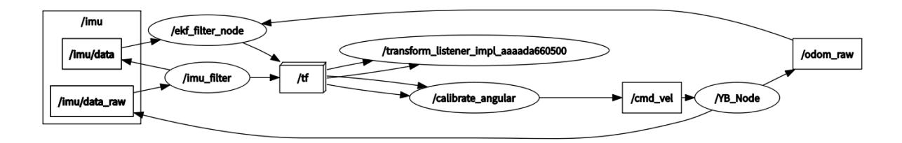

# **Angular velocity calibration**

#### **[Angular velocity calibration](#page-0-0)**

- <span id="page-0-0"></span>[1. Course](#page-0-1) Content
- [2. Preparation](#page-0-2)
  - 2.1 Content [Description](#page-0-3)
  - 2.2 Start the [Agent](#page-0-4)
- [3. Run](#page-1-0) the case
  - 3.1 [Startup Program](#page-1-1)
  - 3.2 Start [calibration](#page-2-0)
  - 3.3 Writing calibration [parameters](#page-3-0) to the chassis
- <span id="page-0-1"></span>[4. Source](#page-4-0) code analysis
  - 4.1 View the node [relationship diagram](#page-5-0)
  - 4.2 Source code [analysis](#page-5-1)

# **1. Course Content**

Learn the function of robot angular velocity calibration

Run the angular velocity calibration program. After clicking Start on the visual interface, the robot chassis will begin to rotate and will stop when the error is less than the tolerance value.

# <span id="page-0-2"></span>**2. Preparation**

# <span id="page-0-3"></span>**2.1 Content Description**

This course uses the Jetson Orin NX as an example. For Raspberry Pi and Jetson Nano boards, you need to open a terminal and enter the command to enter the Docker container. Once inside the Docker container, enter the commands mentioned in this course in the terminal. For instructions on entering the Docker container, refer to the product tutorial **[Configuration and Operation Guide] - [Entering the Docker (Jetson Nano and Raspberry Pi 5 users see here)]**. For Orin and NX boards, simply open a terminal and enter the commands mentioned in this course.

# <span id="page-0-4"></span>**2.2 Start the Agent**

**calibrate\_angular Note: All test cases must start the docker agent first. If it has already been started, there is no need to start it again**

Enter the command in the vehicle terminal:

sh start\_agent.sh

The terminal prints the following information, indicating that the connection is successful


# **3. Run the case**

#### **Notice:**

<span id="page-1-1"></span><span id="page-1-0"></span>**Jetson Nano and Raspberry Pi** series controllers need to enter the Docker container first (please refer to the [Docker course chapter - Entering the robot's Docker container] for steps).

## **3.1 Startup Program**

The vehicle computer opens the terminal and runs the angular velocity calibration node:

ros2 launch calibration calibrate\_angular.launch.py

Open the dynamic parameter adjuster in the virtual machine terminal and run:

```
ros2 run rqt_reconfigure rqt_reconfigure
```

**Click the calibrate\_angular** node in the node options on the left :


**Note:** The above nodes may not be present when you first open the application. Click Refresh to see all nodes. The **calibrate\_angular** node displayed is the node for calibrating angular velocity.

Other parameters of the rqt interface are described as follows:

- test\_angle: calibration test angle, here the test rotates 360 degrees;
- speed: angular velocity;
- Tolerance: the tolerance allowed for error;
- odom\_angular\_scale\_correction: Linear velocity proportional coefficient. If the test result is not ideal, modify this value.
- start\_test: test switch;
- base\_frame: the name of the base coordinate system;
- <span id="page-2-0"></span>odom\_frame: The name of the odometry coordinate frame.

### **3.2 Start calibration**

In the rqt\_reconfigure interface, select the calibrate\_angular node. There is a **start\_test** node below . Click the box to the right of it to start calibration.

Click start\_test to start calibration. The car will monitor the TF transformation of base\_footprint and odom, calculate the theoretical rotation angle of the car, and issue a stop command when the error is less than tolerance.

If the actual rotation angle of the car is not 360 degrees, then modify the odom\_angular\_scale\_correction parameter in rqt. After modification, click a blank space, click start\_test again, reset start\_test, and then click start\_test again to calibrate. Modifying other parameters is the same. You need to click a blank space to write the modified parameters. Record the last calibrated **odom\_angular\_scale\_correction** parameter

### <span id="page-3-0"></span>**3.3 Writing calibration parameters to the chassis**

To write parameters to the chassis, you need to disconnect the chassis agent first. Press **ctrl+c** or directly close the chassis connection agent terminal.

**Open the config\_robot.py** file in the home directory of the vehicle


Uncomment line 552, enter the previous calibration coefficients in the brackets of **robot.set\_ros\_scale\_angluar(xx) , and click Save** .

Open a terminal on the car and enter the command:

```
python3 config_robot.py
```

Wait for the parameter writing to be completed. The ros\_scale\_angluar:1.000 printed in the terminal information is the written parameter, and the chassis angular velocity calibration is completed.

# **4. Source code analysis**

Source code path:

jetson orin nano, jetson orin NX host:

```
/home/jetson/M3Pro_ws/src/calibration/calibration/calibrate_angular.py
```

Jetson Orin Nano, Raspberry Pi host:

You need to enter docker first

### <span id="page-5-0"></span>**4.1 View the node relationship diagram**

Open a terminal on the virtual machine and enter the command:

```
ros2 run rqt_graph rqt_graph
```



In the above node relationship diagram:

- **The imu\_filter node is responsible for filtering the original IMU data /imu/data** of the chassis and publishing the filtered data **/imu/data**
- **The /ekf\_filter\_node** node subscribes to the chassis raw odometer **/odom\_raw** and filtered IMU data **/imu/data** , performs data fusion and publishes to the **/odom** topic
- <span id="page-5-1"></span>**The calibrate\_angular** node monitors the TF transformation of odom->base\_footprint and publishes the /cmd\_vel topic to control the movement of the robot chassis.

# **4.2 Source code analysis**

Among them, the implementation of monitoring tf coordinate transformation is the get\_odom\_angle method in the Calibrateangular class:

```
def get_odom_angle ( self ):
     try :
        now = rclpy . time . Time ()
        rot = self . tf_buffer . lookup_transform (
            self . base_frame ,
            self . odom_frame ,
            now ,
            timeout = rclpy . duration . Duration ( seconds = 1.0 ))
        cacl_rot = PyKDL . Rotation . Quaternion ( rot . transform . rotation .
x , rot . transform . rotation . y , rot . transform . rotation . z , rot .
transform . rotation . w )
        #print("cacl_rot: ",cacl_rot)
        angle_rot = cacl_rot . GetRPY ()[ 2 ]
        #print("angle_rot: ",angle_rot)
     except ( LookupException , ConnectivityException , ExtrapolationException
):
        # self.get_logger().info('transform not ready')
        return
```

The on\_timer (timer callback function) method in the Calibrateangular class is used to determine the rotation angle of the robot chassis and control the chassis movement:

```
def on_timer ( self ):
```

```
self . start_test = self . get_parameter ( 'start_test' ).
get_parameter_value (). bool_value
    self . odom_angular_scale_correction = self . get_parameter (
'odom_angular_scale_correction' ) . get_parameter_value () . double_value
    self . test_angle = self . get_parameter ( 'test_angle' ) .
get_parameter_value () . double_value
    self . test_angle = radians ( self . test_angle ) # Convert angle to radians
    self . speed = self . get_parameter ( 'speed' ). get_parameter_value ().
double_value
    move_cmd = Twist ()
    self . test_angle *= self . reverse
    #self.test_angle *= self.reverse
    #self.error = self.test_angle - self.turn_angle
    if self . start_test :
        self . error = self . turn_angle - self . test_angle
        if abs ( self . error ) > self . tolerance :
            #move_cmd.linear.x = 0.2
            move_cmd . angular . z = copysign ( self . speed , self . error )
            #print("angular: ",move_cmd.angular.z)
            self . cmd_vel . publish ( move_cmd )
            self . odom_angle = self . get_odom_angle ()
            self . delta_angle = self . odom_angular_scale_correction * self .
normalize_angle ( self . odom_angle - self . first_angle )
            #print("delta_angle: ",self.delta_angle)
            self . turn_angle += self . delta_angle
            print ( "turn_angle: " , self . turn_angle , flush = True )
            #self.error = self.test_angle - self.turn_angle
            print ( "error: " , self . error , flush = True )
            self . first_angle = self . odom_angle
            #print("first_angle: ",self.first_angle)
        else :
            self . error = 0.0
            self . turn_angle = 0.0
            print ( "done" , flush = True )
            self . first_angle = 0
            self . reverse = - self . reverse
            self . start_test = rclpy . parameter . Parameter ( 'start_test' ,
rclpy . Parameter . Type . BOOL , False )
            all_new_parameters = [ self . start_test ]
            self . set_parameters ( all_new_parameters )
    else :
        self . error = 0.0
        self . cmd_vel . publish ( Twist ())
        self . turn_angle = 0.0
        self . start_test = rclpy . parameter . Parameter ( 'start_test' ,
rclpy . Parameter . Type . BOOL , False )
        all_new_parameters = [ self . start_test ]
        self . set_parameters ( all_new_parameters )
```