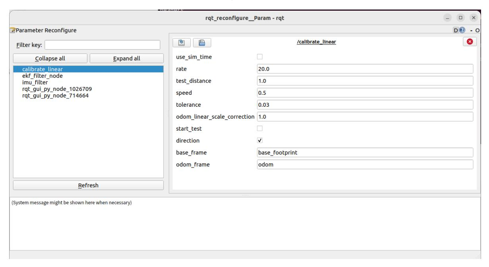
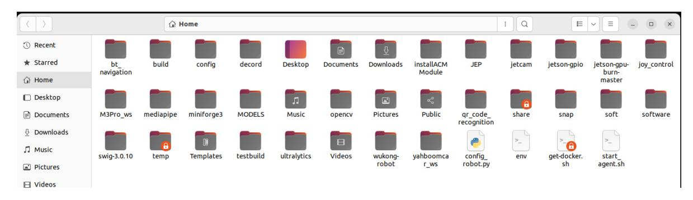
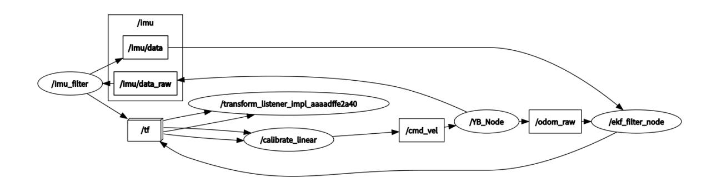

# **Linear speed calibration**

#### **[Linear speed](#page-0-0) calibration**

- <span id="page-0-0"></span>[1. Course](#page-0-1) Content
- [2. Preparation](#page-0-2)
  - 2.1 Content [Description](#page-0-3)
  - 2.2 Start the [Agent](#page-0-4)
- [3. Run](#page-1-0) the case
  - 3.1 [Startup Program](#page-1-1)
  - 3.2 Start [calibration](#page-3-0)
  - 3.3 Writing calibration [parameters](#page-3-1) to the chassis
- <span id="page-0-1"></span>4. Code [explanation](#page-5-0)
  - 4.1 View the node [relationship diagram](#page-5-1)
  - 4.2 Source code [analysis](#page-6-0)

## **1. Course Content**

Learn the function of robot linear speed calibration. After running the program, click Start on the visual interface. The robot chassis will start to move forward and stop when the error is less than the tolerance value.

# <span id="page-0-2"></span>**2. Preparation**

#### <span id="page-0-3"></span>**2.1 Content Description**

This course uses the Jetson Orin NX as an example. For Raspberry Pi and Jetson Nano boards, you need to open a terminal and enter the command to enter the Docker container. Once inside the Docker container, enter the commands mentioned in this course in the terminal. For instructions on entering the Docker container, refer to the product tutorial **[Configuration and Operation Guide] - [Entering the Docker (Jetson Nano and Raspberry Pi 5 users see here)]**. For Orin and NX boards, simply open a terminal and enter the commands mentioned in this course.

### <span id="page-0-4"></span>**2.2 Start the Agent**

**Note: To test all cases, you must start the docker agent first. If it has already been started, you do not need to start it again.**

Enter the command in the vehicle terminal:

sh start\_agent.sh

The terminal prints the following information, indicating that the connection is successful

### **3. Run the case**

#### **Notice:**

<span id="page-1-1"></span><span id="page-1-0"></span>**Jetson Nano and Raspberry Pi** series controllers need to enter the Docker container first (please refer to the [Docker course chapter - Entering the robot's Docker container] for steps).

#### **3.1 Startup Program**

Run the Linear Speed Calibration node:

ros2 launch calibration calibrate\_linear.launch.py

If the error message is displayed as follows when running for the first time, indicating that there is no tf transformation, press **ctrl+c** to exit the program and run it again.

Open the dynamic parameter adjuster and run in the terminal:

```
ros2 run rqt_reconfigure rqt_reconfigure
```

#### **Click the calibrate\_linear** node in the node options on the left :



**Note:** The above nodes may not be present when you first open the application. Click Refresh to see all nodes. The **calibrate\_linear** node shown is the node for calibrating linear velocity.

The rqt interface parameters are described as follows:

- test\_distance: calibration test distance, here the test is to walk forward 1 meter;
- speed: linear speed;
- Tolerance: the tolerance allowed for error;
- odom\_linear\_scale\_correction: linear velocity proportional coefficient. If the test result is not ideal, modify this value.
- start\_test: test switch;
- Direction: can be ignored. This value is used for the McWheel structure trolley. After modification, the linear speed of left and right movement can be calibrated.

- <span id="page-3-0"></span>base\_frame: the name of the base coordinate system;
- odom\_frame: The name of the odometry coordinate frame.

#### **3.2 Start calibration**

In the rqt\_reconfigure interface, select the calibrate\_linear node (if it is not displayed, click **Refresh** ).

Select a reference of known length on the ground (tape measure, tile, etc.): Change **test\_distance** to the actual test distance. Here we take a 1 meter test distance as an example. Click the **start\_test** box to start calibration.

Click start\_test to start calibration. The car will monitor the TF transformation of base\_footprint and odom, calculate the theoretical distance the car has traveled, and wait until the error is less than tolerance. The terminal will print done after issuing the stop command. If the actual distance the car has traveled is less than 1m, increase the **odom\_linear\_scale\_correction** parameter appropriately. After modification, click a blank space, click start\_test again, reset start\_test, and then click start\_test again to calibrate. Modifying other parameters is the same. You need to click a blank space to write the modified parameters. Record the last calibrated **odom\_linear\_scale\_correction** parameter

### <span id="page-3-1"></span>**3.3 Writing calibration parameters to the chassis**

To write parameters to the chassis, you need to disconnect the chassis agent first. Press **ctrl+c** or directly close the chassis connection agent terminal.

**Open the config\_robot.py** file in the home directory of the vehicle .



Uncomment line 551, enter the previous calibration coefficients in the brackets of **robot.set\_ros\_scale\_line(xx) , and click Save** .

Open a terminal on the car and enter the command:

```
python3 config_robot.py
```

Wait for the parameter writing to be completed. The ros\_scale\_line:0.890 in the terminal print information is the written parameter, and the chassis linear speed calibration is completed.

# <span id="page-5-0"></span>**4. Code explanation**

Source code path:

jetson orin nano, jetson orin NX host:

```
/home/jetson/M3Pro_ws/src/patrol/patrol/patrol.py
```

Jetson Orin Nano, Raspberry Pi host:

You need to enter docker first

```
root/M3Pro_ws/src/patrol/patrol/patrol.py
```

### **4.1 View the node relationship diagram**

Open a terminal and enter the command:

```
ros2 run rqt_graph rqt_graph
```



In the above node relationship diagram:

- **The imu\_filter node is responsible for filtering the original IMU data /imu/data** of the chassis and publishing the filtered data **/imu/data**
- **The /ekf\_filter\_node** node subscribes to the chassis raw odometer **/odom\_raw** and filtered IMU data **/imu/data** , performs data fusion and publishes to the **/odom** topic

<span id="page-6-0"></span>**The calibrate\_linear** node monitors the TF transformation of odom->base\_footprint and publishes the /cmd\_vel topic to control the movement of the robot chassis.

#### **4.2 Source code analysis**

Among them, the implementation of monitoring tf coordinate transformation is the get\_position method in the CalibrateLinear class:

```
def get_position ( self ):
     try :
        now = rclpy . time . Time ()
        transform = self . tf_buffer . lookup_transform (
            self . base_frame ,
            self . odom_frame ,
            now ,
            timeout = rclpy . duration . Duration ( seconds = 1.0 ))
        return transform
     except ( LookupException , ConnectivityException , ExtrapolationException
):
        self . get_logger () . info ( 'transform not ready' )
        raise
```

The on\_timer method (timer callback function) in the CalibrateLinear class is used to determine the displacement of the robot chassis and control its movement:

```
def on_timer ( self ):
    move_cmd = Twist ()
    #self.get_param()
    self . start_test = self . get_parameter ( 'start_test' ).
get_parameter_value (). bool_value
    self . odom_linear_scale_correction = self . get_parameter (
'odom_linear_scale_correction' ) . get_parameter_value () . double_value
    self . direction = self . get_parameter ( 'direction' ). get_parameter_value
(). bool_value
    self . test_distance = self . get_parameter ( 'test_distance' ) .
get_parameter_value () . double_value
    self . tolerance = self . get_parameter ( 'tolerance' ). get_parameter_value
(). double_value
    self . speed = self . get_parameter ( 'speed' ). get_parameter_value ().
double_value
    if self . start_test :
        '''trans = self.tf_buffer.lookup_transform(
                    self.odom_frame,
                    self.base_frame,
                    now,
                    )'''
        self . position . x = self . get_position () . transform . translation .
x
        self . position . y = self . get_position () . transform . translation .
y
        self . get_logger () . info ( f"self.position.x: {self.position.x}" )
        self . get_logger () . info ( f"self.position.y: {self.position.y}" )
```

```
distance = sqrt ( pow (( self . position . x - self . x_start ), 2 ) +
                            pow (( self . position . y - self . y_start ), 2
))
        distance *= self . odom_linear_scale_correction
        # print("distance: ",distance)
        self . get_logger () . info ( f"distance: {distance}" )
        error = distance - self . test_distance
        # print("error: ",error)
        self . get_logger () . info ( f"error: {error}" )
        #start = time()
        if abs ( error ) < self . tolerance :
            self . start_test = rclpy . parameter . Parameter ( 'start_test' ,
rclpy . Parameter . Type . BOOL , False )
            all_new_parameters = [ self . start_test ]
            self . set_parameters ( all_new_parameters )
            self . get_logger () . info ( "done" )
        else :
            if self . direction :
                print ( "x" )
                move_cmd . linear . x = copysign ( self . speed , - 1 * error
)
            else :
                move_cmd . linear . y = copysign ( self . speed , - 1 * error
)
                print ( "y" )
        self . cmd_vel . publish ( move_cmd )
        #end = time()
    else :
        self . x_start = self . get_position () . transform . translation . x
        self . y_start = self . get_position () . transform . translation . y
        self . get_logger () . info ( f"self.x_start: {self.x_start}" )
        self . get_logger () . info ( f"self.y_start: {self.y_start}" )
        self . cmd_vel . publish ( Twist ())
```