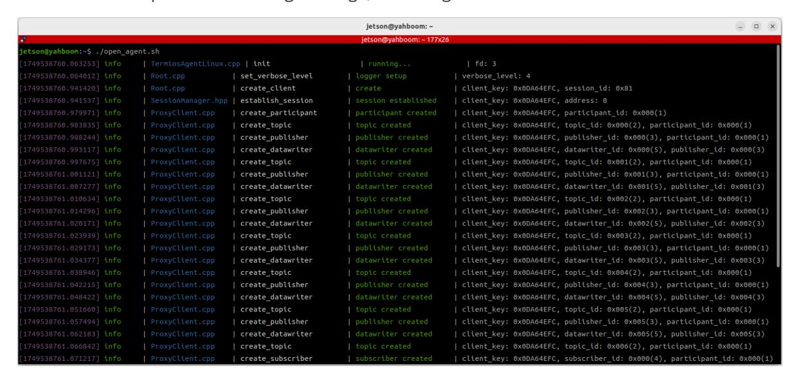
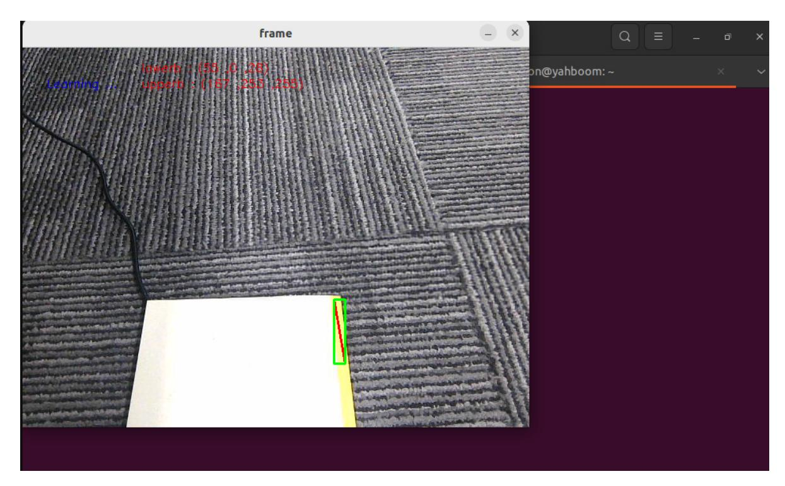
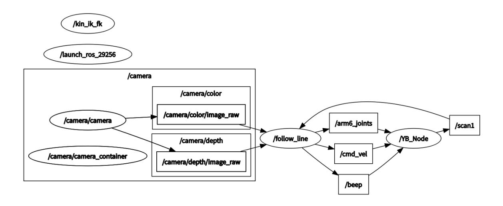
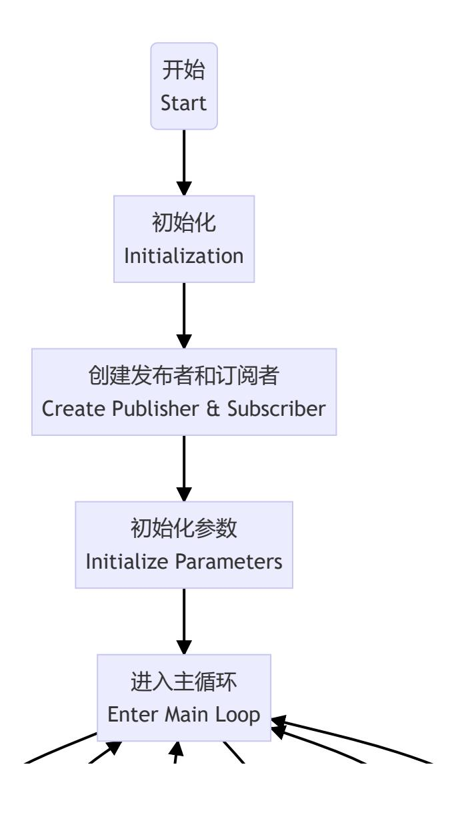
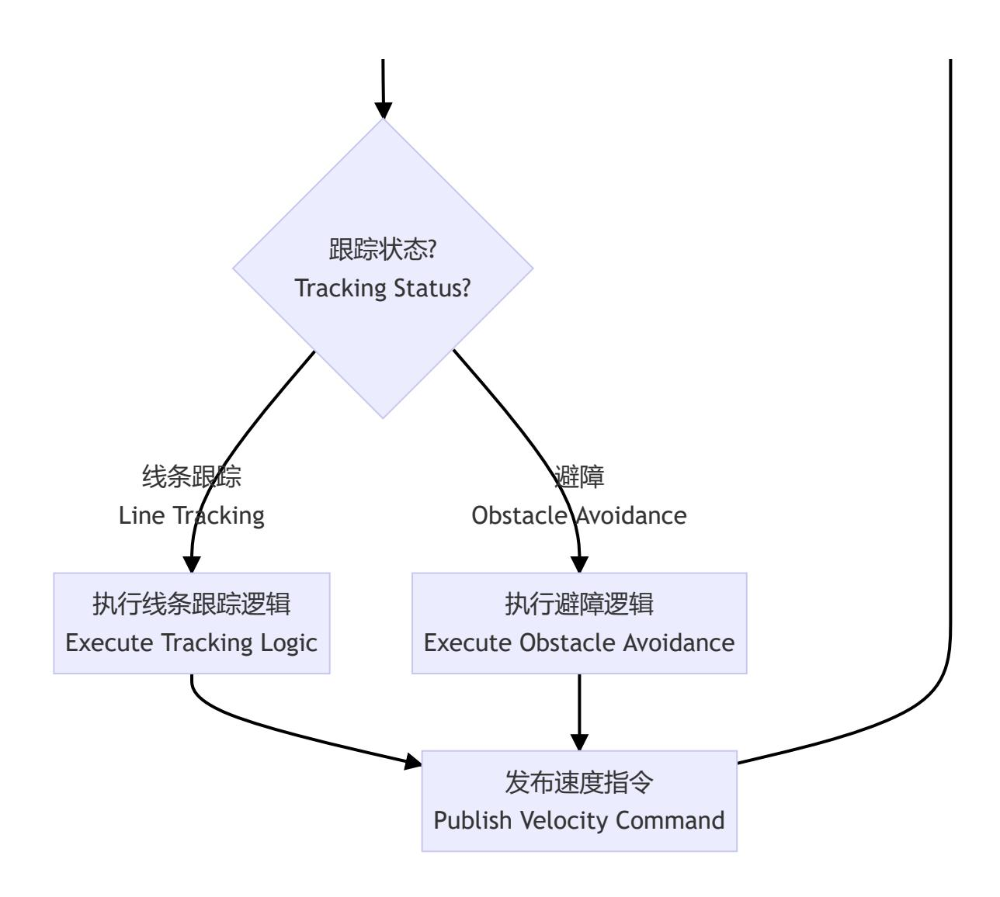

# **Autonomous Line Patrol**

#### **[Autonomous](#page-0-0) Line Patrol**

- <span id="page-0-0"></span>[1. Course](#page-0-1) Content
- [2. Preparation](#page-0-2)
  - 2.1 Content [Description](#page-0-3)
  - 2.2 [Starting](#page-0-4) the Agent
- [3. Running](#page-1-0) the Example
  - 3.1 Starting the [Program](#page-1-1)
  - 3.2 Color [Calibration](#page-2-0)
- <span id="page-0-1"></span>[4. Source](#page-3-0) Code Analysis
  - 4.1 View the Node [Relationship Graph](#page-3-1)
  - 4.2 [Program Flowchart](#page-4-0)
  - 4.3 Key [Programs](#page-6-0)

## **1. Course Content**

Learn the Robot's Autonomous Line Patrol Function

After starting the program, the robot will lock onto the landmark in front of it. Press the spacebar to start, and the robot will follow the ground landmark. If an obstacle appears along the way, the robot will pause and sound a buzzer until the landmark disappears and the robot stops moving.

# <span id="page-0-2"></span>**2. Preparation**

### <span id="page-0-3"></span>**2.1 Content Description**

This tutorial introduces the Dabai\_DCW2 depth camera used in the product and examines the camera node's output of color images, depth images, infrared images, and point clouds. This section requires entering commands in the terminal. The terminal you choose depends on the motherboard type.

This course uses the Jetson Orin NX as an example. For Raspberry Pi and Jetson Nano boards, you need to open a terminal and enter the command to enter the Docker container. Once inside the Docker container, enter the commands mentioned in this course in the terminal. For instructions on entering the Docker container, refer to the product tutorial **[Configuration and Operation Guide] - [Entering the Docker (Jetson Nano and Raspberry Pi 5 users see here)]**. For Orin and NX boards, simply open a terminal and enter the commands mentioned in this course.

For Orin and NX boards, simply open a terminal and enter the commands mentioned in this lesson.

### <span id="page-0-4"></span>**2.2 Starting the Agent**

**Note: The Docker agent must be started before testing all examples. If it's already started, you don't need to restart it.**

Enter the command in the vehicle terminal:

The terminal will print the following message, indicating a successful connection.



# **3. Running the Example**

#### **Note:**

<span id="page-1-1"></span><span id="page-1-0"></span>**Jetson Nano** and **Raspberry Pi** series controllers must first enter the Docker container (for steps, see the [Docker Course Section - Entering the Robot's Docker Container]).

### **3.1 Starting the Program**

First, start the depth camera runtime node in the vehicle terminal:

ros2 launch M3Pro\_demo camera\_arm\_kin.launch.py

Then open a terminal:

```
ros2 run M3Pro_demo follow_line
```

After launching the command, a graphics window titled **frame** will appear. A box will mark the landmark line. Press the spacebar to begin following the landmark line. If an obstacle appears ahead, the robot will stop following the line and the buzzer will sound an alarm. Once the obstacle is removed, the robot will continue to move until it reaches the end of the landmark line. The terminal will display **Not Found**, indicating that the landmark line was not found.


### <span id="page-2-0"></span>**3.2 Color Calibration**

The robot is factory-calibrated. If you find that the road marking color recognition is not ideal during line patrol, or if you need to change the color of the road marking, you will need to change the line patrol color.

After launching ros2 run M3Pro\_demo follow\_line in the previous step and the frame graphics window appears, press the R key on the keyboard to select a color. Hold down the left mouse button and draw a rectangular box within the color area (make sure the box is within the color range). Release the mouse button to automatically confirm the color.



After recalibrating the color, the terminal will prompt **Reset successful!!!**, indicating that the color calibration is complete.


# <span id="page-3-0"></span>**4. Source Code Analysis**

Source Code Path:

jetson orin nano, jetson orin NX:

```
/home/jetson/yahboomcar_ws/src/M3Pro_demo/M3Pro_demo/follow_line.py
```

Jetson Orin Nano, Raspberry Pi:

You need to enter Docker first.

```
root/yahboomcar_ws/src/M3Pro_demo/M3Pro_demo/follow_line.py
```

### **4.1 View the Node Relationship Graph**

Open a terminal and enter the command:

```
ros2 run rqt_graph rqt_graph
```



In the above node relationship graph:

The **follow\_Line** node subscribes to the camera topic for image information, performs line tracking, and subscribes to the /scan1 topic to determine whether there is an obstacle ahead. It controls the buzzer by publishing the **/beep** topic, the robotic arm by publishing the /**arm6\_joitns** topic, and the chassis movement by publishing the /**cmd\_vel** topic.

The **camera** node is the active camera node, responsible for publishing image information using ROS2 messages.

### **4.2 Program Flowchart**

<span id="page-4-0"></span>




### <span id="page-6-0"></span>**4.3 Key Programs**

The following explains the core of the program:

**Display:** Subscribes to the camera topic, converts the image into an OpenCV format image, and displays it.

**Program Implementation:** Callback function in the LineDetect class

```
def callback(self,color_frame,depth_frame):
    # 将画面转为 opencv 格式
    rgb_image = self.rgb_bridge.imgmsg_to_cv2(color_frame,'rgb8')
    rgb_image = np.copy(rgb_image)
    depth_image = self.depth_bridge.imgmsg_to_cv2(depth_frame, encoding[1])
    #depth_to_color_image = cv2.applyColorMap(cv2.convertScaleAbs(depth_image,
alpha=1.0), cv2.COLORMAP_JET)
    depth_img = cv2.resize(depth_image, (640, 480))
    self.depth_image_info = depth_img.astype(np.float32)
    self.tags = self.at_detector.detect(cv2.cvtColor(rgb_image,
cv2.COLOR_RGB2GRAY), False, None, 0.025)
    self.tags = sorted(self.tags, key=lambda tag: tag.tag_id)
    draw_tags(rgb_image, self.tags, corners_color=(0, 0, 255), center_color=(0,
255, 0))
```

```
#depth_image
    depth_image = self.depth_bridge.imgmsg_to_cv2(depth_frame, encoding[1])
    #depth_to_color_image = cv2.applyColorMap(cv2.convertScaleAbs(depth_image,
alpha=1.0), cv2.COLORMAP_JET)
    frame = cv2.resize(depth_image, (640, 480))
    depth_image_info = frame.astype(np.float32)
    action = cv2.waitKey(1)
    if self.count==True and self.Start_==True:
        if (time.time() - self.start_time)>3:
            self.Track_state = 'tracking'
            self.count = False
    result_img,bin_img = self.process(rgb_image,action)
    result_img = cv2.cvtColor(result_img, cv2.COLOR_RGB2BGR)
    if len(bin_img) != 0: cv.imshow('frame', ManyImgs(1, ([result_img,
bin_img])))
    else:cv.imshow('frame', result_img)
```

Line Patrol: Follows the road markings and stops when encountering an obstacle.

Implementation: Use the execute method in the LineDetect class.

```
def execute(self, point_x, color_radius):
    if self.Joy_active == True:
        if self.Start_state == True:
            self.PID_init()
            self.Start_state = False
        return
    self.Start_state = True
    if color_radius == 0:
        print("Not Found")
        self.pub_cmdVel.publish(Twist())
    else:
        twist = Twist()
        b = UInt16()
        [z_Pid, _] = self.PID_controller.update([(point_x - 320)*1.0/16, 0])
        #[z_Pid, _] = self.PID_controller.update([(point_x - 10)*1.0/16, 0])
        if self.img_flip == True: twist.angular.z = -z_Pid #-z_Pid
        #else: twist.angular.z = (twist.angular.z+z_Pid)*0.2
        else: twist.angular.z = +z_Pid
        #point_x = point_x
        #twist.angular.z=-(point_x-320)*1.0/128.0
        twist.linear.x = self.linear
        if self.front_warning > 10:
            print("Obstacles ahead !!!")
            self.pub_cmdVel.publish(Twist())
            self.Buzzer_state = True
            b.data = 1
            self.pub_Buzzer.publish(b)
        else:
            if self.Buzzer_state == True:
                b.data = 0
                for i in range(3): self.pub_Buzzer.publish(b)
                self.Buzzer_state = False
            if abs(point_x-320)<40:
```

```
#if abs(point_x-30)>40:
    twist.angular.z=0.0
if self.Joy_active == False:
    self.pub_cmdVel.publish(twist)
else:
    twist.angular.z=0.0
```