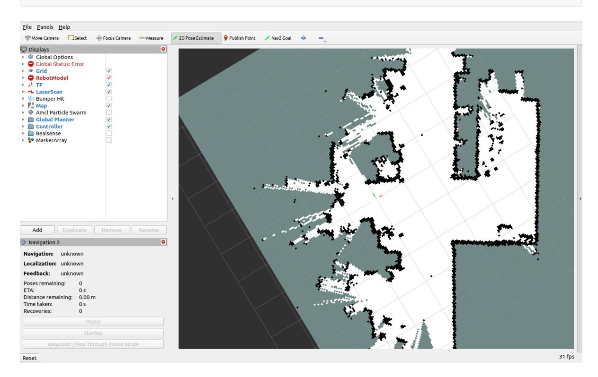
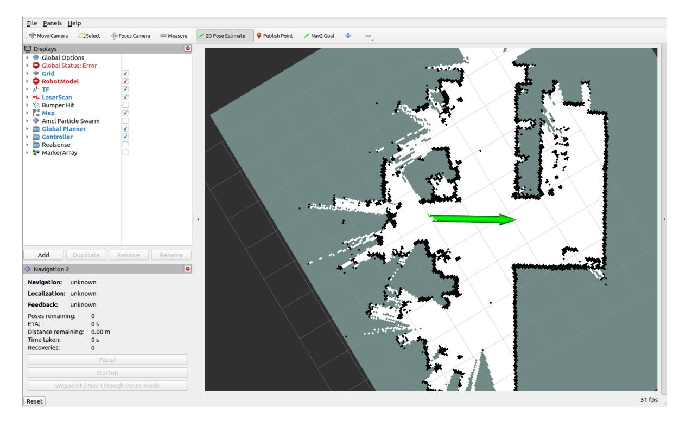
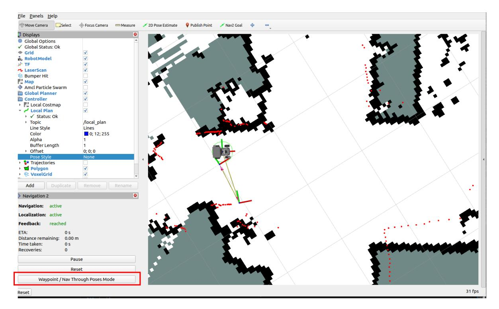
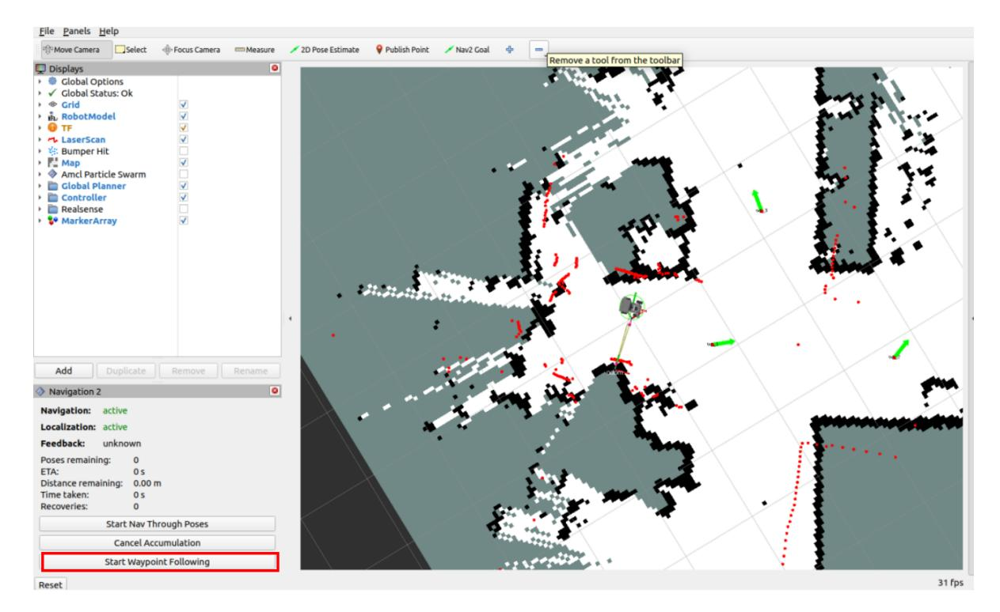
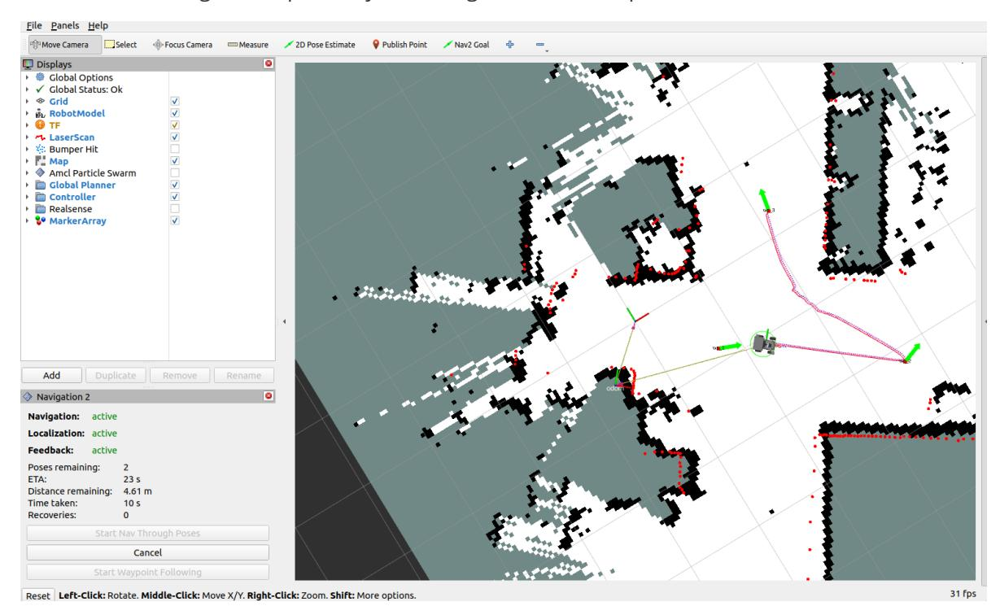
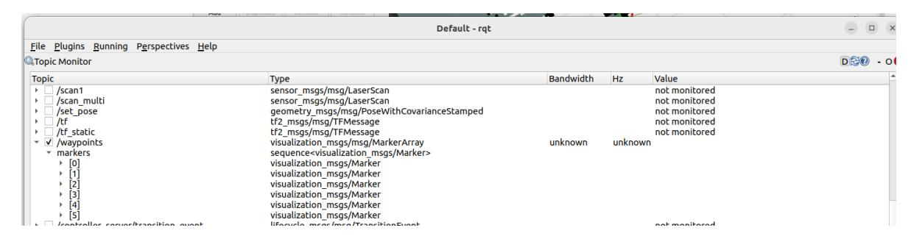
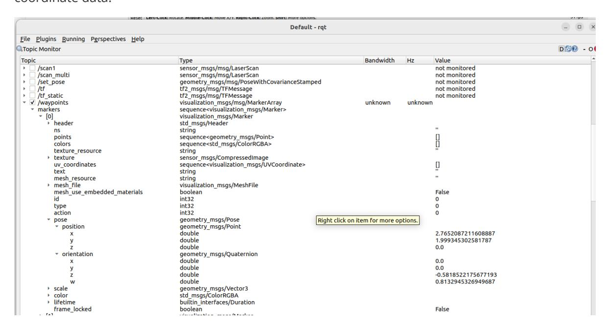
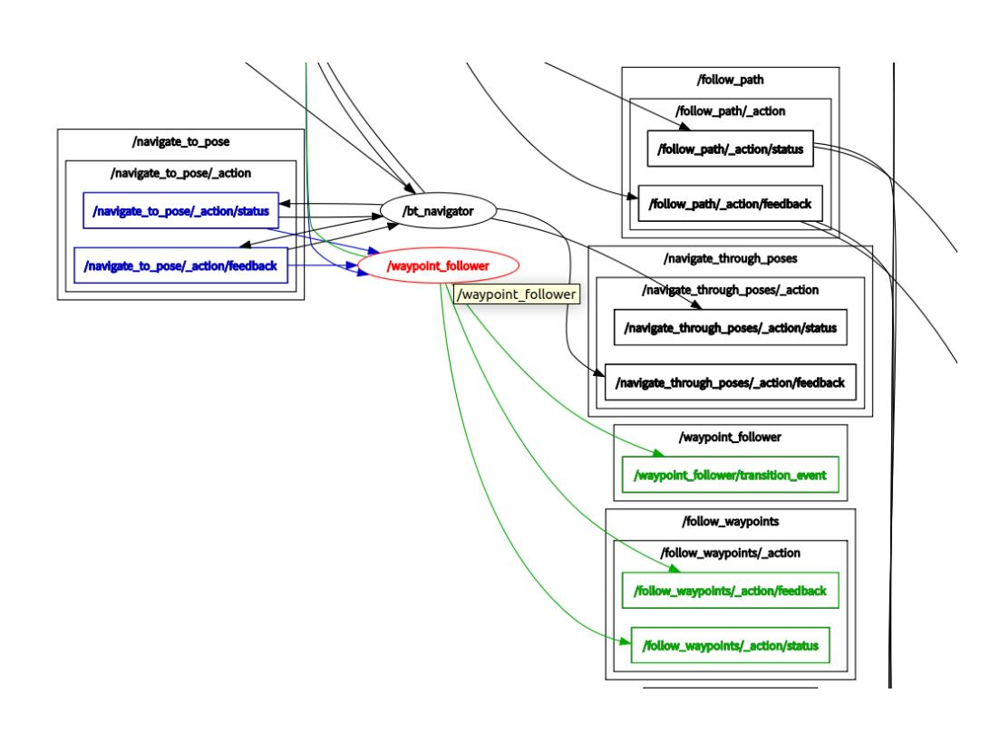

# **Navigation2 Multi-Point Navigation and Obstacle Avoidance**

<span id="page-0-0"></span>Navigation2 Multi-Point Navigation [and Obstacle](#page-0-0) Avoidance

- [1. Course](#page-0-1) Content
- [2. Preparation](#page-0-2)
  - 3.1 Content [Description](#page-0-3)
  - 3.2 [Starting](#page-0-4) the Agent
- [3. Running](#page-1-0) the Example
  - 3.1 [Multi-Point](#page-1-1) Navigation
- <span id="page-0-1"></span>[4. Principle](#page-5-0) Analysis
  - 4.1 [Waypoint](#page-5-1) Data
  - 4.2 Data [transmission](#page-6-0) execution

### **1. Course Content**

**Note:** This course requires you to have studied [Navigation2 Single-Point Navigation and Obstacle Avoidance] first and have a basic understanding of Navigation2 navigation.

Learn the robot's Navigation2 - Waypoint Multi-Point Navigation and Obstacle Avoidance function.

# <span id="page-0-2"></span>**2. Preparation**

### <span id="page-0-3"></span>**3.1 Content Description**

This lesson uses the Jetson Orin NX as an example. For Raspberry Pi and Jetson Nano boards, you need to open a terminal and enter the command to enter the Docker container. Once inside the Docker container, enter the commands mentioned in this lesson in the terminal. For instructions on entering the Docker container, refer to the product tutorial **[Configuration and Operation Guide]--[Entering the Docker (Jetson Nano and Raspberry Pi 5 users, see here)]**. For Orin and NX boards, simply open a terminal and enter the commands mentioned in this lesson.

### <span id="page-0-4"></span>**3.2 Starting the Agent**

**Note: The Docker agent must be started before testing all examples. If it's already started, you don't need to restart it.**

Enter the command in the vehicle terminal:

sh start\_agent.sh

The terminal prints the following message, indicating a successful connection.

# **3. Running the Example**

### **3.1 Multi-Point Navigation**

#### **Note:**

- <span id="page-1-1"></span><span id="page-1-0"></span>For Jetson Nano and Raspberry Pi series controllers, you must first enter the Docker container (see the [Docker Course Section - Entering the Robot's Docker Container] for steps).
- This section requires at least one existing map. Refer to any of the mapping courses, such as Gmapping-SLAM Mapping, Cartographer Mapping, or SLAM-Toolbox Mapping.

To start the underlying sensor on the robot terminal:

```
ros2 launch M3Pro_navigation base_bringup.launch.py
```

To start navigation again:

ros2 launch M3Pro\_navigation navigation2.launch.py

The rviz visualization function can be started on either the vehicle terminal or the virtual machine. You can choose either method. Do not start both the virtual machine and the vehicle terminal simultaneously:

For example, using a virtual machine, open a terminal and start the rviz visualization interface:

ros2 launch slam\_view nav\_rviz.launch.py

Command to launch the Rviz visualization interface on the vehicle:

ros2 launch M3Pro\_navigation nav\_rviz.launch.py



You can now see the map loading. Click [2D Pose Estimate] to set the initial pose for the car. Based on the car's actual position in the environment, click and drag the mouse in Rviz to move the car model to the set position. As shown in the figure below, if the radar scan area roughly overlaps with the actual obstacle, the pose is accurate.



After pose initialization is complete, the robot model and the red LiDAR 2D point cloud will appear in the rviz interface.


Click **[Waypoint/Nav Through Pose Mode]** in the lower left corner to enter multi-point navigation mode.



Click **MarkerArray** in the left-hand option bar to enable waypoint display, then click **Nav2 Goal**: Use your mouse to mark multiple target points on the map.


Click **Start Waypoint Following** in the lower left corner to begin multi-point navigation.



The robot car navigates sequentially according to the marked points.



# <span id="page-5-0"></span>**4. Principle Analysis**

### <span id="page-5-1"></span>**4.1 Waypoint Data**

Users open \*\*[Waypoint/Nav Through After entering multi-point navigation mode, user-marked point information will be published to the /waypoints topic (the rviz waypoint navigation plugin adds additional waypoints between target waypoints to smooth the path). We can view this waypoint data through the RQT interface.

VM terminal startup command:

ros2 run rqt\_graph rqt\_graph

In the rqt interface, we can see the topic **/waypoints**. After checking it, we can observe the data on the topic (you need to check the topic first, then publish the waypoints in the rviz interface). The waypoints we manually mark in rviz will be published to this topic.



Click on a waypoint to view the waypoint data. Here we take [0] as an example, where pose is the coordinate data.



#### <span id="page-6-0"></span>**4.2 Data transmission execution**

After setting the waypoint coordinates, click **Start Waypoint Following**, and the rviz plugin will package the waypoint coordinate sequence into a FollowWaypoints action request and send it to the /follow\_waypoint action server to execute all the waypoints in sequence.

Open a terminal in the virtual machine and enter the following command:

```
ros2 run rqt_graph rqt_graph
```

In the node relationship graph, you can see the **/follow\_waypoint** action server. This action server receives the waypoint sequence and navigates sequentially.

