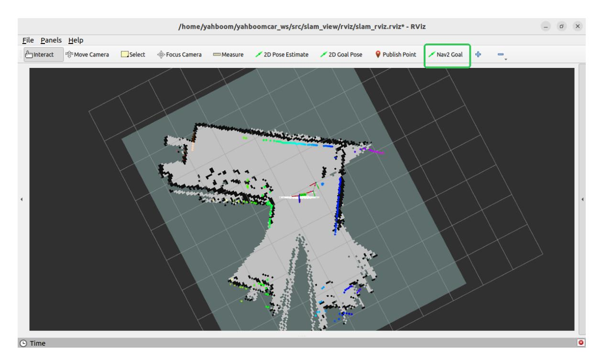

## **RTAB-Map Navigation**

[RTAB-Map Navigation](#page-0-0)

- <span id="page-0-0"></span>1. Content [Description](#page-0-1)
- [2. Preparation](#page-0-2)
- <span id="page-0-1"></span>[3. Command Analysis](#page-2-0)

## **1. Content Description**

This section explains how to implement RTAB-Map navigation by combining the car chassis, LiDAR, depth camera, and Navigation2.

This section requires entering commands in the terminal. The terminal you open depends on your motherboard type. This lesson uses the Raspberry Pi 5 as an example. For Raspberry Pi and Jetson-Nano boards, you need to open a terminal on the host computer and enter the command to enter the Docker container. Once inside the Docker container, enter the commands mentioned in this section in the terminal. For instructions on entering the Docker container from the host computer, refer to this product tutorial **[Configuration and Operation Guide]--[Entering the Docker (Jetson Nano and Raspberry Pi 5 users, see here)]**.

For Orin boards, simply open the terminal and enter the commands mentioned in this section.

## <span id="page-0-2"></span>**2. Preparation**

Due to performance limitations, the Raspberry Pi 5 and Jetson Nano cannot smoothly run the RTAB-Map algorithm in Docker on the motherboard. Therefore, a virtual machine is required to facilitate this. To enable distributed communication between the car and the virtual machine, two steps are required:

- Both systems must be on the same local area network. This is most easily achieved by connecting to the same Wi-Fi network.
- Both systems must have the same ROS\_DOMAIN\_ID. The default ROS\_DOMAIN\_ID for the car is 30, and the default ROS\_DOMAIN\_ID for the virtual machine is also 30. If they are different, you need to modify the virtual machine's ROS\_DOMAIN\_ID. To do this, modify the ~/.bashrc file and change the ROS\_DOMAIN\_ID value to match the car's. Save and exit the file, then enter the command source ~/.bashrc to refresh the environment variables.
- To verify distributed communication between the two systems, enter ros2 node list on the virtual machine. If you see **/YB\_Node**, communication is established.

The Orin motherboard can be run directly on the motherboard.

Also, you need to copy the map created using RTAB-Map to the terminal directory. In the virtual machine/Orin mainboard terminal, enter the following command to copy it:

```
cp ~/.ros/rtabmap.db ~
```

Then, open a terminal on the robot and enter the following command to start the chassis, radar, and camera.

ros2 launch M3Pro\_navigation rtab\_bringup.launch.py

Then, open a terminal in the virtual machine and enter the following command to control the robot arm to move to the navigation posture.

```
ros2 topic pub /arm6_joints arm_msgs/msg/ArmJoints {"joint1: 90,joint2:
180,joint3: 5,joint4: 0,joint5: 90,joint6: 0,time: 1500"} --once
```

Open a terminal in the virtual machine and enter the following command to start RTAB-Map.

```
ros2 launch rtabmap_launch rtabmap.launch.py rgb_topic:=/camera/color/image_raw
depth_topic:=/camera/depth/image_raw
camera_info_topic:=/camera/color/camera_info odom_topic:=/odom
frame_id:=base_link use_sim_time:=false rviz:=true rtabmap_viz:=false
approx_sync:=true approx_sync_max_interval:=0.01 qos:=2 frame_id:=base_link
visual_odometry:=false icp_odometry:=false subscribe_scan:=true
sync_queue_size:=50 topic_queue_size:=50 database_path:=/home/yahboom/rtabmap.db
namespace:=/
rviz_cfg:=/home/yahboom/yahboomcar_ws/src/slam_view/rviz/slam_rviz.rviz
rtabmap_args:="--Mem/IncrementalMemory false"
```

**\***If booting from an Orin motherboard, enter this command in the motherboard terminal:

```
ros2 launch rtabmap_launch rtabmap.launch.py rgb_topic:=/camera/color/image_raw
depth_topic:=/camera/depth/image_raw
camera_info_topic:=/camera/color/camera_info odom_topic:=/odom
frame_id:=base_link use_sim_time:=false rviz:=true rtabmap_viz:=false
approx_sync:=true approx_sync_max_interval:=0.01 qos:=2 frame_id:=base_link
visual_odometry:=false icp_odometry:=false subscribe_scan:=true
sync_queue_size:=50 topic_queue_size:=50 database_path:=/home/jetson/rtabmap.db
namespace:=/
rviz_cfg:=/home/jetson/yahboomcar_ws/src/slam_view/rviz/slam_rviz.rviz
rtabmap_args:="--Mem/IncrementalMemory false"
```

Then run the following command in the VM/Orin motherboard terminal to start Navigation 2.

```
ros2 launch nav2_bringup navigation_launch.py
```

After everything has successfully launched, it should look like the image below.



Then, using the [Nav2 Goal] tool in rivz, you can assign a target point to the car, and it will navigate to it.

## <span id="page-2-0"></span>**3. Command Analysis**

The RTAB-Map navigation commands are as follows. RTAB-Map here only performs positioning.

```
ros2 launch rtabmap_launch rtabmap.launch.py rgb_topic:=/camera/color/image_raw
depth_topic:=/camera/depth/image_raw
camera_info_topic:=/camera/color/camera_info odom_topic:=/odom
frame_id:=base_link use_sim_time:=false rviz:=true rtabmap_viz:=false
approx_sync:=true approx_sync_max_interval:=0.01 qos:=2 frame_id:=base_link
visual_odometry:=false icp_odometry:=false subscribe_scan:=true
sync_queue_size:=50 topic_queue_size:=50 database_path:=/home/yahboom/rtabmap.db
namespace:=/
rviz_cfg:=/home/yahboom/yahboomcar_ws/src/slam_view/rviz/slam_rviz.rviz
rtabmap_args:="--Mem/IncrementalMemory false"
```

- rgb\_topic: Color image topic
- depth\_topic: Depth image topic
- camera\_info\_topic: Color camera internal reference topic
- odom\_topic: Odometry topic
- frame\_id: Robot base coordinate system name
- use\_sim\_time: Whether to use simulation time
- rviz: Whether to enable rviz display
- rtabmap\_viz: Whether to enable rtabmap plugin display
- approx\_sync: Whether to enable approximate time synchronization
- approx\_sync\_max\_interval: Maximum allowed synchronization time difference
- visual\_odometry: Whether to enable visual odometry
- icp\_odometry: Whether to enable ICP point cloud matching odometry
- subscribe\_scan: Whether to subscribe to lidar data

- sync\_queue\_size: Time synchronization queue size
- topic\_queue\_size: Single-topic subscription queue size
- database\_path: Map database path
- namespace: Namespace
- rviz\_cfg: Rviz file path
- rtabmap\_args: Parameters passed directly to the RTAB-MAP core. Optional parameters include:
  - --delete\_db\_on\_start : Clear the previous map database on startup
  - --Mem/IncrementalMemory false : Disable incremental memory mode (for pure positioning)
  - --Rtabmap/DetectionRate 2 : Set the closed-loop detection rate (Hz)
- qos: Quality of Service (QoS policy). Optional parameters include:
  - 0: SYSTEM\_DEFAULT
  - 1: RELIABLE (guaranteed delivery)
  - 2: BEST\_EFFORT (possible loss)