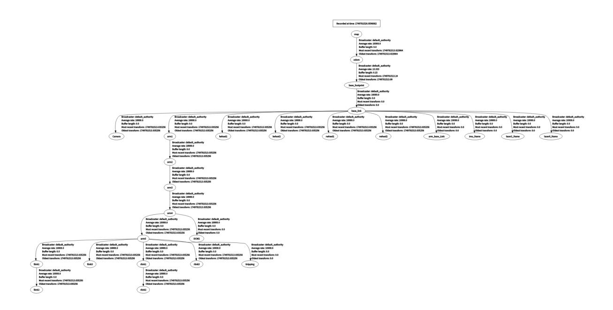

# **Gmapping-SLAM mapping**

#### **[Gmapping-SLAM](#page-0-0) mapping**

- <span id="page-0-0"></span>[1. Course](#page-0-1) Content
- [2. Introduction](#page-0-2) to gmapping
  - 2.1 [Introduction](#page-0-3)
  - 2.2 [Related Materials](#page-1-0)
- [3. Preparation](#page-1-1)
  - 3.1 Content [Description](#page-1-2)
  - 3.2 Start the [Agent](#page-1-3)
- [4. Run](#page-2-0) the case
  - 4.1 [Mapping](#page-2-1) Process
  - 4.2 [Save](#page-4-0) the map
- [5. Node](#page-5-0) parsing
  - 5.1 Displaying the Node [Computation](#page-5-1) Graph
  - 5.2 TF [Transformation](#page-6-0)
  - 5.3 [gmapping](#page-6-1) node details
  - 5.4 [Configuration](#page-7-0) Files

## <span id="page-0-1"></span>**1. Course Content**

Learn the robot gmapping mapping algorithm for SLAM mapping function

After running the program, control the robot through the keyboard or handle to perform SLAM mapping and save it as a raster map

## **2. Introduction to gmapping**

#### **2.1 Introduction**

- <span id="page-0-3"></span><span id="page-0-2"></span>gmapping only works when the number of 2D laser points in a single frame is less than 1440. If the number of laser points in a single frame is greater than 1440, the error [[mapping-4] process has died] will occur.
- Gmapping is a commonly used open source SLAM algorithm based on the filtering SLAM framework.
- Gmapping is based on the RBPF particle filter algorithm, which separates the real-time positioning and mapping processes, performing positioning first and then mapping.
- Gmapping makes two major improvements to the RBpf algorithm: improving the proposal distribution and selective resampling.

**Advantages:** Gmapping can build indoor maps in real time, and the computation required to build small scene maps is small and the accuracy is high.

**Disadvantages:** As the scene grows, the number of particles required increases, because each particle carries a map, so the memory and

The amount of calculation will increase. Therefore, it is not suitable for building large scene maps. And there is no loop detection, so it may cause the map to be

Misalignment, although increasing the number of particles can make the map closed, it comes at the cost of increasing computation and memory.


### <span id="page-1-0"></span>**2.2 Related Materials**

[gmapping repository](https://github.com/Project-MANAS/slam_gmapping)

[ros-wiki documentation](https://wiki.ros.org/gmapping)

## <span id="page-1-1"></span>**3. Preparation**

#### <span id="page-1-2"></span>**3.1 Content Description**

This lesson uses the Jetson Orin NX as an example. For Raspberry Pi and Jetson Nano boards, you need to open a terminal and enter the command to enter the Docker container. Once inside the Docker container, enter the commands mentioned in this lesson in the terminal. For instructions on entering the Docker container, refer to the product tutorial **[Configuration and Operation Guide]--[Entering the Docker (Jetson Nano and Raspberry Pi 5 users, see here)]**. For Orin and NX boards, simply open a terminal and enter the commands mentioned in this lesson.

## <span id="page-1-3"></span>**3.2 Start the Agent**

**Note: To test all cases, you must start the docker agent first. If it has already been started, you do not need to start it again.**

Enter the command in the vehicle terminal:

sh start\_agent.sh

The terminal prints the following information, indicating that the connection is successful

## **4. Run the case**

#### **4.1 Mapping Process**

#### **Notice:**

- <span id="page-2-1"></span><span id="page-2-0"></span>**When building a map, the slower the speed, the better the effect (mainly the slower the rotation speed). If the speed is too fast, the effect will be very poor.**
- **Jetson Nano and Raspberry Pi** series controllers need to enter the Docker container first (please refer to the [Docker course chapter - Entering the robot's Docker container] for steps).

The vehicle terminal starts the mapping command:

```
ros2 launch slam_mapping gmapping.launch.py
```

The rviz visualization function can be started on the vehicle side or the virtual machine side. **You can choose either** method to start it. It is forbidden to start it on the virtual machine side and the vehicle side repeatedly:

Taking the configuration of a virtual machine as an example, open a terminal and start the rviz visualization interface:

```
ros2 launch slam_view slam_view.launch.py
```

Start the rviz visualization interface command on the vehicle:

```
ros2 launch slam_mapping slam_view.launch.py
```


Open another terminal in the virtual machine and start the keyboard control node (you can also use the controller remote control, you need to start the controller control node in advance, refer to [5. Chassis Control - 2. Controller Control]):

```
ros2 run yahboomcar_ctrl yahboom_keyboard
```

Click the window in the terminal and press z to reduce the speed appropriately.

Press I, <, J, and L to control the car to move forward, backward, turn left, and turn right respectively, and control the car to move to complete the map construction.


### <span id="page-4-0"></span>**4.2 Save the map**

Open a new terminal on the car and save the map

```
ros2 launch slam_mapping save_map.launch.py
```

If the terminal prompts **"Map saved successfully** ", it means that the map is saved successfully. If the map fails to be saved, try saving again.

The map save path is as follows:

jetson orin nano, jetson orin NX:

Jetson Orin Nano, Raspberry Pi:

You need to enter docker first

/root/M3Pro\_ws/install/M3Pro\_navigation/share/M3Pro\_navigation/map/

A pgm image, a yaml file yahboom\_map.yaml

image: yahboom\_map.pgm

mode: trinary resolution: 0.05 origin: [-10, -10, 0]

negate: 0

occupied\_thresh: 0.65 free\_thresh: 0.25

#### Parameter analysis:

- image: The path of the map file, which can be an absolute path or a relative path
- mode: This attribute can be one of trinary, scale or raw, depending on the selected mode. Trinary mode is the default mode.
- resolution: map resolution, meters/pixels
- origin: The 2D position (x, y, yaw) of the lower-left corner of the map, where yaw is a counterclockwise rotation (yaw=0 means no rotation). Currently, many parts of the system ignore the yaw value.
- negate: whether to invert the meaning of white/black, free/occupied (the interpretation of thresholds is not affected)
- occupied\_thresh: Pixels with an occupancy probability greater than this threshold are considered fully occupied.
- <span id="page-5-0"></span>free\_thresh: Pixels with an occupancy probability less than this threshold are considered completely free.

## **5. Node parsing**

### **5.1 Displaying the Node Computation Graph**

The virtual machine terminal runs:

<span id="page-5-1"></span>ros2 run rqt\_graph rqt\_graph


#### <span id="page-6-0"></span>**5.2 TF Transformation**

The virtual machine terminal runs:

```
ros2 run rqt_tf_tree rqt_tf_tree
```

The image size is too large. The original image can be viewed in the folder of this course.



## <span id="page-6-1"></span>**5.3 gmapping node details**

```
ros2 node info /slam_gmapping
```

Enter the above command in the terminal to view the subscription and publishing topics related to the gmapping node.

```
/slam_gmapping
  Subscribers:
    /parameter_events: rcl_interfaces/msg/ParameterEvent
    /scan: sensor_msgs/msg/LaserScan
  Publishers:
    /entropy: std_msgs/msg/Float64
    /map: nav_msgs/msg/OccupancyGrid
    /map_metadata: nav_msgs/msg/MapMetaData
    /parameter_events: rcl_interfaces/msg/ParameterEvent
    /rosout: rcl_interfaces/msg/Log
    /tf: tf2_msgs/msg/TFMessage
  Service Servers:
    /slam_gmapping/describe_parameters: rcl_interfaces/srv/DescribeParameters
    /slam_gmapping/get_parameter_types: rcl_interfaces/srv/GetParameterTypes
    /slam_gmapping/get_parameters: rcl_interfaces/srv/GetParameters
    /slam_gmapping/list_parameters: rcl_interfaces/srv/ListParameters
    /slam_gmapping/set_parameters: rcl_interfaces/srv/SetParameters
    /slam_gmapping/set_parameters_atomically:
rcl_interfaces/srv/SetParametersAtomically
  Service Clients:
```

```
Action Servers:
Action Clients:
```

### **5.4 Configuration Files**

Configuration file path:

jetson orin nano, jetson orin NX:

```
/home/jetson/M3Pro_ws/src/M3Pro_core/slam_gmapping/params/slam_gmapping.yaml
```

Jetson Orin Nano, Raspberry Pi:

You need to enter docker first

```
root/M3Pro_ws/src/M3Pro_core/slam_gmapping/params/slam_gmapping.yaml
```

Default configuration parameters:

```
slam_gmapping:
  ros__parameters:
    # Angular update threshold (radians): update the map when the robot rotates
beyond this angle
    angularUpdate: 0.25
    # Angle sampling step (radians): step size for angular search in scan
matching
    astep: 0.05
    # Robot base frame name
    base_frame: base_footprint
    # Map frame name
    map_frame: map
    # Odometry frame name
    odom_frame: odom
    # Termination condition for scan matching iteration: stop when parameter
change is smaller than this value
    delta: 0.05
    # Maximum number of iterations for scan matching
    iterations: 5
    # Kernel size used in scan matching, affects the smoothness of matching
    kernelSize: 1
    # Large-scale scan matching sampling range (meters)
    lasamplerange: 0.005
    # Large-scale scan matching sampling step (meters)
    lasamplestep: 0.005
    # Linear update threshold (meters): update the map when the robot moves
beyond this distance
    linearUpdate: 0.5
    # Small-scale scan matching sampling range (meters)
    llsamplerange: 0.01
    # Small-scale scan matching sampling step (meters)
    llsamplestep: 0.01
```

```
# Measurement noise covariance for laser scan
    lsigma: 0.075
    # Number of laser beams to skip: 0 means use all laser points
    lskip: 0
    # Linear sampling step (meters): step size for linear search in scan
matching
    lstep: 0.05
    # Map update interval (seconds)
    map_update_interval: 3.0
    # Maximum laser range (meters): points beyond this distance will be ignored
    maxRange: 6.0
    # Maximum usable laser range (meters): maximum distance used for mapping
    maxUrange: 4.0
    # Minimum score threshold for scan matching: matches below this value will be
discarded
    minimum_score: 0.0
    # Occupancy probability threshold: cells above this value are considered
occupied
    occ_thresh: 0.25
    # Gain factor: affects the speed of map updates
    ogain: 3.0
    # Number of particles in the particle filter
    particles: 30
    # QoS (Quality of Service) parameter settings
    qos_overrides:
      /parameter_events:
        publisher:
          depth: 1000 # Message queue depth
          durability: volatile # Durability policy
          history: keep_all # History policy
          reliability: reliable # Reliability policy
      /tf:
        publisher:
          depth: 1000
          durability: volatile
          history: keep_last # Keep only the latest message
          reliability: reliable
    # Resample threshold: resampling is triggered when the effective particle
count drops below this ratio
    resampleThreshold: 0.5
    # Angular noise covariance for scan matching
    sigma: 0.05
    # Odometry model parameter: linear error ratio caused by linear motion
    srr: 0.1
    # Odometry model parameter: angular error ratio caused by linear motion
    srt: 0.2
    # Odometry model parameter: linear error ratio caused by angular motion
    str: 0.1
    # Odometry model parameter: angular error ratio caused by angular motion
    stt: 0.2
    # Temporal update interval (seconds): update map even when the robot is
stationary
    temporalUpdate: 1.0
    # Transform publish period (seconds)
    transform_publish_period: 0.05
    # Use simulation time
    use_sim_time: false
```

```
# Map maximum range on x-axis (meters)
xmax: 100.0
# Map minimum range on x-axis (meters)
xmin: -100.0
# Map maximum range on y-axis (meters)
ymax: 100.0
# Map minimum range on y-axis (meters)
ymin: -100.0
```

The above are the configurable parameters of gmapping. If the user needs to modify the configuration parameters, M3Pro\_ws the gmapping function package needs to be recompiled in the workspace after the modification is completed to take effect:

```
colcon build --packages-select slam_gmapping
```