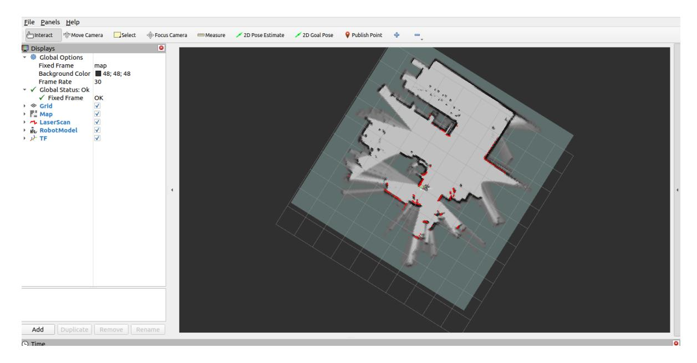
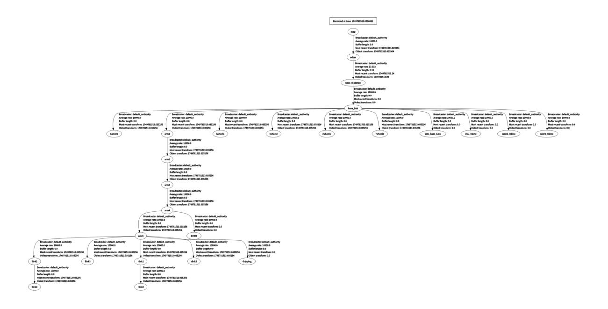

# **Cartographer-SLAM mapping**

#### **[Cartographer-SLAM](#page-0-0) mapping**

- <span id="page-0-0"></span>[1. Course](#page-0-1) Content
- [2. Introduction](#page-0-2) to Cartographer
  - 2.1 [Introduction](#page-0-3)
  - 2.2 [Related Materials](#page-1-0)
- [3. Preparation](#page-1-1)
  - 3.1 Content [Description](#page-1-2)
  - 3.2 [Starting](#page-2-0) the Agent
- [4. Run](#page-2-1) the case
  - 4.1 [Mapping](#page-2-2) Process
  - 4.2 [Save](#page-4-0) the map
  - 4.3 Saving [pbstream format](#page-5-0) maps
- [5. Node](#page-6-0) parsing
  - 5.1 Displaying the Node [Computation](#page-6-1) Graph
  - 5.2 TF [Transformation](#page-6-2)
  - 5.3 [Cartographer](#page-6-3) Node Details

# **1. Course Content**

1. Learn the robot cartographer mapping algorithm for SLAM mapping function

<span id="page-0-3"></span><span id="page-0-2"></span><span id="page-0-1"></span>After running the sample program, use the keyboard or handle to control the robot to move and complete the map construction and save the map.

# **2. Introduction to Cartographer**

#### **2.1 Introduction**

Cartographer is an open-source 2D and 3D SLAM (simultaneous localization and mapping) library from Google, supported by the ROS system. This mapping algorithm utilizes graph optimizations (multi-threaded backend optimization and problem optimization built using Cere). It combines data from multiple sensors (such as LIDAR, IMU, and cameras) to simultaneously calculate sensor positions and map the surrounding environment.

The source code of cartographer mainly consists of three parts: cartographer, cartographer\_ros and ceres-solver (backend optimization).


Cartographer uses the mainstream SLAM framework, which consists of a three-step process of feature extraction, loop closure detection, and backend optimization. A certain number of LaserScans form a submap, and a series of submaps form the global map. While the short-term cumulative error of constructing submaps using LaserScans is small, the long-term cumulative error of constructing a global map using submaps is significant. Therefore, loop closure detection is required to correct the positions of these submaps. The basic unit of loop closure detection is the submap, which uses the scan\_match strategy. Cartographer focuses on creating submaps that fuse multi-sensor data (odometry, IMU, LaserScan, etc.) and implementing the scan\_match strategy for loop closure detection.

<span id="page-1-0"></span>cartographer\_ros

cartographer\_ros runs under ROS and can receive various sensor data in the form of ROS messages.

After processing, it is published in the form of a message to facilitate debugging and visualization.

#### **2.2 Related Materials**

[GitHub repository](https://github.com/cartographer-project/cartographer)

[Official Documentation](https://google-cartographer.readthedocs.io/en/latest/)

# <span id="page-1-1"></span>**3. Preparation**

### <span id="page-1-2"></span>**3.1 Content Description**

This lesson uses the Jetson Orin NX as an example. For Raspberry Pi and Jetson Nano boards, you need to open a terminal and enter the command to enter the Docker container. Once inside the Docker container, enter the commands mentioned in this lesson in the terminal. For instructions on entering the Docker container, refer to the product tutorial **[Configuration and Operation Guide]--[Entering the Docker (Jetson Nano and Raspberry Pi 5 users, see here)]**. For Orin and NX boards, simply open a terminal and enter the commands mentioned in this lesson.

#### <span id="page-2-0"></span>**3.2 Starting the Agent**

**Note: To test all cases, you must start the docker agent first. If it has already been started, you do not need to start it again.**

Enter the command in the vehicle terminal:

```
sh start_agent.sh
```

The terminal prints the following information, indicating that the connection is successful

# **4. Run the case**

### **4.1 Mapping Process**

#### **Notice:**

- <span id="page-2-2"></span><span id="page-2-1"></span>**When building a map, the slower the speed, the better the effect (mainly the slower the rotation speed). If the speed is too fast, the effect will be very poor.**
- **Jetson Nano and Raspberry Pi** series controllers need to enter the Docker container first (please refer to the [Docker course chapter - Entering the robot's Docker container] for steps).

The vehicle terminal starts the underlying sensor command:

```
ros2 launch slam_mapping bringup.launch.py
```

Restart the mapping command:

```
ros2 launch slam_mapping cartographer.launch.py
```

The rviz visualization function can be started on the vehicle side or the virtual machine side. **You can choose either** method to start it. It is forbidden to start it on the virtual machine side and the vehicle side repeatedly:

Taking the configuration of a virtual machine as an example, open a terminal and start the rviz visualization interface:

```
ros2 launch slam_view slam_view.launch.py
```

Start the rviz visualization interface command on the vehicle:

#### ros2 launch slam\_mapping slam\_view.launch.py


Open another terminal in the virtual machine to start the keyboard control node (you can also use the handle remote control):

```
ros2 run yahboomcar_ctrl yahboom_keyboard
```

Click the window in the terminal with the mouse, press z to reduce the speed appropriately, press I, <, J, L to control the car to move forward, backward, turn left, and turn right respectively, and control the car to move slowly to complete the map building



### <span id="page-4-0"></span>**4.2 Save the map**

Open a new terminal on the car and save the map

```
ros2 launch yahboomcar_nav save_map_launch.py
```

The terminal prompts **"Map saved successfully"** to indicate that the map has been saved successfully.

The map save path is as follows:

jetson orin nano, jetson orin NX :

```
/home/jetson/M3Pro_ws/install/M3Pro_navigation/share/M3Pro_navigation/map
```

Jetson Orin Nano, Raspberry Pi :

```
/root/M3Pro_ws/install/M3Pro_navigation/share/M3Pro_navigation/map/
```

A pgm image, a yaml file yahboom\_map.yaml

```
image: yahboom_map.pgm
mode: trinary
resolution: 0.05
origin: [-10, -10, 0]
negate: 0
occupied_thresh: 0.65
free_thresh: 0.25
```

#### Parameter analysis:

- image: The path of the map file, which can be an absolute path or a relative path
- mode: This attribute can be one of trinary, scale or raw, depending on the selected mode. Trinary mode is the default mode.
- resolution: map resolution, meters/pixels
- origin: The 2D position (x, y, yaw) of the lower-left corner of the map, where yaw is a counterclockwise rotation (yaw=0 means no rotation). Currently, many parts of the system ignore the yaw value.
- negate: whether to invert the meaning of white/black, free/occupied (the interpretation of thresholds is not affected)
- occupied\_thresh: Pixels with an occupancy probability greater than this threshold are considered fully occupied.
- <span id="page-5-0"></span>free\_thresh: Pixels with an occupancy probability less than this threshold are considered completely free.

## **4.3 Saving pbstream format maps**

Map files in pbstream format are used for repositioning navigation, which will be explained in subsequent chapters.

After the map is built, open a new terminal and enter the command to end the map track:

```
ros2 service call /finish_trajectory cartographer_ros_msgs/srv/FinishTrajectory "
{trajectory_id: 0}"
```

Then open another terminal to save the pbstream format map file:

Save command on jetson orin nano and jetson orin NX s:

```
ros2 service call /write_state cartographer_ros_msgs/srv/WriteState "{filename:
'/home/jetson/yahboom_map.pbstream'}"
```

Save the command on Jetson Orin Nano and Raspberry Pi :

You need to enter docker first

```
ros2 service call /write_state cartographer_ros_msgs/srv/WriteState "{filename:
'/root/yahboom_map.pbstream'}"
```

# **5. Node parsing**

#### **5.1 Displaying the Node Computation Graph**

<span id="page-6-1"></span><span id="page-6-0"></span>ros2 run rqt\_graph rqt\_graph


### <span id="page-6-2"></span>**5.2 TF Transformation**

The virtual machine terminal runs:

```
ros2 run rqt_tf_tree rqt_tf_tree
```

The image size is too large. The original image can be viewed in the folder of this course.



### **5.3 Cartographer Node Details**

<span id="page-6-3"></span>ros2 node info /slam\_gmapping

Enter the above command in the terminal to view the subscription and publishing topics related to the gmapping node.

```
/cartographer_node
  Subscribers:
    /parameter_events: rcl_interfaces/msg/ParameterEvent
    /scan: sensor_msgs/msg/LaserScan
  Publishers:
    /constraint_list: visualization_msgs/msg/MarkerArray
    /landmark_poses_list: visualization_msgs/msg/MarkerArray
    /parameter_events: rcl_interfaces/msg/ParameterEvent
    /rosout: rcl_interfaces/msg/Log
    /scan_matched_points2: sensor_msgs/msg/PointCloud2
    /submap_list: cartographer_ros_msgs/msg/SubmapList
    /tf:tf2_msgs/msg/TFMessage
    /trajectory_node_list: visualization_msgs/msg/MarkerArray
  Service Servers:
    /cartographer_node/describe_parameters:
rcl_interfaces/srv/DescribeParameters
    /cartographer_node/get_parameter_types: rcl_interfaces/srv/GetParameterTypes
    /cartographer_node/get_parameters: rcl_interfaces/srv/GetParameters
    /cartographer_node/list_parameters: rcl_interfaces/srv/ListParameters
    /cartographer_node/set_parameters: rcl_interfaces/srv/SetParameters
    /cartographer_node/set_parameters_atomically:
rcl_interfaces/srv/SetParametersAtomically
    /finish_trajectory: cartographer_ros_msgs/srv/FinishTrajectory
    /get_trajectory_states: cartographer_ros_msgs/srv/GetTrajectoryStates
    /read_metrics: cartographer_ros_msgs/srv/ReadMetrics
    /start_trajectory: cartographer_ros_msgs/srv/StartTrajectory
    /submap_query: cartographer_ros_msgs/srv/SubmapQuery
    /tf2_frames: tf2_msgs/srv/FrameGraph
    /trajectory_query: cartographer_ros_msgs/srv/TrajectoryQuery
    /write_state: cartographer_ros_msgs/srv/WriteState
  Service Clients:
  Action Servers:
  Action Clients:
```