# **Navigation2 Single-Point Navigation and Obstacle Avoidance**

# **1. Course Content**

- 1. Learn the single-point navigation and obstacle avoidance function of Robot Navigation2.
- 2. Run the program. A map will load in rviz. In the rviz interface, use the [2D Pose Estimate] tool to set the robot's initial pose, then use the [2D Goal Pose] tool to set a target point for the robot. The robot will calculate a path based on its surroundings and move to its destination. If it encounters obstacles, it will automatically avoid them and stop at its destination.
- 3. Learn the concepts of global and local costmaps, navigation parameter configuration, and the principles of the AMCL localization algorithm.

# **2. Introduction to Navigation2**

# **2.1 Introduction**

Navigation2 Overall Architecture Diagram

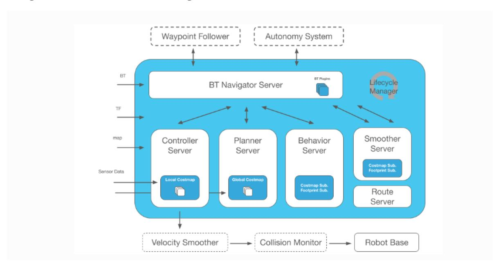

Navigation2 provides the following tools:

- Tools for loading, serving, and storing maps (Map Server)
- Tools for localizing the robot on a map (AMCL)
- Tools for planning paths from point A to point B while avoiding obstacles (Nav2 Planner)
- Tools for controlling the robot while following a path (Nav2 Controller)
- Tools for converting sensor data into a costmap representation of the robot's world (Nav2 Costmap 2D)
- Tools for building complex robot behaviors using behavior trees (Nav2 Behavior Trees and BT Navigator)
- Tools for calculating recovery behaviors in the event of a failure (Nav2 Recoveries)
- A tool for following sequential waypoints (Nav2 Waypoint Follower)
- A tool and watchdog for managing the server lifecycle (Nav2 Lifecycle Manager)
- A plugin for enabling user-defined algorithms and behaviors (Nav2 Core)

Navigation 2 (Nav2) is the native navigation framework in ROS 2. Its purpose is to safely move mobile robots from point A to point B. Nav2 implements behaviors such as dynamic path planning, motor speed calculation, obstacle avoidance, and structure recovery.

Nav2 uses behavior trees (BTs) to call modular servers to complete an action. Actions can include path calculation, control efforts, recovery, or other navigation-related actions. These actions are independent nodes that communicate with the behavior tree (BT) through the action server.

# **2.2 Related Materials**

Navigation2 Documentation:<https://navigation.ros.org/index.html>

Navigation2 GitHub:<https://github.com/ros-planning/navigation2>

Navigation2 Paper:<https://arxiv.org/pdf/2003.00368.pdf>

# **3. Preparation**

### **3.1 Content Description**

This lesson uses the Jetson Orin NX as an example. For Raspberry Pi and Jetson Nano boards, you need to open a terminal and enter the command to enter the Docker container. Once inside the Docker container, enter the commands mentioned in this lesson in the terminal. For instructions on entering the Docker container, refer to the product tutorial **[Configuration and Operation Guide]--[Entering the Docker (Jetson Nano and Raspberry Pi 5 users, see here)]**. For Orin and NX boards, simply open a terminal and enter the commands mentioned in this lesson.

### **3.2 Starting the Agent**

**Note: The Docker agent must be started before testing all examples. If it's already started, you don't need to restart it.**

Enter the following command in the vehicle terminal:

```
sh start_agent.sh
```

The terminal prints the following message, indicating a successful connection.

# **4. Running the Example**

# **4.1 Single-Click Navigation**

#### **Note:**

- For Jetson Nano and Raspberry Pi series controllers, you must first enter the Docker container (see the [Docker Course Section - Entering the Robot's Docker Container] for steps).
- This section requires at least one existing map. Refer to any of the SLAM mapping courses, such as Gmapping-SLAM Mapping, Cartographer Mapping, or Slam-Toolbox Mapping.

To start the underlying sensor on the robot terminal:

```
ros2 launch M3Pro_navigation base_bringup.launch.py
```

To start navigation again:

ros2 launch M3Pro\_navigation navigation2.launch.py

The rviz visualization function can be started on either the vehicle terminal or the virtual machine. **Select either** method. Do not start both the virtual machine and the vehicle terminal at the same time:

For example, using a virtual machine, open a terminal and start the rviz visualization interface:

```
ros2 launch slam_view nav_rviz.launch.py
```

Command to launch the Rviz visualization interface on the vehicle:

```
ros2 launch M3Pro_navigation nav_rviz.launch.py
```

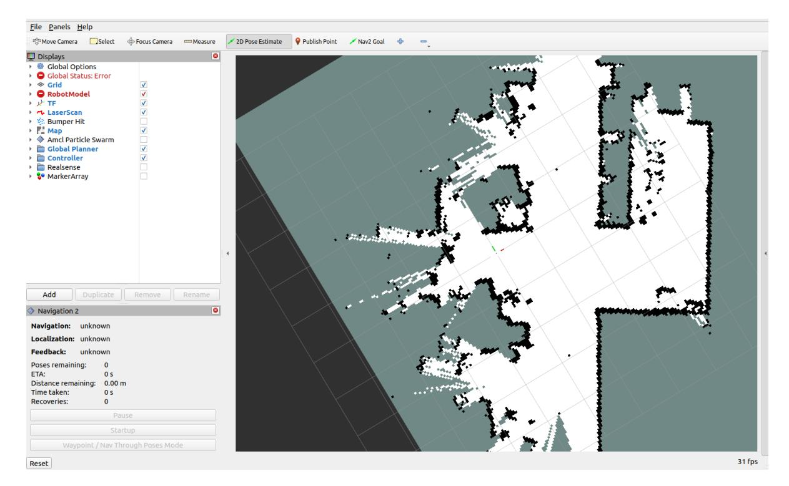

You can now see the map loading. Click [2D Pose Estimate] to set the initial pose for the car. Based on the car's actual position in the environment, click and drag the mouse in Rviz to move the car model to the set position. As shown in the figure below, if the radar scan area roughly overlaps with the actual obstacle, the pose is accurate.

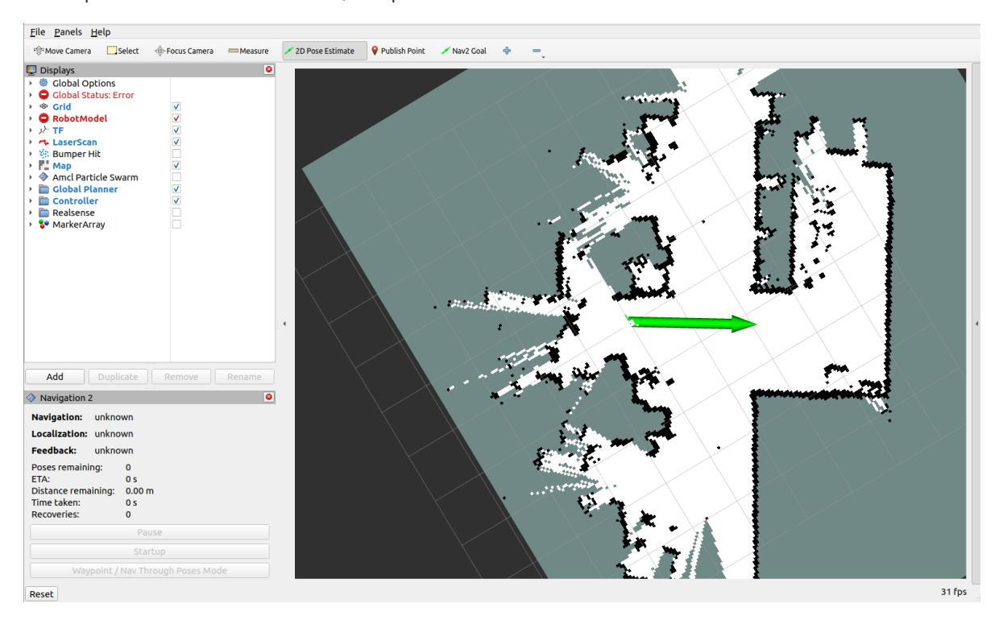

After pose initialization is complete, the robot model and the red LiDAR 2D point cloud will appear in the rviz interface.

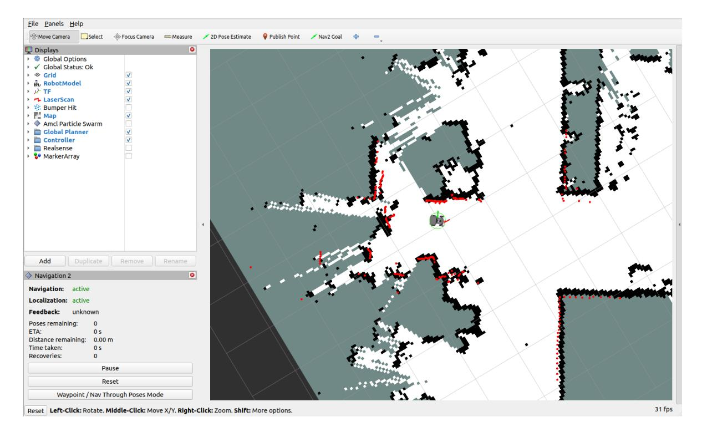

For single-point navigation, click the [2D Goal Pose] tool, then use the mouse to select a target point and orientation in rviz, then release.

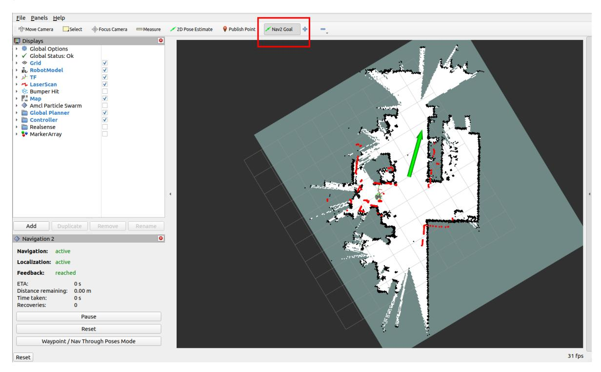

The robot plans a path based on its surroundings and moves along it to the target point.

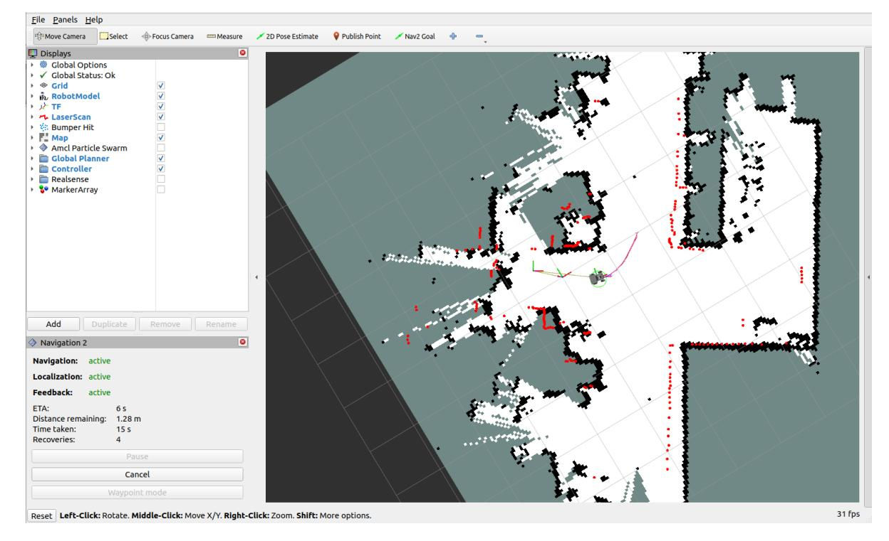

After the robot successfully reaches the target point, the vehicle terminal will display "Goal succeeded," indicating successful navigation.

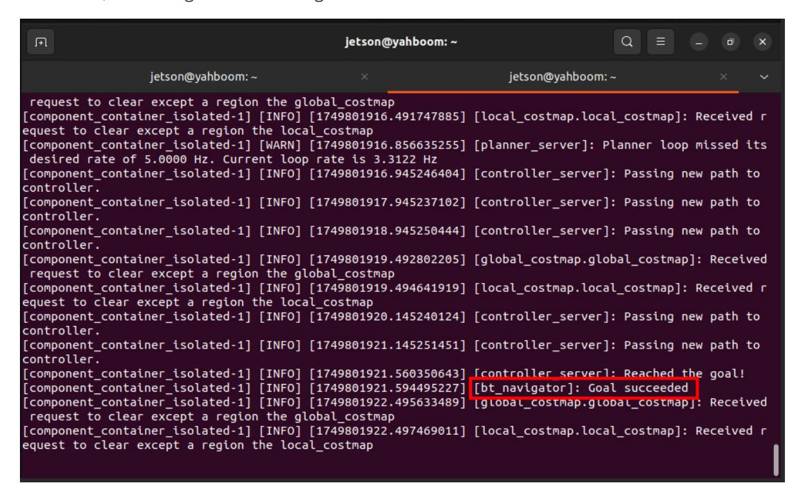

# **4.2 Viewing the Costmap**

To view the global and local costmaps, locate Global Costmap under the Global Planner group in the left-hand configuration pane and select it to display the global costmap. Similarly, locate Local Costmap under the Controller group and select it. Click the Costmap option to display the costmap (the concept of costmaps will be explained in the theoretical section below).

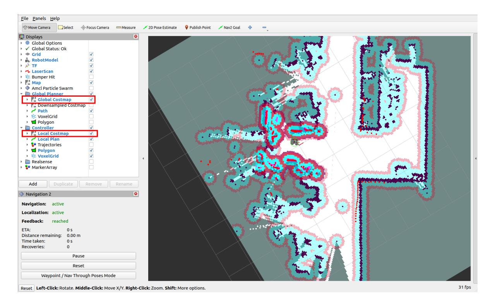

# **4.3 Viewing the Node Communication Graph**

In the VM terminal, enter:

```
ros2 run rqt_graph rqt_graph
```

If the graph does not display initially, select [Nodes/Topics (all)] and click the refresh button in the upper left corner. The original graph is too large; you can view it in the current lesson folder.

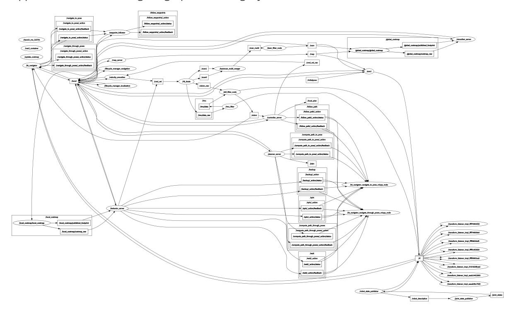

# **4.4 Viewing the TF Tree**

In the VM terminal, enter:

ros2 run rqt\_tf\_tree rqt\_tf\_tree

If the page doesn't display initially, click the refresh icon in the upper left corner to refresh the page. The original image is too large; you can view it in the course folder.

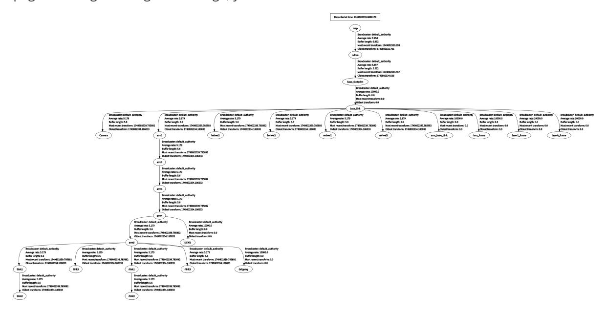

# **5. Navigation Explanation**

### **5.1 Core Steps of the Navigation Process**

### **5.1.1 Phase 1: System Initialization and Map Loading**

- **Map Acquisition**
- Load a pre-built raster map from map\_server
- The map contains static obstacle information and serves as the basic environment model for navigation.

#### **Cost Map Initialization**

- **Global Costmap**: Based on the static map, used for global path planning.
- **Local Costmap**: Integrates the real-time scan topic of the lidar for dynamic obstacle avoidance.

### **5.1.2 Phase 2: Sensor Data Processing and Environmental Perception**

### **Sensor Data Access**

LiDAR (/scan), IMU (/imu/data), and odometry (/odom) data are input via ROS topics.

#### **Cost Map Update**

- The local cost map updates dynamic obstacle information in real time. Each grid cell calculates occupancy probability and cost based on sensor data (e.g., the closer to the obstacle, the higher the cost).
- Inflation: Expands the edges of obstacles to prevent the robot from getting too close.

### **5.1.3 Phase 3: Path Planning (Global and Local Planning)**

#### **Global Path Planning**

- Input: Start point (current robot pose), end point (goal pose), and global cost map.
- The Dijkstra planner algorithm generates an optimal path (a series of discrete coordinate points) from the start point to the end point.

#### **Local Path Planning and Tracking**

The local planner, DWBLocalPlanner, generates short-term control commands that the robot can execute based on the global path and the local costmap.

### **5.1.4 Phase 4: Control Execution and Behavior Decision-Making**

#### **Controller Output**

- The controller converts the local path into the robot's linear velocity ( linear.x ) and angular velocity ( angular.z ), which are published via the /cmd\_vel topic.
- Velocity Smoothing: This prevents abrupt changes in robot motion and improves stability.

#### **Behavior Tree Decision Process**

The behavior tree defines the priority and state transition logic for navigation tasks. A typical process is as follows:

- 1. **Checking if the target is reachable**: If global planning fails, trigger a "recovery behavior" (e.g., replanning).
- 2. **Performing Local Obstacle Avoidance**: When an obstacle is detected in the local costmap, temporarily deviate from the global path.
- 3. **Reaching the Target**: When the error between the robot's pose and the target pose is less than a threshold, the task is completed.

#### **Recovery Behavior Mechanism**

When navigation encounters an anomaly (such as a completely blocked path), a pre-set recovery strategy (such as rotating to search for a new path or backing off to replan) is triggered.

# **5.2 Key Technical Principles**

### **5.2.1 Costmap**

- **Probabilistic Grid Representation**: Each grid stores an occupancy probability (0-1) and is updated based on sensor data (such as raycast detection by LiDAR).
- **Multi-layer Cost Overlay**: Static cost (for obstacles in the map) + Dynamic cost (for obstacles detected by real-time sensors) + Inflated cost (for safety distance).

A costmap is a 2D or 3D map created and updated by the robot using sensor information. The following figure provides a brief overview.

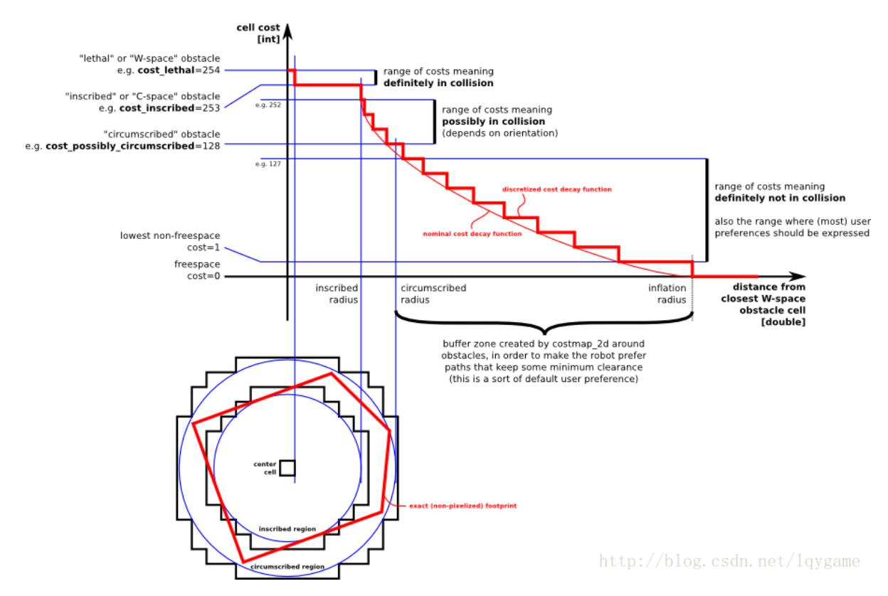

In the figure above, the red area represents obstacles in the costmap, the blue area represents obstacles expanded by the radius of the robot's inscribed circle, and the red polygon represents the footprint (the vertical projection of the robot's outline). To avoid collisions, the footprint should not intersect the red area, and the robot's center should not intersect the blue area. The ROS costmap uses a grid format, with each cell value (cell cost) ranging from 0 to 255. It is divided into three states: occupied (obstacles present), free area (no obstacles), and unknown area.

The specific states and values are shown in the following figure:

The above figure can be divided into five parts, with the red polygon representing the robot's outline:

- Lethal: The robot's center coincides with the center of the grid; in this case, the robot will definitely collide with the obstacle.
- Inscribed: The grid's circumscribed circle is inscribed within the robot's outline; in this case, the robot will definitely collide with the obstacle.
- Possibly circumscribed: The grid's circumscribed circle is inscribed within the robot's outline; in this case, the robot is essentially close to the obstacle, so a collision is not certain.
- Freespace: Space without obstacles.
- Unknown: Space without known locations.

#### Global Costmap:

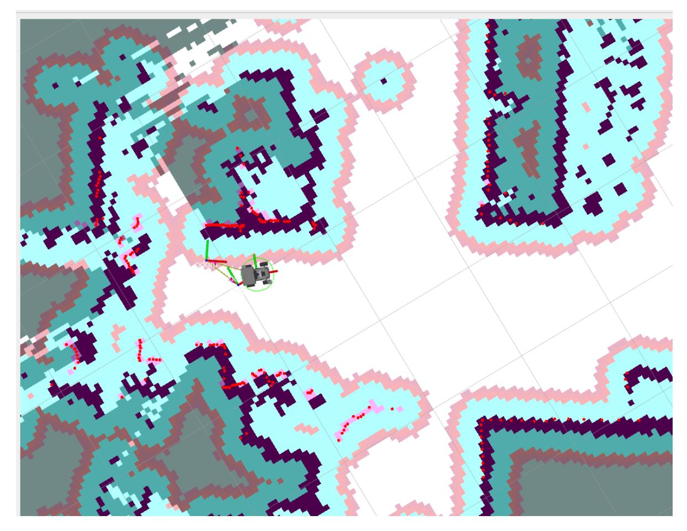

### Local Costmap:

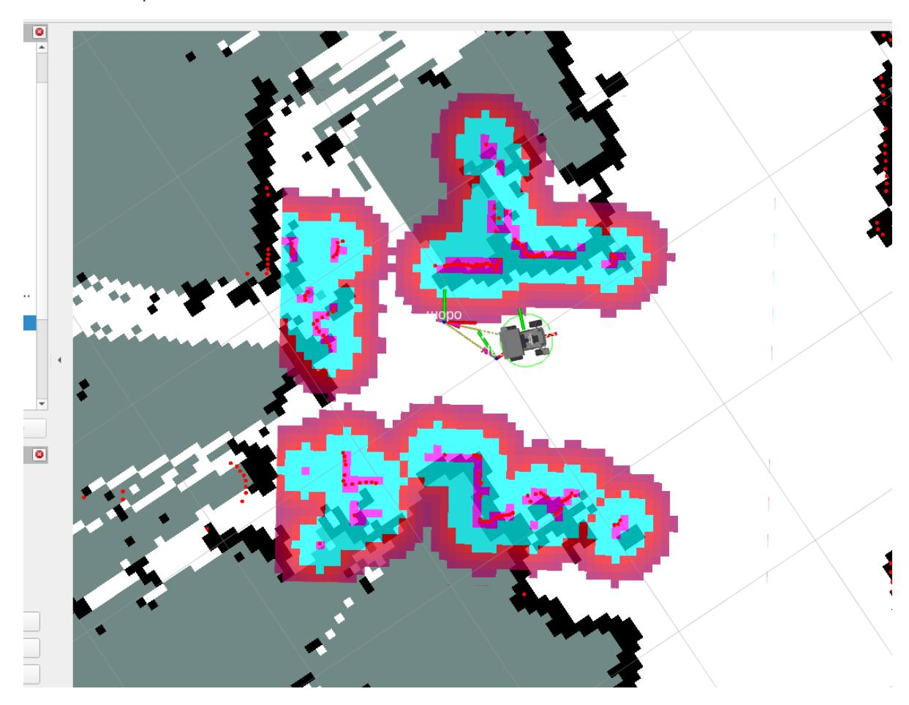

### **5.2.2 AMCL Localization Algorithm**

AMCL (Adaptive Monte Carlo Localization) is a probabilistic localization system for 2D mobile robots. It implements an adaptive (or KLD sampling) Monte Carlo localization method that uses a particle filter to estimate the robot's position based on a given map.

As shown in the figure below, if the odometry is error-free, in a perfect world, we can directly use the odometry information (top half) to infer the robot's (base\_frame) position relative to the odometry coordinate system. However, in reality, odometry drift and non-negligible cumulative errors exist. Therefore, AMCL uses the method in the bottom half. This method first uses the odometry information to preliminarily locate the base\_frame. Then, using the measurement model, we determine the base\_frame's position relative to the map\_frame (global map coordinate system), thus determining the robot's position within the map. (Note that although the conversion from base to map is estimated here, the conversion from map to odom is finally published, which can be understood as the drift of the odometry.)

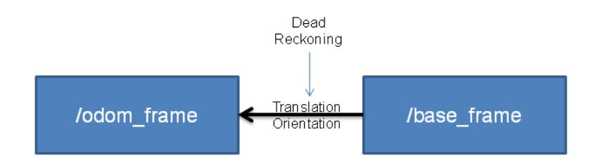

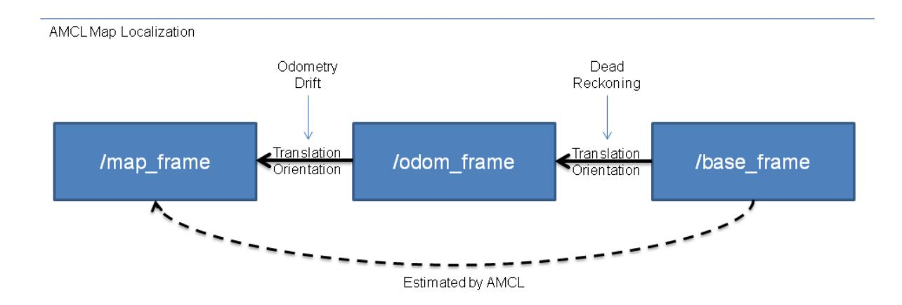

In the TF tree during robot navigation, the coordinate transformation between map (map coordinate system) and odom (odometry coordinate system) is published by the AMCL positioning algorithm, while the coordinate transformation between odom (odometry coordinate system) and besel\_footprint (robot chassis center projection coordinate system) is published by the **ekf\_filter\_node** node under the **robot\_localization** function package. Its function is to publish the odometry information after the fusion of the IMU sensor and the encoder raw mileage.

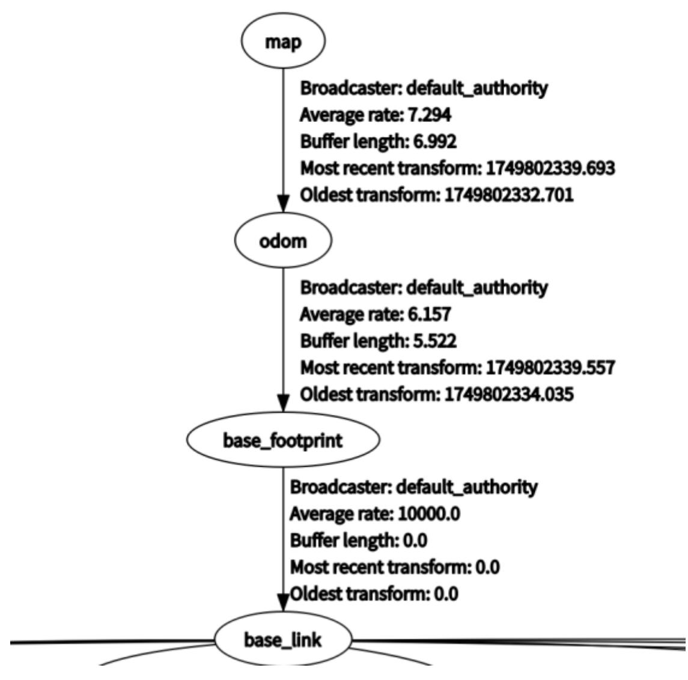

In the node communication diagram above, we can see the communication data flow for the ekf\_filter\_node.

The /YB\_Node node is the robot chassis node, publishing **/imu/data\_raw** (raw IMU sensor data) and **/odom\_raw** (raw encoder odometry data).

The imu\_filter node subscribes to **/imu\_data\_raw** published by the robot chassis. u/data\_raw\*\* (raw IMU sensor data). The imu\_filter node filters the raw IMU sensor data and publishes it to the /imu/data topic.

The **ekf\_filter\_node** node subscribes to the /**odom** and **/imu/data** topics, fuses the multi-sensor data, and publishes it to the **/odom** topic.

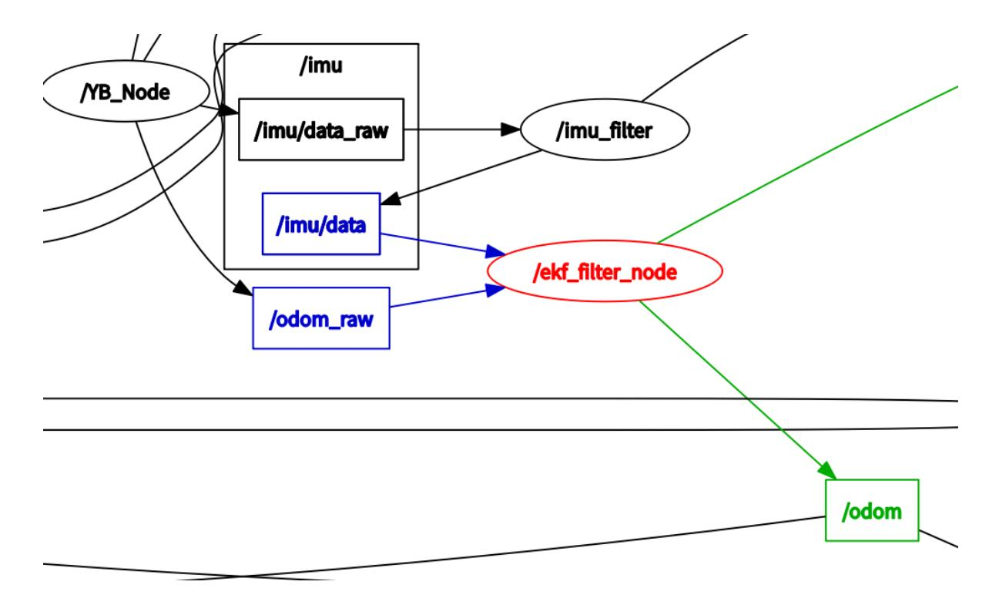

# **5.3 Path Planning**

### **5.3.1 Global Path Planning**

Global path planning calculates an optimal or feasible global path from a start point to a destination within a known environment map, disregarding real-time obstacles. The path from the start point to the destination is calculated with the global optimum as the goal. As shown in the figure below, the path connected by arrows is the global path.

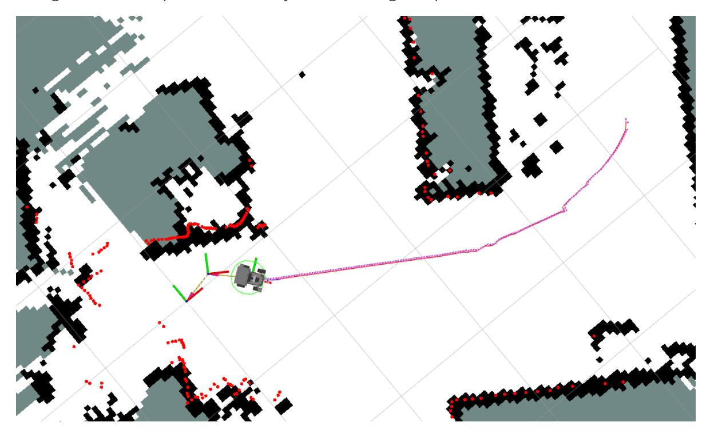

### **5.3.2 Local Path Planning**

Local path planning dynamically adjusts the robot's path based on real-time LiDAR sensor data during movement to avoid obstacles (obstacles are displayed in the costmap). As shown in the figure below, the blue path is the local path.

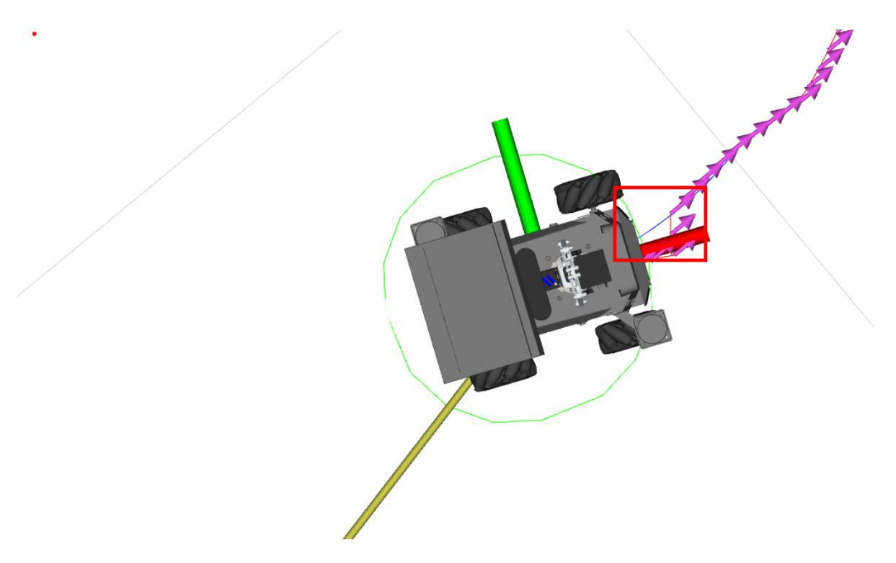

# **5.4 Navigation Parameter Configuration**

Configuration file path:

For Jetson Nano and Raspberry Pi, you must first enter Docker:

```
/root/M3Pro_ws/src/M3Pro_navigation/param/yahboom_M3Pro.yaml
```

For Jetson Orin Nano and NX:

```
/home/jetson/M3Pro_ws/src/M3Pro_navigation/param/yahboom_M3Pro.yaml
```

The default configuration parameters for the navigation function are as follows:

```
# AMCL (Adaptive Monte Carlo Localization) configuration
amcl :
  ros__parameters :
    # Whether to use simulation time, False means use real time
    use_sim_time : False
    # Control the noise parameters of the odometer model when the robot rotates
    alpha1 : 0.2
    # Control the noise parameters of the odometry model when the robot rotates
and translates
    alpha2 : 0.2
    # Control the noise parameters of the odometer model when the robot
translates
    alpha3 : 0.2
    # Control the noise parameters of the odometer model when the robot is
rotated due to translation
    alpha4 : 0.2
    # Control the noise parameters of the odometry model when the robot rotates
(another aspect)
    alpha5 : 0.2
    # The name of the robot's base coordinate system
    base_frame_id : "base_footprint"
```

```
# The distance threshold for beam skipping, used for laser scanning data
processing
    beam_skip_distance : 0.5
    # The error threshold for beam skipping, used to decide whether to skip
certain beams
    beam_skip_error_threshold : 0.9
    # The beam skipping threshold is used to decide whether to skip certain
beams
    beam_skip_threshold : 0.3
    # Whether to enable beam skipping function
    do_beamskip : false
    # Global coordinate system name
    global_frame_id : "map"
    # Attenuation coefficient of short laser reflection
    lambda_short : 0.1
    # Maximum likelihood distance for laser scanning
    laser_likelihood_max_dist : 2.0
    # Maximum range of laser scanning
    laser_max_range : 100.0
    # Minimum range of laser scanning
    laser_min_range : -1.0
    # Laser model type
    laser_model_type : "likelihood_field"
    # Maximum number of laser beams to use per update
    max_beams : 60
    # Maximum number of particles allowed in the particle filter
    max_particles : 2000
    # Minimum number of particles allowed in the particle filter
    min_particles : 500
    # Odometer coordinate system name
    odom_frame_id : "odom"
    # Error threshold of particle filter
    pf_err : 0.05
    # Confidence threshold for particle filter
    pf_z : 0.99
    # Fast recovery factor, used for the recovery mechanism of the particle
filter
    recovery_alpha_fast : 0.0
    # Slow recovery factor, used for the recovery mechanism of the particle
filter
    recovery_alpha_slow : 0.0
    # Resampling interval
    resample_interval : 1
    # The robot's motion model type
    robot_model_type : "nav2_amcl::DifferentialMotionModel"
    # Save the rate of the robot's posture
    save_pose_rate : 0.5
    # Standard deviation of laser hits
    sigma_hit : 0.2
    # Whether to broadcast TF transformation
    tf_broadcast : true
    # TF Transform Release Rate
    tf_publish_rate : 10.0
    # Transformation tolerance time
    transform_tolerance : 0.2
    # Minimum threshold for angle update
    update_min_a : 0.2
    # Minimum threshold for distance update
```

```
update_min_d : 0.25
    # Weight of laser hit
    z_hit : 0.5
    # Weight of the laser's maximum range
    z_max : 0.05
    # Weights of random laser measurements
    z_rand : 0.5
    # Weight of short laser reflections
    z_short : 0.05
    #Topic name for laser scanning data
    scan_topic : scan
# AMCL map client configuration
amcl_map_client :
  ros__parameters :
    # Whether to use simulation time, False means use real time
    use_sim_time : False
# AMCL RCLCPP node configuration
amcl_rclcpp_node :
  ros__parameters :
    # Whether to use simulation time, False means use real time
    use_sim_time : False
# BT Navigator Configuration
bt_navigator :
  ros__parameters :
    # Whether to use simulation time, False means use real time
    use_sim_time : False
    # Global coordinate system name
    global_frame : map
    # The name of the robot's base coordinate system
    robot_base_frame : base_link
    # Topic name for odometer data
    odom_topic : /odom
    # Default behavior tree XML file name
    default_bt_xml_filename : "navigate_w_replanning_and_recovery.xml"
    # Behavior Tree Loop
    bt_loop_duration : 10
    #Default server timeout
    default_server_timeout : 20
    # Whether to enable Groot monitoring
    enable_groot_monitoring : True
    # Groot's ZMQ publisher port
    groot_zmq_publisher_port : 1666
    # Groot's ZMQ server port
    groot_zmq_server_port : 1667
    # List of behavior tree plugin library names
    plugin_lib_names :
    - nav2_compute_path_to_pose_action_bt_node
    - nav2_compute_path_through_poses_action_bt_node
    - nav2_follow_path_action_bt_node
    - nav2_back_up_action_bt_node
    - nav2_spin_action_bt_node
    - nav2_wait_action_bt_node
    - nav2_clear_costmap_service_bt_node
    - nav2_is_stuck_condition_bt_node
    - nav2_goal_reached_condition_bt_node
```

```
- nav2_goal_updated_condition_bt_node
    - nav2_initial_pose_received_condition_bt_node
    - nav2_reinitialize_global_localization_service_bt_node
    - nav2_rate_controller_bt_node
    - nav2_distance_controller_bt_node
    - nav2_speed_controller_bt_node
    - nav2_truncate_path_action_bt_node
    - nav2_goal_updater_node_bt_node
    - nav2_recovery_node_bt_node
    - nav2_pipeline_sequence_bt_node
    - nav2_round_robin_node_bt_node
    - nav2_transform_available_condition_bt_node
    - nav2_time_expired_condition_bt_node
    - nav2_distance_traveled_condition_bt_node
    - nav2_single_trigger_bt_node
    - nav2_is_battery_low_condition_bt_node
    - nav2_navigate_through_poses_action_bt_node
    - nav2_navigate_to_pose_action_bt_node
    - nav2_remove_passed_goals_action_bt_node
    - nav2_planner_selector_bt_node
    - nav2_controller_selector_bt_node
    - nav2_goal_checker_selector_bt_node
# BT Navigator RCLCPP node configuration
bt_navigator_rclcpp_node :
  ros__parameters :
    # Whether to use simulation time, False means use real time
    use_sim_time : False
# Controller Server Configuration
controller_server :
  ros__parameters :
    # Whether to use simulation time, False means use real time
    use_sim_time : False
    # The controller's operating frequency
    controller_frequency : 5.0
    # Minimum speed threshold in the X direction
    min_x_velocity_threshold : 0.001
    # Minimum speed threshold in the Y direction
    min_y_velocity_threshold : 0.5
    # Minimum speed threshold for rotation direction
    min_theta_velocity_threshold : 0.001
    # Maximum failure tolerance allowed
    failure_tolerance : 0.3
    # Progress checker plugin name
    progress_checker_plugin : "progress_checker"
    # List of target checker plugin names
    goal_checker_plugins : [ "general_goal_checker" ]
    # List of controller plugin names
    controller_plugins : [ "FollowPath" ]
    # Progress Checker Parameters
    progress_checker :
      # Progress Checker Plugin Type
      plugin : "nav2_controller::SimpleProgressChecker"
      # The minimum radius the robot must move
      required_movement_radius : 0.5
      # Maximum allowed movement time
```

```
movement_time_allowance : 10.0
general_goal_checker :
  # Is this a stateful target checker?
  stateful : True
  # Target Inspector Plugin Type
  plugin : "nav2_controller::SimpleGoalChecker"
  # Target tolerance in X and Y directions
  xy_goal_tolerance : 0.15
  # Target tolerance for rotation direction
  yaw_goal_tolerance : 0.15
# DWB local planner parameters
FollowPath :
  # Local planner plugin type
  plugin : "dwb_core::DWBLocalPlanner"
  # Whether to debug trajectory details
  debug_trajectory_details : True
  # Minimum speed in the X direction
  min_vel_x : 0.0
  # Minimum speed in the Y direction
  min_vel_y : 0.0
  # Maximum speed in the X direction
  max_vel_x : 0.35
  # Maximum speed in the Y direction
  max_vel_y : 0.0
  # Maximum speed in the direction of rotation
  max_vel_theta : 1.0
  # Minimum speed in the XY plane
  min_speed_xy : 0.0
  # Maximum speed in the XY plane
  max_speed_xy : 0.22
  # Minimum speed in the direction of rotation
  min_speed_theta : 0.0
  # Acceleration limit in X direction
  acc_lim_x : 2.5
  # Acceleration limit in the Y direction
  acc_lim_y : 0.0
  # Acceleration limit in the rotation direction
  acc_lim_theta : 3.2
  # Deceleration limit in X direction
  decel_lim_x : -2.5
  # Deceleration limit in Y direction
  decel_lim_y : 0.0
  # Deceleration limit in the rotation direction
  decel_lim_theta : -3.2
  # Number of velocity samples in the X direction
  vx_samples : 20
  # Number of velocity samples in the Y direction
  vy_samples : 0
  # Number of speed samples in the rotation direction
  vtheta_samples : 40
  # Simulation time
  sim_time : 1.5
  Linear resolution
  linear_granularity : 0.05
  # Angular resolution
  angular_granularity : 0.025
```

```
# Transformation tolerance time
      transform_tolerance : 0.2
      # Target tolerance in X and Y directions
      xy_goal_tolerance : 0.05
      # Speed threshold for panning to stop
      trans_stopped_velocity : 0.25
      # Whether to short-circuit trajectory evaluation
      short_circuit_trajectory_evaluation : True
      # Is it a stateful planner?
      stateful : True
      # Evaluator list
      critics : [ "RotateToGoal" , "Oscillation" , "BaseObstacle" ,
 "GoalAlign" , "PathAlign" , "PathDist" , "GoalDist" ]
      # Weight of the basic obstacle evaluator
      BaseObstacle.scale : 0.02
      # Weights of the path alignment evaluator
      PathAlign.scale : 32.0
      # Forward point distance of path alignment evaluator
      PathAlign.forward_point_distance : 0.1
      # Weights of the target alignment evaluator
      GoalAlign.scale : 24.0
      # Forward point distance of target alignment evaluator
      GoalAlign.forward_point_distance : 0.1
      # Weight of the path distance evaluator
      PathDist.scale : 32.0
      # Weight of target distance evaluator
      GoalDist.scale : 24.0
      # Rotate to the target evaluator weights
      RotateToGoal.scale : 32.0
      #Deceleration factor for rotating to target evaluator
      RotateToGoal.slowing_factor : 5.0
      # Rotate to the look-ahead time of the target evaluator
      RotateToGoal.lookahead_time : -1.0
# Controller server RCLCPP node configuration
controller_server_rclcpp_node :
  ros__parameters :
    # Whether to use simulation time, False means use real time
    use_sim_time : False
# Local costmap configuration
local_costmap :
  local_costmap :
    ros__parameters :
      # Costmap update frequency
      update_frequency : 5.0
      # How often the costmap is published
      publish_frequency : 2.0
      # Global coordinate system name
      global_frame : odom
      # The name of the robot's base coordinate system
      robot_base_frame : base_link
      # Whether to use simulation time, False means use real time
      use_sim_time : False
      # Whether to use rolling window
      rolling_window : true
      # The width of the costmap
      width : 3
```

```
# The height of the costmap
height : 3
# Costmap resolution
resolution : 0.05
# The radius of the robot
robot_radius : 0.15
# List of costmap plugins
plugins : [ "obstacle_layer" , "voxel_layer" , "inflation_layer" ]
inflation_layer :
  # Expansion layer plugin type
  plugin : "nav2_costmap_2d::InflationLayer"
  # Expansion radius
  inflation_radius : 0.3
  # Cost scaling factor
  cost_scaling_factor : 3.0
obstacle_layer :
  # Obstacle layer plugin type
  plugin : "nav2_costmap_2d::ObstacleLayer"
  # Whether to enable the obstacle layer
  enabled : True
  # Observation source name
  observation_sources : scan
  scan :
    #Topic name for laser scanning data
    topic : /scan
    # Maximum obstacle height
    max_obstacle_height : 2.0
    # Whether to clear obstacles
    clearing : True
    # Whether to mark obstacles
    marking : True
    # Data Types
    data_type : "LaserScan"
voxel_layer :
  # Voxel layer plugin type
  plugin : "nav2_costmap_2d::VoxelLayer"
  # Whether to enable voxel layer
  enabled : True
  # Whether to publish voxel map
  publish_voxel_map : True
  # Z-origin
  origin_z : 0.0
  # Z resolution
  z_resolution : 0.05
  # Number of voxels in the Z direction
  z_voxels : 16
  # Maximum obstacle height
  max_obstacle_height : 2.0
  # Marking threshold
  mark_threshold : 0
  # Observation source name
  observation_sources : scan
  scan :
    #Topic name for laser scanning data
    topic : /scan
    # Maximum obstacle height
    max_obstacle_height : 2.0
    # Whether to clear obstacles
```

```
clearing : True
          # Whether to mark obstacles
          marking : True
          # Data Types
          data_type : "LaserScan"
          # Maximum range of ray tracing
          raytrace_max_range : 3.0
          # Minimum range for ray tracing
          raytrace_min_range : 0.0
          # Maximum detection range of obstacles
          obstacle_max_range : 2.5
          # Minimum obstacle detection range
          obstacle_min_range : 0.0
      static_layer :
        # Whether to subscribe to transient local map
        map_subscribe_transient_local : True
      # Whether to always send the full costmap
      always_send_full_costmap : True
  local_costmap_client :
    ros__parameters :
      # Whether to use simulation time, False means use real time
      use_sim_time : False
  local_costmap_rclcpp_node :
    ros__parameters :
      # Whether to use simulation time, False means use real time
      use_sim_time : False
# Global costmap configuration
global_costmap :
  global_costmap :
    ros__parameters :
      # Costmap update frequency
      update_frequency : 1.0
      # How often the costmap is published
      publish_frequency : 1.0
      # Global coordinate system name
      global_frame : map
      # The name of the robot's base coordinate system
      robot_base_frame : base_link
      # Whether to use simulation time, True means to use simulation time
      use_sim_time : True
      # The radius of the robot
      robot_radius : 0.2
      # Costmap resolution
      resolution : 0.05
      # Whether to track unknown space
      track_unknown_space : false
      # List of costmap plugins
      plugins : [ "static_layer" , "obstacle_layer" , "voxel_layer" ,
 "inflation_layer" ]
      obstacle_layer :
        # Obstacle layer plugin type
        plugin : "nav2_costmap_2d::ObstacleLayer"
        # Whether to enable the obstacle layer
        enabled : True
        # Observation source name
        observation_sources : scan
        scan :
```

```
#Topic name for laser scanning data
    topic : /scan
    # Maximum obstacle height
    max_obstacle_height : 2.0
    # Whether to clear obstacles
    clearing : True
    # Whether to mark obstacles
    marking : True
    # Data Types
    data_type : "LaserScan"
    # Maximum range of ray tracing
    raytrace_max_range : 3.0
    # Minimum range for ray tracing
    raytrace_min_range : 0.0
    # Maximum detection range of obstacles
    obstacle_max_range : 2.5
    # Minimum obstacle detection range
    obstacle_min_range : 0.0
voxel_layer :
  # Voxel layer plugin type
  plugin : "nav2_costmap_2d::VoxelLayer"
  # Whether to enable voxel layer
  enabled : True
  # Whether to publish voxel map
  publish_voxel_map : True
  # Z-origin
  origin_z : 0.0
  # Z resolution
  z_resolution : 0.05
  # Number of voxels in the Z direction
  z_voxels : 16
  # Maximum obstacle height
  max_obstacle_height : 2.0
  # Marking threshold
  mark_threshold : 0
  # Observation source name
  observation_sources : scan
  scan :
    #Topic name for laser scanning data
    topic : /scan
    # Maximum obstacle height
    max_obstacle_height : 2.0
    # Whether to clear obstacles
    clearing : True
    # Whether to mark obstacles
    marking : True
    # Data Types
    data_type : "LaserScan"
    # Maximum range of ray tracing
    raytrace_max_range : 3.0
    # Minimum range for ray tracing
    raytrace_min_range : 0.0
    # Maximum detection range of obstacles
    obstacle_max_range : 2.5
    # Minimum obstacle detection range
    obstacle_min_range : 0.0
static_layer :
  # Static layer plugin type
```

```
plugin : "nav2_costmap_2d::StaticLayer"
        # Whether to subscribe to transient local map
        map_subscribe_transient_local : True
      inflation_layer :
        # Expansion layer plugin type
        plugin : "nav2_costmap_2d::InflationLayer"
        # Cost scaling factor
        cost_scaling_factor : 3.0
        # Expansion radius
        inflation_radius : 0.3
      # Whether to always send the full costmap
      always_send_full_costmap : True
  global_costmap_client :
    ros__parameters :
      # Whether to use simulation time, False means use real time
      use_sim_time : False
  global_costmap_rclcpp_node :
    ros__parameters :
      # Whether to use simulation time, False means use real time
      use_sim_time : False
# Map server configuration
map_server :
  ros__parameters :
    # Whether to use simulation time, False means use real time
    use_sim_time : False
    # Name of the map YAML file
    yaml_filename : "map.yaml"
# Map saver configuration
map_saver :
  ros__parameters :
    # Whether to use simulation time, False means use real time
    use_sim_time : False
    # Timeout for saving the map
    save_map_timeout : 5.0
    # Default idle threshold
    free_thresh_default : 0.25
    #Default occupancy threshold
    occupied_thresh_default : 0.65
    # Whether to subscribe to transient local map
    map_subscribe_transient_local : True
•
# Planner server configuration
planner_server :
  ros__parameters :
    # Desired planner frequency
    expected_planner_frequency : 5.0
    # Whether to use simulation time, False means use real time
    use_sim_time : False
    # List of planner plugin names
    planner_plugins : [ "GridBased" ]
    GridBased :
      # Grid-based planner plugin types
      plugin : "nav2_navfn_planner/NavfnPlanner"
      # Planning tolerance
      tolerance : 0.5
      # Whether to use the A* algorithm
```

```
use_astar : false
      # Whether to allow unknown space
      allow_unknown : true
# Planner server RCLCPP node configuration
planner_server_rclcpp_node :
  ros__parameters :
    # Whether to use simulation time, False means use real time
    use_sim_time : False
# Restore server configuration
recoveries_server :
  ros__parameters :
    # The topic name of the costmap
    costmap_topic : local_costmap/costmap_raw
    # Topic name of the robot footprint
    footprint_topic : local_costmap/published_footprint
    # Loop frequency
    cycle_frequency : 5.0
    # Restore plugin name list
    recovery_plugins : [ "spin" , "backup" , "wait" ]
    spin :
      # Rotation recovery plugin type
      plugin : "nav2_recoveries/Spin"
    backup :
      # Back restore plugin type
      plugin : "nav2_recoveries/BackUp"
    wait :
      # Waiting to restore plugin type
      plugin : "nav2_recoveries/Wait"
    # Global coordinate system name
    global_frame : odom
    # The name of the robot's base coordinate system
    robot_base_frame : base_link
    # Transformation timeout
    transform_timeout : 0.1
    # Whether to use simulation time, False means use real time
    use_sim_time : False
    # Look-ahead simulation time
    simulate_ahead_time : 2.0
    # Maximum rotation speed
    max_rotational_vel : 1.0
    # Minimum rotation speed
    min_rotational_vel : 0.4
    # Rotational acceleration limit
    rotational_acc_lim : 3.2
# Robot status publisher configuration
robot_state_publisher :
  ros__parameters :
    # Whether to use simulation time, False means use real time
    use_sim_time : False
# Waypoint follower configuration
waypoint_follower :
  ros__parameters :
    # Loop rate
    loop_rate : 2000
```

```
# Whether to stop on failure
stop_on_failure : false
#Waypoint task executor plugin name
waypoint_task_executor_plugin : "wait_at_waypoint"
wait_at_waypoint :
  #Waypoint wait plugin type
  plugin : "nav2_waypoint_follower::WaitAtWaypoint"
  # Whether to enable the plugin
  enabled : True
  #Waypoint pause duration
  waypoint_pause_duration : 200
```

The above are the configurable parameters of Navigation2. If the user needs to modify the configuration parameters, after the modification is completed, the M3Pro\_navigation function package needs to be recompiled in the M3Pro\_ws workspace to take effect:

```
colcon build --packages-select M3Pro_navigation
```