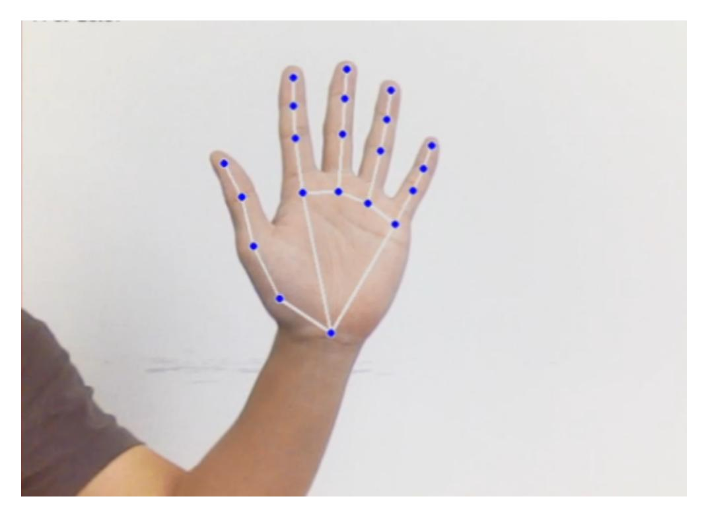
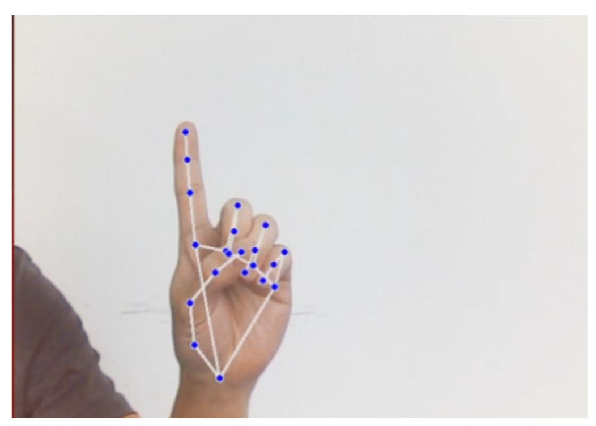
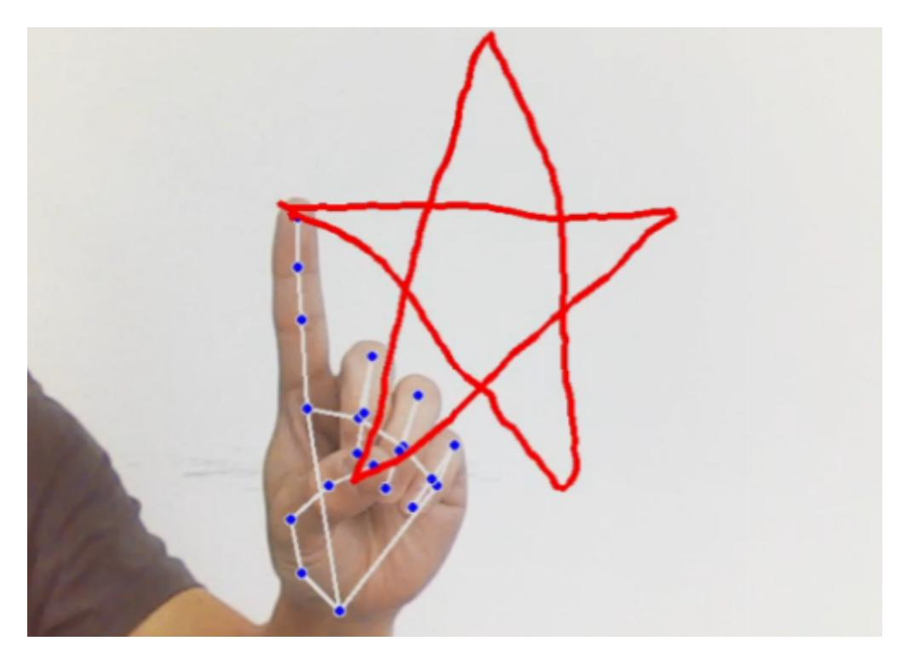
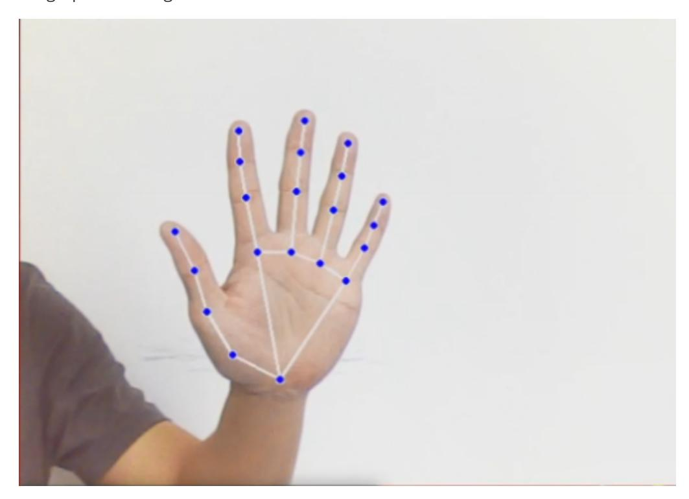
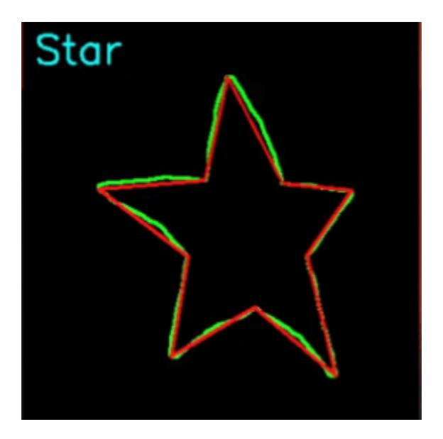

## **11.Fingertip trajectory recognition**

## **1. Content Description**

This course implements color image acquisition and fingertip detection using the MediaPipe framework. Gestures are used to start and stop recording fingertip trajectories within the image. After recording is complete, a fingertip trajectory map is generated and the trajectory is recognized.

This section requires entering commands in the terminal. The terminal you open depends on your motherboard type. This lesson uses the Raspberry Pi 5 as an example. For Raspberry Pi and Jetson-Nano boards, you need to open a terminal on the host computer and enter the command to enter the Docker container. Once inside the Docker container, enter the commands mentioned in this section in the terminal. For instructions on entering the Docker container from the host computer, refer to this product tutorial **[Configuration and Operation Guide]--[Enter the Docker (Jetson Nano and Raspberry Pi 5 users, see here)]**.

Simply open the terminal on the Orin motherboard and enter the commands mentioned in this section.

## **2. Program startup**

First, in the terminal, enter the following command to start the camera,

```
ros2 launch orbbec_camera dabai_dcw2.launch.py
```

After successfully starting the camera, open another terminal and enter the following command in the terminal to start the fingertip trajectory recognition program:

```
ros2 run yahboomcar_mediapipe 15_ FingerTrajectory
```

After the program is run, as shown in the figure below, place your palm flat on the camera screen, open your fingers, and face the camera with your palm, similar to the number 5 gesture. The image will draw the joints on the entire palm. Adjust the position of your palm and try to keep it in the upper middle part of the screen.



At this time, the index finger remains unchanged and the other fingers are retracted, similar to the gesture of the number 1.



While holding gesture 1, move the position of your finger and a red line will appear on the screen, drawing the path of your index finger.



After the graphic is drawn, open all your fingers and make a gesture similar to the number 5, and the drawn graphic will be generated below.





Note: The drawn graphics need to be closed, otherwise some content may be missing.

There are currently four trajectory shapes that can be recognized, namely: triangle, rectangle, circle, and five-pointed star

## **3. Core code analysis**

Program code path:

Raspberry Pi 5 and Jetson-Nano board

The program code is in the running docker. The path in docker is /root/yahboomcar\_ws/src/yahboomcar\_mediapipe/yahboomcar\_mediapipe/15\_FingerTra jectory.py

Orin Motherboard

The program code path is /home/jetson/yahboomcar\_ws/src/yahboomcar\_mediapipe/yahboomcar\_mediapipe/15\_Fi ngerTrajectory.py

Import the library files used,

```
import math
import time
import cv2 as cv
import numpy as np
import mediapipe as mp
import rclpy
from rclpy.node import Node
from cv_bridge import CvBridge
from sensor_msgs.msg import Image
from arm_msgs.msg import ArmJoints,ArmJoint
import cv2
import gc
import threading
import enum
```

Initialize data and define publishers and subscribers,

```
def __init__(self,name):
    super().__init__(name)
```

```
self.drawing = mp.solutions.drawing_utils
    self.timer = time.time()
    self.move_state = False
    self.state = State.NULL
    self.points = []
    self.start_count = 0
    self.no_finger_timestamp = time.time()
    self.gc_stamp = time.time()
    self.hand_detector = mp.solutions.hands.Hands(
        static_image_mode=False,
        max_num_hands=1,
        min_tracking_confidence=0.05,
        min_detection_confidence=0.6
    )
    self.rgb_bridge = CvBridge()
    #Define the topic for controlling 6 servos and publish the detected posture
    self.TargetAngle_pub = self.create_publisher(ArmJoints, "arm6_joints", 10)
    self.init_joints = [90, 164, 18, 0, 90, 30]
    self.pubSix_Arm(self.init_joints)
    #Define subscribers for the color image topic
    self.sub_rgb =
self.create_subscription(Image,"/camera/color/image_raw",self.get_RGBImageCallBa
ck,100)
```

Color image callback function,

```
def get_RGBImageCallBack(self,msg):
    rgb_image = self.rgb_bridge.imgmsg_to_cv2(msg, "bgr8")
    rgb_image = cv2.flip(rgb_image, 1) # 水平翻转
    result_image = np.copy(rgb_image)
    if self.timer <= time.time() and self.state == State.RUNNING:
        self.state = State.NULL
    try:
        #Call the process function to detect the palm
        results = self.hand_detector.process(rgb_image) if self.state !=
State.RUNNING else None
        #Judge whether the palm is detected. If results is not 0, it means that
the palm is detected.
        if results is not None and results.multi_hand_landmarks:
            gesture = "none"
            index_finger_tip = [0, 0]
            #Record the current time for timeout processing
            self.no_finger_timestamp = time.time()
            #Traverse the test results
            for hand_landmarks in results.multi_hand_landmarks:
                self.drawing.draw_landmarks(
                    result_image,
                    hand_landmarks,
                    mp.solutions.hands.HAND_CONNECTIONS)
                landmarks = get_hand_landmarks(rgb_image,
hand_landmarks.landmark)
                #Call hand_angle to calculate the bending angle of each finger
                angle_list = (hand_angle(landmarks))
                #Call the h_gesture function to determine the gesture made by the
finger
                gesture = (h_gesture(angle_list))
                index_finger_tip = landmarks[8].tolist()
```

```
if self.state == State.NULL:
                 # Detect that only the index finger is extended and the other
fingers are clenched into a fist
                if gesture == "one":
                    self.start_count += 1
                    if self.start_count > 20:
                        self.state = State.TRACKING
                        self.points = []
                else:
                    self.start_count = 0
            elif self.state == State.TRACKING:
                # Stretch out five fingers to end drawing
                if gesture == "five":
                    self.state = State.NULL
                    # Generate black and white trajectory map
                    track_img = get_track_img(self.points)
                    contours = cv2.findContours(track_img, cv2.RETR_EXTERNAL,
cv2.CHAIN_APPROX_NONE)[-2]
                    contour = get_area_max_contour(contours, 300)
                    contour = contour[0]
                    # Identify the drawn graphics according to the trajectory
graph
                    # cv2.fillPoly draws and fills polygons on the image
                    track_img = cv2.fillPoly(track_img, [contour,], (255, 255,
255))
                    for _ in range(3):
                        # Corrosion function
                        track_img = cv2.erode(track_img,
cv2.getStructuringElement(cv2.MORPH_RECT, (5, 5)))
                        # Expansion function
                        track_img = cv2.dilate(track_img,
cv2.getStructuringElement(cv2.MORPH_RECT, (5, 5)))
                    contours = cv2.findContours(track_img, cv2.RETR_EXTERNAL,
cv2.CHAIN_APPROX_NONE)[-2]
                    contour = get_area_max_contour(contours, 300)
                    contour = contour[0]
                    h, w = track_img.shape[:2]
                    track_img = np.full([h, w, 3], 0, dtype=np.uint8)
                    track_img = cv2.drawContours(track_img, [contour, ], -1, (0,
255, 0), 2)
                    # Perform polygon fitting on image contour points
                    approx = cv2.approxPolyDP(contour, 0.026 *
cv2.arcLength(contour, True), True)
```

```
track_img = cv2.drawContours(track_img, [approx, ], -1, (0,
0, 255), 2)
                    graph_name = 'unknown'
                    # Determine the shape based on the number of vertices of the
outline
                    if len(approx) == 3:
                        graph_name = 'Triangle'
                    if len(approx) == 4 or len(approx) == 5:
                        graph_name = 'Square'
                    if 5 < len(approx) < 10:
                        graph_name = 'Circle'
                    if len(approx) == 10:
                        graph_name = 'Star'
                    cv2.putText(track_img, graph_name, (10,
40),cv2.FONT_HERSHEY_SIMPLEX, 1.2, (255, 255, 0), 2)
                    cv2.imshow('track', track_img)
                else:
                    if len(self.points) > 0:
                        if distance(self.points[-1], index_finger_tip) > 5:
                            self.points.append(index_finger_tip)
                    else:
                        self.points.append(index_finger_tip)
                draw_points(result_image, self.points)
            else:
                pass
        else:
            if self.state == State.TRACKING:
                if time.time() - self.no_finger_timestamp > 2:
                    self.state = State.NULL
                    self.points = []
    except BaseException as e:
        print(e)
    #result_image = cv2.cvtColor(result_image, cv2.COLOR_RGB2BGR)
    cv2.imshow('image', result_image)
    key = cv2.waitKey(1)
     # Press the spacebar to clear the recorded tracks
    if key == ord(' '):
        self.points = []
    if time.time() > self.gc_stamp:
        self.gc_stamp = time.time() + 1
        gc.collect()
```

hand\_angle function, calculates the bending angle of each finger

```
def hand_angle(landmarks):
    angle_list = []
    # thumb 大拇指
    angle_ = vector_2d_angle(landmarks[3] - landmarks[4], landmarks[0] -
landmarks[2])
    angle_list.append(angle_)
    # index 食指
```

```
angle_ = vector_2d_angle(landmarks[0] - landmarks[6], landmarks[7] -
landmarks[8])
    angle_list.append(angle_)
    # middle 中指
    angle_ = vector_2d_angle(landmarks[0] - landmarks[10], landmarks[11] -
landmarks[12])
    angle_list.append(angle_)
    # ring 无名指
    angle_ = vector_2d_angle(landmarks[0] - landmarks[14], landmarks[15] -
landmarks[16])
    angle_list.append(angle_)
    # pink 小拇指
    angle_ = vector_2d_angle(landmarks[0] - landmarks[18], landmarks[19] -
landmarks[20])
    angle_list.append(angle_)
    angle_list = [abs(a) for a in angle_list]
    return angle_list
```

h\_gesture function, which determines the gesture of the finger through two-dimensional features

```
def h_gesture(angle_list):
    thr_angle, thr_angle_thumb, thr_angle_s = 65.0, 53.0, 49.0
    if (angle_list[0] < thr_angle_s) and (angle_list[1] < thr_angle_s) and
(angle_list[2] < thr_angle_s) and (
            angle_list[3] < thr_angle_s) and (angle_list[4] < thr_angle_s):
        gesture_str = "five"
    elif (angle_list[0] > 5) and (angle_list[1] < thr_angle_s) and
(angle_list[2] > thr_angle) and (
            angle_list[3] > thr_angle) and (angle_list[4] > thr_angle):
        gesture_str = "one"
    else:
        gesture_str = "none"
    return gesture_str
```

get\_track\_img function, generates the track map,

```
def get_track_img(points):
    points = np.array(points).astype(dtype=np.int32)
    x_min, y_min = np.min(points, axis=0).tolist()
    x_max, y_max = np.max(points, axis=0).tolist()
    track_img = np.full([y_max - y_min + 100, x_max - x_min + 100, 1], 0,
dtype=np.uint8)
    points = points - [x_min, y_min]
    points = points + [50, 50]
    draw_points(track_img, points, 1, (255, 255, 255))
    return track_img
```