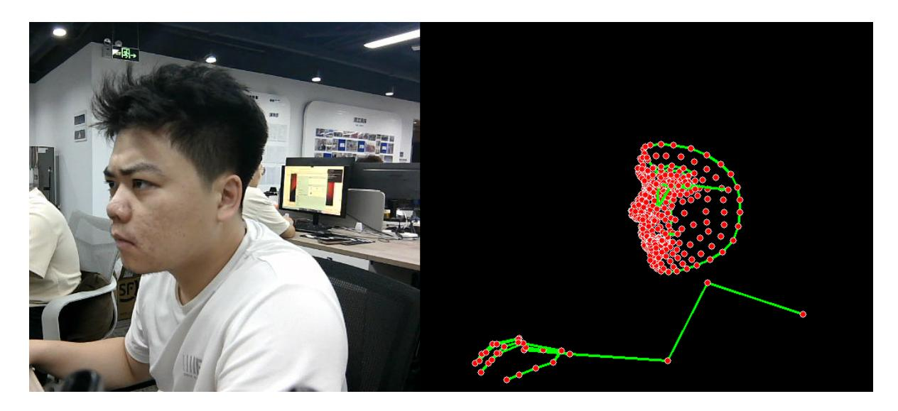

## **Overall detection**

Overall [detection](#page-0-0)

- <span id="page-0-0"></span>1. Content [Description](#page-0-1)
- [2. Program startup](#page-0-2)
- <span id="page-0-1"></span>3. Core code [analysis](#page-1-0)

## **1. Content Description**

This course implements color image acquisition and uses the MediaPipe framework to perform overall image detection, including faces, hands, and torsos.

This section requires entering commands in the terminal. The terminal you open depends on your motherboard type. This lesson uses the Raspberry Pi 5 as an example. For Raspberry Pi and Jetson-Nano boards, you need to open a terminal on the host computer and enter the command to enter the Docker container. Once inside the Docker container, enter the commands mentioned in this section in the terminal. For instructions on entering the Docker container from the host computer, refer to this product tutorial **[Configuration and Operation Guide]--[Enter the Docker (Jetson Nano and Raspberry Pi 5 users, see here)]**.

Simply open the terminal on the Orin motherboard and enter the commands mentioned in this section.

## **2. Program startup**

First, in the terminal, enter the following command to start the camera,

```
ros2 launch orbbec_camera dabai_dcw2.launch.py
```

After successfully starting the camera, open another terminal and enter the following command in the terminal to start the overall detection program:

```
ros2 run yahboomcar_mediapipe 03_Holistic
```

After the program is run, as shown in the figure below, the overall points detected will be displayed on the right side of the image.



## **3. Core code analysis**

Program code path:

Raspberry Pi 5 and Jetson-Nano board The program code is in the running docker. The path in docker

<span id="page-1-0"></span>is /root/yahboomcar\_ws/src/yahboomcar\_mediapipe/yahboomcar\_mediapipe/03\_Holistic. py

Orin Motherboard

The program code path is /home/jetson/yahboomcar\_ws/src/yahboomcar\_mediapipe/yahboomcar\_mediapipe/03\_Ho listic.py

Import the library files used,

```
import rclpy
from rclpy.node import Node
from geometry_msgs.msg import Point
import mediapipe as mp
import cv2 as cv
import numpy as np
import time
import os
from cv_bridge import CvBridge
from sensor_msgs.msg import Image
from arm_msgs.msg import ArmJoints
import cv2
print("import done")
```

Initialize data and define publishers and subscribers,

```
def __init__(self, name,staticMode=False, landmarks=True, detectionCon=0.5,
trackingCon=0.5):
    super().__init__(name)
    #Use the class in the mediapipe library to define an overall object
    self.mpHolistic = mp.solutions.holistic
    self.mpFaceMesh = mp.solutions.face_mesh
    self.mpHands = mp.solutions.hands
    self.mpPose = mp.solutions.pose
    self.mpDraw = mp.solutions.drawing_utils
```

```
self.mpholistic = self.mpHolistic.Holistic(
    static_image_mode=staticMode,
    smooth_landmarks=landmarks,
    min_detection_confidence=detectionCon,
    min_tracking_confidence=trackingCon)
    #Define the properties of the joint connection line, which will be used in
the subsequent joint point connection function
    self.lmDrawSpec = mp.solutions.drawing_utils.DrawingSpec(color=(0, 0, 255),
thickness=-1, circle_radius=3)
    self.drawSpec = mp.solutions.drawing_utils.DrawingSpec(color=(0, 255, 0),
thickness=2, circle_radius=2)
    #create a publisher
    self.rgb_bridge = CvBridge()
    self.TargetAngle_pub = self.create_publisher(ArmJoints, "arm6_joints", 10)
    self.init_joints = [90, 150, 10, 20, 90, 90]
    self.pubSix_Arm(self.init_joints)
    self.sub_rgb =
self.create_subscription(Image,"/camera/color/image_raw",self.get_RGBImageCallBa
ck,100)
```

Color image callback function,

```
def get_RGBImageCallBack(self,msg):
    #Use CvBridge to convert color image message data into image data
    rgb_image = self.rgb_bridge.imgmsg_to_cv2(msg, "bgr8")
    #Put the obtained image into the defined pubPosePoint function, draw=False
means not to draw the joint points on the original color image
    frame, img = self.findHolistic(rgb_image, draw=False)
    #Merge two images
    dist = self.frame_combine(frame, img)
    key = cv2.waitKey(1)
    cv.imshow('dist', dist)
```

findHolistic function,

```
def findHolistic(self, frame, draw=True):
    #Create a new image based on the incoming image size. The image data type is
uint8
    img = np.zeros(frame.shape, np.uint8)
    #Convert the color space of the incoming image from BGR to RGB to facilitate
subsequent image processing
    img_RGB = cv.cvtColor(frame, cv.COLOR_BGR2RGB)
    #Call the process function in the mediapipe library for image processing.
During init, the self.mpholistic object is created and initialized.
    self.results = self.mpholistic.process(img_RGB)
    #Determine whether a face is detected. If so, connect each point on the blank
image created previously
    if self.results.face_landmarks:
        if draw: self.mpDraw.draw_landmarks(frame, self.results.face_landmarks,
self.mpFaceMesh.FACEMESH_CONTOURS, self.lmDrawSpec, self.drawSpec)
        self.mpDraw.draw_landmarks(img, self.results.face_landmarks,
self.mpFaceMesh.FACEMESH_CONTOURS, self.lmDrawSpec, self.drawSpec)
    #Determine whether the torso is detected. If so, connect each point on the
blank image created previously.
    if self.results.pose_landmarks:
```

```
if draw: self.mpDraw.draw_landmarks(frame, self.results.pose_landmarks,
self.mpPose.POSE_CONNECTIONS, self.lmDrawSpec, self.drawSpec)
        self.mpDraw.draw_landmarks(img, self.results.pose_landmarks,
self.mpPose.POSE_CONNECTIONS, self.lmDrawSpec, self.drawSpec)
    #Determine whether the left hand is detected. If so, connect each point on
the blank image created previously.
    if self.results.left_hand_landmarks:
        if draw: self.mpDraw.draw_landmarks(frame,
self.results.left_hand_landmarks, self.mpHands.HAND_CONNECTIONS,
self.lmDrawSpec, self.drawSpec)
        self.mpDraw.draw_landmarks(img, self.results.left_hand_landmarks,
self.mpHands.HAND_CONNECTIONS, self.lmDrawSpec, self.drawSpec)
    #Determine whether the right hand is detected. If so, connect each point on
the blank image created previously.
    if self.results.right_hand_landmarks:
        if draw: self.mpDraw.draw_landmarks(frame,
self.results.right_hand_landmarks, self.mpHands.HAND_CONNECTIONS,
self.lmDrawSpec, self.drawSpec)
        self.mpDraw.draw_landmarks(img, self.results.right_hand_landmarks,
self.mpHands.HAND_CONNECTIONS, self.lmDrawSpec, self.drawSpec)
    return frame, img
```

The frame\_combine image merging function was mentioned in the first lesson of this chapter. Please refer to [Meediapipe Visual Fun Game] - [1. Hand Detection] for an analysis of this function.