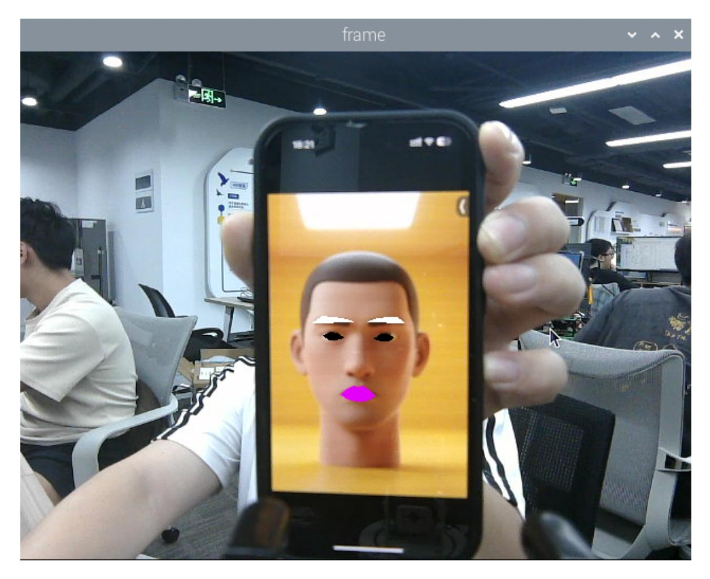

## **1. Content Description**

This program implements the functions of acquiring color images and using the dlib library to implement face detection and face effects.

This section requires entering commands in the terminal. The terminal you open depends on your motherboard type. This lesson uses the Raspberry Pi 5 as an example. For Raspberry Pi and Jetson-Nano boards, you need to open a terminal on the host computer and enter the command to enter the Docker container. Once inside the Docker container, enter the commands mentioned in this section in the terminal. For instructions on entering the Docker container from the host computer, refer to this product tutorial **[Configuration and Operation Guide]--[Enter the Docker (Jetson Nano and Raspberry Pi 5 users, see here)]**.

Open the terminal directly on the Orin motherboard and enter the commands mentioned in this section.

## **2. Program startup**

First, in the terminal, enter the following command to start the camera,

ros2 launch orbbec\_camera dabai\_dcw2.launch.py

After successfully starting the camera, open another terminal and enter the following command in the terminal to start the face effects program:

ros2 run yahboomcar\_mediapipe 06\_FaceLandmarks

After the program is run, as shown in the figure below, it will first detect the face, and then perform special effects processing on the eyebrows, eyes and mouth areas.



## **3. Core code analysis**

Program code path:

Raspberry Pi 5 and Jetson-Nano board

The program code is in the running docker. The path in docker is /root/yahboomcar\_ws/src/yahboomcar\_mediapipe/yahboomcar\_mediapipe/06\_FaceLandm arks.py

Orin Motherboard

The program code path is /home/jetson/yahboomcar\_ws/src/yahboomcar\_mediapipe/yahboomcar\_mediapipe/06\_Face Landmarks.py

Import the library files used,

```
import time
#Import dlib library
import dlib
import cv2 as cv
import numpy as np
import rclpy
from rclpy.node import Node
from cv_bridge import CvBridge
from sensor_msgs.msg import Image
from arm_msgs.msg import ArmJoints
import cv2
```

DLIB is a modern C++ toolkit that includes machine learning algorithms and tools for creating complex software in C++ to solve real-world problems. It is widely used in industry and academia for robotics, embedded devices, mobile phones, and large-scale high-performance computing environments. The dlib library uses 68 points to mark important facial features, such as points 18- 22 for the right eyebrow and points 51-68 for the mouth. Faces are detected using the get\_frontal\_face\_detector module in the dlib library, and facial feature values are predicted using the shape\_predictor\_68\_face\_landmarks.dat feature data.

The 68 facial key points of dlib are arranged in the following order:

```
0-16: Chin contour
```

- 17-21: right eyebrow
- 22-26: Left eyebrow
- 27-35: Nose bridge and nose tip
- 36-41: right eye
- 42-47: Left eye
- 48-67: Lip contour

Initialize data and define publishers and subscribers,

```
def __init__(self,name):
    super().__init__(name)
    #Import database
    self.dat_file =
"/root/yahboomcar_ws/src/yahboomcar_mediapipe/yahboomcar_mediapipe/file/shape_pr
edictor_68_face_landmarks.dat"
    #Define face detection object
    self.hog_face_detector = dlib.get_frontal_face_detector()
    self.dlib_facelandmark = dlib.shape_predictor(self.dat_file)
    self.rgb_bridge = CvBridge()
    #Define the topic for controlling 6 servos and publish the detected posture
    self.TargetAngle_pub = self.create_publisher(ArmJoints, "arm6_joints", 10)
    self.init_joints = [90, 150, 10, 20, 90, 90]
    self.pubSix_Arm(self.init_joints)
    #Define subscribers for the color image topic
    self.sub_rgb =
self.create_subscription(Image,"/camera/color/image_raw",self.get_RGBImageCallBa
ck,100)
```

The topic of color images returns to the function,

```
def get_RGBImageCallBack(self,msg):
    rgb_image = self.rgb_bridge.imgmsg_to_cv2(msg, "bgr8")
    #Put the obtained image into the defined get_face function and return the
detected image
    frame = self.get_face(rgb_image, draw=False)
    #Call the prettify_face function to perform special effects processing on the
image
    frame = self.prettify_face(frame, eye=True, lips=True, eyebrow=True,
draw=True)
    key = cv2.waitKey(1)
    cv.imshow('frame', frame)
```

get\_face function, detects faces,

```
def get_face(self, frame, draw=True):
    #Convert the image space and convert bgr into grayscale image to facilitate
subsequent image processing
    gray = cv.cvtColor(frame, cv.COLOR_BGR2GRAY)
    #Input grayscale image and detect faces
    self.faces = self.hog_face_detector(gray)
    for face in self.faces:
        self.face_landmarks = self.dlib_facelandmark(gray, face)
        if draw:
            for n in range(68):
                x = self.face_landmarks.part(n).x
                y = self.face_landmarks.part(n).y
                cv.circle(frame, (x, y), 2, (0, 255, 255), 2)
                cv.putText(frame, str(n), (x, y), cv.FONT_HERSHEY_SIMPLEX, 0.6,
(0, 255, 255), 2)
    return frame
```

prettify\_face function, add special effects to the face,

```
def prettify_face(self, frame, eye=True, lips=True, eyebrow=True, draw=True):
    #Eye
    if eye:
        leftEye = self.get_lmList(frame, 36, 42)
        rightEye = self.get_lmList(frame, 42, 48)
        if draw:
            if len(leftEye) != 0: frame = cv.fillConvexPoly(frame,
np.mat(leftEye), (0, 0, 0))
            if len(rightEye) != 0: frame = cv.fillConvexPoly(frame,
np.mat(rightEye), (0, 0, 0))
    #lips
    if lips:
        lipIndexlistA = [51, 52, 53, 54, 64, 63, 62]
        lipIndexlistB = [48, 49, 50, 51, 62, 61, 60]
        lipsUpA = self.get_lipList(frame, lipIndexlistA, draw=True)
        lipsUpB = self.get_lipList(frame, lipIndexlistB, draw=True)
        lipIndexlistA = [57, 58, 59, 48, 67, 66]
        lipIndexlistB = [54, 55, 56, 57, 66, 65, 64]
        lipsDownA = self.get_lipList(frame, lipIndexlistA, draw=True)
        lipsDownB = self.get_lipList(frame, lipIndexlistB, draw=True)
        if draw:
            if len(lipsUpA) != 0: frame = cv.fillConvexPoly(frame,
np.mat(lipsUpA), (249, 0, 226))
            if len(lipsUpB) != 0: frame = cv.fillConvexPoly(frame,
np.mat(lipsUpB), (249, 0, 226))
            if len(lipsDownA) != 0: frame = cv.fillConvexPoly(frame,
np.mat(lipsDownA), (249, 0, 226))
            if len(lipsDownB) != 0: frame = cv.fillConvexPoly(frame,
np.mat(lipsDownB), (249, 0, 226))
    #Eyebrow
    if eyebrow:
        lefteyebrow = self.get_lmList(frame, 17, 22)
        righteyebrow = self.get_lmList(frame, 22, 27)
        if draw:
            if len(lefteyebrow) != 0: frame = cv.fillConvexPoly(frame,
np.mat(lefteyebrow), (255, 255, 255))
            if len(righteyebrow) != 0: frame = cv.fillConvexPoly(frame,
np.mat(righteyebrow), (255, 255, 255))
```

get\_lmList gets the facial coordinate function,

```
def get_lmList(self, frame, p1, p2, draw=True):
    #Define an empty list
    lmList = []
    # Determine whether a face is detected
    if len(self.faces) != 0:
         #Traverse the face list and get the xy coordinates of each point in the
interval
        for n in range(p1, p2):
            x = self.face_landmarks.part(n).x
            y = self.face_landmarks.part(n).y
            #Add the coordinates of the points on the face to the list
            lmList.append([x, y])
            if draw:
                next_point = n + 1
                if n == p2 - 1: next_point = p1
                x2 = self.face_landmarks.part(next_point).x
                y2 = self.face_landmarks.part(next_point).y
                cv.line(frame, (x, y), (x2, y2), (0, 255, 0), 1)
    return lmList
```