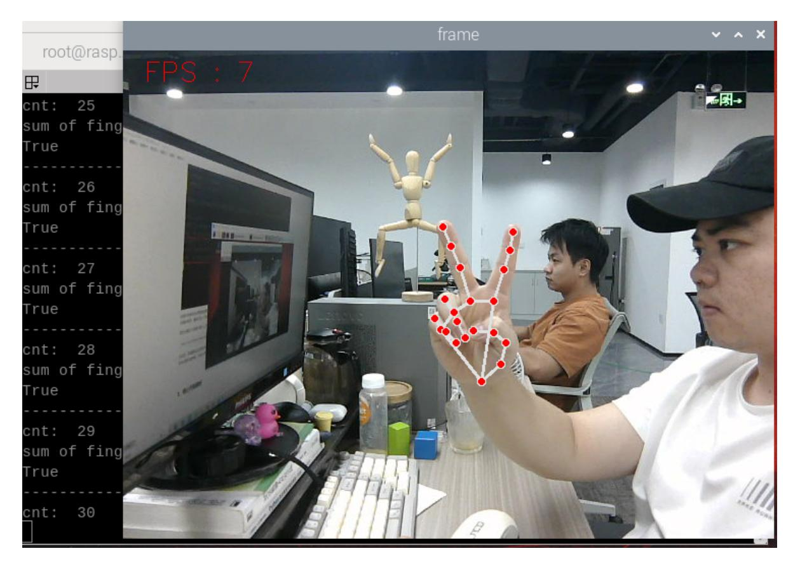
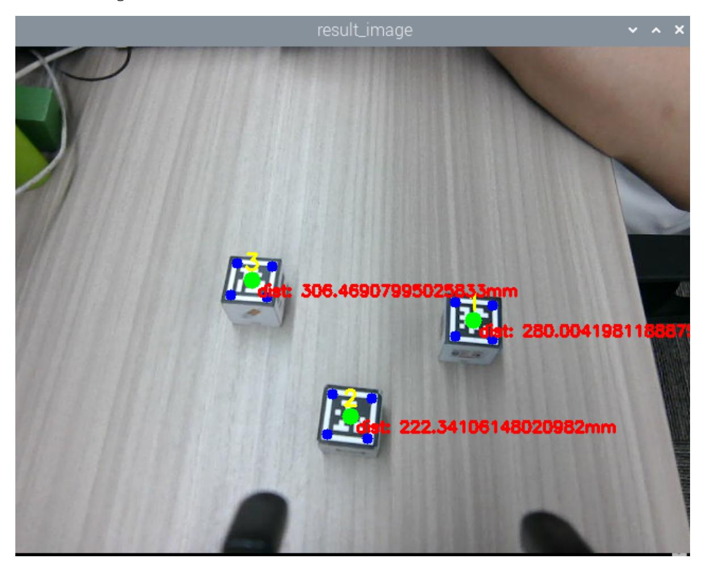

# **Medipipe gesture ID sorting machine code**

## **1. Content Description**

This function implements the program to capture images through the camera and then recognize gestures (1-4). After analyzing the gestures, the robotic arm moves to a sorting posture. According to the gestures, it sorts the machine-coded wooden blocks on the table. If a machine-coded wooden block with the ID corresponding to the gesture exists on the table, the robotic arm lowers its gripper and places it in the designated location. If a machine-coded wooden block with the ID corresponding to the gesture does not exist on the table, the robotic arm shakes its head and finally returns to the gesture recognition posture.

This section requires entering commands in the terminal. The terminal you open depends on your motherboard type. This lesson uses the Raspberry Pi 5 as an example. For Raspberry Pi and Jetson-Nano boards, you need to open a terminal on the host computer and enter the command to enter the Docker container. Once inside the Docker container, enter the commands mentioned in this section in the terminal. For instructions on entering the Docker container from the host computer, refer to this product tutorial **[Configuration and Operation Guide]--[Enter the Docker (Jetson Nano and Raspberry Pi 5 users, see here)]**.

Simply open the terminal on the Orin motherboard and enter the commands mentioned in this section.

#### **2. Program startup**

First, open the terminal and enter the following command to start the robot arm solver and camera driver,

```
ros2 launch M3Pro_demo camera_arm_kin.launch.py
```

Then, open another terminal and enter the following command to start the robotic arm gripping program:

```
ros2 run M3Pro_demo grasp_desktop
```

After running, it is shown as follows:

Then enter the following command in the third terminal to start the Mediapipe gesture ID sorting machine code program,

After starting this command, the second terminal should receive the current angle topic information sent in one frame and calculate the current posture once, as shown in the figure below.

If the current angle information is not received and the current posture is not calculated, the gripping posture will be inaccurate during the coordinate system conversion. Therefore, you need to close the Mediapipe gesture ID sorting machine code program by pressing ctrl c and restart the Mediapipe gesture ID sorting machine code program until the robot arm gripping program obtains the current angle information and calculates the current end position posture.

Then enter the following command in the fourth terminal to start the Mediapipe gesture recognition program,

```
ros2 run M3Pro_demo mediapipe_detect
```

After starting, the robot arm will move to the recognition posture and begin to recognize gestures. The recognized gestures are 1-4. Gesture 1 represents one finger stretched out, gesture 2 represents two fingers stretched out, gesture 3 represents three fingers stretched out, and gesture 4 represents four fingers stretched out. Keep the gesture in mind and wait for the buzzer to sound, indicating that the gesture recognition is complete. The robot arm will move to the sorting posture. As shown in the figure below, assuming gesture 2 is given,



After entering the sorting posture, it will start to recognize the machine code on the desktop, as shown in the figure below.



After waiting for 8 seconds, if machine code No. 2 is found, the program will determine whether the distance between the machine code block No. 2 and the trolley base\_link is within the range of [210, 220]. If so, the lower claw will directly clamp the machine code block No. 2, and then place it at the set position. Finally, the robotic arm returns to the sorting posture. If not, the distance

between the machine code block No. 2 and the trolley base\_link is outside the range of [210, 220]. The program will control the chassis to adjust the distance, adjust the distance between the two to within the range of [210, 220], and then clamp it with the lower claw, and then place it at the set position. Finally, the robotic arm returns to the sorting posture.

If machine code No. 2 is not found or no machine code is found, the buzzer on the car will sound, then the robotic arm will shake its head and finally return to the gesture recognition posture.

## **3. Core code analysis**

#### **3.1、mediapipe\_detect.py**

Program code path:

Raspberry Pi and Jetson-Nano board

The program code is in the running docker. The path in docker is /root/yahboomcar\_ws/src/M3Pro\_demo/M3Pro\_demo/ mediapipe\_detect.py

Orin Motherboard

The program code path is /home/jetson/yahboomcar\_ws/src/M3Pro\_demo/M3Pro\_demo/mediapipe\_detect.py

Import the necessary libraries,

```
import cv2
import os
import numpy as npX5Plus
from sensor_msgs.msg import Image
from cv_bridge import CvBridge
import cv2 as cv
from arm_msgs.msg import ArmJoints
from std_msgs.msg import Bool,Int16,UInt16
from geometry_msgs.msg import Twist
import time
from M3Pro_demo.media_library import *
from rclpy.node import Node
import rclpy
from message_filters import Subscriber,
TimeSynchronizer,ApproximateTimeSynchronizer
import threading
```

The program initializes and creates publishers and subscribers,

```
def __init__(self, name):
    super().__init__(name)
    #Robotic arm gesture recognition
    self.init_joints = [90, 150, 12, 20, 90, 0]
    self.rgb_bridge = CvBridge()
    self.depth_bridge = CvBridge()
    #Create a gesture recognition object
    self.hand_detector = HandDetector()
     #Define the flag for publishing gestures. When the value is True, it means
that the topic of gesture recognition results can be published.
    self.pub_gesture = True
    #Record the number of times the gesture recognition has the same result. If
the number reaches 30, the gesture recognition is completed.
```

```
self.cnt = 0
    #Record the last gesture recognition result
    self.last_sum = 0
    self.pTime = self.cTime = 0
    #Create a topic for publishers to publish gesture recognition results
    self.pub_GesturetId = self.create_publisher(Int16,"GesturetId",1)
    self.TargetAngle_pub = self.create_publisher(ArmJoints, "arm6_joints", 10)
    self.rgb_image_sub = Subscriber(self, Image, '/camera/color/image_raw')
    #Create a subscriber to subscribe to the reset gesture recognition result
topic
    self.sub_reset_gesture =
self.create_subscription(Bool,"reset_gesture",self.get_resetCallBack,100)
    self.pub_beep = self.create_publisher(UInt16, "beep", 10)
    #Control the robot arm to move to the recognized gesture posture
    self.pubSix_Arm(self.init_joints)
    self.ts = ApproximateTimeSynchronizer([self.rgb_image_sub], 1, 0.5)
    self.ts.registerCallback(self.callback)
    time.sleep(2)
```

callback image topic callback function,

```
def callback(self,color_msg):
    #Get color image topic data and use CvBridge to convert message data into
image data
    rgb_image = self.rgb_bridge.imgmsg_to_cv2(color_msg, "bgr8")
    #Pass the obtained image data into self.process for gesture recognition
    self.process(rgb_image)
```

process function,

```
def process(self, frame):
    #Call the findHands function to detect the palm. The function will return the
lmList list, which stores the detection results.
    frame, lmList, bbox = self.hand_detector.findHands(frame)
    #If the detection list is not empty, it means that a palm is detected, and
self.pub_gesture is True, which means that the gesture topic can be published
    if len(lmList) != 0 and self.pub_gesture == True:
        #Start the thread and execute the gesture recognition program
        gesture = threading.Thread(target=self.Gesture_Detect_threading, args=
(lmList,bbox))
        gesture.start()
        gesture.join()
    self.cTime = time.time()
    fps = 1 / (self.cTime - self.pTime)
    self.pTime = self.cTime
    text = "FPS : " + str(int(fps))
    cv.putText(frame, text, (20, 30), cv.FONT_HERSHEY_SIMPLEX, 0.9, (0, 0, 255),
1)
    #self.media_ros.pub_imgMsg(frame)
    if cv.waitKey(1) & 0xFF == ord('q'):
        cv.destroyAllWindows()
    cv.imshow('frame', frame)
```

Gesture\_Detect\_threading gesture detection program,

```
def Gesture_Detect_threading(self, lmList,bbox):
```

```
#Call fingersUp function to return the number of fingers extended
    fingers = self.hand_detector.fingersUp(lmList)
    print("sum of fingers: ",sum(fingers))
    print(self.pub_gesture)
    #If the number of fingers stretched is the same as last time, then start
counting
    if sum(fingers) == self.last_sum:
        print("---------------------------")
        self.cnt = self.cnt + 1
        print("cnt: ",self.cnt)
        #The cumulative count reaches 30, indicating that the gesture
recognition results of 30 times are the same. The gesture recognition program
ends, the buzzer sounds once, and the gesture recognition result topic is
published.
        if self.cnt==30 and self.pub_gesture == True:
            self.Beep_Loop()
            print("sum of fingers: ",self.last_sum)
            self.pub_gesture = False
            sum_gesture = Int16()
            sum_gesture.data = self.last_sum
            self.pub_GesturetId.publish(sum_gesture)
    else:
        self.cnt = 0
    #Change the gesture result of the last recognition to the current number of
fingers stretched
    self.last_sum = sum(fingers)
```

#### **3.2, apriltagID\_gesture.py**

Program code path:

Raspberry Pi and Jetson-Nano board

The program code is in the running docker. The path in docker is /root/yahboomcar\_ws/src/M3Pro\_demo/M3Pro\_demo/ apriltagID\_gesture.py

Orin Motherboard

The program code path is /home/jetson/yahboomcar\_ws/src/M3Pro\_demo/M3Pro\_demo/apriltagID\_gesture.py

Import the necessary library files,

```
import cv2
import os
import numpy as np
import message_filters
from M3Pro_demo.vutils import draw_tags
from dt_apriltags import Detector
from cv_bridge import CvBridge
import cv2 as cv
from arm_interface.srv import ArmKinemarics
from arm_interface.msg import AprilTagInfo,CurJoints
from arm_msgs.msg import ArmJoints
from arm_msgs.msg import ArmJoint
from M3Pro_demo.Robot_Move import *
from M3Pro_demo.compute_joint5 import *
from std_msgs.msg import Float32,Bool,UInt16,Int16
```

```
import time
import yaml
import math
from rclpy.node import Node
import rclpy
from message_filters import Subscriber,
TimeSynchronizer,ApproximateTimeSynchronizer
from sensor_msgs.msg import Image
from geometry_msgs.msg import Twist
import transforms3d as tfs
import tf_transformations as tf
```

The program initializes and creates publishers and subscribers,

```
def __init__(self, name):
    super().__init__(name).
    #Robot arm sorting posture
    self.init_joints = [90, 120, 0, 0, 90, 90]
    self.identify_joints = [90, 150, 12, 20, 90, 0]
    #Define the array to store the end posture of the robotic arm
    self.CurEndPos = [0.0, 0.0, 0.0, 0.0, 0.0, 0.0]
    self.rgb_bridge = CvBridge()
    self.depth_bridge = CvBridge()
    self.pubPos_flag = False
    self.at_detector = Detector(searchpath=['apriltags'],
                                families='tag36h11',
                                nthreads=8,
                                quad_decimate=2.0,
                                quad_sigma=0.0,
                                refine_edges=1,
                                decode_sharpening=0.25,
                                debug=0)
    self.Center_x_list = []
    self.Center_y_list = []
    self.pos_info_pub = self.create_publisher(AprilTagInfo,"PosInfo",1)
    self.CmdVel_pub = self.create_publisher(Twist,"cmd_vel",1)
    self.sub_grasp_status =
self.create_subscription(Bool,"grasp_done",self.get_graspStatusCallBack,100)
    self.pub_cur_joints = self.create_publisher(CurJoints,"Curjoints",1)
    #Define the publisher of the reset gesture result topic
    self.pub_reset_gesture = self.create_publisher(Bool,"reset_gesture",1)
    self.TargetAngle_pub = self.create_publisher(ArmJoints, "arm6_joints", 10)
    self.pub_SingleTargetAngle = self.create_publisher(ArmJoint, "arm_joint",
10)
    self.rgb_image_sub = Subscriber(self, Image, '/camera/color/image_raw')
    self.depth_image_sub = Subscriber(self, Image, '/camera/depth/image_raw')
    self.client = self.create_client(ArmKinemarics, 'get_kinemarics')
    self.TargetJoint5_pub = self.create_publisher(Int16, "set_joint5", 10)
    self.get_current_end_pos()
    self.pubCurrentJoints()
    #Define the subscriber who subscribes to the gesture recognition result
topic
    self.sub_GesturetId =
self.create_subscription(Int16,"GesturetId",self.get_GesturetIdCallBack,1)
    self.ts = ApproximateTimeSynchronizer([self.rgb_image_sub,
self.depth_image_sub], 1, 0.5)
    #Define the publisher to publish the buzzer control topic
```

```
self.pub_beep = self.create_publisher(UInt16, "beep", 10)
    self.ts.registerCallback(self.callback)
    self.camera_info_K = [477.57421875, 0.0, 319.3820495605469, 0.0,
477.55718994140625, 238.64108276367188, 0.0, 0.0, 1.0]
    self.EndToCamMat = np.array([[ 0 ,0 ,1 ,-1.00e-01],
                                 [-1 ,0 ,0 ,0],
                                 [0 ,-1 ,0 ,4.82000000e-02],
                                 [ 0.00000000e+00 , 0.00000000e+00 ,
0.00000000e+00 , 1.00000000e+00]])
    time.sleep(2)
    self.TargetID = 0
    self.detect_flag = False
    self.x_offset = offset_config.get('x_offset')
    self.y_offset = offset_config.get('y_offset')
    self.z_offset = offset_config.get('z_offset')
    self.adjust_dist = True
    self.linearx_PID = (0.5, 0.0, 0.2)
    self.linearx_pid = simplePID(self.linearx_PID[0] / 1000.0,
self.linearx_PID[1] / 1000.0, self.linearx_PID[2] / 1000.0)
    self.joint5 = Int16()
    self.count = False
    self.start_time = 0.0
    self.index = None
```

callback image topic processing function,

```
def callback(self,color_msg,depth_msg):
    rgb_image = self.rgb_bridge.imgmsg_to_cv2(color_msg, "rgb8")
    depth_image = self.depth_bridge.imgmsg_to_cv2(depth_msg, "32FC1")
    depth_to_color_image = cv.applyColorMap(cv.convertScaleAbs(depth_image,
alpha=1.0), cv.COLORMAP_JET)
    frame = cv.resize(depth_image, (640, 480))
    depth_image_info = frame.astype(np.float32)
    tags = self.at_detector.detect(cv2.cvtColor(rgb_image, cv2.COLOR_RGB2GRAY),
False, None, 0.025)
    self.Center_x_list = list(range(len(tags)))
    self.Center_y_list = list(range(len(tags)))
    draw_tags(rgb_image, tags, corners_color=(0, 0, 255), center_color=(0, 255,
0))
    key = cv2.waitKey(10)
    if key == 32:
        self.pubPos_flag = True
    if self.count==True:
        if (time.time() - self.start_time)>8:
            self.pubPos_flag = True
            self.count = False
    if len(tags) > 0 :
        for i in range(len(tags)):
            center_x, center_y = tags[i].center
            self.Center_x_list[i] = center_x
            self.Center_y_list[i] = center_y
            cur_id = tags[i].tag_id
            cx = center_x
            cy = center_y
            cz = depth_image_info[int(cy),int(cx)]/1000
            print("cx: ",cx)
            print("cy: ",cy)
```

```
print("cz: ",cz)
            pose = self.compute_heigh(cx,cy,cz)
            dist_detect = math.sqrt(pose[1] ** 2 + pose[0]** 2)
            dist_detect = dist_detect*1000
            dist = 'dist: ' + str(dist_detect) + 'mm'
            cv.putText(rgb_image, dist, (int(cx)+5, int(cy)+15),
cv.FONT_HERSHEY_SIMPLEX, 0.5, (255, 0, 0), 2)
            #If the current ID is the target ID, it means the target machine
code has been found
            if cur_id == self.TargetID and self.pubPos_flag==True:
                print("Found the target.")
                #Change the value of self.detect_flag to indicate that the target
ID machine code has been found
                self.detect_flag = True
                #Store the array index of tags of the target ID machine code
                self.index = i
            print("self.index: ",self.index)
            #If the target ID machine code is found and chassis adjustment is
enabled, and the distance between the machine code block and the car base_link is
outside the range [210, 220]
            if abs(dist_detect - 215.0)>5 and self.adjust_dist==True and
self.detect_flag == True and self.index!=None:
                print("Adjusting")
                #Call move_dist to control the chassis movement and adjust the
distance
                self.move_dist(dist_detect)
             #If the target ID machine code is found and the distance between
the machine code block and the car base_link is within the range of [210, 220]
            elif abs(dist_detect - 215.0)<5 and self.detect_flag == True and
self.index!=None:
                self.pubVel(0,0,0)
                self.adjust_dist = False
                tag = AprilTagInfo()
                tag.id = tags[self.index].tag_id
                #Find the target machine code through the array subscript and
extract the center coordinates xy
                tag.x = float(self.Center_x_list[self.index])
                tag.y = float(self.Center_y_list[self.index])
                tag.z = depth_image_info[int(tag.y),int(tag.x)]/1000
                vx = int(tags[self.index].corners[0][0]) -
int(tags[self.index].corners[1][0])
                vy = int(tags[self.index].corners[0][1]) -
int(tags[self.index].corners[1][1])
                target_joint5 = compute_joint5(vx,vy)
                print("target_joint5: ",target_joint5)
                self.joint5.data = int(target_joint5)
                if tag.z!=0 and self.pubPos_flag == True :
                    #Publish machine code location topic message
                    self.pos_info_pub.publish(tag)
                    self.TargetJoint5_pub.publish(self.joint5)
                    self.pubPos_flag = False
                    self.index = None
                else:
                    print("Invalid distance.")
        #If the machine code location topic is enabled but the target ID machine
code is not found, the buzzer sounds once and the reset gesture topic is
published
```

```
if self.detect_flag == False and self.TargetID!=0 and
self.pubPos_flag==True:
            self.pubPos_flag = False
            self.Beep_Loop()
            self.shake()
            print("Did not find the target.")
            self.TargetID = 0
            reset = Bool()
            reset.data = True
            self.pub_reset_gesture.publish(reset)
    #If the machine code location topic is enabled but no machine code is found,
the buzzer sounds and the reset gesture topic is published
    elif self.pubPos_flag==True and len(tags)==0:
        self.pubVel(0,0,0)
        self.Beep_Loop()
        self.shake()
        reset = Bool()
        reset.data = True
        self.pub_reset_gesture.publish(reset)
        self.pubPos_flag = False
        print("Did not find any target.")
    rgb_image = cv2.cvtColor(rgb_image, cv2.COLOR_RGB2BGR)
    cv2.imshow("result_image", rgb_image)
    cv2.imshow("depth_image", depth_to_color_image)
    key = cv2.waitKey(1)
```