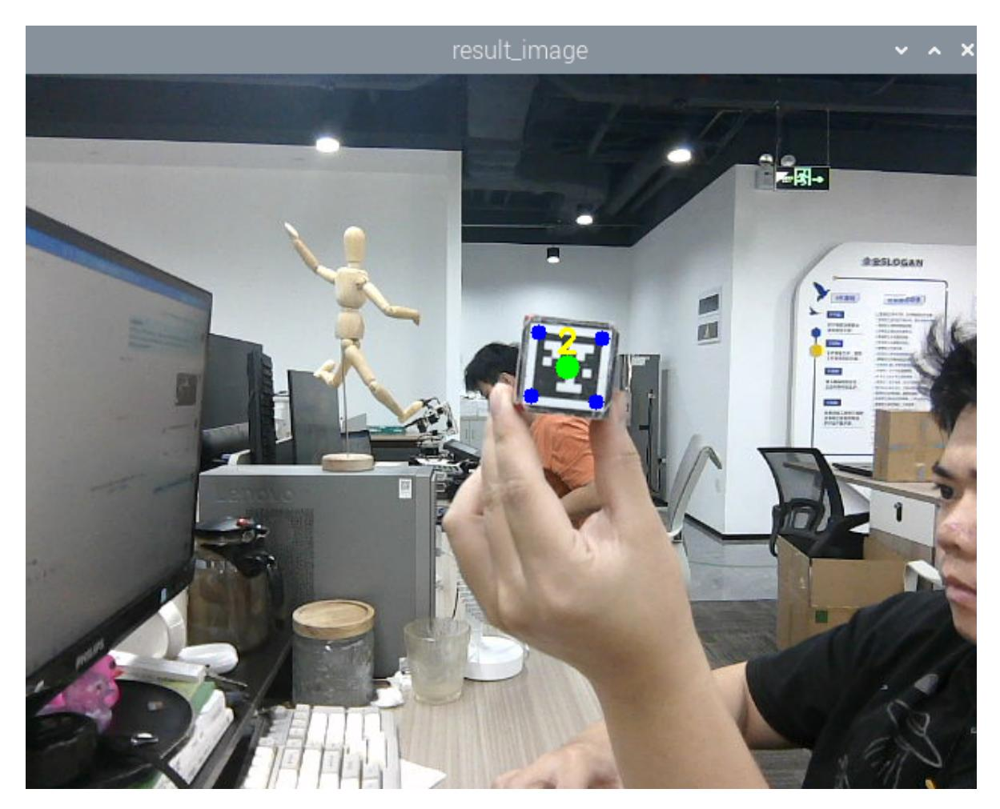

## **3D tracking machine code**

## **1. Content Description**

This function implements a program that captures images from a camera and recognizes machine codes. The machine codes move up and down, left and right, and forward and backward, and the robotic arm follows the machine codes.

This section requires entering commands in the terminal. The terminal you open depends on your motherboard type. This lesson uses the Raspberry Pi 5 as an example. For Raspberry Pi and Jetson-Nano boards, you need to open a terminal on the host computer and enter the command to enter the Docker container. Once inside the Docker container, enter the commands mentioned in this section in the terminal. For instructions on entering the Docker container from the host computer, refer to this product tutorial **[Configuration and Operation Guide]--[Enter the Docker (Jetson Nano and Raspberry Pi 5 users, see here)]**.

Simply open the terminal on the Orin motherboard and enter the commands mentioned in this section.

The wooden blocks used in this lesson: **40x40x40mm Machine Code Blocks.**

## **2. Program startup**

First, open the terminal and enter the following command to start the robot arm solver and camera driver,

ros2 launch M3Pro\_demo camera\_arm\_kin.launch.py

Then, open another terminal and enter the following command to start the 3D tracking machine code program.

ros2 run M3Pro\_demo apriltag\_follow

After the program is started, the robotic arm will move to the tracking posture, holding a **40x40x40mm** machine code wooden block, as shown in the figure below.



Then press the space bar to start tracking and slowly move the robot code block. The program will calculate the position changes in the machine code space and then control the robotic arm to track the machine code.

## **3. Core code analysis**

Program code path:

Raspberry Pi and Jetson-Nano board

The program code is in the running docker. The path in docker is /root/yahboomcar\_ws/src/M3Pro\_demo/M3Pro\_demo/ apriltag\_follow.py

Orin Motherboard

The program code path is /home/jetson/yahboomcar\_ws/src/M3Pro\_demo/M3Pro\_demo/apriltag\_follow.py

Import the necessary library files,

```
import cv2
import os
import numpy as np
import message_filters
from M3Pro_demo.vutils import draw_tags
from dt_apriltags import Detector
from cv_bridge import CvBridge
import cv2 as cv
from arm_interface.srv import ArmKinemarics
from arm_msgs.msg import ArmJoints
import time
import transforms3d.euler as t3d_euler
```

```
import math
from rclpy.node import Node
import rclpy
from message_filters import Subscriber,
TimeSynchronizer,ApproximateTimeSynchronizer
from sensor_msgs.msg import Image
import threading
import yaml
import transforms3d as tfs
import tf_transformations as tf
```

Program initialization and definition of related variables,

```
def __init__(self, name):
    super().__init__(name)
    self.init_joints = [90, 150, 12, 20, 90, 0]
    self.cur_joints = self.init_joints
    self.rgb_bridge = CvBridge()
    self.depth_bridge = CvBridge()
    self.cur_distance = 0.0
    self.camera_info_K = [477.57421875, 0.0, 319.3820495605469, 0.0,
477.55718994140625, 238.64108276367188, 0.0, 0.0, 1.0]
    self.EndToCamMat = np.array([[ 0 ,0 ,1 ,-1.00e-01],
                                 [-1 ,0 ,0 ,0],
                                 [0 ,-1 ,0 ,4.82000000e-02],
                                 [ 0.00000000e+00 , 0.00000000e+00 ,
0.00000000e+00 , 1.00000000e+00]])
    self.CurEndPos = [0.0, 0.0, 0.0, 0.0, 0.0, 0.0]
    self.x_offset = offset_config.get('x_offset')
    self.y_offset = offset_config.get('y_offset')
    self.z_offset = offset_config.get('z_offset')
    self.at_detector = Detector(searchpath=['apriltags'],
                                families='tag36h11',
                                nthreads=8,
                                quad_decimate=2.0,
                                quad_sigma=0.0,
                                refine_edges=1,
                                decode_sharpening=0.25,
                                debug=0)
    self.rgb_image_sub = Subscriber(self, Image, '/camera/color/image_raw')
    self.depth_image_sub = Subscriber(self, Image, '/camera/depth/image_raw')
    self.pub_SixTargetAngle = self.create_publisher(ArmJoints, "arm6_joints",
10)
    self.client = self.create_client(ArmKinemarics, 'get_kinemarics')
    self.pubSixArm(self.init_joints)
    self.get_current_end_pos()
    self.ts = ApproximateTimeSynchronizer([self.rgb_image_sub,
self.depth_image_sub], 100, 0.1)
    self.ts.registerCallback(self.callback)
    self.adjust_flag = False
    self.compute_flag = False
    self.start_time = 0.0
    #Store the position xyz of the gripper at the end of the robotic arm
    self.last_z = 0.34
    self.last_y = 0.0
    self.last_x = 0.12
```

```
#The direction of the z-axis (height) change is 1 for upwards and -1 for
downwards
    self.dir_z = 1
    #xyz The time of moving in three directions
    self.start_time_z = time.time()
    self.start_time_y = time.time()
    self.start_time_x = time.time()
    #The first tracking flag is used to assign a value to self.pitch
    self.first_track = True
```

callback image topic callback function,

```
def callback(self,color_frame,depth_frame):
    # Convert the image to opencv format
    rgb_image = self.rgb_bridge.imgmsg_to_cv2(color_frame,'rgb8')
    result_image = np.copy(rgb_image)
    #depth_image
    depth_image = self.depth_bridge.imgmsg_to_cv2(depth_frame, encoding[1])
    #depth_to_color_image = cv2.applyColorMap(cv2.convertScaleAbs(depth_image,
alpha=1.0), cv2.COLORMAP_JET)
    frame = cv2.resize(depth_image, (640, 480))
    depth_image_info = frame.astype(np.float32)
    tags = self.at_detector.detect(cv2.cvtColor(rgb_image, cv2.COLOR_RGB2GRAY),
False, None, 0.025)
    #tags = sorted(tags, key=lambda tag: tag.tag_id)
    draw_tags(result_image, tags, corners_color=(0, 0, 255), center_color=(0,
255, 0))
    show_frame = threading.Thread(target=self.img_out, args=(result_image,))
    show_frame.start()
    show_frame.join()
    key = cv2.waitKey(1)
    #Press the spacebar to start the tracking process
    if key == 32:
        self.compute_flag = True
    if len(tags) > 0 :
        center_x, center_y = tags[0].center
        corners = tags[0].corners
        cur_depth = depth_image_info[int(center_y),int(center_x)]
        if cur_depth>0:
            res_pos =
self.compute_heigh(int(center_x),int(center_y),cur_depth/1000)
            print("heigh: ",res_pos[2])
            if self.compute_flag==True:
                #Judge whether the height of the machine code during initial
tracking is higher/lower than the height of the current robot arm's gripper end
(0.34) and assign the initial value of self.pitch based on the judgment result
                if res_pos[2] - 0.34 > 0.03 and self.first_track == True:
                    self.pitch = 0.25
                    self.first_track = False
                elif res_pos[2] - 0.34 < 0.03 and self.first_track == True:
                    self.pitch = -0.25
                    self.first_track = False
                elif res_pos[2] - 0.34 == 0.03 and self.first_track == True:
```

```
self.pitch = 0.0
                    self.first_track = False
            #print("self.pitch: ",self.pitch)
            #Judge whether the height of the machine code has changed. 0.03
means it has moved up/down by 3cm.
            if abs(res_pos[2] - self.last_z)>0.03 and self.compute_flag==True:
                #Wait for 1 second to ensure data stability
                if (time.time() - self.start_time_z)>1:
                    #By comparing the last height, we can judge whether the
height of the machine code is lower or higher, that is, whether to move up or
down. According to the judgment result, we can modify the value of self and
dir_z.
                    if (res_pos[2] - self.last_z)<0:
                        self.dir_z = -1
                    else:
                        self.dir_z = 1
                        #If the moving distance is greater than 3cm within 1
second, modify the value of self.adjust_flag to True, indicating that the robotic
arm needs to adjust its posture
                    self.adjust_flag = True
            else:
                #If the moving distance is greater than 3cm but the time is less
than 1 second, the start time will be modified to the current time to facilitate
the next time calculation
                self.start_time_z = time.time()
            if abs(res_pos[1] - self.last_y)>0.03 and self.compute_flag == True:
                if (time.time() - self.start_time_y)>1:
                    self.adjust_flag = True
            else:
                self.start_time_y = time.time()
            if abs(res_pos[0] - self.last_x)>0.03 and self.compute_flag == True:
                if (time.time() - self.start_time_x)>1:
                    self.adjust_flag = True
            else:
                self.start_time_x = time.time()
            #If the values of self.adjust_flag and self.compute_flag are both
true, it means that the robot arm needs to adjust its posture for tracking
            if self.adjust_flag == True and self.compute_flag == True:
                #Change two values to prevent multiple entries into this
judgment
                self.adjust_flag = False
                self.compute_flag = False
                #Calculate the offset of the end gripper movement
                of_x = res_pos[0]
                of_y = res_pos [1] * 0.3 #To ensure that the camera can
recognize the object, make the recognized object in the middle of the picture
                of_z = res_pos [2]
                #Start the thread execution thread passed in the parameter is
offset
```

```
adjust_move = threading.Thread(target=self.adjust, args=
(of_x,of_y,of_z,))
                adjust_move.start()
                adjust_move.join()
                #Update the xyz value of the last machine code to facilitate the
judgment of the next moving distance
                self.last_z = res_pos[2]
                self.last_y = res_pos[1]
                self.last_x = res_pos[0]
```

Adjust adjustment function,

```
def adjust(self,offset_x,offset_y,offset_z):
    request = ArmKinemarics.Request()
    #Here, the x of the target of our robot arm's gripper is the difference
between the x of the machine code and 0.17, that is, the x of the end of the
robot arm's gripper and the machine code must be kept at a distance of 17cm in
order to obtain the depth data of the camera
    request.tar_x = offset_x - 0.17
    #Judge whether the x value at the end of the robotic arm is less than 0.10.
If so, assign it a value of 0.10
    if request.tar_x<0.10:
        request.tar_x = 0.10
    #The y value of the end of the robot arm is the offset_y passed in, which is
0.3 times the y value of the machine code block. The 0.3 times here is to ensure
that the machine code is in the middle of the picture.
    request.tar_y = offset_y
    #The z value of the end of the robot arm is the offset_z passed in, which is
the z value of the machine code block, indicating the height of the machine code
block at this time
    request.tar_z = offset_z
    #Judge whether the z value of the end of the robotic arm is less than 0.25,
which is 25cm. If so, assign it a value of 0.25
    if request.tar_z<0.25:
        request.tar_z = 0.25
    request.kin_name = "ik"
    request.roll = 0.0
    #Based on the value of self.dir_z, determine whether the height change of the
machine code is upward or downward. The pitch angle needs to be changed
accordingly. Here, 0.2 is the proportional coefficient. Debug according to the
actual situation.
    if self.dir_z<0:
        self.pitch = self.pitch - offset_z*0.2*self.dir_z
    else:
        self.pitch = self.pitch + offset_z*0.2*self.dir_z
    # Check if the calculated value of self.pitch is greater than 0.174 radians.
If so, assign it a value of 0.174 to prevent the pitch angle from being too low.
    if self.pitch>0.174:
        self.pitch = 0.174
    request.pitch = self.pitch
    print("self.pitch: ",self.pitch)
    #Calculate the value of yaw by offset_y left and right offset
    request.yaw = offset_y/0.5
    print("request",request)
    future = self.client.call_async(request)
    future.add_done_callback(self.get_ik_respone_callback
```