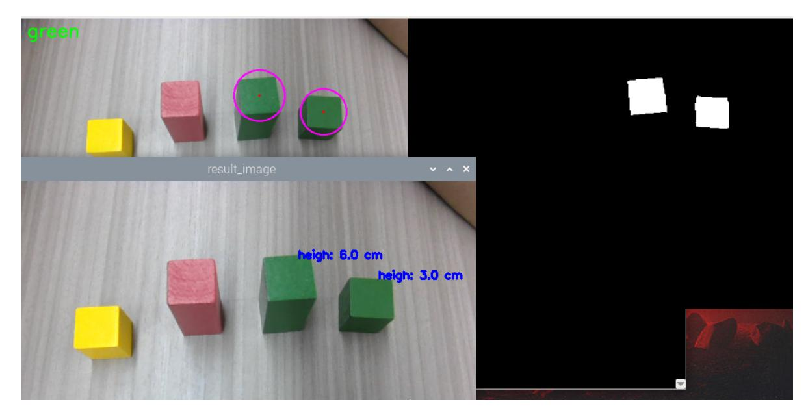

# **Sorting height abnormality color block**

### **1. Content Description**

This function enables the program to obtain images through the camera and select the color of the color blocks to be sorted according to the key input. The program will identify the color blocks that meet the requirements and the lower claw will grab the color blocks with a height of more than 4 cm and finally place them in the set position.

This section requires entering commands in the terminal. The terminal you open depends on your motherboard type. This lesson uses the Raspberry Pi 5 as an example. For Raspberry Pi and Jetson-Nano boards, you need to open a terminal on the host computer and enter the command to enter the Docker container. Once inside the Docker container, enter the commands mentioned in this section in the terminal. For instructions on entering the Docker container from the host computer, refer to this product tutorial **[Configuration and Operation Guide]--[Enter the Docker (Jetson Nano and Raspberry Pi 5 users, see here)]**.

Simply open the terminal on the Orin motherboard and enter the commands mentioned in this section.

The wooden blocks used in this lesson are: **30x30x30mm and 30x30x60mm colored blocks**.

#### **2. Program startup**

First, open the terminal and enter the following command to start the robot arm solver and camera driver,

```
ros2 launch M3Pro_demo camera_arm_kin.launch.py
```

Then, open another terminal and enter the following command to start the robotic arm gripping program:

```
ros2 run M3Pro_demo grasp_desktop
```

Finally, open the third terminal and input the following command to start the program for sorting highly abnormal color blocks:

```
ros2 run M3Pro_demo color_list
```

After starting this command, the second terminal should receive the current angle topic information sent in one frame and calculate the current posture once, as shown in the figure below.

If the current angle information is not received and the current posture is not calculated, the calculation of the gripping posture will be inaccurate when the coordinate system is converted. Therefore, you need to press ctrl c to close the height abnormality color block sorting program and restart the height abnormality color block sorting program until the robot arm gripping program obtains the current angle information and calculates the current end posture.

After the color block color sorting program is started, it will subscribe to the color image and depth image topics. Place the color block provided by the product under the camera. When the color block appears in the image, use the following buttons to select the color of the color block or calibrate the color of the color block:

- Press R or r: sort red blocks
- Press G or g: sort the green blocks
- Press B or b: sort blue blocks
- Press Y or y: sort the yellow blocks
- Press C or c: calibrate the color of the selected color block

Suppose we place four color blocks, two **30x30x60mm**red blocks and green blocks, and two**30x30x30mm**yellow blocks and green blocks. Press the g key to select the green blocks with a height higher than 4 cm. The running screenshot is as follows:



Pressing the spacebar starts the gripping process. Similarly, the program determines the distance between the target green block and the robot's base\_link. If the distance is within [215, 225], the robot arm directly lowers its gripper to grab the target green block and place it at the set location. If the distance is outside [215, 225], the robot first moves the target green block to within [215, 225] based on the distance between the target green block and the robot's base coordinate system (base\_link), then lowers its gripper to grab the block and finally place it at the set location.

#### **2.1. Color block color calibration**

You can refer to the content of [2.1, Color Block Color Calibration] in [6. Color Block Color Sorting] in the tutorial [9. Robotic Arm and 3D Space Gripping]. The calibration method is the same.

## **3. Core code analysis**

Program code path:

- Raspberry Pi and Jetson-Nano board The program code is in the running docker. The path in docker is /root/yahboomcar\_ws/src/M3Pro\_demo/M3Pro\_demo/ color\_list.py
- Orin Motherboard

The program code path is /home/jetson/yahboomcar\_ws/src/M3Pro\_demo/M3Pro\_demo/color\_list.py

Import the necessary library files,

```
import cv2
import os
import numpy as np
from sensor_msgs.msg import Image
from cv_bridge import CvBridge
import cv2 as cv
from M3Pro_demo.Robot_Move import *
#Import color recognition library
from M3Pro_demo.color_common import *
from arm_interface.srv import ArmKinemarics
from arm_interface.msg import AprilTagInfo,CurJoints
from arm_msgs.msg import ArmJoints
from std_msgs.msg import Bool,Int16
import time
```

```
import transforms3d as tfs
import tf_transformations as tf
import yaml
import math
from rclpy.node import Node
import rclpy
from message_filters import Subscriber,
TimeSynchronizer,ApproximateTimeSynchronizer
from sensor_msgs.msg import Image
from geometry_msgs.msg import Twist
from ament_index_python.packages import get_package_share_directory
import threading
from M3Pro_demo.compute_joint5 import *
```

Program initialization and creation of publishers and subscribers,

```
def __init__(self, name):
    super().__init__(name)
    self.init_joints = [90, 110, 0, 0, 90, 0]
    self.rgb_bridge = CvBridge()
    self.depth_bridge = CvBridge()
    #Define the flag for publishing color block information. When the value is
True, it means publishing. When it is False, it means not publishing.
    self.pub_pos_flag = False
    self.linearx_PID = (0.5, 0.0, 0.2)
    #Define the array that stores the current end pose coordinates
    self.CurEndPos = [0.13850614623645266, 0.000231128779644737,
0.16629191805489946, 0.00018255962454541956, 1.221730317129278,
0.00014750319860679475]
    #Dabai_DCW2 camera internal parameters
    self.camera_info_K = [477.57421875, 0.0, 319.3820495605469, 0.0,
477.55718994140625, 238.64108276367188, 0.0, 0.0, 1.0]
    #Rotation matrix from the end to the camera
    self.EndToCamMat = np.array([[ 0 ,0 ,1 ,-1.00e-01],
                                 [-1 ,0 ,0 ,0],
                                 [0 ,-1 ,0 ,4.82000000e-02],
                                 [ 0.00000000e+00 , 0.00000000e+00 ,
0.00000000e+00 , 1.00000000e+00]])
    self.rgb_image_sub = Subscriber(self, Image, '/camera/color/image_raw')
    self.sub_grasp_status =
self.create_subscription(Bool,"grasp_done",self.get_graspStatusCallBack,100)
    self.depth_image_sub = Subscriber(self, Image, '/camera/depth/image_raw')
    self.CmdVel_pub = self.create_publisher(Twist,"cmd_vel",1)
    self.pub_cur_joints = self.create_publisher(CurJoints,"Curjoints",1)
    self.pos_info_pub = self.create_publisher(AprilTagInfo,"PosInfo",1)
    self.pub_SixTargetAngle = self.create_publisher(ArmJoints, "arm6_joints",
10)
    self.client = self.create_client(ArmKinemarics, 'get_kinemarics')
    self.pub_beep = self.create_publisher(Bool, "beep", 10)
    self.TargetJoint5_pub = self.create_publisher(Int16, "set_joint5", 10)
    self.pubCurrentJoints()
    #Get the current robot arm end pose coordinates
    self.get_current_end_pos()
    self.pubSixArm(self.init_joints)
    self.ts = ApproximateTimeSynchronizer([self.rgb_image_sub,
self.depth_image_sub], 1, 0.5)
    self.ts.registerCallback(self.callback)
```

```
self.start_grasp = False
    self.x_offset = offset_config.get('x_offset')
    self.y_offset = offset_config.get('y_offset')
    self.z_offset = offset_config.get('z_offset')
    self.adjust_dist = False
    self.linearx_pid = simplePID(self.linearx_PID[0] / 1000.0,
self.linearx_PID[1] / 1000.0, self.linearx_PID[2] / 1000.0)
    #Define the flag bit that completes the recognition and gripping process.
When the value is True, it means that the next recognition and gripping can be
carried out.
    self.done_flag = True
    self.target_color = 0
    #Read the HSV values of four colors
    self.red_hsv_text = os.path.join(package_pwd, 'red_colorHSV.text')
    self.green_hsv_text = os.path.join(package_pwd, 'green_colorHSV.text')
    self.blue_hsv_text = os.path.join(package_pwd, 'blue_colorHSV.text')
    self.yellow_hsv_text = os.path.join(package_pwd, 'yellow_colorHSV.text')
    self.hsv_range = ()
    self.select_flags = False
    self.windows_name = 'frame'
    self.Track_state = 'init'
    self.Mouse_XY = (0, 0)
    self.cols, self.rows = 0, 0
    self.Roi_init = ()
    #Create a color recognition object
    self.color = color_detect()
    #Define a variable to record the current color
    self.cur_color = None
    #Define the RGB value of the currently selected color
    self.text_color = (0,0,0)
    #The center x coordinate of the target color block
    self.cx = 0
    #The center y coordinate of the target color block
    self.cy = 0
    #The radius of the minimum circumscribed circle of the target color block
    self.c_r = 0
    self.circle_r = 0
    #Valid distance flag, the value is True means the current distance is valid
    self.valid_dist = True
    #Store the x coordinate of the center point of the target color block
    self.CX_list = []
    #Store the y coordinate of the center point of the target color block
    self.CY_list = []
    #Store the minimum circumscribed circle radius that matches the target color
block
    self.R_list = []
    #Define whether a highly abnormal color block flag is detected. The value is
True if a highly abnormal color block flag is detected.
    self.detect_flag = False
    #Define the flag for calculating the height of the target color block. The
value True indicates that the height of each target color block is calculated.
    self.compute_height = True
    self.joint5 = Int16()
    self.corners = np.empty((4, 2), dtype=np.int32)
    #Define the flag for calculating the height of the target color block. The
value True indicates that the height of each target color block is calculated.
    self.cur_target_color = 0
```

```
#Indicates the update HSV value flag. When the value is True, it means that
the HSV value of the selected color can be updated.
    self.updata_flag = False
```

callback image topic callback function,

```
def callback(self,color_frame,depth_frame):
    #Get color image topic data and use CvBridge to convert message data into
image data
    rgb_image = self.rgb_bridge.imgmsg_to_cv2(color_frame,'rgb8')
    rgb_image = cv2.cvtColor(rgb_image, cv2.COLOR_RGB2BGR)
    result_image = np.copy(rgb_image)
    #Get the deep image topic data and use CvBridge to convert the message data
into image data
    depth_image = self.depth_bridge.imgmsg_to_cv2(depth_frame, encoding[1])
    frame = cv.resize(depth_image, (640, 480))
    depth_to_color_image = cv2.applyColorMap(cv2.convertScaleAbs(depth_image,
alpha=1.0), cv2.COLORMAP_JET)
    depth_image_info = frame.astype(np.float32)
    key = cv2.waitKey(10)& 0xFF
    #Call the defined process function to perform key processing and image
processing
    result_frame, binary = self.process(rgb_image,key)
    #Call thread function to display image
    show_frame = threading.Thread(target=self.img_out, args=
(result_frame,binary,))
    show_frame.start()
    show_frame.join()
    if key == 32:
        self.adjust_dist = True
        self.pub_pos_flag = True
    #If self.CX_list>0, it means that the color block of the selected color has
been detected and the entire recognition and clamping process has ended
    if len(self.CX_list)>0 and self.done_flag==True:
        for i in range(len(self.CX_list)):
            #Judge whether the radius of the circumscribed circle of the current
color block is greater than 30, in order to filter out the small area of
misidentification
            if self.R_list_[i]>30:
                #Get the xy coordinates of the center point of the current color
block and calculate the depth distance of the center point
                cx = int(self.CX_list[i])
                cy = int(self.CY_list[i])
                dist = depth_image_info[int(cy),int(cx)]/1000
                #Calculate the position of the color block in the world
coordinate
                pose = self.compute_heigh(cx,cy,dist)
                       #Calculate the distance between the center of the color
block and the base coordinate base_link
                compute_heigh = round(pose[2],2)*100
                heigh = 'heigh: ' + str(compute_heigh) + ' cm'
                cv.putText(result_image, heigh, (int(cx)+10, int(cy)-25),
cv.FONT_HERSHEY_SIMPLEX, 0.5, (255, 0, 0), 2)
                   #If the current height of the color block is greater than 4
cm and the calculated height flag is True
                if compute_heigh > 4.0 and self.pub_pos_flag == True and
self.compute_height == True:
```

```
self.c_x = int(self.CX_list[i])
                    self.c_y = int(self.CY_list[i])
                    self.c_r = self.R_list_[i]
                    #Change self.detect_flag to true, indicating that the target
color block is detected
                    self.detect_flag = True
                if self.detect_flag == True :
                    cz = depth_image_info[int(self.c_y),int(self.c_x)]/1000
                    pose = self.compute_heigh(self.c_x,self.c_y,cz)
                    dist_detect = math.sqrt(pose[1] ** 2 + pose[0]** 2)
                    dist_detect = dist_detect*1000
                    dist = 'dist: ' + str(dist_detect) + ' mm'
                    cv.putText(result_image, dist, (int(cx)+5, int(cy)+15),
cv.FONT_HERSHEY_SIMPLEX, 0.5, (255, 0, 0), 2)
                    #If the distance is valid and outside the range [215, 225],
then control the chassis to adjust the distance
                    if abs(dist_detect - 220.0)>5 :
                        if self.adjust_dist==True:
                            self.move_dist(dist_detect)
                    #If the distance is valid and within the range of [215,
225], then directly take the value and publish the location information topic of
the target color block
                    else:
                        self.compute_height = False
                        self.pubVel(0,0,0)
                        self.adjust_dist = False
                        cx = self.c_x
                        cy = self.c_y
                        dist = depth_image_info[int(cy),int(cx)]/1000
                        #If the depth distance of the center point of the color
block is not 0, it means it is valid
                        if dist!=0 and self.pub_pos_flag == True:
                            vx = self.corners[0][0][0] - self.corners[1][0][0]
                            vy = self.corners[0][0][1] - self.corners[1][0][1]
                            target_joint5 = compute_joint5(vx,vy)
                            self.joint5.data = int(target_joint5)
                            pos = AprilTagInfo()
                            pos.id = self.target_color
                            pos.x = float(cx)
                            pos.y = float(cy)
                            pos.z = float(dist)
                            if self.pub_pos_flag == True:
                                self.pub_pos_flag = False
                                self.done_flag = False
                                self.pos_info_pub.publish(pos)
                                self.TargetJoint5_pub.publish(self.joint5)
                                print("Publish the position.")
        if self.detect_flag == False:
            self.pubVel(0,0,0)
            print("Do not find target hight.")
    cv2.imshow("result_image", result_image)
```