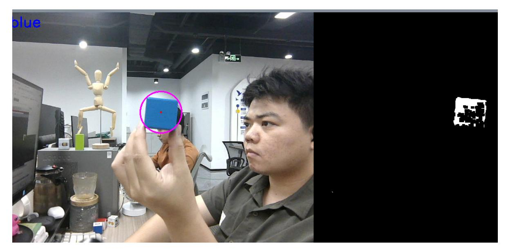

# **Tracking and gripping color block**

## **1. Content Description**

This function allows the program to capture an image through the camera and select the color block to be tracked and gripped by pressing a button. The program will then identify the target color block in the image. When the handheld color block moves, the robotic arm will follow, keeping the center of the color block in the center of the image. When the robotic arm stops tracking, the program will calculate the distance between the color block and the robot's base\_link. If the distance is greater than 26 cm, the program will adjust the distance until it is less than 24 cm. If the distance is less than 26 cm, the robotic arm will be controlled to grip the color block and place it in the set position.

Note: Sometimes the robot cannot move the chassis for adjustment. This may be because the depth distance of the current color block is invalid. In this case, you need to rotate the color block to obtain valid depth information.

This section requires entering commands in the terminal. The terminal you open depends on your motherboard type. This lesson uses the Raspberry Pi 5 as an example. For Raspberry Pi and Jetson-Nano boards, you need to open a terminal on the host computer and enter the command to enter the Docker container. Once inside the Docker container, enter the commands mentioned in this section in the terminal. For instructions on entering the Docker container from the host computer, refer to this product tutorial **[Configuration and Operation Guide]--[Enter the Docker (Jetson Nano and Raspberry Pi 5 users, see here)]**.

Simply open the terminal on the Orin motherboard and enter the commands mentioned in this section.

The wooden blocks used in this lesson: **40x40x40mm colored blocks**.

# **2. Program startup**

First, open the terminal and enter the following command to start the robot arm solver and camera driver,

```
ros2 launch M3Pro_demo camera_arm_kin.launch.py
```

Then, open another terminal and enter the following command to start the robotic arm gripping program:

ros2 run M3Pro\_demo grasp

After running, it is shown as follows:

Finally, open the third terminal and enter the following command to start the tracking and clamping color block program:

```
ros2 run M3Pro_demo color_follow
```

After the program starts, it will subscribe to the color image and depth image topics. According to the following buttons, you can select the color of the tracked color block or the calibration color block:

- Press R or r: sort red blocks
- Press G or g: sort the green blocks
- Press B or b: sort blue blocks
- Press Y or y: sort the yellow blocks
- Press C or c: calibrate the color of the selected color block

As shown in the image below, after the program runs, the matching blue block (40x40x40mm) will appear in the image. Then, press the B key or the 'b' key, and the program will recognize the blue block in your hand.



Slowly move the color block, and the robotic arm will follow. The program will keep the center of the color block in the center of the image. After the robotic arm stops tracking, the program will determine whether the distance between the robot base\_link and the color block is less than or equal to 26 cm. If so, a buzzer will sound, and the program will control the robotic arm to grab the color block, place it in the set position, and finally return to the initial position. If the distance between the robot base\_link and the color block is greater than 26 cm, the program will control the chassis to move forward until the condition of less than or equal to 26 cm is met, and then the gripping, placement, and homing operations will be carried out.

#### **2.1. Color block color calibration**

You can refer to the content of [2.1, Color Block Color Calibration] in [6. Color Block Color Sorting] in the tutorial [9. Robotic Arm and 3D Space Gripping].

The calibration method is consistent.

### **3. Core code analysis**

Program code path:

Raspberry Pi and Jetson-Nano board

The program code is in the running docker. The path in docker is /root/yahboomcar\_ws/src/M3Pro\_demo/M3Pro\_demo/ color\_follow.py

Orin Motherboard

The program code path is /home/jetson/yahboomcar\_ws/src/M3Pro\_demo/M3Pro\_demo/color\_follow.py

Import the necessary library files,

```
import cv2
import os
import numpy as np
from cv_bridge import CvBridge
import cv2 as cv
from M3Pro_demo.Robot_Move import *
#Import color recognition library
from M3Pro_demo.color_common import *
from arm_interface.srv import ArmKinemarics
from arm_interface.msg import AprilTagInfo,CurJoints
from arm_msgs.msg import ArmJoints
from std_msgs.msg import Bool,Int16,UInt16
import time
import transforms3d as tfs
import tf_transformations as tf
import yaml
import math
from rclpy.node import Node
import rclpy
from message_filters import Subscriber,
TimeSynchronizer,ApproximateTimeSynchronizer
from sensor_msgs.msg import Image
from geometry_msgs.msg import Twist
from ament_index_python.packages import get_package_share_directory
import threading
from M3Pro_demo.compute_joint5 import *
#Import the library for servo PID adjustment
from M3Pro_demo.PID import *
```

Program initialization and creation of publishers and subscribers,

```
def __init__(self, name):
    super().__init__(name)
    self.init_joints = [90, 150, 12, 20, 90, 0]
    self.cur_joints = self.init_joints
    self.rgb_bridge = CvBridge()
```

```
self.depth_bridge = CvBridge()
    self.pub_pos_flag = True
    self.cur_distance = 0.0
    #Define the array that stores the current end pose coordinates
    self.CurEndPos = [0.0, 0.0, 0.0, 0.0, 0.0, 0.0]
    #Dabai_DCW2 camera internal parameters
    self.camera_info_K = [477.57421875, 0.0, 319.3820495605469, 0.0,
477.55718994140625, 238.64108276367188, 0.0, 0.0, 1.0]
    #Rotation matrix from the end to the camera
    self.EndToCamMat = np.array([[ 0 ,0 ,1 ,-1.00e-01],
                                 [-1 ,0 ,0 ,0],
                                 [0 ,-1 ,0 ,4.82000000e-02],
                                 [ 0.00000000e+00 , 0.00000000e+00 ,
0.00000000e+00 , 1.00000000e+00]])
    self.rgb_image_sub = Subscriber(self, Image, '/camera/color/image_raw')
    self.sub_grasp_status =
self.create_subscription(Bool,"grasp_done",self.get_graspStatusCallBack,100)
    self.depth_image_sub = Subscriber(self, Image, '/camera/depth/image_raw')
    self.CmdVel_pub = self.create_publisher(Twist,"cmd_vel",1)
    self.pub_cur_joints = self.create_publisher(CurJoints,"Curjoints",1)
    self.pos_info_pub = self.create_publisher(AprilTagInfo,"PosInfo",1)
    self.pub_SixTargetAngle = self.create_publisher(ArmJoints, "arm6_joints",
10)
    self.client = self.create_client(ArmKinemarics, 'get_kinemarics')
    self.pub_beep = self.create_publisher(UInt16, "beep", 10)
    self.TargetJoint5_pub = self.create_publisher(Int16, "set_joint5", 10)
    self.pubSixArm(self.init_joints)
    #Get the current robot arm end pose coordinates
    self.get_current_end_pos()
    #Publish the topic of the six servo angles of the current robotic arm
    self.pubCurrentJoints()
    self.ts = ApproximateTimeSynchronizer([self.rgb_image_sub,
self.depth_image_sub], 1, 0.5)
    self.ts.registerCallback(self.callback)
    self.start_grasp = False
    self.x_offset = offset_config.get('x_offset')
    self.y_offset = offset_config.get('y_offset')
    self.z_offset = offset_config.get('z_offset')
    self.adjust_dist = False
    self.linearx_PID = (0.5, 0.0, 0.2)
    self.linearx_pid = simplePID(self.linearx_PID[0] / 1000.0,
self.linearx_PID[1] / 1000.0, self.linearx_PID[2] / 1000.0)
    #Define the clamping distance in millimeters
    self.grasp_Dist = 260.0
    #Define the flag bit that completes the recognition and gripping process.
When the value is True, it means that the next recognition and gripping can be
carried out.
    self.done_flag = True
    self.target_color = 0
    #Read the HSV values of four colors
    self.red_hsv_text = os.path.join(package_pwd, 'red_colorHSV.text')
    self.green_hsv_text = os.path.join(package_pwd, 'green_colorHSV.text')
    self.blue_hsv_text = os.path.join(package_pwd, 'blue_colorHSV.text')
    self.yellow_hsv_text = os.path.join(package_pwd, 'yellow_colorHSV.text')
    self.hsv_range = ()
    self.select_flags = False
    self.windows_name = 'frame'
    self.Track_state = 'init'
```

```
self.Mouse_XY = (0, 0)
    self.cols, self.rows = 0, 0
    self.Roi_init = ()
    #Create a color recognition object
    self.color = color_detect()
    #Define a variable to record the current color
    self.cur_color = None
    #Define the RGB value of the currently selected color
    self.text_color = (0,0,0)
    #The center x coordinate of the target color block
    self.cx = 0
    #The center y coordinate of the target color block
    self.cy = 0
    #The radius of the minimum circumscribed circle of the target color block
    self.circle_r = 0
    self.joint5 = Int16()
    self.corners = np.empty((4, 2), dtype=np.int32)
    self.target_servox=90
    self.target_servoy=180
    # Initialize the robot arm PID adjustment parameters in the x direction
    self.xservo_pid = PositionalPID(0.25, 0.1, 0.05)
    # Initialize the robot arm PID adjustment parameters in the y direction
    self.yservo_pid = PositionalPID(0.25, 0.1, 0.05)
    #Define whether the y value threshold is exceeded. When the value is True, it
means that the y value threshold is exceeded.
    self.y_out_range = False
    #Define whether the x value threshold is exceeded. When the value is True, it
means that the x value threshold is exceeded.
    self.x_out_range = False
    self.a = 0
    self.b = 0
    self.XY_Track_flag = True
    self.joint5 = Int16()
    self.Done_flag = True
    self.cur_target_color = 0
    self.updata_flag = False
    print("Init done.")
```

callback image topic callback function,

```
def callback(self,color_frame,depth_frame):
    #Get color image topic data and use CvBridge to convert message data into
image data
    rgb_image = self.rgb_bridge.imgmsg_to_cv2(color_frame,'rgb8')
    rgb_image = cv2.cvtColor(rgb_image, cv2.COLOR_RGB2BGR)
    result_image = np.copy(rgb_image)
    #Get the deep image topic data and use CvBridge to convert the message data
into image data
    depth_image = self.depth_bridge.imgmsg_to_cv2(depth_frame, encoding[1])
    frame = cv.resize(depth_image, (640, 480))
    depth_to_color_image = cv2.applyColorMap(cv2.convertScaleAbs(depth_image,
alpha=1.0), cv2.COLORMAP_JET)
    depth_image_info = frame.astype(np.float32)
    key = cv2.waitKey(10)& 0xFF
   #Call the defined process function to perform key processing and image
processing
    result_frame, binary = self.process(rgb_image,key)
```

```
show_frame = threading.Thread(target=self.img_out, args=
(result_frame,binary,))
    show_frame.start()
    show_frame.join()
    cx = int(self.cx)
    cy = int(self.cy)
    cur_depth = depth_image_info[int(cy),int(cx)]
    print("cur_depth: ",cur_depth)
    #If the values of self.cx and self.cy are not 0, it means that the target
color block has been identified. self.circle_r is greater than 10 to filter out
smaller points that are misidentified.
    if self.cx!=0 and self.cy!=0 and self.circle_r>10:
        cx = int(self.cx)
        cy = int(self.cy)
        #If the center point of the color block is not in the middle of the
screen and self.XY_Track_flag is True, it means that the robot can track and call
the custom self.XY_track function
        if (abs(cx-320) >10 or abs(cy-240)>10) and self.XY_Track_flag==True:
            self.XY_track(cx,cy)
            print("Tracking")
            print("-------------------------------------")
        #If the center point of the color block is not in the middle of the
picture and self.Done_flag is True, it means that the last tracking and clamping
process can be completed.
        if abs(cx-320) <10 and abs(cy-240)<10 and self.Done_flag==True:
            #Modify the value of self.adjust_dist to True, indicating that
chassis adjustment can be performed
            self.adjust_dist = True
            #Modify the value of XY_Track_flag to False, which means disabling
robot tracking
            self.XY_Track_flag = False
            #Publish the message of the six servo values of the robot arm at
this moment, so that the clamping node can calculate the current position of the
end of the robot arm
            self.pubCurrentJoints()
            print("Adjust it.")
            print("-------------------------------------")
        if self.adjust_dist== True :
            cx = int(self.cx)
            cy = int(self.cy)
            cur_depth = depth_image_info[int(cy),int(cx)]
            if cur_depth !=0:
                #Calculate the position of the color block in the world
coordinate system
                get_dist = self.compute_heigh(cx,cy,cur_depth/1000.0)
                print("cur_depth: ",cur_depth/1000.0)
                #Calculate the distance between the color block and the car
base_link
                self.cur_distance = math.sqrt(get_dist[1] ** 2 + get_dist[0]**
2)*1000
                print("self.cur_distance: ",self.cur_distance)
                #If the current distance is greater than 26 cm, call
self.move_dist to control the chassis movement and adjust the distance between
the color block and the car base_link
                if self.cur_distance>260:
                    dist_detect = self.cur_distance
                    self.move_dist(dist_detect)
```

```
else:
                    self.pubVel(0,0,0)
                    #Change the state of self.start_grasp to indicate that the
topic of color block position can be published
                    self.start_grasp = True
                    #Modify the value of XY_Track_flag to False, which means
disabling the chassis adjustment program
                    self.adjust_dist = False
            else:
                self.pubVel(0,0,0)
                print("Invalid dist.")
        if self.start_grasp == True:
            self.pubVel(0,0,0)
            cx = int(self.cx)
            cy = int(self.cy)
            dist = depth_image_info[int(cy),int(cx)]/1000
            vx = self.corners[0][0][0] - self.corners[1][0][0]
            vy = self.corners[0][0][1] - self.corners[1][0][1]
            target_joint5 = compute_joint5(vx,vy)
            self.joint5.data = int(target_joint5)
            if dist!=0:
                self.start_grasp = False
                self.Done_flag = False
                self.TargetJoint5_pub.publish(self.joint5)
                pos = AprilTagInfo()
                pos.id = self.target_color
                pos.x = float(cx)
                pos.y = float(cy)
                pos.z = float(dist)
                self.Beep_Loop()
                self.pos_info_pub.publish(pos)
    else:
        self.pubVel(0,0,0)
```