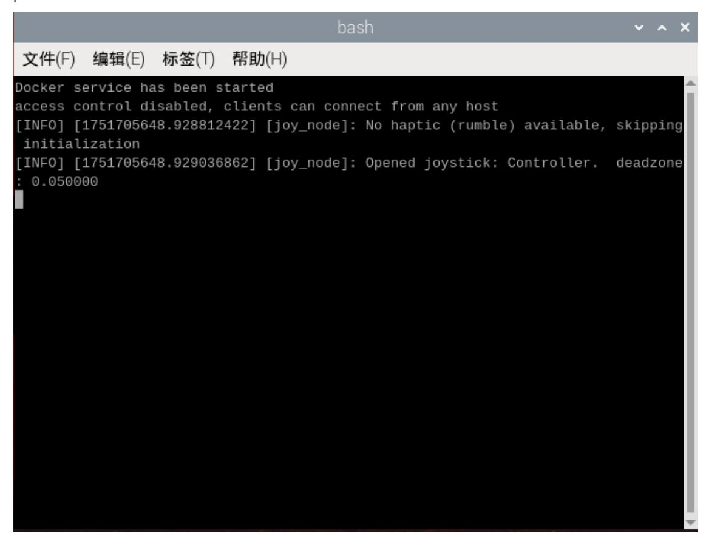
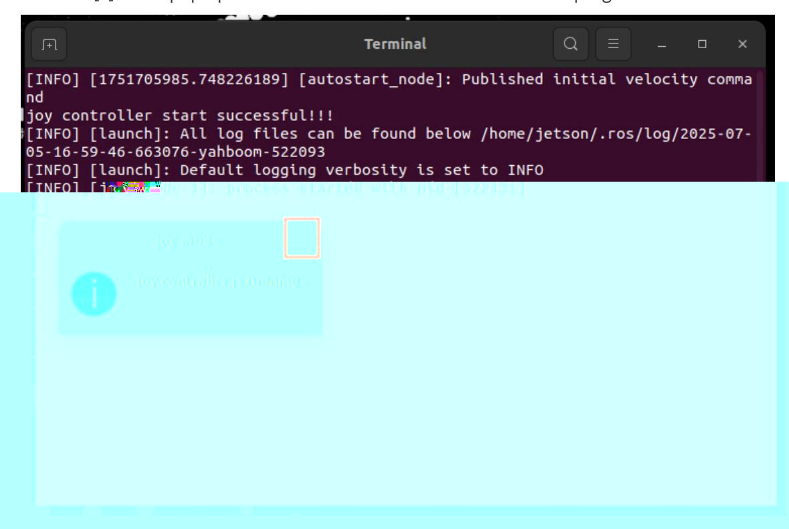

# Quick Start: Control the Robot with the Controller

Plug the wireless controller receiver into the mainboard or HUB expansion board. After the robot powers on, the system automatically connects to the agent and starts the controller program. Press [START] on the controller to wake it, then press [R2/RT] to unlock motion control. You can then control the robot as shown in the table below.

| Button or control         | Function                                                           |
|---------------------------|--------------------------------------------------------------------|
| Left joystick up/down     | Move the robot forward/backward                                    |
| Left joystick left/right  | Move the robot left/right                                          |
| Right joystick left/right | Rotate the robot left/right                                        |
| START                     | Wake the controller from sleep mode                                |
| Left joystick press       | Adjust X/Y-axis linear velocity                                    |
| Right joystick press      | Adjust angular velocity                                            |
| D-pad up                  | Move robotic arm servo No. 4 up                                    |
| D-pad down                | Move robotic arm servo No. 4 down                                  |
| D-pad left                | Move robotic arm servo No. 3 down                                  |
| D-pad right               | Move robotic arm servo No. 3 up                                    |
| X                         | Move robotic arm servo No. 1 left                                  |
| B                         | Move robotic arm servo No. 1 right                                 |
| Y                         | Move robotic arm servo No. 2 up                                    |
| A                         | Move robotic arm servo No. 2 down                                  |
| L1/LB                     | Tighten servo No. 6 gripper / rotate servo No. 5 right             |
| L2/LT                     | Loosen servo No. 6 gripper / rotate servo No. 5 left               |
| SELECT                    | Switch control between servo No. 6 and servo No. 5                 |
| R1/RB                     | Switch lighting effects                                            |
| R2/RT                     | Unlock controller input                                            |

## 1. Stop controller control

Raspberry Pi and Jetson Nano mainboards

Close the window that is running the controller program, as shown in the figure below, then press Ctrl+C to stop the terminal process.



Orin mainboard

Click [X] in the pop-up window below to close the controller program.



## 2. Temporarily start controller control

If you stopped the controller node that normally starts at boot, you can restart the controller program without rebooting the robot.

On Raspberry Pi and Jetson Nano mainboards, open a terminal and run:

```
sh Docker_M3Pro.sh
```

On the Orin mainboard, open a terminal and run:

```
sh ~/joy_control/joy.sh
```

## 3. Permanently disable controller control at startup

To prevent the controller program from starting automatically at boot, move its autostart desktop file out of the autostart directory.

On Raspberry Pi and Jetson Nano mainboards, open a terminal and run:

```bash
mv ~/.config/autostart/uros.desktop ~
```

This moves `uros.desktop` to your home directory. Keep this file so you can restore controller startup later by copying it back to `~/.config/autostart`.

On the Orin mainboard, open a terminal and run:

```bash
mv ~/.config/autostart/joy_control.desktop ~
```

This moves `joy_control.desktop` to your home directory. Keep this file so you can restore controller startup later by copying it back to `~/.config/autostart`.
