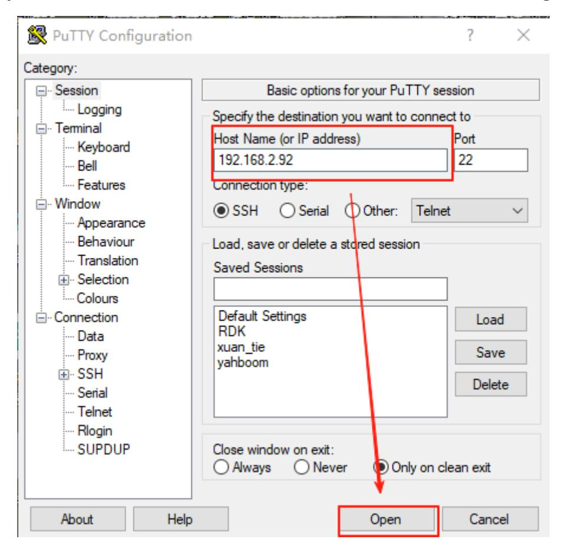
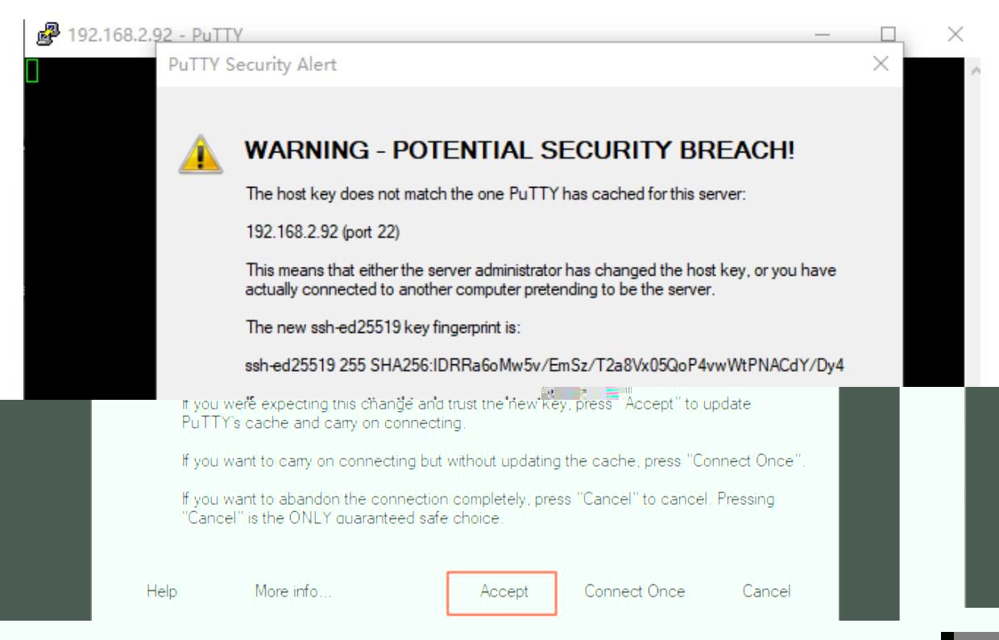
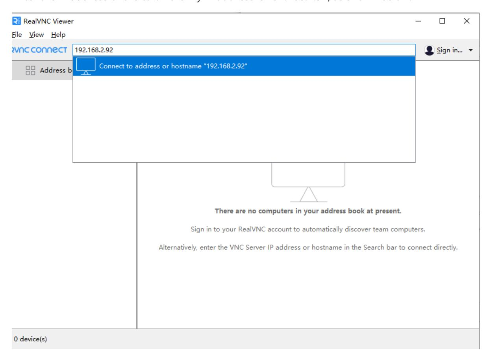

# Log In to the Robot and View the Code

This section explains how to connect the robot to your computer and how to view the source code.

Recommended workflow:

1. Connect to the robot's hotspot, or connect an Ethernet cable to obtain an IP address.
2. Check the IP address shown on the OLED screen.
3. Log in through VNC.
4. Turn off the robot's hotspot and connect it to your own Wi-Fi network. This is required later for large-model functions that need internet access.
5. Check the updated IP address on the OLED screen.
6. Reconnect through VNC.
7. View the source code.

**The default hotspot name in the factory image is `ROSMASTER`, the password is `12345678`, and the default IP address is `192.168.8.88`.**

## 1. Connect to the Robot

No matter which connection method you use, the computer and the robot must be on the same local area network (LAN). The simplest way to do this is to connect both devices to the same Wi-Fi network or hotspot. First, connect your computer to the robot's default hotspot, `ROSMASTER`, using the Wi-Fi password `12345678`. After the connection succeeds, use one of the login methods below.

You can also connect the mainboard directly with an Ethernet cable. After the cable is connected, the OLED screen automatically updates the displayed IP address. The examples below use the IP address obtained after connecting the Ethernet cable.

### 1.1 SSH Connection (Optional)

You can use PuTTY, MobaXterm, or another SSH client to connect to the robot. This example uses PuTTY. Download PuTTY here: [Download PuTTY: latest release \(0.83\)](https://www.chiark.greenend.org.uk/~sgtatham/putty/latest.html)

Install the version that matches your computer, then open PuTTY. The PuTTY interface is shown below.


Select **SSH**, then enter the IP address shown on the OLED screen in the **Host Name (or IP address)** field. In this example, the IP address is `192.168.2.92`.



Click **Open**. A terminal window and a confirmation dialog will appear. Click **Accept** to continue.



When the terminal displays **login as**, enter the username for your robot mainboard and press Enter. Then enter the password. The default usernames and passwords are:

| Mainboard      | Username | Password |
|----------------|----------|----------|
| Raspberry Pi 5 | pi       | yahboom  |
| Jetson Nano    | jetson   | yahboom  |
| Orin Nano      | jetson   | yahboom  |
| Orin NX        | jetson   | yahboom  |

For example, if the mainboard is an Orin Nano, enter `jetson`, press Enter, then enter `yahboom` as the password. **The password is not displayed while you type it.**

After login succeeds, you will see a terminal connected to the robot.

SSH opens only a command-line terminal. It does not show the graphical desktop, so SSH is best for command-line work and for programs that do not require a graphical interface.

### 1.2 VNC Login

#### 1.2.1 Orin Mainboard Without a Monitor

Users with an Orin mainboard and no connected monitor need to configure a virtual desktop before using VNC. Other users can skip this section and continue with [1.2.2 VNC Desktop Login](#122-vnc-desktop-login).

The Orin mainboard runs Ubuntu 22.04. By default, the desktop may require a physical monitor. If you did not purchase or connect a monitor, use the virtual desktop method below.

If you have connected a monitor to the Orin mainboard, or if you are using a Jetson Nano or Raspberry Pi 5, skip this step.

Open document `19. Attachment - Virtual Desktop Files`, then copy `xorg.conf.backup_dp` and `xorg.conf.backup_vnc` to the `/etc/X11` directory.

Install the virtual desktop environment:

```bash
sudo apt-get install xserver-xorg-video-dummy
```

Open a terminal and run the following command to switch to VNC virtual desktop mode:

```bash
sudo cp /etc/X11/xorg.conf.backup_vnc /etc/X11/xorg.conf
```

Restart the system. After rebooting, continue with section 1.2.2 to connect through VNC.

```bash
sudo reboot
```

Note: After switching to VNC virtual desktop mode, the DP display cable will no longer output video, even if a monitor is connected. To use a DP monitor again, switch the configuration back.

To disable the virtual desktop and restore DP display output, run:

```bash
sudo cp /etc/X11/xorg.conf.backup_dp /etc/X11/xorg.conf
```

Restart the system. After rebooting, you can use the DP cable to connect a display.

```bash
sudo reboot
```

#### 1.2.2 VNC Desktop Login

VNC lets you remotely access and control the robot's graphical desktop over the network. Use VNC when you need the desktop environment, such as when starting a program with an image display. Download VNC Viewer here: [Download VNC Viewer by RealVNC(R)](https://www.realvnc.com/en/connect/download/viewer/?lai_vid=0XwM1MAv5h60&lai_sr=5-9&lai_sl=l)

Install the version that matches your computer, then open VNC Viewer. The start screen is shown below.


Enter the robot's IP address. In this example, the IP address is `192.168.2.92`.



Press Enter.


Enter the username in **Username** and the password in **Password**. Refer to the table in section 1.1. The password for all listed mainboards is `yahboom`. Click **OK** to enter the desktop.


If the screen displays abnormally, as shown below:


or if the connection keeps closing immediately, change the VNC settings as shown below.


Then reconnect. The Orin mainboard supports only one remote desktop connection at a time. If VNC cannot connect, check whether another remote desktop session is already active.

After connecting through VNC, switch the robot from its local hotspot to a Wi-Fi network with internet access. The AI large-model functions need internet access, while the robot's hotspot provides only a local network.

## 2. View the Code

On Orin mainboards, the source code is in `/home/jetson`. After you connect to the robot, you can view the code directly.

On Raspberry Pi 5 and Jetson Nano mainboards, the source code is inside the running Docker container. Enter the container first, then view the code there.

The following methods are useful for viewing and editing code during later tutorials.

### 2.1 JupyterLab

#### 2.1.1 Orin Mainboard

JupyterLab is not recommended for editing code on the Orin mainboard, but it can be used for quick code viewing.

JupyterLab starts automatically after boot. In a browser, enter the robot IP address followed by `:8888`. In this example, the address is:

```text
192.168.2.92:8888
```


Press Enter. If a password is required, enter `yahboom`. The JupyterLab interface will open.


Use the folder browser on the left to view the source code.

#### 2.1.2 Raspberry Pi 5 and Jetson Nano Mainboards

For Raspberry Pi 5 and Jetson Nano mainboards, enter the Docker container first. Then run:

```bash
jupyter-lab --allow-root
```

In your browser, enter the robot IP address followed by `:8888`. For example, if the Raspberry Pi mainboard IP address is `192.168.2.22`, enter:

```text
192.168.2.22:8888
```


Press Enter. If a password is required, enter `yahboom` to open JupyterLab and view the code.
