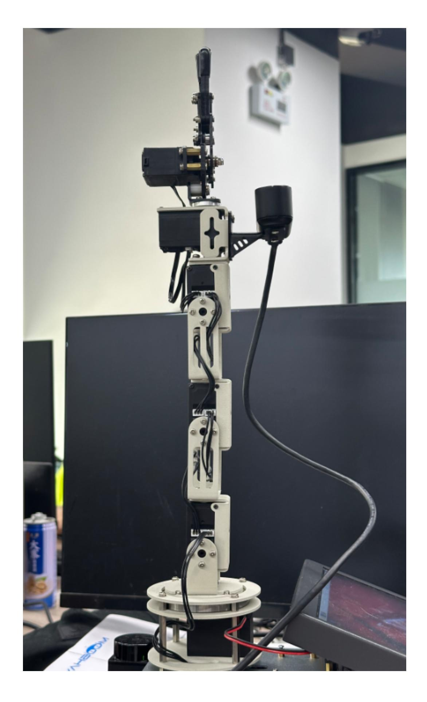
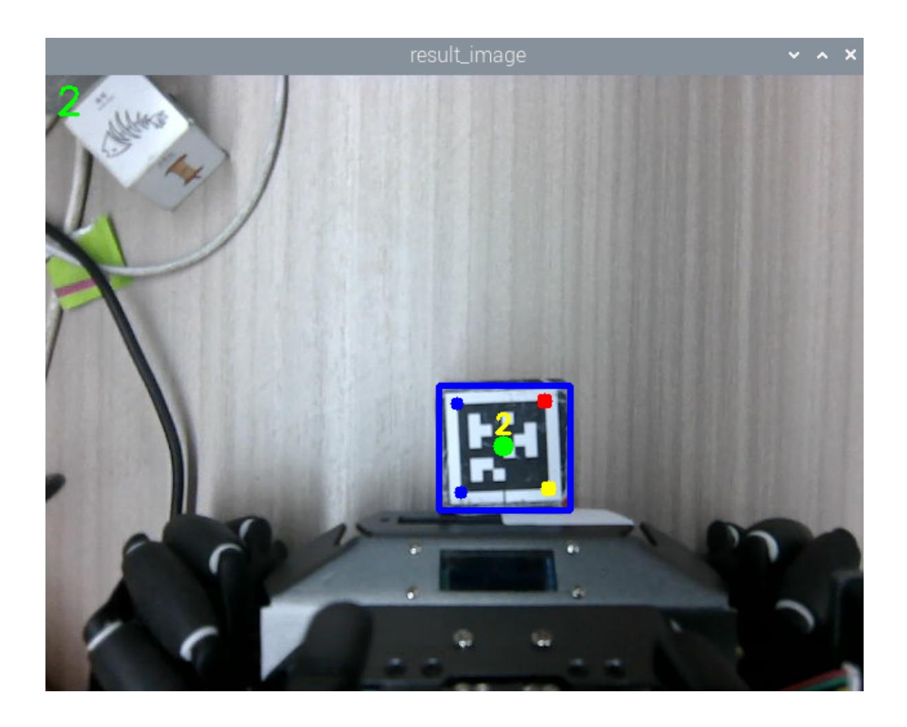

## Robotic arm calibration

Mechanical calibration is performed in two steps: median calibration and offset calibration.

# 1. Jetson Orin Nano/NX version (skip the Raspberry Pi and Jetson Nano versions)

#### 1. Calibrate the median value

If you use the Yahboom factory image, the communication agent will automatically start when you boot up.

Enter the command at this time to make the robot arm vertically upward to reduce the difficulty of calibration:

```
ros2 topic pub /arm6_joints arm_msgs/msg/ArmJoints {"joint1: 90, joint2: 90,
joint3: 90, joint4: 90, joint5: 90, joint6: 180, time: 1500"} --once
```

Then use Ctrl+C in the proxy terminal to close the proxy program and run the following command again to unload the servo

```
python3 ~/calibrate_arm.py
```

After running, the underlying control board version V1.X will be printed. If it is not printed, you need to rerun this program (or the proxy has not closed the communication serial port). After running, the six servos can be moved at will, and then observe which servo of the robotic arm is not straightened. Try to make the robotic arm appear in a straight line, and the gripper is fully closed, forming an "L" shape as shown below.



Then, enter " in the terminal where calibrate.py is launched y, confirm that the centering is complete, and press Enter to complete the calibration. The calibration will print the state values of the six servos respectively. The calibration is successful only when state = 1.

Enter the following command in the terminal to reconnect the proxy,

### 2. Calibration offset

Simply open a terminal on the Orin board and enter the commands mentioned in this section. This example uses the Raspberry Pi 5 board as an example.

Open the terminal and enter the following command to start the camera and robotic arm solver.

```
ros2 launch M3Pro_demo camera_arm_kin.launch.py
```

Open the second terminal and enter the following command to start the calibration offset program:

```
ros2 run M3Pro_demo arm_offset
```

After the program runs, the robot arm will move to the calibration posture, and then the program will display a screen. Put the 4x4x4 wooden block (the largest wooden block provided) in the blue box in the machine code screen, as shown below.


Finally, press the space bar to complete the offset calibration. The calibrated offset data is saved in yahboomcar_ws/src/arm_kin/param/offset_value.yaml.

Run the program to compile the arm_kin function package to make the updated calibration file effective.

```
cd ~/yahboomcar_ws
colcon build --packages-select arm_kin
```

# 2. Jetson Nano, Raspberry Pi version (skip for Orin motherboard)

Raspberry Pi 5 and Jetson Nano motherboard users need to enter the Docker image to operate. They need to open a terminal on the host machine and enter the command to enter the Docker container. After entering the Docker container, enter the command mentioned in this course in the terminal. For information on entering the Docker image, please refer to [Entering the Docker (Jetson Nano and Raspberry Pi 5 users see here)] in this product tutorial [0. Instructions and Installation Steps].

#### 1. Calibrate the median value

If you use the Yahboom factory image, the communication agent will automatically start when you boot up.

At this time, enter the command in docker to make the robotic arm vertically upward to reduce the difficulty of calibration:

```
ros2 topic pub /arm6_joints arm_msgs/msg/ArmJoints {"joint1: 90, joint2: 90,
joint3: 90, joint4: 90, joint5: 90, joint6: 180, time: 1500"} --once
```

Then use Ctrl+C to close the proxy program and run the following command in docker again to unload the servo

```
python3 calibrate.py
```

After running, the underlying control board version V1.X will be printed. If it is not printed, you need to rerun this program. After running, the six servos can be moved at will, and then observe which servo of the robotic arm is not in a straight line. Try to make the robotic arm appear in a straight line and the gripper fully closed, as shown in the figure below.


Then, enter " in the terminal where calibrate.py is launched y, confirm that the centering is complete, and press Enter to complete the calibration. The calibration will print the state values of the six servos respectively. The calibration is successful only when state = 1.

Next, run the communication agent in the host

### 2. Calibration offset

Open the Docker terminal and enter the following command to start the camera and robotic arm solver.

```
ros2 launch M3Pro_demo camera_arm_kin.launch.py
```

Open the second terminal and enter the following command to start the calibration offset program:

```
ros2 run M3Pro_demo arm_offset
```

After the program runs, the robot arm will move to the calibration posture, and then the program will display a screen. Put the 4x4x4 wooden block (the largest wooden block provided) in the blue box in the machine code screen, as shown below.



Finally, press the space bar to complete the offset calibration. The calibrated offset data is saved in yahboomcar_ws/src/arm_kin/param/offset_value.yaml.

Run the program to compile the arm_kin function package to make the updated calibration file effective.

cd ~/yahboomcar_ws

colcon build --packages-select arm_kin
