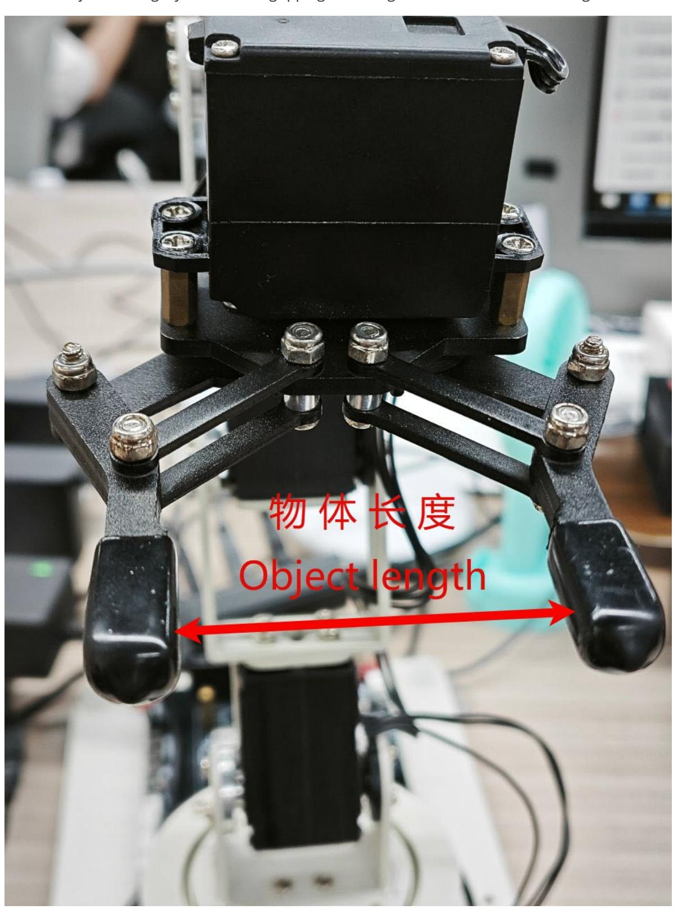
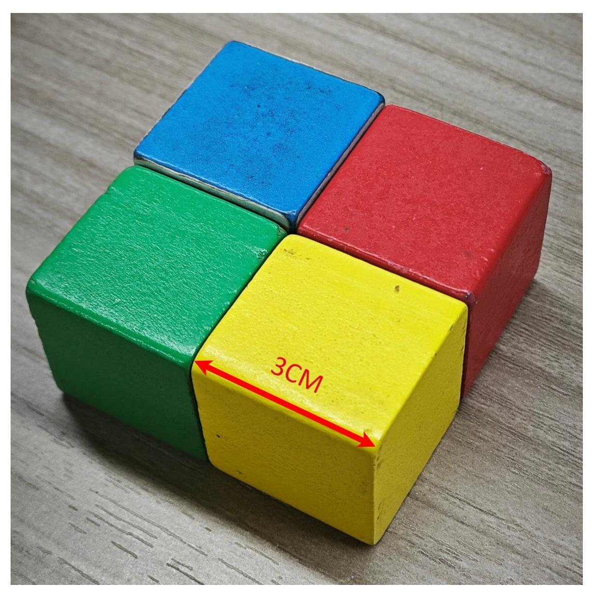
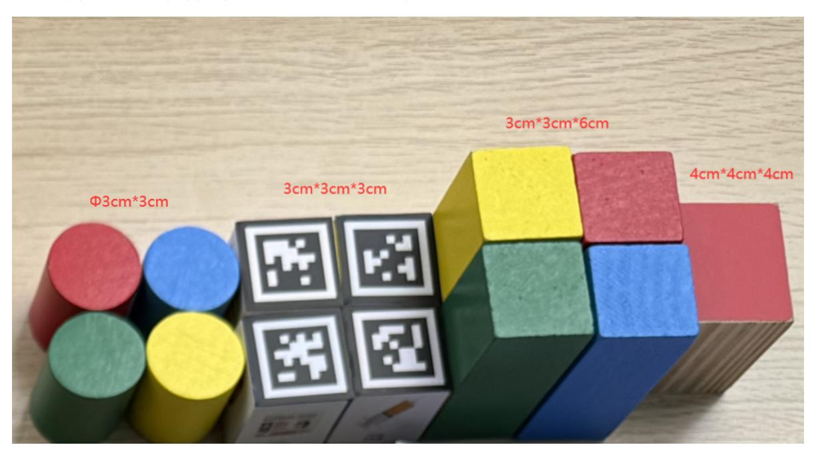

## Precautions for DIY Robotic Arm

**Note: When the robot arm is gripping objects, it is necessary to control the angle of the gripper. Improper angle setting may cause the servo to stall and burn.**

Here is a table of gripper angles, which records the angle that the servo needs to be set to for every 0.5 cm object.

You can adjust the angle you set when gripping according to this table to avoid stalling the servo.

| Object length (unit: cm) | Servo angle (unit: degree) |  |  |
|--------------------------|----------------------------|--|--|
| 0                        | 180                        |  |  |
| 0.5                      | 176                        |  |  |
| 1.0                      | 168                        |  |  |
| 1.5                      | 160                        |  |  |
| 2.0                      | 152                        |  |  |
| 2.5                      | 143                        |  |  |
| 3.0                      | 134                        |  |  |
| 3.5                      | 125                        |  |  |
| 4.0                      | 115                        |  |  |
| 4.5                      | 105                        |  |  |
| 5.0                      | 95                         |  |  |
| 5.5                      | 80                         |  |  |
| 6.0                      | 57                         |  |  |
| 6.0-6.4                  | 0-57                       |  |  |

For example, the visual recognition cube we provide has a length, width and height of 3 cm each, so you can clamp it by setting the servo angle to 134°. Do not set an angle that is too large.

Note: This product includes four different sizes and shapes of wooden blocks. It is essential to strictly adhere to the block dimensions specified in the tutorial when performing gripping operations. If the program is configured to grip a 3cm square block, but a 4cm square block is actually placed for gripping, it will result in damage to Servo No. 6.

