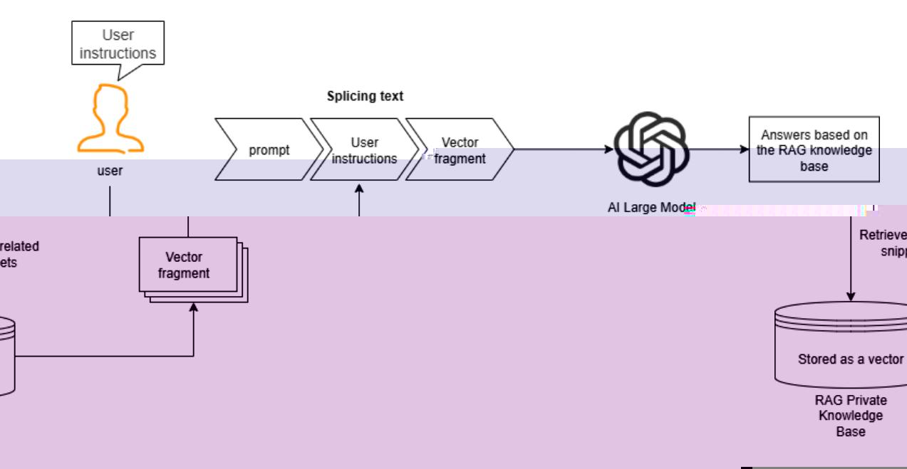

# RAG Retrieval Enhancement and Model Training Samples

## 1. Course Content

This course introduces large-model hallucinations, RAG retrieval enhancement, and model training samples. These concepts provide the theoretical foundation for later practical applications.

## 2. What Is Large-Model Hallucination?

RAG retrieval enhancement and model training samples are mainly used to reduce large-model hallucinations. First, it is important to understand what hallucination means in this context.

A large-model hallucination occurs when the model outputs content that is inconsistent with real-world facts or logic. In embodied AI, hallucinations may appear during environment understanding, instruction generation, or action planning, causing incorrect robot behavior or large deviations from user expectations.

Why do hallucinations occur? **Large models are probabilistic prediction systems trained on massive amounts of text.** In some domains or scenarios, the training data may not contain enough relevant examples. When this happens, the model may fabricate plausible-looking content to fill the gap.

## 3. RAG Retrieval Enhancement and Training Examples

### 3.1 RAG Retrieval Enhancement

RAG is an architecture that combines a retrieval system with a generation model. It addresses limitations of traditional generation models in scenarios such as open-domain question answering and real-time information queries, where knowledge may become outdated, hallucinations may occur, or long-context input may be required.

The core idea is to retrieve relevant knowledge first, add that knowledge to the prompt, and then let the large model generate an answer based on the retrieved information. This follows a "retrieve first, generate second" workflow.

### 3.2 Training Examples

Training examples are stored in the RAG knowledge base. The robot comes with two preinstalled knowledge bases: the action function library and the training example library. The training examples include samples from course-case scenarios, providing references for the large model's decision-making and planning in specific situations.

Later sections, such as **2. AI Large Model Basics - 5. Configuring the AI Large Model**, explain how to configure and extend the private knowledge base and training examples.

## 4. The Role of RAG Retrieval Enhancement and Training Examples in Robots

### 4.1 Reducing Large-Model Hallucinations

When a large model encounters a new domain or unique user requirement, it generates a likely result based on existing training data. That result may not match the user's expectations or the requirements of a specific scenario. RAG reduces this risk by giving the model relevant reference knowledge before it generates a response.

### 4.2 Improving Scenario Generalization

The robot includes training examples related to the course cases, as described in the "Configuring the Large Model" section. These examples provide reference information for the large model in specific scenarios. Users can also add custom training examples to adapt the robot to different application areas.

### 4.3 Reducing Prompt Length

If the number of training examples and knowledge-base entries is small, they can be placed directly in the large-model prompt. Prompts are the role definitions, requirements, and other instructions provided to the model in advance.

However, as user-defined scenarios and robot action libraries grow, longer prompts consume more tokens. RAG retrieval enhancement solves this by centrally managing the robot action function library and training examples, then retrieving only the relevant content when needed.

### 4.4 Expanding and Managing Robot Capabilities

The Alibaba Bailian large-model platform, also known as the Tongyi Qianwen platform, provides online management for knowledge bases and training examples. This makes it easier to manage and expand data. Domestic users use Alibaba Bailian by default to manage action function libraries and training examples. International users use a locally deployed Dify instance to manage knowledge-base content.
