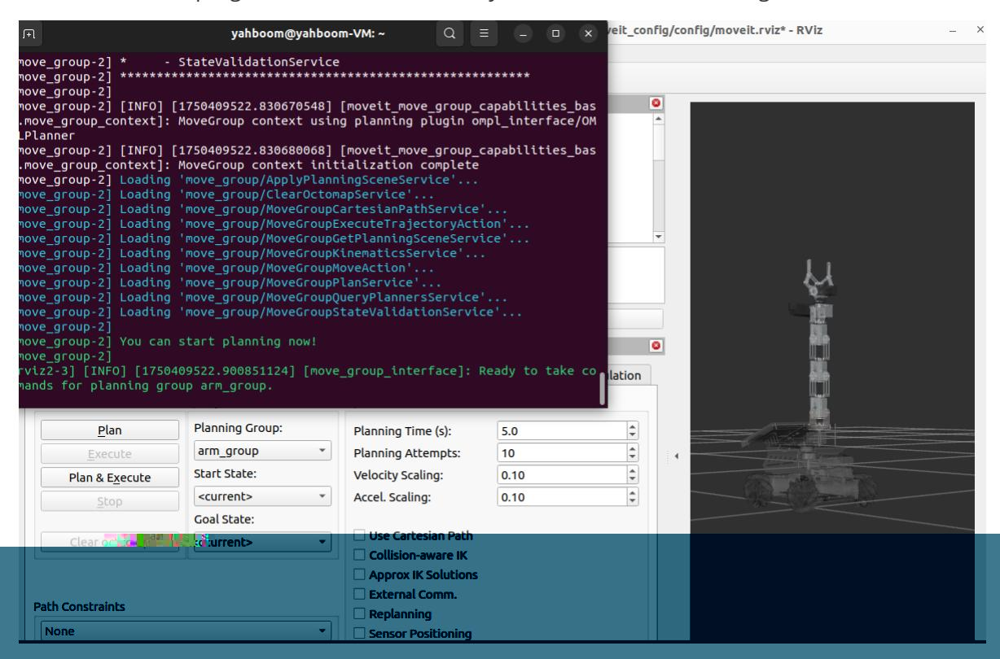
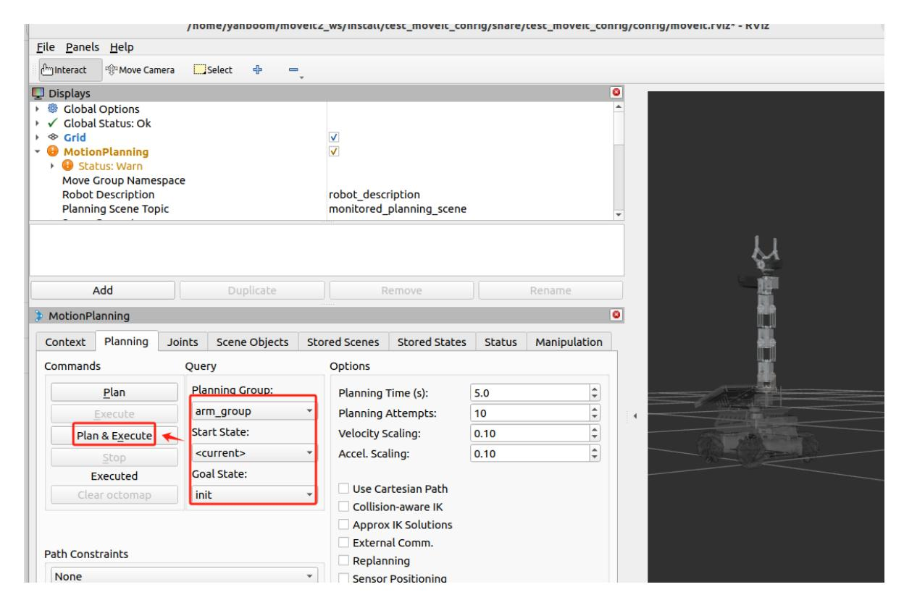
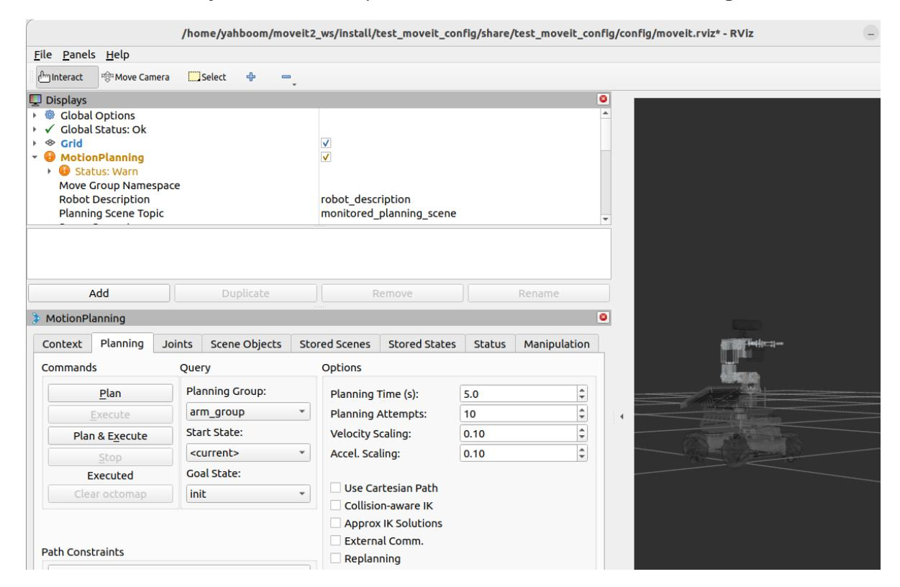
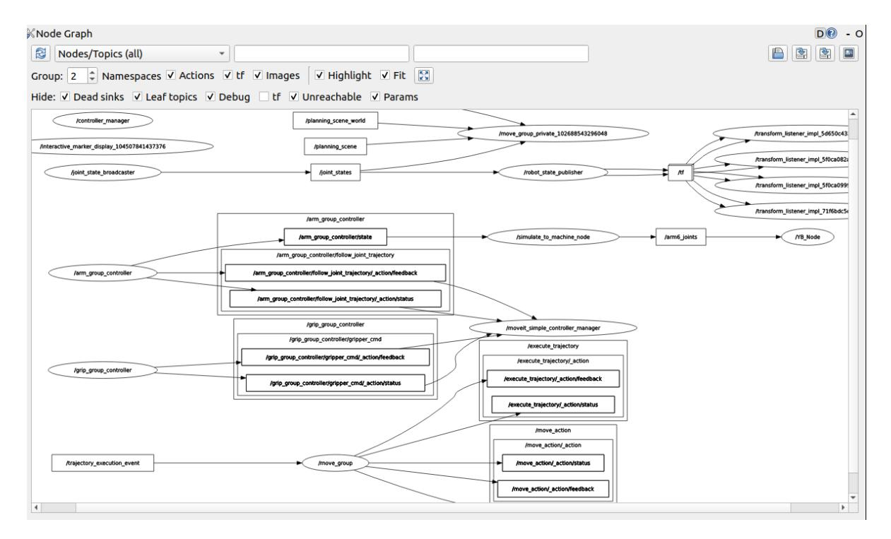
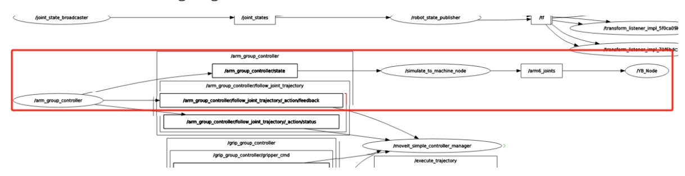

# MoveIt2 simulation-reality linkage

Preface: Raspberry Pi 5 and Jetson Nano's ROS is running in Docker, so the effect of running MoveIT2 is generally poor. It is recommended that Raspberry Pi 5 and

The user of the Jetson Nano motherboard runs MoveIt2 on a virtual machine. The ROS of the Orin motherboard runs directly on the motherboard.

Therefore, users of the Orin motherboard can run MoveIt2 related cases directly on the motherboard, and the instructions are the same as those running on a virtual machine.

The following content uses running on a virtual machine as an example.

## 1. Content Description

This section explains how to combine the simulated robotic arm in RViz with the real robotic arm to realize the function of driving the real machine.

## 2. Preparation

Preface: Since the real robot arm does not have an obstacle avoidance function, some positions may hit obstacles. Therefore, before driving the real machine, you need to ensure that there are no obstacles around the robot arm.

### 2.1. Start the agent

You need to start the agent on the motherboard. The agent will start the control node to control the robot and chassis. The agent will be automatically started when the computer is turned on. If the agent is not started, you can enter the following command in the terminal to start it.

sh start_agent.sh

### 2.2 Distributed communication between virtual machines and cars

The virtual machine and the car need to be able to communicate. There are two steps to achieve this:

- In the same local area network, the easiest way to achieve this is to connect to the same Wi-Fi;
- The ROS_DOMAIN_ID of the two must be consistent. The default ROS_DOMAIN_ID of the car is 30, and the default ROS_DOMAIN_ID of the virtual machine is also 30. If the two are different, you need to modify the ROS_DOMAIN_ID of the virtual machine, modify ~/.bashrc the file, and then change the value of ROS_DOMAIN_ID in it to the same as that of the car. Save and exit, then enter the command source ~/.bashrc to refresh the environment variables.
- Check whether the distributed communication between the two is achieved. Enter it on the virtual machine side ros2 node list. If you see **/YB_Node**, it means that the two are communicating.

## 3. Program startup

Enter the following command in the virtual machine to start MoveIt2,

```bash
ros2 launch test_moveit_config demo.launch.py
```

After the program is started, when the terminal displays **"You can start planning now!"**, it indicates that the program has been successfully started, as shown in the figure below.



At this time, the posture of the robotic arm is straightened upwards. After running the program to drive the real machine, the robotic arm on the car will also straighten upwards. Be careful with the robotic arm and place it in an open space. Enter the following command in the virtual machine terminal to start the program to drive the real machine:

```bash
ros2 run MoveIt_SimToMachine SimulationToMachine
```

After the program runs, the robotic arm will straighten upwards, just like the robotic arm in RViz.

This is to allow the robot arm in RViz to plan and move to our preset init posture, as shown in the figure below. Select [Planning Group] as arm_group, select [Start State] as, and select [Goal State] as. We plan the robot arm's posture from the current up to the previously set init, and then click [Plan&Execute].



The robotic arm in RViz will first plan and then slowly move to the init posture. The robotic arm on the car will also slowly move to the init posture. The final result is shown in the figure below.



## 4. Node Communication

Enter the following command in the virtual machine to view the current node communication diagram,

```bash
ros2 run rqt_graph rqt_graph
```

Select [Nodes/Topics (all)] in the upper left corner, and then click the refresh button next to it to get the following content:



We focus on the following diagrams:



This section illustrates the communication between the three nodes.

## 5. Core code analysis

Program source code path:

In the virtual

machine: /home/yahboom/moveit2_ws/src/MoveIt_SimToMachine/MoveIt_SimToMachine/Simula tionToMachine.py

Import the library files used,

```python
import rclpy
from rclpy.node import Node
from control_msgs.msg import JointTrajectoryControllerState
from math import pi
import numpy as np
from arm_msgs.msg import ArmJoints
```

Program initialization, creating topic subscribers and publishers,

```python
def __init__(self, name):
    super().__init__(name)
    #Create a subscriber and define the /arm_group_controller/state topic message
published by the MoveIt node
    self.sub_state
=self.create_subscription(JointTrajectoryControllerState,"/arm_group_controller/
state",self.get_ArmPosCallback,1)
    #Create a publisher to publish the control topic message of six servo angles,
and the underlying control node subscribes to the message
    self.pub_SixTargetAngle = self.create_publisher(ArmJoints, "arm6_joints",
10)
    self.joints = [90.0, 90.0, 90.0, 90.0, 90.0, 30.0]
```

/arm_group_controller/state topic callback function,

```python
def get_ArmPosCallback(self,msg):
    #print("Get the position of arm : ",msg.actual.positions)
    #Get the actual joint status of the robotic arm
    arm_rad = np.array(msg.actual.positions)
    DEG2RAD = np.array([180 / pi])
    #Convert angle to radians
    arm_deg = np.dot(arm_rad.reshape(-1, 1), DEG2RAD)
    #Median value of robotic arm
    mid = np.array([90, 90, 90, 90, 90])
    #mid = np.array([0, 0, 0, 0, 0])
    #Calculate absolute joint angles
    arm_array = np.array(np.array(arm_deg) + mid)
    #Assign values to servos 1-5
    for i in range(5): self.joints[i] = arm_array[i]
    print("self.joints: ",self.joints)
    #Execute the function to publish the topic of servo angle
    self.pubSixArm(self.joints)
```

Release the servo angle topic function,

```python
def pubSixArm(self, joints, id=6, angle=180.0, runtime=2000):
    #Create topic data object
    arm_joints =ArmJoints()
    #Assign values to the data in the topic data object
    arm_joints.joint1 = int(joints[0])
    arm_joints.joint2 = int(joints[1])
    arm_joints.joint3 = int(joints[2])
    arm_joints.joint4 = int(joints[3])
    arm_joints.joint5 = int(joints[4])
    arm_joints.joint6 = int(joints[5])
    arm_joints.time = runtime self.pub_SixTargetAngle.publish(arm_joints)
    #Publish topic data
    self.pub_SixTargetAngle.publish(arm_joints)
```
