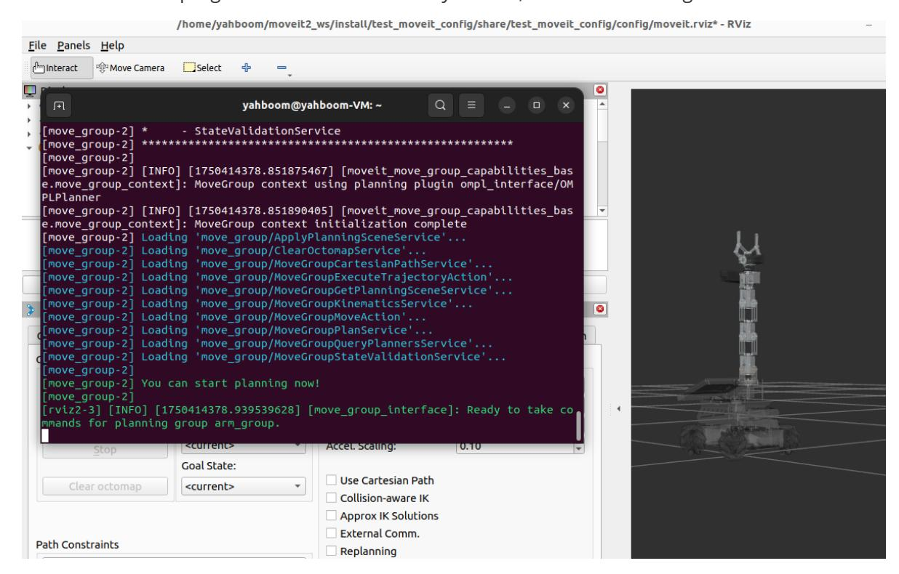
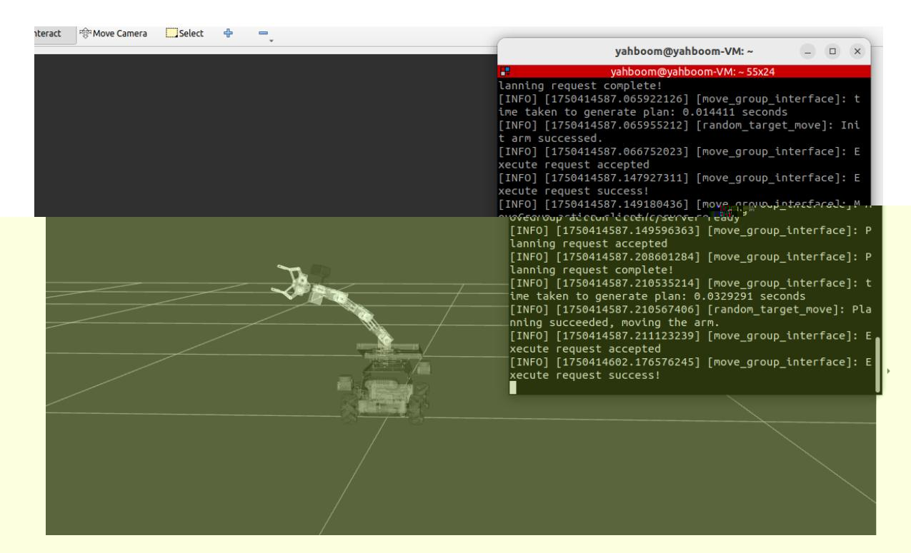

# Random movement

Preface: Raspberry Pi 5 and Jetson Nano run ROS in Docker, so the performance of running MoveIt2 is generally poor. Users of Raspberry Pi 5 and Jetson Nano boards are advised to run MoveIt2 examples in a virtual machine. Orin motherboards run ROS directly on the motherboard, so users of Orin boards can run MoveIt2 examples directly on the motherboard, using the same instructions as running in a virtual machine. This section uses running in a virtual machine as an example.

## 1. Content Description

This section describes how to use the MoveIt2 library to implement random movement of the robotic arm in RViz to a certain posture.

## 2. Start

Open the terminal in the virtual machine and enter the following command to start Movet2.

```bash
ros2 launch test_moveit_config demo.launch.py
```

After the program is started, when the terminal displays **"You can start planning now!"**, it indicates that the program has been successfully started, as shown in the figure below.



Then enter the following command in the terminal to start the random movement program,

```bash
ros2 run MoveIt_demo random_move
```

After the program runs, the robotic arm in RViz will move randomly, as shown in the figure below.



## 3. Core code analysis

Program code path:

The code path in the virtual machine

is: /home/yahboom/moveit2_ws/src/MoveIt_demo/src/random_move.cpp

```python
//Import necessary header files
#include <rclcpp/rclcpp.hpp>
#include <moveit/move_group_interface/move_group_interface.h>
#include <moveit/planning_scene_interface/planning_scene_interface.h>
#include <geometry_msgs/msg/pose.hpp>
#include <random>
class RandomMove : public rclcpp::Node
{
public:
  RandomMove()
    : Node("random_target_move")
  {
    // Initialize other content
    RCLCPP_INFO(this->get_logger(), "Initializing RandomMoveIt2Control.");
  }
  void initialize()
  {
    //Initialize move_group_interface_ and planning_scene_interface_ in this
function, and set the planning group to arm_group
       move_group_interface_ =
std::make_shared<moveit::planning_interface::MoveGroupInterface>
(shared_from_this(), "arm_group");
    planning_scene_interface_ =
std::make_shared<moveit::planning_interface::PlanningSceneInterface>();
    move_group_interface_->setNumPlanningAttempts(10); // Set the maximum
number of planning attempts to 10
```

```
move_group_interface_->setPlanningTime(5.0); // Set the maximum time
for each planning to 5 seconds
    // Plan the path
    moveit::planning_interface::MoveGroupInterface::Plan my_plan;
    //First, set the target pose to up, which is the up in the robot pose set in
the first section.
    move_group_interface_->setNamedTarget("up");
    bool success = (move_group_interface_->plan(my_plan) ==
moveit::core::MoveItErrorCode::SUCCESS);
    if (success)
    {
        //If the plan is successful, execute the execute function
        RCLCPP_INFO(this->get_logger(), "Init arm successed.");
        move_group_interface_->execute(my_plan);
    }
    else
    {
        RCLCPP_ERROR(this->get_logger(), "Init arm failed!");
    }
    // Set the target position
    move_group_interface_->setRandomTarget();
    bool success_random = (move_group_interface_->plan(my_plan) ==
moveit::core::MoveItErrorCode::SUCCESS);
    if (success_random)
    {
        //If the plan is successful, execute the execute function
      RCLCPP_INFO(this->get_logger(), "Planning succeeded, moving the arm.");
      move_group_interface_->execute(my_plan);
    }
    else
    {
      RCLCPP_ERROR(this->get_logger(), "Planning failed!");
    }
  }
private:
  std::shared_ptr<moveit::planning_interface::MoveGroupInterface>
move_group_interface_;
  std::shared_ptr<moveit::planning_interface::PlanningSceneInterface>
planning_scene_interface_;
};
int main(int argc, char **argv)
{
  rclcpp::init(argc, argv);
  auto node = std::make_shared<RandomMove>();
  // Delayed initialization
  node->initialize();
  rclcpp::spin(node);
  rclcpp::shutdown();
```

return 0;
}
