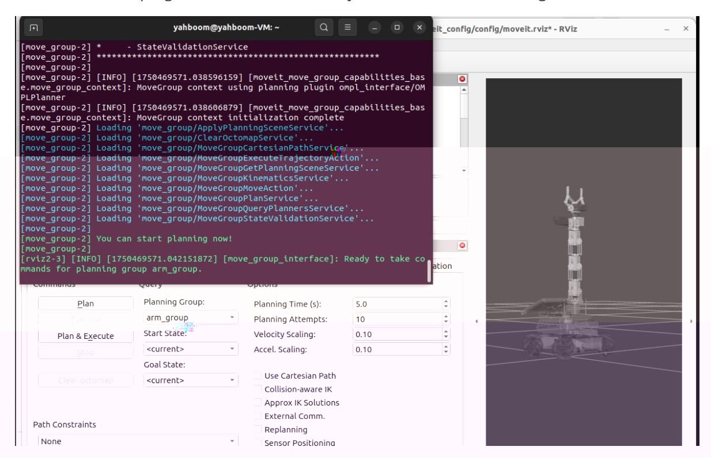
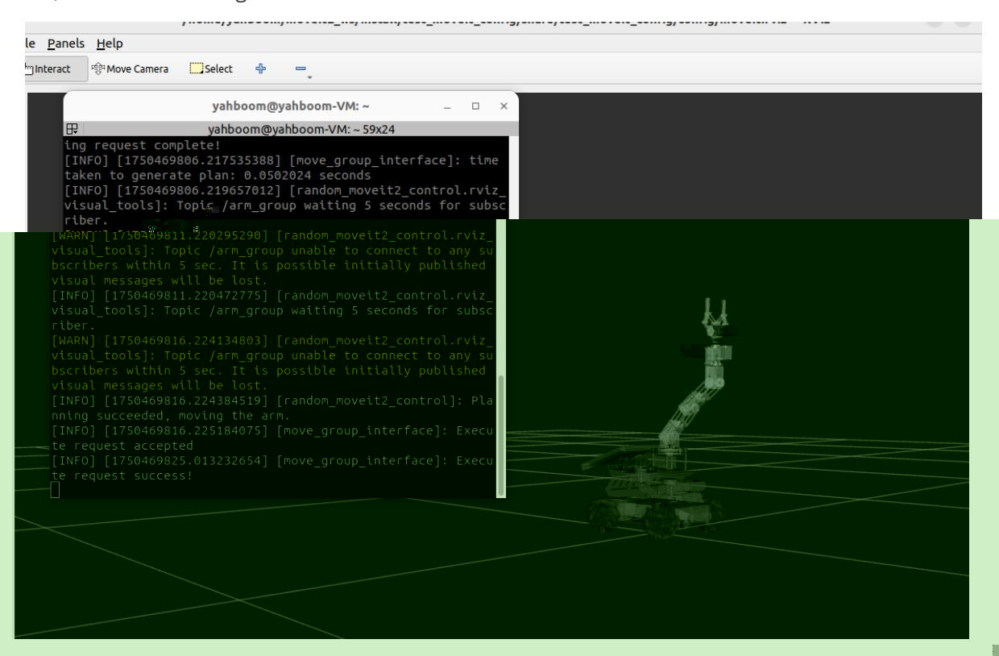

## Forward kinematics design

Preface: ROS on Raspberry Pi 5 and Jetson Nano runs in Docker, so the performance of running MoveIt2 is average. It is recommended that users of Raspberry Pi 5 and Jetson Nano motherboards run MoveIt2 related cases in a virtual machine. ROS on Orin motherboard runs directly on the motherboard, so users of Orin motherboard can run MoveIt2 related cases directly on the motherboard. The instructions are the same as running in a virtual machine.

The following content uses running on a virtual machine as an example.

## 1. Content Description

This course explains how to use functions in the MoveIt library to implement forward kinematics for a robotic arm. Forward kinematics involves calculating the pose of the robotic arm's end effector based on joint angles. In RViz, we specify the angles for each joint and have MoveIt2 program the robot to achieve these poses.

## 2. Start

Open a terminal in the virtual machine and enter the following command to start MoveIt2.

```
ros2 launch test_moveit_config demo.launch.py
```

After the program is started, when the terminal displays **"You can start planning now!"**, it indicates that the program has been successfully started, as shown in the figure below.



Then enter the following command in the terminal to start the positive kinematics design program,

After the program runs, the robotic arm in RViz will plan to move to the posture of each joint we set, as shown in the figure below.



## 3. Core code analysis

The code path in the virtual machine

is: /home/yahboom/moveit2_ws/src/MoveIt_demo/src/set_target_joints.cpp

```
#include <rclcpp/rclcpp.hpp>
#include <moveit/move_group_interface/move_group_interface.h>
#include <rclcpp/rclcpp.hpp>
#include <moveit/move_group_interface/move_group_interface.h>
#include <vector>
class RandomMoveIt2Control : public rclcpp::Node
{
public:
  RandomMoveIt2Control()
    : Node("random_moveit2_control")
  {
    RCLCPP_INFO(this->get_logger(), "Initializing RandomMoveIt2Control.");
  }
  void initialize()
  {
    int max_attempts = 5 ; // Maximum number of planning attempts
    int attempt_count = 0 ; // Current number of attempts
    //Initialize move_group_interface_ in this function and create a planning
group named arm_group
    move_group_interface_ =
std::make_shared<moveit::planning_interface::MoveGroupInterface>
(shared_from_this(), "arm_group");
    //The following is the setting for the planning group
    move_group_interface _-> setNumPlanningAttempts ( 10 ); // Set the maximum
number of planning attempts to 10
```

```
move_group_interface _-> setPlanningTime ( 5.0 ); // Set the
maximum time for each planning to 5 seconds
    move_group_interface _-> allowReplanning ( true ); //Allow replanning after
failure
    move_group_interface _-> setReplanAttempts ( 5 ); //Run replanning 5 times
    while (attempt_count < max_attempts)
    {
        attempt_count++;
        std::vector < double > target_joints = { 0 , - 0.69 , - 0.17 , 0.86 ,
0 }; // Target joint angles (unit: radians)
        // Set the target joint space value setJointValueTarget
        move_group_interface_->setJointValueTarget(target_joints);
        // Initialize plan
        moveit::planning_interface::MoveGroupInterface::Plan my_plan;
        //Execute plan plan(my_plan)
        bool success = (move_group_interface_->plan(my_plan) ==
moveit::core::MoveItErrorCode::SUCCESS);
        if (success)
        {
            //If the plan is successful, execute the plan, execute(my_plan)
            RCLCPP_INFO(this->get_logger(), "Planning succeeded, moving the
arm.");
            move_group_interface_->execute(my_plan);
            return;
        }
        else
        {
            RCLCPP_ERROR(this->get_logger(), "Planning failed!");
        }
    }
    RCLCPP_ERROR(this->get_logger(), "Exit!");
  }
private:
  std::shared_ptr<moveit::planning_interface::MoveGroupInterface>
move_group_interface_;
};
int main(int argc, char **argv)
{
  rclcpp::init(argc, argv);
  auto node = std::make_shared<RandomMoveIt2Control>();
  // Delayed initialization
  node->initialize();
  rclcpp::spin(node);
  rclcpp::shutdown();
  return 0;
}
```
