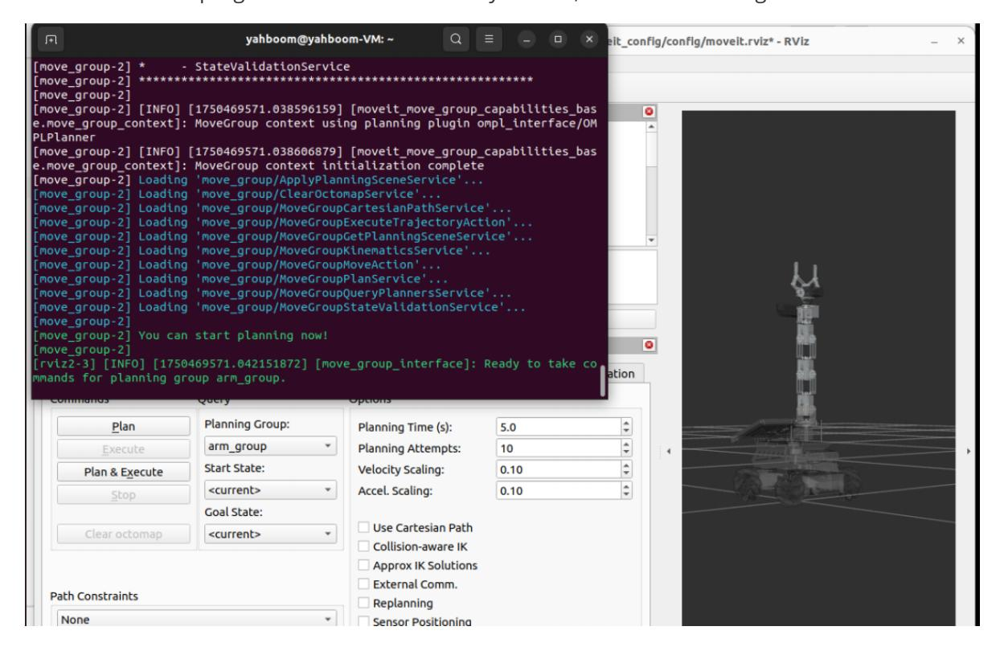
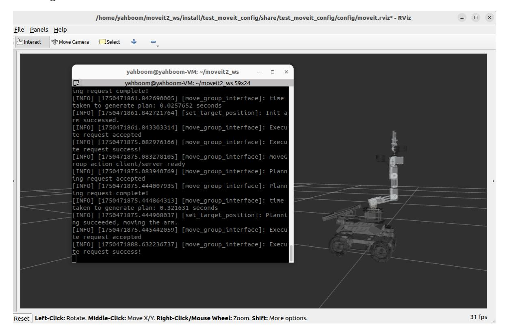

# Inverse Kinematics Design

Raspberry Pi 5 and Jetson Nano run ROS in Docker, so MoveIt2 performance is usually limited on those boards. Raspberry Pi 5 and Jetson Nano users should run these MoveIt2 examples in the virtual machine. Orin users can run the same commands directly on the robot because ROS runs directly on the Orin mainboard. This lesson uses the virtual machine as the example environment.

## 1. Content Description

This lesson uses MoveIt2 to plan arm motion from a target end-effector pose. Inverse kinematics calculates the joint angles required to reach the desired pose. In RViz, the program assigns an end-effector pose and asks MoveIt2 to plan and execute the motion.

## 2. Program Startup

Open a terminal in the virtual machine and start MoveIt2:

```bash
ros2 launch test_moveit_config demo.launch.py
```

When the terminal displays **"You can start planning now!"**, MoveIt2 has started successfully.



Start the inverse-kinematics example:

```bash
ros2 run MoveIt_demo set_target_position
```

After the program starts, the robotic arm in RViz plans a motion to the configured target pose.



## 3. Core Code Analysis

Program code path in the virtual machine:

```text
/home/yahboom/moveit2_ws/src/MoveIt_demo/src/set_target_position.cpp
```

```python
#include <rclcpp/rclcpp.hpp>
#include <moveit/move_group_interface/move_group_interface.h>
#include <geometry_msgs/msg/pose.hpp>
class SetTargetPosition : public rclcpp::Node
{
public :
 SetTargetPosition ()
   : Node ( "set_target_position" )
 {
   // Initialize other content
   RCLCPP_INFO ( this -> get_logger (), "Initializing RandomMoveIt2Control." );
 }
 void initialize ()
 {
   int max_attempts = 5 ; // Maximum number of planning attempts
   int attempt_count = 0 ; // Current number of attempts
  //Initialize move_group_interface_ in this function and create a planning
group named arm_group
   move_group_interface_ = std::make_shared <
moveit::planning_interface::MoveGroupInterface > ( shared_from_this (),
"arm_group" );
   move_group_interface _-> setNumPlanningAttempts ( 10 ); // Set the maximum
number of planning attempts to 10
```

```
move_group_interface _-> setPlanningTime ( 5.0 ); // Set the maximum
time for each planning to 5 seconds
    // Initialize plan
    moveit::planning_interface::MoveGroupInterface::Plan my_plan ;
    //First, set the target pose to up, which is the up in the robot pose set in
the first section.
    move_group_interface_ -> setNamedTarget ( "up" );
    // Plan the movement to reach the up posture
    bool success = ( move_group_interface_ -> plan ( my_plan ) ==
moveit::core::MoveItErrorCode::SUCCESS );
    if ( success )
    {
        //If the plan is successful, execute the plan execute(my_plan)
        RCLCPP_INFO ( this -> get_logger (), "Init arm successful." );
        move_group_interface_ -> execute ( my_plan );
    }
    else
    {
        RCLCPP_ERROR ( this -> get_logger (), "Init arm failed!" );
    }
    // Set the target pose data of the end of the robotic arm
    geometry_msgs::msg::Pose target_pose ;
    target_pose . position . x = 0.10755 ;
    target_pose . position . y = - 1.35847e - 05 ;
    target_pose . position . z = 0.400775 ;
    target_pose . orientation . w = 1.0 ;
    while ( attempt_count < max_attempts )
    {
        attempt_count ++ ;
        //Set the target pose setPoseTarget
        move_group_interface_ -> setPoseTarget ( target_pose );
        // Initialize plan
        moveit::planning_interface::MoveGroupInterface::Plan my_plan ;
        // Plan the path to reach this pose
        bool success = ( move_group_interface_ -> plan ( my_plan ) ==
moveit::core::MoveItErrorCode::SUCCESS );
        if ( success )
        {
            RCLCPP_INFO ( this -> get_logger (), "Planning succeeded, moving the
arm." );
             //If the plan is successful, execute the plan execute(my_plan)
            move_group_interface_ -> execute ( my_plan );
            attempt_count = 0 ;
            break ;
        }
        else
        {
            RCLCPP_INFO ( this -> get_logger (), "Planning failed!" );
        }
    }
  }
private :
```

```
std::shared_ptr < moveit::planning_interface::MoveGroupInterface >
move_group_interface_ ;
};
int main ( int argc , char ** argv )
{
  rclcpp::init ( argc , argv );
  auto node = std::make_shared < SetTargetPosition > ();
  // Initialization
  node- > initialize ();
  rclcpp::spin ( node );
  rclcpp::shutdown ();
  return 0 ;
}
```
