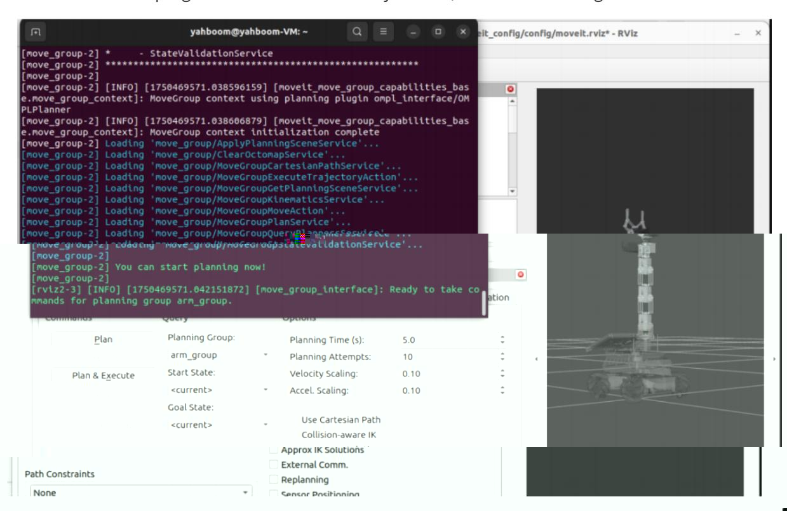
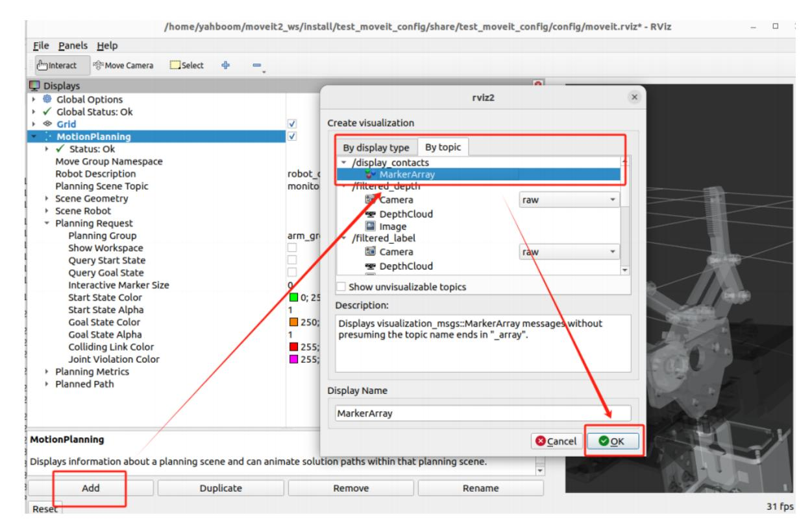
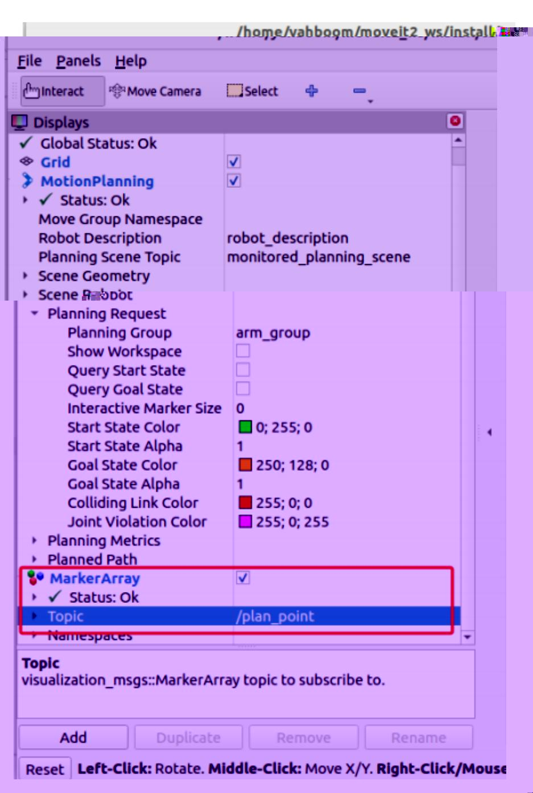
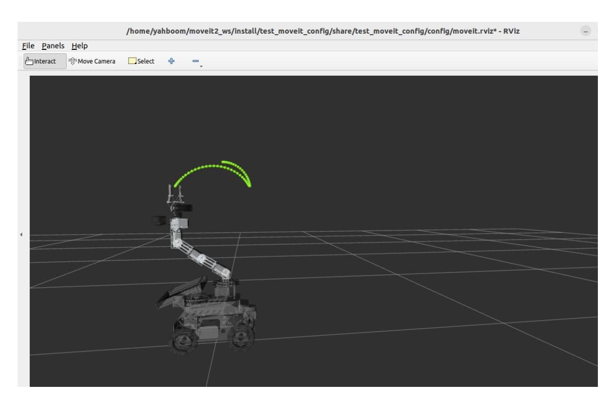

# Cartesian path

Preface: ROS on Raspberry Pi 5 and Jetson Nano runs in Docker, so the performance of running MoveIt2 is average. It is recommended that users of Raspberry Pi 5 and Jetson Nano motherboards run MoveIt2 related cases in a virtual machine. ROS on Orin motherboard runs directly on the motherboard, so users of Orin motherboard can run MoveIt2 related cases directly on the motherboard. The instructions are the same as running in a virtual machine.

The following content uses running on a virtual machine as an example.

## 1. Content Description

This section explains how to use functions in MoveIt2 to implement Cartesian paths. Cartesian path planning is an important feature in robotic arm control. It allows users to specify the trajectory of the end effector in Cartesian space (i.e., three-dimensional space) rather than directly specifying the motion in joint space. MoveIt provides powerful Cartesian path planning capabilities.

## 2. Program startup

After the program is started, when the terminal displays **"You can start planning now!"**, it indicates that the program has been successfully started, as shown in the figure below.



Then, we need to add a plug-in to display the planned trajectory, and set it up as shown in the figure below.



Next, we modify the topics that need to be displayed, as shown below.



Then, enter the following command in the virtual machine terminal to start the Cartesian path program,

```bash
ros2 run MoveIt_demo cartesian_path
```

After running, the robot arm will move to the set posture and a green Cartesian path point will be displayed, as shown in the figure below.



## 3. Core code analysis

Virtual machine code

path: /home/yahboom/moveit2_ws/src/MoveIt_demo/src/cartesian_path.cpp

```python
#include <rclcpp/rclcpp.hpp>
#include <moveit/move_group_interface/move_group_interface.h>
#include <moveit/planning_scene_interface/planning_scene_interface.h>
#include <moveit_msgs/msg/display_trajectory.hpp>
#include <moveit_visual_tools/moveit_visual_tools.h>
#include <geometry_msgs/msg/pose.hpp>
#include <vector>
#include <moveit/robot_trajectory/robot_trajectory.h>
#include <moveit/robot_state/robot_state.h>
#include <moveit/robot_model/robot_model.h>
#include <moveit/robot_model_loader/robot_model_loader.h>
class CartesianPathPlanning : public rclcpp::Node
{
public :
  CartesianPathPlanning ()
    : Node ( "cartesian_path_planning" )
    {
        RCLCPP_INFO ( this -> get_logger (), "Initializing
CartesianPathPlanning." );
    }
  void initialize ()
  {
    int max_attempts = 5 ; // Maximum number of planning attempts
    int attempt_count = 0 ; // Current number of attempts
    // Use RobotModelLoader to load the robot model
    robot_model_loader::RobotModelLoader robot_model_loader ( shared_from_this
(), "robot_description" );
    const moveit::core::RobotModelPtr & robot_model = robot_model_loader .
getModel ();
```

```
//Initialize move_group_interface_ in this function and create a planning
group named arm_group
   move_group_interface_ = std::make_shared <
moveit::planning_interface::MoveGroupInterface > (
     shared_from_this (), "arm_group" );
   planning_scene_interface_ = std::make_shared <
moveit::planning_interface::PlanningSceneInterface > ();
   move_group_interface _-> setNumPlanningAttempts ( 10 ); // Set the maximum
number of planning attempts to 10
   move_group_interface _-> setPlanningTime ( 5.0 ); // Set the maximum
time for each planning to 5 seconds
   const moveit::core::JointModelGroup * joint_model_group = robot_model ->
getJointModelGroup ( "arm_group" );
   // Initialize the coordinate system of the trajectory display to base_link,
the trajectory topic to plan_point, and the robot model to the planning group
model
   moveit_visual_tools::MoveItVisualTools visual_tools_ ( shared_from_this (),
"base_link" , "plan_point" ,
                                                   move_group_interface_ ->
getRobotModel ());
   moveit::planning_interface::MoveGroupInterface::Plan up_plan ;
   // Set the predefined target position
   move_group_interface_ -> setNamedTarget ( "up" );
   //Start planning the robot arm to the up position
   bool success = ( move_group_interface_ -> plan ( up_plan ) ==
moveit::core::MoveItErrorCode::SUCCESS );
   //If the plan is successful, execute the plan
   if ( success )
   {
       RCLCPP_INFO ( this -> get_logger (), "Init arm successful." );
       move_group_interface_ -> execute ( up_plan );
   }
   else
   {
       RCLCPP_ERROR ( this -> get_logger (), "Init arm failed!" );
   }
   // Define a series of target poses
   std::vector < geometry_msgs::msg::Pose > waypoints ;
   geometry_msgs::msg::Pose target_pose ;
   target_pose . position . x = 0.111475 ;
   target_pose . position . y = - 0.00398619 ;
   target_pose . position . z = 0.381269 ;
   target_pose . orientation . x = 2.14803e - 05 ;
   target_pose . orientation . y = - 0.000202467 ;
   target_pose . orientation . z = - 6.38068e - 05 ;
   target_pose . orientation . w = 1 ;
   waypoints . push_back ( target_pose );
```

```
geometry_msgs::msg::Pose target_pose_2 ;
   target_pose_2 . position . x = - 0.10527 ;
   target_pose_2 . position . y = 0.00216908 ;
   target_pose_2 . position . z = 0.385409 ;
   target_pose_2 . orientation . x = 2.5884e - 05 ;
   target_pose_2 . orientation . y = 4.08345e - 05 ;
   target_pose_2 . orientation . z = - 0.161976 ;
   target_pose_2 . orientation . w = 0.986795 ;
   waypoints . push_back ( target_pose_2 );
   //Define some necessary parameters for the Cartesian path
   moveit_msgs::msg::RobotTrajectory trajectory_msg ;
   double jump_threshold = 0.0 ;
   double eef_step = 0.25 ;
   int maxtries = 1000 ; //maximum number of attempts to plan
   int attempts = 0 ; //Number of attempts already made
   double fraction = 0.0 ;
while ( attempts < maxtries )
   {
       //Call computeCartesianPath to calculate the Cartesian path. waypoints
represents the target pose, eef_step represents the maximum step size between
waypoints, jump_threshold represents the allowed joint space jump threshold (in
radians), trajectory_msg represents the output trajectory, and the fraction
returned is the path fraction. A fraction of 1.0 indicates that the path planning
was successful and can be executed safely. A fraction of 0.0 indicates a complete
failure and requires checking for collisions, workspace restrictions, etc. A
fraction between 0.0 and 1.0 indicates partial success and may require adjustment
of the path or optimization parameters.
       fraction = move_group_interface_ -> computeCartesianPath ( waypoints ,
eef_step , jump_threshold , trajectory_msg );
       if ( fraction > 0.0 )
       {
               RCLCPP_INFO ( this -> get_logger (), "Cartesian path planned
successfully (%.2f%% achieved)" , fraction * 100.0 );
             robot_trajectory::RobotTrajectory trajectory (
move_group_interface_ -> getRobotModel (), move_group_interface_ -> getName ());
             // Visualize the trajectory in RViz. The trajectory parameters are
the planned path. Set the end execution link to Gripping. The point color of the
robot trajectory is green.
             visual_tools_ . publishTrajectoryLine ( trajectory_msg ,
move_group_interface_ -> getRobotModel () -> getLinkModel ( "Gripping" ),
joint_model_group , rviz_visual_tools::LIME_GREEN );
             visual_tools_ . trigger ();
             moveit::planning_interface::MoveGroupInterface::Plan plan ;
             plan . trajectory_ = trajectory_msg ;
             move_group_interface_ -> execute ( plan );
             break ;
       }
       else
       {
```

```
RCLCPP_ERROR ( this -> get_logger (), "Failed to compute Cartesian
path" );
             attempts ++ ;
        }
  }
}
private :
  std::shared_ptr < moveit::planning_interface::MoveGroupInterface >
move_group_interface_ ;
  std::shared_ptr < moveit::planning_interface::PlanningSceneInterface >
planning_scene_interface_ ;
  std::shared_ptr < moveit_visual_tools::MoveItVisualTools > visual_tools_ ;
};
int main ( int argc , char ** argv )
{
  rclcpp::init ( argc , argv );
  auto node = std::make_shared < CartesianPathPlanning > ();
  rclcpp::executors::SingleThreadedExecutor executor ;
  executor . add_node ( node );
  // Start asynchronous Spinner
  node- > initialize ();
  executor.spin ( ) ;
  //rclcpp::spin(node);
  rclcpp::shutdown ();
  return 0 ;
}
```
