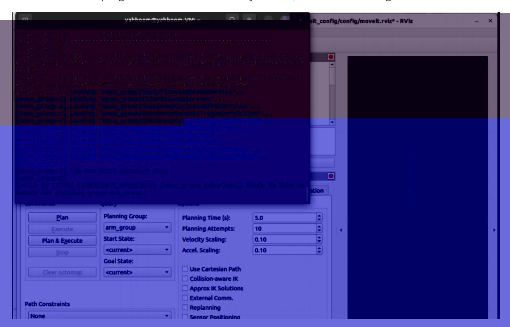
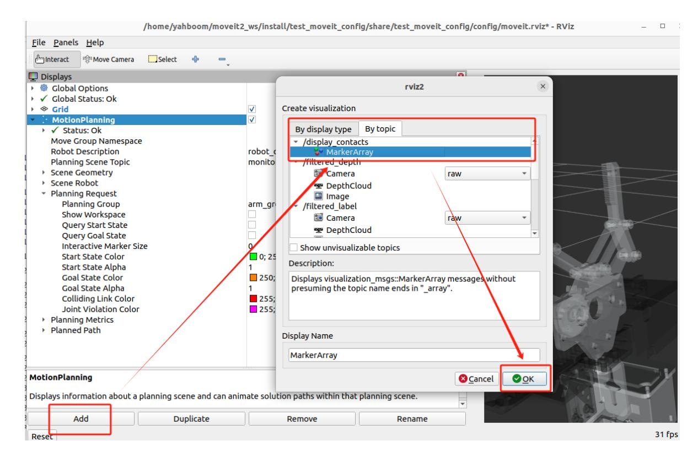
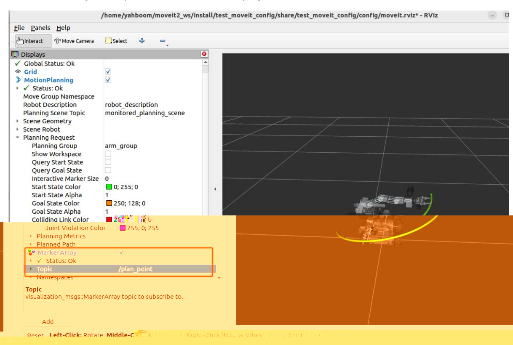
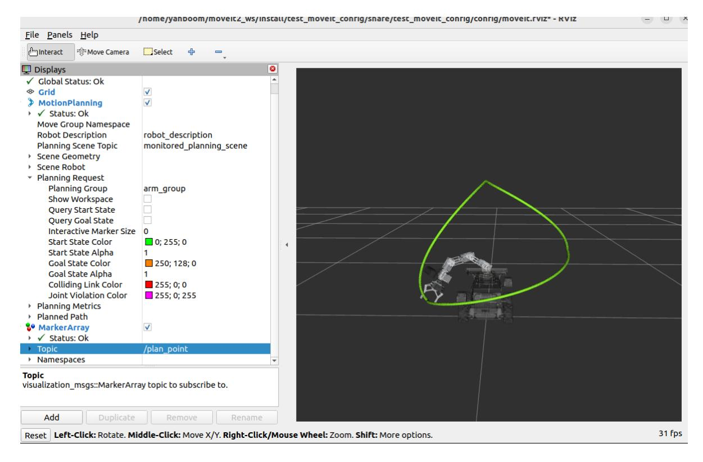

# Trajectory Planning

Raspberry Pi 5 and Jetson Nano run ROS in Docker, so MoveIt2 performance is usually limited on those boards. Raspberry Pi 5 and Jetson Nano users should run these MoveIt2 examples in the virtual machine. Orin users can run the same commands directly on the robot because ROS runs directly on the Orin mainboard.

This lesson uses the virtual machine as the example environment.

## 1. Content Description

This lesson shows how to display a MoveIt2 planned path in RViz and execute the robotic arm motion along that trajectory.

## 2. Program Startup

Open a terminal in the virtual machine and start MoveIt2:

```bash
ros2 launch test_moveit_config demo.launch.py
```

When the terminal displays **"You can start planning now!"**, MoveIt2 has started successfully.



Add the plugin used to display the planned trajectory and configure it as shown below.



Next, configure the topics that should be displayed.



Start the trajectory planning program:

```bash
ros2 run MoveIt_demo multi_track_motion
```

After the program starts, RViz displays the trajectory and the robotic arm moves along the planned path.



## 3. Core Code Analysis

Program code path in the virtual machine:

```text
/home/yahboom/moveit2_ws/src/MoveIt_demo/src/multi_track_motion.cpp
```

```python
#include <rclcpp/rclcpp.hpp>
#include <moveit/move_group_interface/move_group_interface.h>
#include <moveit/planning_scene_interface/planning_scene_interface.h>
#include <moveit_visual_tools/moveit_visual_tools.h>
#include <moveit_msgs/msg/display_trajectory.hpp>
#include <vector>
#include <moveit/robot_trajectory/robot_trajectory.h>
#include <moveit/robot_state/robot_state.h>
#include <moveit/robot_model/robot_model.h>
#include <moveit/robot_model_loader/robot_model_loader.h>
class RandomMoveIt2Control : public rclcpp::Node
{
public :
  RandomMoveIt2Control ()
    : Node ( "random_moveit2_control" )
  {
    // Initialize other content
    RCLCPP_INFO ( this -> get_logger (), "Initializing RandomMoveIt2Control." );
  }
  void initialize ()
  {
        // Use RobotModelLoader to load the robot model
    robot_model_loader::RobotModelLoader robot_model_loader ( shared_from_this
(), "robot_description" );
    const moveit::core::RobotModelPtr & robot_model = robot_model_loader .
getModel ();
    // Initialize move_group_interface_ in this function and create a planning
group named arm_group
```

```
move_group_interface_ = std::make_shared <
moveit::planning_interface::MoveGroupInterface > ( shared_from_this (),
"arm_group" );
   const moveit::core::JointModelGroup * joint_model_group = robot_model ->
getJointModelGroup ( "arm_group" );
   // Initialize the coordinate system of the trajectory display to base_link,
the trajectory topic to plan_point, and the robot model to the planning group
model
   moveit_visual_tools::MoveItVisualTools visual_tools_ ( shared_from_this (),
"base_link" , "plan_point" , move_group_interface_ -> getRobotModel ());
   move_group_interface _-> setNumPlanningAttempts ( 10 ); // Set the maximum
number of planning attempts to 10
   move_group_interface _-> setPlanningTime ( 5.0 ); // Set the maximum
time for each planning to 5 seconds
   // First target joint angle (unit: radians)
   std::vector < double > target_joints = { 1.57 , - 1.00 , - 0.61 , 0.20 ,
0.0 };
   //Set the joint angles of the first pose
   move_group_interface_ -> setJointValueTarget ( target_joints );
   // Plan the path
   moveit::planning_interface::MoveGroupInterface::Plan my_plan ;
   bool success = ( move_group_interface_ -> plan ( my_plan ) ==
moveit::core::MoveItErrorCode::SUCCESS );
   //If the first path planning is successful, execute the planning
   if ( success )
   {
     // Visualize the trajectory in RViz. The trajectory parameters are the
planned path. Set the end execution link to Gripping. The point color of the
robot trajectory is green.
       visual_tools_ . publishTrajectoryLine ( my_plan . trajectory_ ,
move_group_interface_ -> getRobotModel () -> getLinkModel ( "Gripping" ),
joint_model_group , rviz_visual_tools::LIME_GREEN );
       visual_tools_ . trigger ();
       RCLCPP_INFO ( this -> get_logger (), "Planning succeeded, moving the
arm." );
       moveit::planning_interface::MoveItErrorCode execute_result =
move_group_interface_ -> execute ( my_plan );
       //If the first execution is successful, then execute the second plan
       if ( execute_result == moveit::core::MoveItErrorCode::SUCCESS )
       {
           RCLCPP_INFO ( this -> get_logger (), "Trajectory executed
successfully." );
           // First target joint angle (unit: radians)
           std::vector < double > target_joints = { 0 , 0 , 0 ,
0 , 0 };
           //Set the joint angles of the second pose
           move_group_interface_ -> setJointValueTarget ( target_joints );
           moveit::planning_interface::MoveGroupInterface::Plan my_plan ;
           bool success_two = ( move_group_interface_ -> plan ( my_plan ) ==
moveit::core::MoveItErrorCode::SUCCESS );
           //If the second planning path is successful, execute the planning
           if ( success_two )
           {
```

```
// Visualize the trajectory in RViz. The trajectory parameters
are the planned path. Set the end execution link to Gripping and the point color
of the trajectory is green.
                visual_tools_ . publishTrajectoryLine ( my_plan . trajectory_ ,
move_group_interface_ -> getRobotModel () -> getLinkModel ( "Gripping" ),
joint_model_group , rviz_visual_tools::LIME_GREEN );
                visual_tools_ . trigger ();
                RCLCPP_INFO ( this -> get_logger (), "Planning succeeded, moving
the arm 2nd." );
                moveit::planning_interface::MoveItErrorCode execute_result_2nd
= move_group_interface_ -> execute ( my_plan );
                //If the second execution is successful, then execute the third
plan
                if ( execute_result_2nd ==
moveit::core::MoveItErrorCode::SUCCESS )
                {
                    RCLCPP_INFO ( this -> get_logger (), "Trajectory executed
successfully 2nd." );
                    std::vector < double > target_joints = { - 1.16 , - 0.97 ,
- 0.81 , - 0.79 , 1.57 };
                    move_group_interface_ -> setJointValueTarget ( target_joints
);
                    moveit::planning_interface::MoveGroupInterface::Plan my_plan
;
                    bool success_three = ( move_group_interface_ -> plan (
my_plan ) == moveit::core::MoveItErrorCode::SUCCESS );
                    //If the third planning path is successful, execute the
planning
                    if ( success_three )
                    {
                          // Visualize the trajectory in RViz. The trajectory
parameters are the planned path. Set the end execution link to Gripping and the
point color of the trajectory is green.
                        visual_tools_ . publishTrajectoryLine ( my_plan .
trajectory_ , move_group_interface_ -> getRobotModel () -> getLinkModel (
"Gripping" ), joint_model_group , rviz_visual_tools::LIME_GREEN );
                        visual_tools_ . trigger ();
                        RCLCPP_INFO ( this -> get_logger (), "Planning succeeded,
moving the arm 3rd." );
                        moveit::planning_interface::MoveItErrorCode
execute_result_3rd = move_group_interface_ -> execute ( my_plan );
                        if ( execute_result_3rd ==
moveit::core::MoveItErrorCode::SUCCESS )
                        {
                            RCLCPP_INFO ( this -> get_logger (), "Trajectory
executed successfully 3rd." );
                        }
                }
            }
        }
      }
      else
      {
        RCLCPP_ERROR ( this -> get_logger (), "Trajectory execution failed with
error code: %d" , execute_result . val );
      }
    }
    else
```

```
{
        RCLCPP_ERROR ( this -> get_logger (), "Planning failed!" );
    }
  }
private :
  std::shared_ptr < moveit::planning_interface::MoveGroupInterface >
move_group_interface_ ;
  std::shared_ptr < moveit_visual_tools::MoveItVisualTools > visual_tools_ ;
};
int main ( int argc , char ** argv )
{
  rclcpp::init ( argc , argv );
  auto node = std::make_shared < RandomMoveIt2Control > ();
  // Initialization
  node- > initialize ();
  rclcpp::spin ( node );
  rclcpp::shutdown ();
  return 0 ;
}
```
