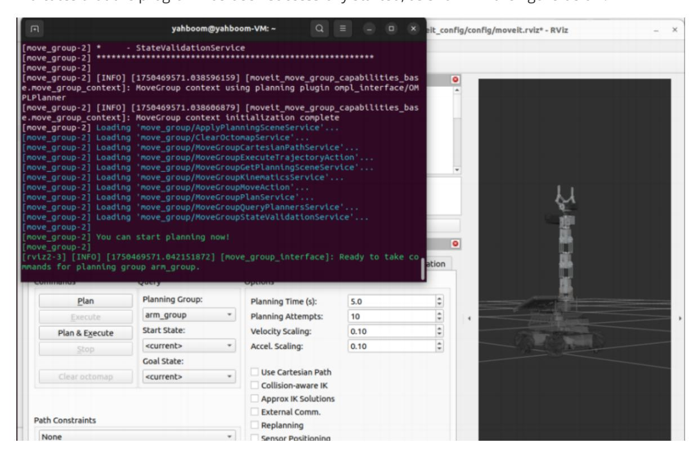
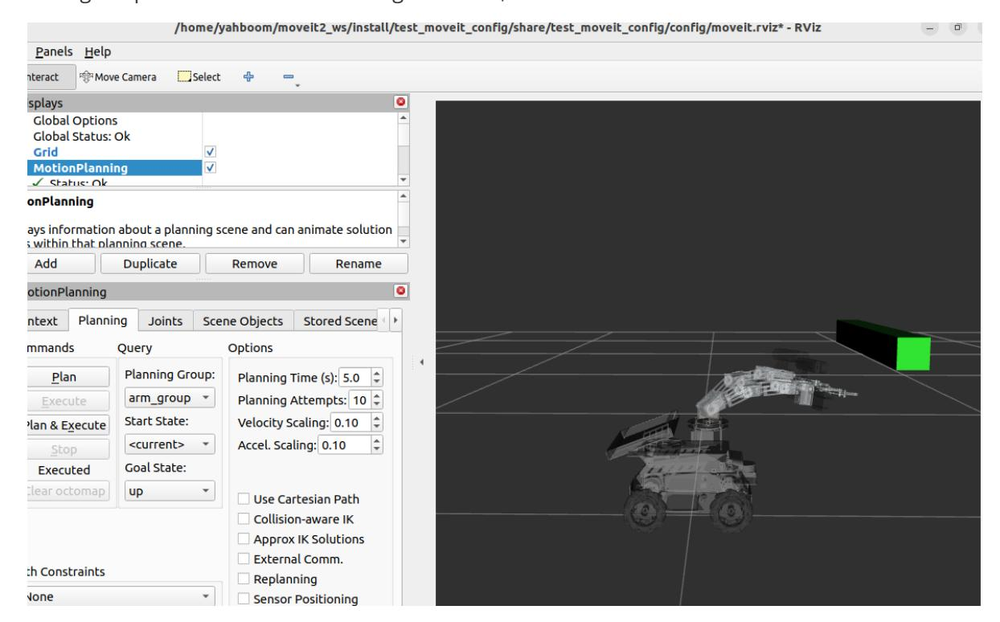

# Collision Detection

Raspberry Pi 5 and Jetson Nano run ROS in Docker, so MoveIt2 performance is usually limited on those boards. Raspberry Pi 5 and Jetson Nano users should run these MoveIt2 examples in the virtual machine. Orin users can run the same commands directly on the robot because ROS runs directly on the Orin mainboard. This lesson uses the virtual machine as the example environment.

## 1. Content Description

This lesson uses MoveIt2 to add obstacles to the RViz planning scene and plan robotic-arm motion that avoids those obstacles.

## 2. Program Startup

Open a terminal in the virtual machine and start MoveIt2:

```bash
ros2 launch test_moveit_config demo.launch.py
```

When the terminal displays **"You can start planning now!"**, MoveIt2 has started successfully.



Start the collision detection program:

```bash
ros2 run MoveIt_demo obstacle_avoidance
```

After the program starts, a green block is added to RViz as an obstacle. The arm first moves to the `up` pose, then plans a motion to the `down` pose while avoiding the obstacle. Finally, it plans a motion from `down` back to `up`, again avoiding the obstacle.



## 3. Core Code Analysis

Program code path in the virtual machine:

```text
/home/yahboom/moveit2_ws/src/MoveIt_demo/src/obstacle_avoidance.cpp
```

```python
#include <rclcpp/rclcpp.hpp>
#include <moveit/move_group_interface/move_group_interface.h>
#include <moveit/planning_scene_interface/planning_scene_interface.h>
#include <geometry_msgs/msg/pose.hpp>
class Avoidance : public rclcpp::Node
{
public :
 Avoidance ()
   : Node ( "random_target_move" )
 {
   // Initialize other content
   RCLCPP_INFO ( this -> get_logger (), "Initializing AvoidanceMoveIt2Control."
);
 }
 void initialize ()
 {
   int max_attempts = 5 ; // Maximum number of planning attempts
   int attempt_count = 0 ; // Current number of attempts
   // Initialize move_group_interface_ in this function and create a planning
group named arm_group
```

```
move_group_interface_ = std::make_shared <
moveit::planning_interface::MoveGroupInterface > ( shared_from_this (),
"arm_group" );
   //Create an interface for managing planning scenes to add collision objects
(obstacles) to the scene
   planning_scene_interface_ = std::make_shared <
moveit::planning_interface::PlanningSceneInterface > ();
   move_group_interface _-> setNumPlanningAttempts ( 10 ); // Set the maximum
number of planning attempts to 10
   move_group_interface _-> setPlanningTime ( 5.0 ); // Set the
maximum time for each planning to 5 seconds
   //Define a collision object
   moveit_msgs::msg::CollisionObject collision_object ;
   collision_object . header . frame_id = move_group_interface_ ->
getPlanningFrame ();
   collision_object . id = "box1" ;
   // Create a simple collision body or visualization object to describe the
robot's environment
   shape_msgs::msg::SolidPrimitive primitive ;
   //Set the type of geometric object to box
   primitive . type = primitive . BOX ;
   primitive . dimensions . resize ( 3 );
   //Set the size of the geometric object box in meters
   primitive . dimensions [ primitive . BOX_X ] = 0.05 ;
   primitive . dimensions [ primitive . BOX_Y ] = 0.05 ;
   primitive . dimensions [ primitive . BOX_Z ] = 0.5 ;
   //Create an object that describes the box pose of the collection object and
assign the data in the object
   geometry_msgs::msg::Pose box_pose ;
   box_pose . orientation . w = 0.7071 ;
   box_pose . orientation . x = 0.7071 ;
   box_pose . position . x = 0.35 ;
   box_pose . position . y = 0.0 ;
   box_pose . position . z = 0.35 ;
   //Add the shape of the collision object, the primitive just defined
   collision_object . primitives . push_back ( primitive );
   //Add the pose of the collision object, the box_pose just defined
   collision_object . primitive_poses . push_back ( box_pose );
   //Add collision objects to the environment
   collision_object . operation = collision_object . ADD ;
   std::vector < moveit_msgs::msg::CollisionObject > collision_objects ;
     //Add a collision object to the pending list
   collision_objects . push_back ( collision_object );
   RCLCPP_INFO ( this -> get_logger (), "Add an object into the world" );
   //Add collision objects to rviz for display
   planning_scene_interface_ -> addCollisionObjects ( collision_objects );
   // Plan the path
   moveit::planning_interface::MoveGroupInterface::Plan my_plan ;
   while ( attempt_count < max_attempts )
```

```
{
        attempt_count ++ ;
        // Set the predefined target position
        move_group_interface_ -> setNamedTarget ( "up" );
        // Create a plan and execute it
        moveit::planning_interface::MoveGroupInterface::Plan my_plan ;
        bool success = ( move_group_interface_ -> plan ( my_plan ) ==
 moveit::core::MoveItErrorCode::SUCCESS );
        //If the plan is successful, then execute the plan
        if ( success )
        {
            RCLCPP_INFO ( this -> get_logger (), "Planning succeeded, moving the
arm." );
            move_group_interface_ -> execute ( my_plan );
            attempt_count = 0 ;
            break ;
        }
        else
        {
            RCLCPP_INFO ( this -> get_logger (), "Planning failed!" );
        }
    }
    while ( attempt_count < max_attempts )
    {
        attempt_count ++ ;
        // Set the predefined target position
        move_group_interface_ -> setNamedTarget ( "down" );
        // Create a plan and execute it
        moveit::planning_interface::MoveGroupInterface::Plan my_plan ;
         bool success = ( move_group_interface_ -> plan ( my_plan ) ==
 moveit::core::MoveItErrorCode::SUCCESS );
        //If the plan is successful, then execute the plan
        if ( success )
        {
            RCLCPP_INFO ( this -> get_logger (), "Planning succeeded, moving the
arm." );
            move_group_interface_ -> execute ( my_plan );
            attempt_count = 0 ;
            break ;
        }
        else
        {
            RCLCPP_INFO ( this -> get_logger (), "Planning failed!" );
        }
    }
    while ( attempt_count < max_attempts )
    {
        attempt_count ++ ;
        // Set the predefined target position
        move_group_interface_ -> setNamedTarget ( "up" );
        // Create a plan and execute it
        moveit::planning_interface::MoveGroupInterface::Plan my_plan ;
        bool success = ( move_group_interface_ -> plan ( my_plan ) ==
 moveit::core::MoveItErrorCode::SUCCESS );
```

```
//If the plan is successful, then execute the plan
        if ( success )
        {
            RCLCPP_INFO ( this -> get_logger (), "Planning succeeded, moving the
arm." );
            move_group_interface_ -> execute ( my_plan );
            attempt_count = 0 ;
            break ;
        }
        else
        {
            RCLCPP_INFO ( this -> get_logger (), "Planning failed!" );
        }
    }
  }
private :
  std::shared_ptr < moveit::planning_interface::MoveGroupInterface >
 move_group_interface_ ;
  std::shared_ptr < moveit::planning_interface::PlanningSceneInterface >
 planning_scene_interface_ ;
};
int main ( int argc , char ** argv )
{
  rclcpp::init ( argc , argv );
  auto node = std::make_shared < Avoidance > ();
  // Initialization
  node- > initialize ();
  rclcpp::spin ( node );
  rclcpp::shutdown ();
  return 0 ;
}
```
