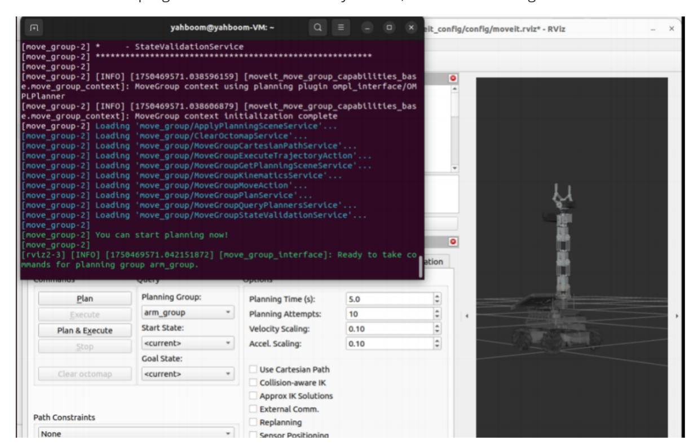
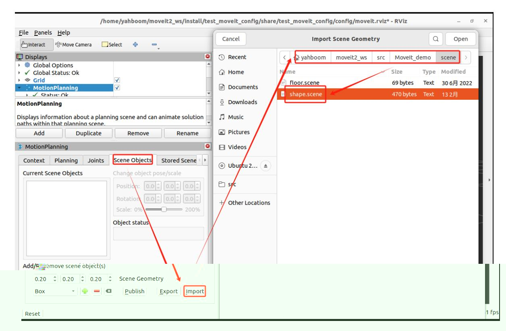
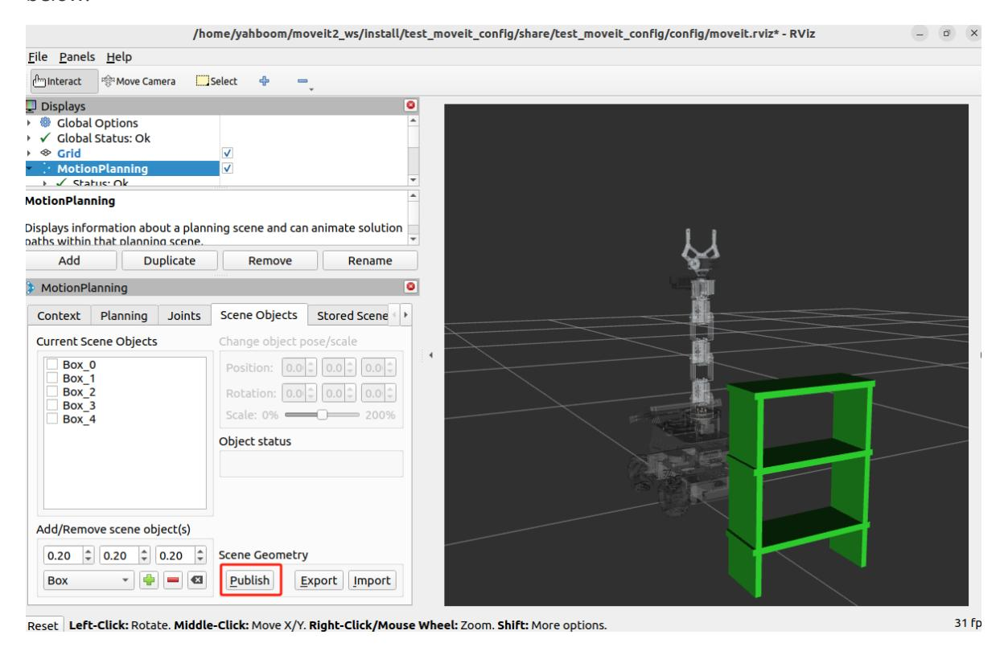
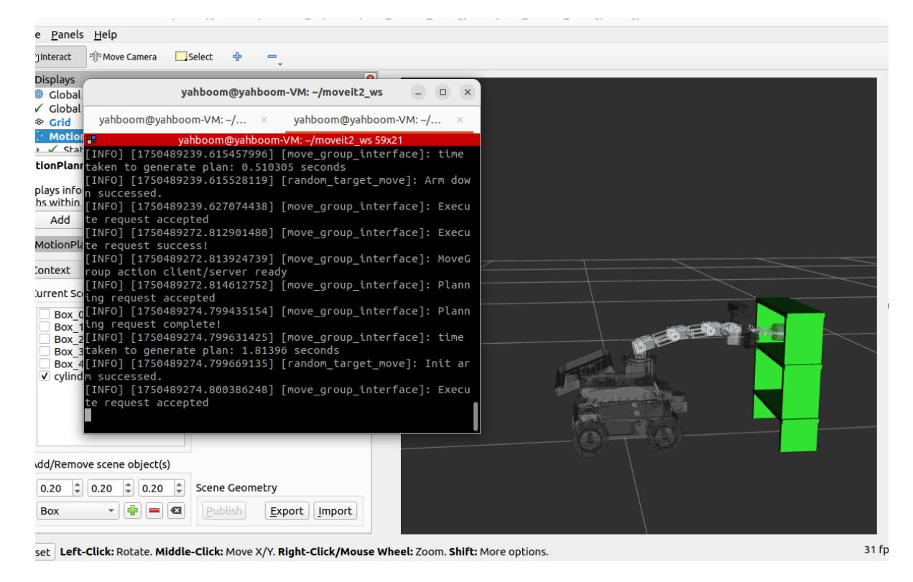

# Scene design

Preface: Raspberry Pi 5 and Jetson Nano run ROS in Docker, so the performance of running MoveIt2 is generally poor. Users of Raspberry Pi 5 and Jetson Nano boards are advised to run MoveIt2 examples in a virtual machine. Orin motherboards run ROS directly on the motherboard, so users of Orin boards can run MoveIt2 examples directly on the motherboard, using the same instructions as running in a virtual machine. This section uses running in a virtual machine as an example.

## 1. Content Description

This course implements a scenario: in RViz, there is a three-layer shelf. After the robotic arm grabs the cylindrical object, it plans to move it to the upper and lower layers in the middle to simulate the action of placing the object.

## 2. Program startup

Open a terminal in the virtual machine and enter the following command to start MoveIt2.

```bash
ros2 launch test_moveit_config demo.launch.py
```

After the program is started, when the terminal displays **"You can start planning now!"**, it indicates that the program has been successfully started, as shown in the figure below.



Then, we add the scene in RViz as shown below.



After selecting the scene file, click [Open] to complete the addition. The addition is as shown below.



Click [Publish] to publish the obstacle information. The robot arm will then avoid obstacles during planning.

Then, enter the following command in another terminal to start the upper and lower layer planning program,

```bash
ros2 run MoveIt_demo set_scene
```

After the program runs, the robot arm will plan to the set init posture, then a purple cylindrical object will be added to the gripper, and then the simulation action of placing the object will be planned and executed on the middle two layers.



## 3. Core code analysis

The code path in the virtual machine

is: /home/yahboom/moveit2_ws/src/MoveIt_demo/src/set_scene.cpp

```python
#include <rclcpp/rclcpp.hpp>
#include <moveit/move_group_interface/move_group_interface.h>
#include <moveit/planning_scene_interface/planning_scene_interface.h>
#include <geometry_msgs/msg/pose.hpp>
class Scene : public rclcpp::Node
{
public :
 Scene ()
   : Node ( "set_scene_node" )
 {
   // Initialize other content
   RCLCPP_INFO ( this -> get_logger (), "Initializing SceneMoveIt2Control." );
 }
 void initialize ()
 {
   int max_attempts = 5 ; // Maximum number of planning attempts
   int attempt_count = 0 ; // Current number of attempts
   // Initialize move_group_interface_ in this function and create a planning
group named arm_group
   move_group_interface_ = std::make_shared <
moveit::planning_interface::MoveGroupInterface > ( shared_from_this (),
"arm_group" );
   //Create an interface for managing planning scenes to add collision objects
(obstacles) to the scene
   planning_scene_interface_ = std::make_shared <
moveit::planning_interface::PlanningSceneInterface > ();
```

```
move_group_interface _-> setNumPlanningAttempts ( 10 ); // Set the maximum
number of planning attempts to 10
    move_group_interface _-> setPlanningTime ( 5.0 ); // Set the
maximum time for each planning to 5 seconds
    //Define a collision object
    moveit_msgs::msg::CollisionObject object_to_attach ;
    object_to_attach . id = "cylinder1" ;
    // Create a simple collision body or visualization object to describe the
robot's environment
    shape_msgs::msg::SolidPrimitive cylinder_primitive ;
    //Set the type of the geometric object to cylinder
    cylinder_primitive . type = cylinder_primitive . CYLINDER ;
    cylinder_primitive . dimensions . resize ( 2 );
    //Set the type of the geometric object to the size of the cylinder, in
meters
    cylinder_primitive . dimensions [ cylinder_primitive . CYLINDER_HEIGHT ] =
 0.03 ;
    cylinder_primitive . dimensions [ cylinder_primitive . CYLINDER_RADIUS ] =
 0.02 ;
    //Get the coordinate system of the end effector of the current planning group
as the collision object
    object_to_attach . header . frame_id = move_group_interface_ ->
getEndEffectorLink ();
    //Create an object that describes the cylinder pose of the collection object
and assign the data in the object
    geometry_msgs::msg::Pose grab_pose ;
    grab_pose . orientation . w = 1.0 ;
    grab_pose . position . z = 0.10 ;
    grab_pose . position . x = 0.00 ;
    //Add the shape of the collision object, the cylinder_primitive just defined
    object_to_attach . primitives . push_back ( cylinder_primitive );
    //Add the pose of the collision object, the box_pose just defined
    object_to_attach . primitive_poses . push_back ( grab_pose );
    //Add collision objects to the environment
    object_to_attach . operation = object_to_attach . ADD ;
    planning_scene_interface_ -> applyCollisionObject ( object_to_attach );
    RCLCPP_INFO ( this -> get_logger (), "Attach the object to the robot" );
    std::vector < std::string > touch_links ;
    touch_links . push_back ( "llink2" );
    touch_links . push_back ( "rlink2" );
    //Attach the object in the scene to the robotic arm so that it becomes part
of the robotic arm model and moves with the robotic arm. The parameters passed in
are the ID of the collision object, the link of the end effector, and the list of
links that are allowed to contact the object (to avoid collision detection)
    move_group_interface_ -> attachObject ( object_to_attach . id , "Gripping" ,
touch_links );
    // Create a plan
    moveit::planning_interface::MoveGroupInterface::Plan my_plan ;
    // Set the predefined target position
    move_group_interface_ -> setNamedTarget ( "init" );
    //Start planning the robot arm to the init position
    bool success = ( move_group_interface_ -> plan ( my_plan ) ==
 moveit::core::MoveItErrorCode::SUCCESS );
    //If the plan is successful, then execute the plan
    if ( success )
```

```
{
        RCLCPP_INFO ( this -> get_logger (), "Arm execute successful." );
        move_group_interface_ -> execute ( my_plan );
    }
    else
    {
        RCLCPP_ERROR ( this -> get_logger (), "Arm down failed!" );
    }
    // Set the predefined target position
    move_group_interface_ -> setNamedTarget ( "down" );
     //Start planning the robot arm to the down position
    success = ( move_group_interface_ -> plan ( my_plan ) ==
 moveit::core::MoveItErrorCode::SUCCESS );
    //If the plan is successful, then execute the plan
    if ( success )
    {
        RCLCPP_INFO ( this -> get_logger (), "Init arm successful." );
        move_group_interface_ -> execute ( my_plan );
    }
    else
    {
        RCLCPP_ERROR ( this -> get_logger (), "Init arm failed!" );
    }
    while ( attempt_count < max_attempts )
    {
        attempt_count ++ ;
        // Target joint angle (unit: radians)
        std::vector < double > target_joints = { 0.0 , - 1.57 , - 0.5 , 0.15 ,
0 };
        // Set the target joint space value
        move_group_interface_ -> setJointValueTarget ( target_joints );
        // Create a plan
        moveit::planning_interface::MoveGroupInterface::Plan my_plan ;
        //Start planning to the posture of the target joint angle
        bool success = ( move_group_interface_ -> plan ( my_plan ) ==
 moveit::core::MoveItErrorCode::SUCCESS );
         //If the plan is successful, then execute the plan
        if ( success )
        {
            RCLCPP_INFO ( this -> get_logger (), "Planning succeeded, moving the
arm." );
            move_group_interface_ -> execute ( my_plan );
            return ;
        }
        else
        {
            RCLCPP_INFO ( this -> get_logger (), "Planning failed!" );
        }
    }
    RCLCPP_ERROR ( this -> get_logger (), "Exit!" );
  }
private :
  std::shared_ptr < moveit::planning_interface::MoveGroupInterface >
 move_group_interface_ ;
```

```
std::shared_ptr < moveit::planning_interface::PlanningSceneInterface >
 planning_scene_interface_ ;
};
int main ( int argc , char ** argv )
{
  rclcpp::init ( argc , argv );
  auto node = std::make_shared < Scene > ();
  // Initialization
  node- > initialize ();
  rclcpp::spin ( node );
  rclcpp::shutdown ();
  return 0 ;
}
```
