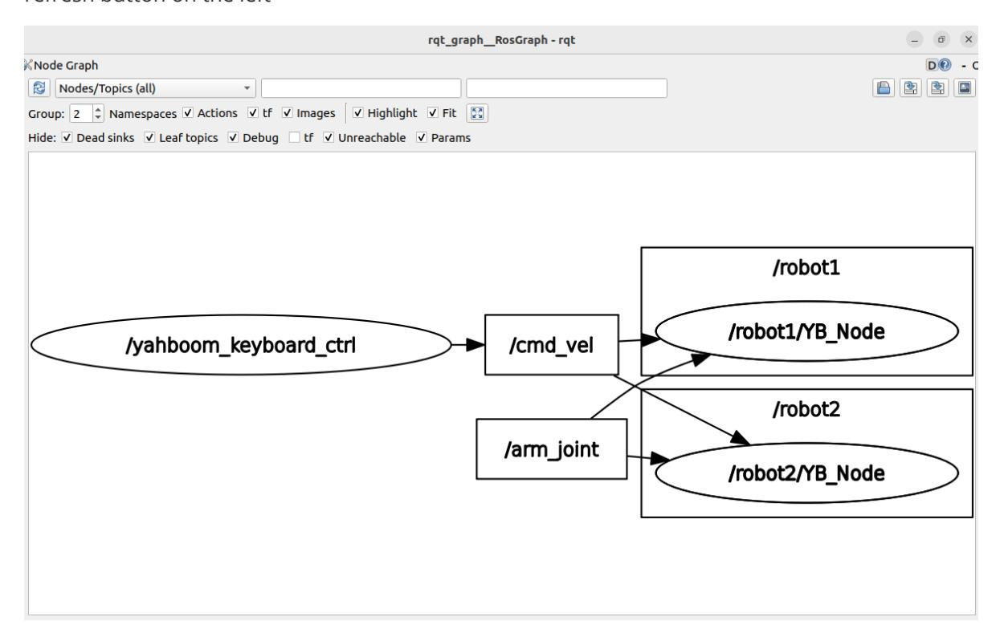

# Multi-vehicle chassis control

## 1. Content Description

This function enables the use of a keyboard to control multiple cars at the same time.

### 1.1 Functional Requirements

Taking two cars as an example, these two cars need to meet the following three requirements at the same time:

- The two vehicles need to be in the same local area network and connected to the same Wi-Fi to achieve this requirement.
- The ros_domain_id of the two vehicles needs to be the same. This can be done by modifying the ROS_DOMAIN_ID value in the terminal running the ROS environment. The default value is 30. Here we modify it according to the motherboard:
  - Raspberry Pi and Jetson Nano motherboards: Enter Docker, modify the value of ROS_DOMAIN_ID in the /root/.bashrc file, save and exit, and enter the command in the terminal source ~/.bashrc to refresh the environment variables. The modified [MY_DOMAIN_ID] will be printed in the terminal.
  - Orin motherboard: Open the terminal directly, then modify the value of ROS_DOMAIN_ID in the ~/.bashrc file, save and exit, enter the command in the terminal source ~/.bashrc to refresh the environment variables, and the terminal will print the modified [MY_DOMAIN_ID].
- The namespaces of the two robots are set to different ones. Here we use robot1 and robot2 as the namespaces of the two robots. The setting method of the robots on all mainboards is the same. The setting method is as follows:
  - Open the Rosmaster_Lib.py file in the /home directory and bot.set_ros_namespace modify its contents as shown below. Set the namespace of the first car to robot1. Note that the value in bot.set_ros_domain_id must be the same as the ROS_DOMAIN_ID value set in the second step.

Save and exit, press Ctrl+C to close the proxy, then use a screwdriver or toothpick to press the [RESET] button on the STM32 control board and enter in the terminal within 5 seconds python3 Rosmaster_Lib.py to run the setup program. After completion, use a screwdriver or toothpick to press the [RESET] button on the STM32 control board again to complete the setup. Finally, enter in the terminal to sh start_agent.sh reconnect to the proxy.

Repeat the same steps for the other car, setting the namespac to robot2.

## 2. Program startup

After setting the namespace and successfully reconnecting to the proxy, enter the following command in the terminal to verify that the namespace is set correctly. The virtual machine needs to be on the same LAN as the two cars, and the ROS_DOMAIN_ID must be the same for both cars. To modify it, refer to the setting of the car's ros_domain_id above. All you need to do is modify the contents of ~/.bashrc and refresh the environment variables after the modification is complete.

```bash
ros2 node list
```

As shown in the figure below, the appearance of /robot1/YB_Node and /robot2/YB_Node indicates that the setting is successful.

Enter the following command in the virtual machine terminal to start keyboard control,

```bash
ros2 run yahboomcar_ctrl yahboom_keyboard
```

After the program starts, click to start the keyboard controlled terminal and press the corresponding keys according to the following key table to control the movement of the two cars.

| button | property                  |
|--------|---------------------------|
| i or I | go ahead                  |
| <      | Back                      |
| j or J | Turn left                 |
| l or L | Turn right                |
| uorU   | Go forward and turn left  |
| o or O | Go forward and turn right |
| m or M | Turn left                 |
| >      | Turn right                |

## 3. Node Communication

Enter the following command in the virtual machine terminal to view the node communication diagram.

```bash
ros2 run rqt_graph rqt_graph
```

As shown in the figure below, select [Nodes/Topics (all)] in the upper left corner, and then click the refresh button on the left



The keyboard control node /yahboom_keyboard_ctrl publishes the speed topic /cmd_vel. The bottom-level nodes /robot1/YB_Node and /robot2/YB_Node of the two robots subscribe to this /cmd_vel topic. After receiving the message data from this topic, they process it and pass it to the driver board to control the movement of the robots.
