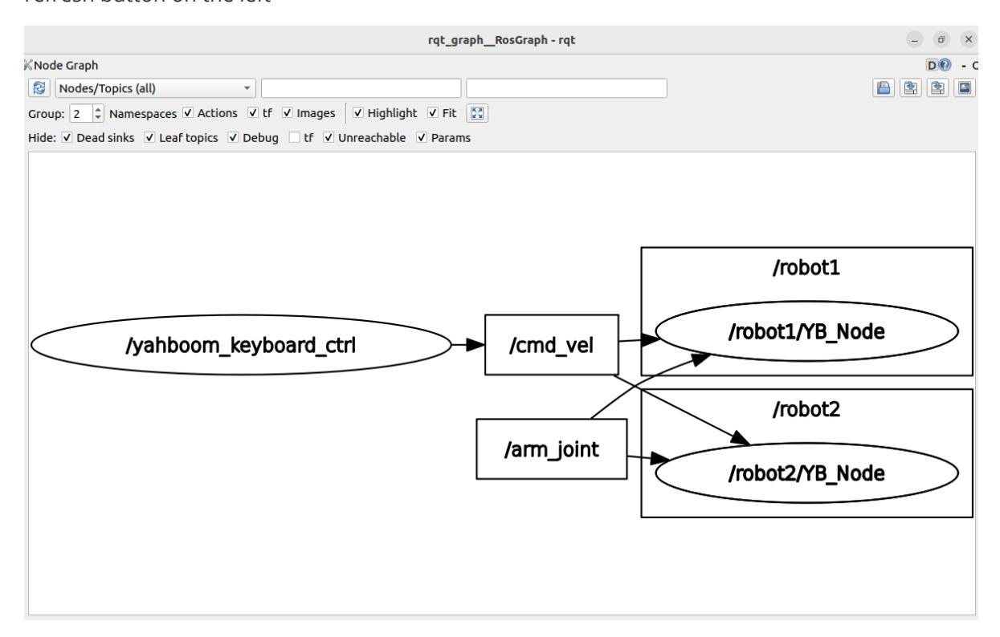

# Multi-Vehicle Chassis Control

## 1. Content Description

This lesson shows how to use one keyboard-control node to command multiple ROSMASTER robots at the same time.

### 1.1 Functional Requirements

This example uses two robots. Both robots must meet these requirements:

- The two robots must be on the same LAN and connected to the same Wi-Fi network.
- The two robots must use the same `ROS_DOMAIN_ID`. The default value is `30`. Change the value in the terminal that runs the ROS environment:
  - Raspberry Pi and Jetson Nano mainboards: enter the Docker container, edit `ROS_DOMAIN_ID` in `/root/.bashrc`, save the file, then run `source ~/.bashrc` to refresh the environment. The terminal prints the updated `[MY_DOMAIN_ID]`.
  - Orin mainboard: open a terminal directly, edit `ROS_DOMAIN_ID` in `~/.bashrc`, save the file, then run `source ~/.bashrc` to refresh the environment. The terminal prints the updated `[MY_DOMAIN_ID]`.
- The two robots must use different namespaces. This lesson uses `robot1` and `robot2`.

Namespace configuration is the same on all supported mainboards. Open `Rosmaster_Lib.py` in the `/home` directory and modify `bot.set_ros_namespace` as shown in the source example. Set the first robot namespace to `robot1`. The value in `bot.set_ros_domain_id` must match the `ROS_DOMAIN_ID` configured above.

Save the file and exit. Press `Ctrl+C` to stop the agent, then use a screwdriver or toothpick to press the `RESET` button on the STM32 control board. Within 5 seconds, run the setup program:

```bash
python3 Rosmaster_Lib.py
```

After the setup finishes, press the `RESET` button on the STM32 control board again. Reconnect the agent:

```bash
sh start_agent.sh
```

Repeat the same steps on the second robot, but set its namespace to `robot2`.

## 2. Program Startup

After both robots have namespaces configured and the agent reconnects successfully, verify the namespace settings from a virtual-machine terminal. The virtual machine must be on the same LAN as both robots, and its `ROS_DOMAIN_ID` must match the robots. To change it, edit `~/.bashrc` and run `source ~/.bashrc`.

```bash
ros2 node list
```

If `/robot1/YB_Node` and `/robot2/YB_Node` appear in the node list, the namespace setup is correct.

Start keyboard control from the virtual-machine terminal:

```bash
ros2 run yahboomcar_ctrl yahboom_keyboard
```

After the program starts, click the keyboard-control terminal so it has focus. Use the keys below to control both robots.

| Key | Function |
| --- | --- |
| `i` or `I` | Move forward |
| `<` | Move backward |
| `j` or `J` | Turn left |
| `l` or `L` | Turn right |
| `u` or `U` | Move forward and turn left |
| `o` or `O` | Move forward and turn right |
| `m` or `M` | Move backward and turn left |
| `>` | Move backward and turn right |

## 3. Node Communication

Run the following command in the virtual-machine terminal to view the node communication graph:

```bash
ros2 run rqt_graph rqt_graph
```

In the upper-left corner, select `Nodes/Topics (all)`, then click the refresh button on the left.



The keyboard-control node `/yahboom_keyboard_ctrl` publishes the `/cmd_vel` velocity topic. The low-level nodes `/robot1/YB_Node` and `/robot2/YB_Node` subscribe to `/cmd_vel`, process the received motion commands, and send them to the driver board to move the robots.
