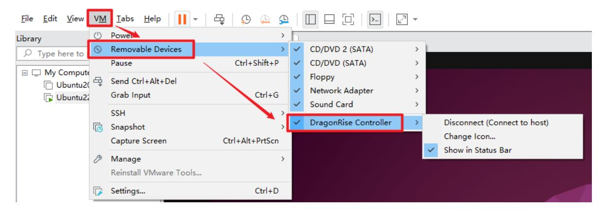
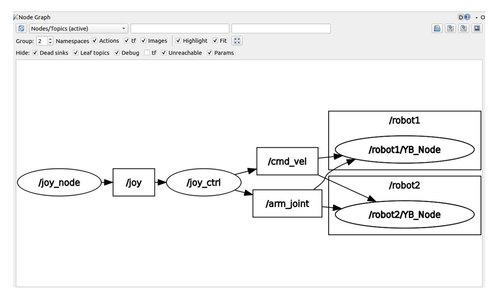

# Multi-vehicle robotic arm control

## 1. Content Description

This function enables the use of handles to control the robotic arms of multiple robots.

#### 1.1 Functional Requirements

For more information, please refer to this product course **[11. Multi-vehicle Function] - [1. Multi-vehicle Chassis Control] - [1.1. Functional Requirements]**

#### 1.2. Connect the controller to the virtual machine

After the virtual machine starts, plug the handle receiver into the USB port of the computer, and then select Connect handle receiver in the virtual machine, as shown below.



Click [Connect] to complete the connection.

## 2. Program startup

After completing the namespace settings for the two robots and successfully reconnecting to the proxy, open two terminals in the corresponding virtual machines and enter the following commands respectively to start the handle to control the robotic arm.

```
#Terminal 1
ros2 run joy joy_node
#Terminal 2
ros2 run yahboomcar_ctrl yahboom_joy_M3Pro
```

After the program starts, press the [START] button to wake up the controller, then press the [R2] button to unlock the controller. The terminal will display "joy control now". Then control the robotic arm according to the following table. **Note** that **when controlling the servo, use the quick press and release technique, which is equivalent to clicking and releasing the button**

.

| button          | property                                  |  |  |
|-----------------|-------------------------------------------|--|--|
| X/B             | Servo No. 1 turns left/right              |  |  |
| Y/A             | Servo No. 2 down/down                     |  |  |
| Left/Right      | Servo No. 3 up/down                       |  |  |
| Up key/Down key | Servo No. 4 up/down                       |  |  |
| SELECT          | Select to control Servo No. 5/Servo No. 6 |  |  |
| L1              | Servo No. 5 turns left/Servo No. 6 closes |  |  |
| L2              | Servo No. 5 turns right/Servo No. 6 opens |  |  |

In addition to the controllable robotic arm, the chassis can also be controlled.

The left joystick controls forward/backward/left/right movement, and the right joystick controls left turn/right turn on the spot.

## 3. Node Communication

Enter the following command in the virtual machine terminal to view the node communication diagram.

```
ros2 run rqt_graph rqt_graph
```

As shown in the figure below, select [Nodes/Topics (all)] in the upper left corner, and then click the refresh button on the left.



The joystick node /joy_ctrl publishes the /cmd_vel and /arm_joint topics to control the chassis and robotic arm. The two robots' underlying nodes /robot1/YB_Node and /robot2/YB_Node subscribe to these topics, receive messages from these topics, process them, and pass them to the driver board, which then controls the robot's movement and the robotic arm.
