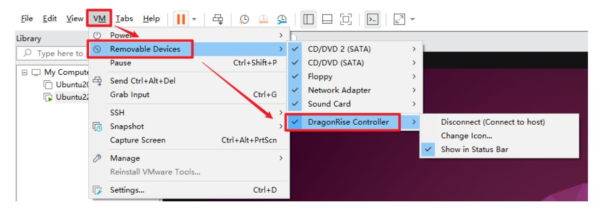
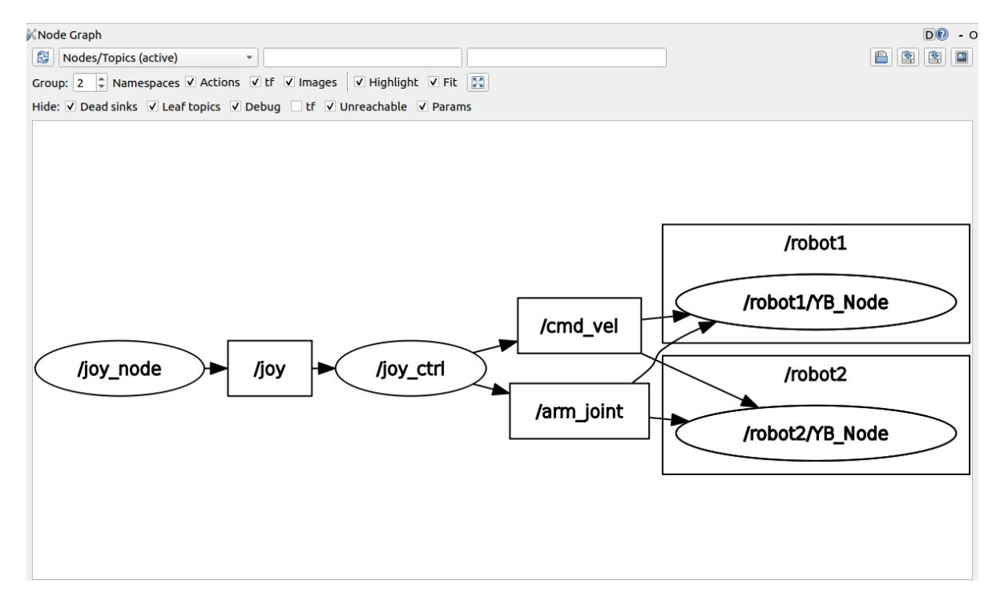

# Multi-Vehicle Robotic Arm Control

## 1. Content Description

This lesson shows how to use a gamepad to control the robotic arms of multiple ROSMASTER robots.

### 1.1 Functional Requirements

Complete the shared multi-vehicle setup first. See [11.1 Multi-Vehicle Chassis Control](../1.Multi-vehicle%20chassis%20control/README.md#11-functional-requirements).

### 1.2 Connect the Controller to the Virtual Machine

After the virtual machine starts, plug the gamepad receiver into the host computer's USB port. In the virtual machine USB menu, select the controller receiver and connect it to the VM.



Click `Connect` to finish attaching the receiver to the virtual machine.

## 2. Program Startup

After both robots have namespaces configured and the agent reconnects successfully, open two terminals in the virtual machine. Start the joystick node in one terminal and the ROSMASTER controller node in the other:

```bash
# Terminal 1
ros2 run joy joy_node

# Terminal 2
ros2 run yahboomcar_ctrl yahboom_joy_M3Pro
```

After the program starts, press `START` to wake the controller, then press `R2` to unlock it. The terminal displays `joy control now`. Use the controls below to move the robotic arm. When controlling a servo, quickly press and release the button, like a click.

| Button | Function |
| --- | --- |
| `X` / `B` | Servo No. 1 turns left/right |
| `Y` / `A` | Servo No. 2 moves up/down |
| Left / Right | Servo No. 3 moves up/down |
| Up / Down | Servo No. 4 moves up/down |
| `SELECT` | Switch control between Servo No. 5 and Servo No. 6 |
| `L1` | Servo No. 5 turns left / Servo No. 6 closes |
| `L2` | Servo No. 5 turns right / Servo No. 6 opens |

The controller can also drive the chassis. The left joystick controls forward, backward, left, and right movement. The right joystick turns the robot left or right in place.

## 3. Node Communication

Run the following command in the virtual-machine terminal to view the node communication graph:

```bash
ros2 run rqt_graph rqt_graph
```

In the upper-left corner, select `Nodes/Topics (all)`, then click the refresh button on the left.



The joystick node `/joy_ctrl` publishes the `/cmd_vel` and `/arm_joint` topics for chassis and robotic-arm control. The low-level nodes `/robot1/YB_Node` and `/robot2/YB_Node` subscribe to these topics, process the received messages, and pass the commands to the driver board to move the robots and robotic arms.
