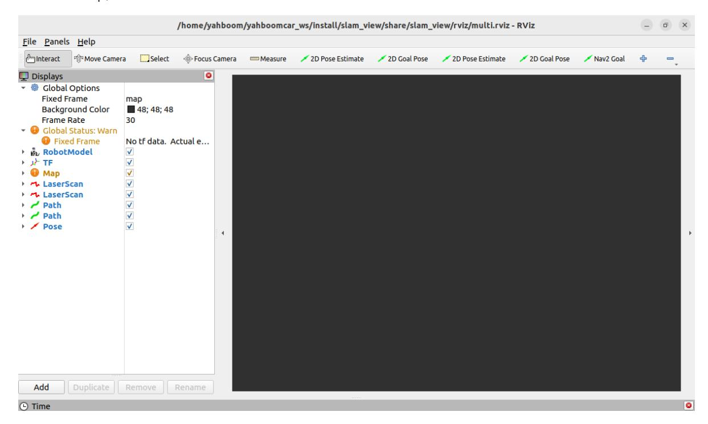
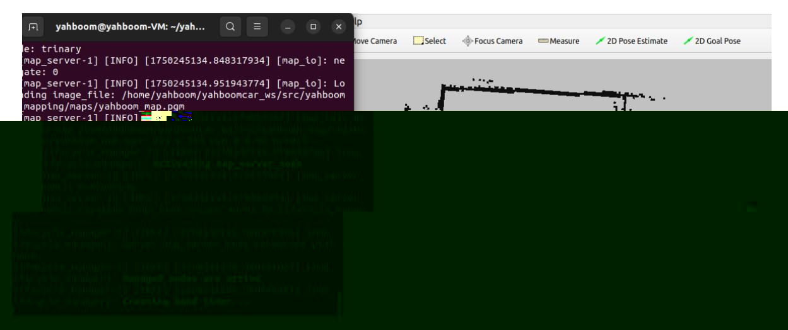
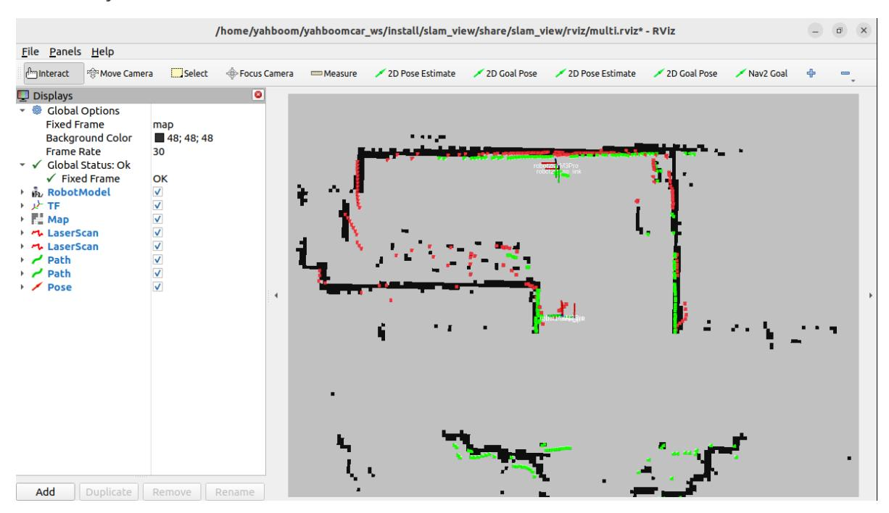
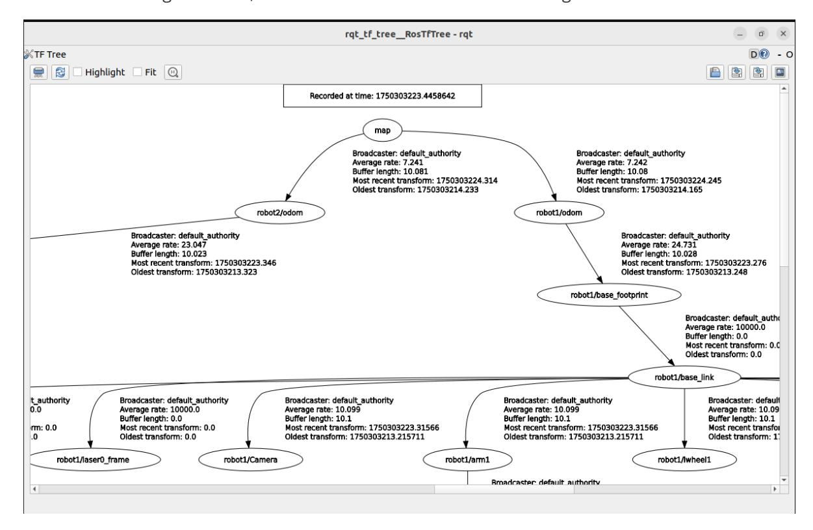

# Multi-Vehicle Navigation

## 1. Content Description

This lesson shows how to assign different navigation goals to two robots in RViz. Each robot plans a path from its current map position to its assigned target and avoids obstacles in real time while navigating.

### 1.1 Functional Requirements

Complete the shared multi-vehicle setup first. See [11.1 Multi-Vehicle Chassis Control](../1.Multi-vehicle%20chassis%20control/README.md#11-functional-requirements).

### 1.2 Navigation Map

Before starting multi-vehicle navigation, place the map files in the virtual machine at:

```text
/home/yahboom/yahboomcar_ws/src/yahboom_mapping/maps
```

The map consists of a `.yaml` parameter file and a `.pgm` image file.

## 2. Program Startup

The virtual machine must be on the same LAN as both robots, and its `ROS_DOMAIN_ID` must match the robots. To change it, edit `~/.bashrc` and run `source ~/.bashrc`.

The terminal location depends on the mainboard type. This lesson uses Raspberry Pi 5 as the example. On Raspberry Pi and Jetson Nano mainboards, open a terminal and enter the Docker container before running the commands in this section. For Docker access, see the Configuration and Operation Guide lesson on entering Docker for Jetson Nano and Raspberry Pi 5. On Orin mainboards, open a terminal directly and run the commands there.

### 2.1 Start Chassis Data Fusion

On robot1, start chassis data fusion:

```bash
ros2 launch yahboom_multi yahboom_bringup_multi.xml robot_name:=robot1
```

On robot2, start chassis data fusion:

```bash
ros2 launch yahboom_multi yahboom_bringup_multi.xml robot_name:=robot2
```

This launch starts the robot chassis data pipeline, including dual-LiDAR fusion, IMU filtering, odometry filtering, and EKF fusion.

### 2.2 Start RViz and Publish Map Data

In the virtual machine, start RViz:

```bash
ros2 launch slam_view multi_nav_rviz.launch.py
```

After startup, RViz appears as shown below.



Start the map-loading program. By default, the map is `yahboom_map.yaml` in `/home/yahboom/yahboomcar_ws/src/yahboom_mapping/maps`.

```bash
ros2 launch yahboom_mapping map.launch.py
```

After the command runs successfully, the map loads in RViz.



### 2.3 Start AMCL Localization

On robot1, start AMCL localization:

```bash
ros2 launch yahboom_multi robot1_amcl.launch.py
```

On robot2, start AMCL localization:

```bash
ros2 launch yahboom_multi robot2_amcl.launch.py
```

If the terminal prints `AMCL cannot publish a pose or update the transform. Please set the initial pose...`, the AMCL localization program is running and waiting for an initial pose.

In RViz, use the `2D Pose Estimate` tools to set the initial poses based on the robots' actual positions on the map. RViz provides two `2D Pose Estimate` tools: the first sets the initial pose for robot1, and the second sets the initial pose for robot2.

In the figure below, the LiDAR scan areas overlap the black area on the map. The green point cloud is scanned by robot1, and the red point cloud is scanned by robot2.



### 2.4 Start Nav2 Navigation

On robot1, start Nav2 navigation:

```bash
ros2 launch yahboom_multi robot1_nav.launch.py
```

On robot2, start Nav2 navigation:

```bash
ros2 launch yahboom_multi robot2_nav.launch.py
```

When both terminals show `Creating bond timer...`, Nav2 has started successfully.

In RViz, use the `2D Goal Pose` tools to assign navigation goals. RViz provides two `2D Goal Pose` tools: the first assigns a target point to robot1, and the second assigns a target point to robot2. After a target point is assigned, the corresponding robot plans a path and navigates to it.

## 3. TF Tree

Run the following command in the virtual-machine terminal to view the TF tree:

```bash
ros2 run rqt_tf_tree rqt_tf_tree
```

The figure below shows the TF tree for multi-vehicle navigation.



## 4. Expansion

This tutorial uses two robots. To add another robot, such as `robot3`, modify the files below. The target directory depends on the mainboard type:

- Raspberry Pi 5 and Jetson boards: use the `/root` directory inside the running Docker container.
- Orin mainboard: use the `/home/jetson` directory.

### 4.1 Add the Robot URDF Model File

In `/M3Pro_ws/src/M3Pro/urdf`, add a URDF model file for `robot3` and name it `M3Pro_robot3.urdf`. You can copy `M3Pro_robot1.urdf` and replace every `robot1` reference with `robot3`.

### 4.2 Add the Robot URDF Launch File

In `M3Pro_ws/src/M3Pro/launch/`, add the `robot3` URDF launch file and name it `display_robot3.launch.py`. You can copy `display_robot1.launch.py` and replace every `robot1` reference with `robot3`.

Save the file, return to the `M3Pro_ws` directory, and compile the package:

```bash
colcon build --packages-select M3Pro
```

After compilation succeeds, refresh the environment:

```bash
source ~/.bashrc
```

### 4.3 Add the Robot AMCL Parameter File

In `M3Pro_ws/src/yahboom_multi/param/`, add the AMCL parameter file for `robot3` and name it `robot3_amcl_param.yaml`. You can copy `robot1_amcl_param.yaml` and replace every `robot1` reference with `robot3`.

### 4.4 Add the Robot AMCL Launch File

In `M3Pro_ws/src/yahboom_multi/launch/`, add the AMCL launch file for `robot3` and name it `robot3_amcl.launch.py`. You can copy `robot1_amcl.launch.py` and replace every `robot1` reference with `robot3`.

### 4.5 Add the Robot Nav2 Parameter File

In `M3Pro_ws/src/yahboom_multi/param/`, add the Nav2 parameter file for `robot3` and name it `robot3_nav_param.yaml`. You can copy `robot1_nav_param.yaml` and replace every `robot1` reference with `robot3`.

### 4.6 Add the Robot Nav2 Launch File

In `M3Pro_ws/src/yahboom_multi/launch/`, add the Nav2 launch file for `robot3` and name it `robot3_nav.launch.py`. You can copy `robot1_nav.launch.py` and replace every `robot1` reference with `robot3`.

Save the file, return to the `M3Pro_ws` directory, and compile the package:

```bash
colcon build --packages-select yahboom_multi
```

After compilation succeeds, refresh the environment:

```bash
source ~/.bashrc
```
