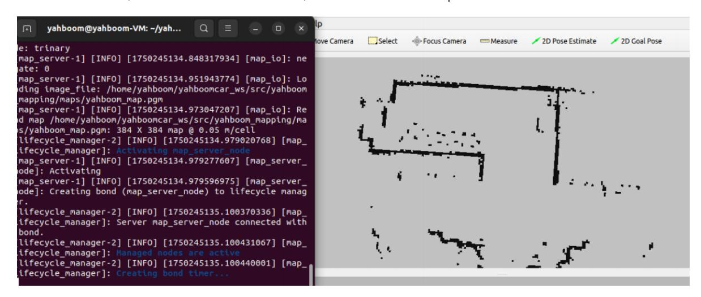

# Multi-vehicle Platoon

## 1. Description

This function arranges three robots in a program-defined position. When the lead vehicle moves, the other two vehicles follow suit, maintaining the formation at the destination. The program offers three possible formations:

- Vertical Column: The lead vehicle is at the front, with the other two vehicles behind it, forming a formation similar to the Arabic numeral 1;
- Horizontal Row: The lead vehicle is in the center, with the other two vehicles to its left and right, forming a formation similar to the Chinese character "一";
- Left and Right Guard: The lead vehicle is in the center, with the other two vehicles to its left and right, forming a formation similar to a "tank" formation.

For ease of explanation, this tutorial uses robot1 to represent the lead vehicle, and robot2 and robot3 to represent the other two vehicles.

#### 1.1. Functional Requirements

This feature requires three vehicles, and all three must have their namespaces and ROS_DOMAIN_IDs configured. For setup instructions, refer to [1.1. Functional Requirements] in [1. Multi-Vehicle Chassis Control] in the [11. Multi-Vehicle Functionality] section of this product's course.

#### 1.2. Site Requirements

To run this feature, choose a spacious site. Although the vehicles have obstacle avoidance, a narrow site can result in poor navigation performance or even navigation planning failure.

#### 1.3. Navigation Map

Before enabling multi-vehicle platooning, you need to place the map file in the /home/yahboom/yahboomcar_ws/src/yahboom_mapping/maps directory in the virtual machine. The map file includes a.yaml parameter file and a.pgm image file.

## 2. Implementation Principle

This feature relies on nav2 navigation when enabled. When robot1 is given a target point, it publishes two TF transforms: one from robot1 to point2 and one from robot1 to point3. Point2 and point3 are the target points that robot2 and robot3 need to reach. As robot1 moves, it publishes these two TF transforms. Robot2 and robot3 simply need to obtain the locations of point2 and point3 on the map and then navigate to them, respectively.

## 3. Program Startup

Because of multi-vehicle navigation, the virtual machine must be on the same local area network as the three cars, and its ROS_DOMAIN_ID must be set to the same value. For setup instructions, refer to the beginning of [3. Multi-vehicle Navigation] - [2. Program Startup] in [11. Multi-vehicle Functionality] and will not be repeated here.

This section requires entering commands in the terminal. The terminal you open depends on your motherboard type. This lesson uses the Raspberry Pi 5 as an example. For Raspberry Pi and Jetson Nano boards, you need to open a terminal on the host computer and enter the command to enter the Docker container. Once inside the Docker container, enter the commands mentioned in this section in the terminal. For instructions on entering the Docker container from the host computer, refer to this product tutorial **[Configuration and Operation Guide]--[Enter the Docker (Jetson Nano and Raspberry Pi 5 users, see here)]**.

For Orin boards, simply open a terminal and enter the commands mentioned in this lesson.

#### 3.1. Start chassis data fusion

Enter the following commands in robot1, robot2, and robot3 respectively to start the robot and chassis data fusion.

```
#robot1
ros2 launch yahboom_multi yahboom_bringup_multi.xml robot_name:=robot1
#robot2
ros2 launch yahboom_multi yahboom_bringup_multi.xml robot_name:=robot2
#robot3
ros2 launch yahboom_multi yahboom_bringup_multi.xml robot_name:=robot3
```

#### 3.2. Start RViz display and publish map data

In the virtual machine, open two terminals and enter the following commands:

```
#Open rviz
ros2 launch slam_view formation_rviz.launch.py
#Publish map data
ros2 launch yahboom_mapping map.launch.py
```

As shown below, after a successful launch, RViz will load the map.



#### 3.3. Starting AMCL Positioning

Enter the following commands in robot1, robot2, and robot3 to start AMCL positioning.

```
#robot1
ros2 launch yahboom_multi robot1_amcl.launch.py
#robot2
ros2 launch yahboom_multi robot2_amcl.launch.py
#robot3
ros2 launch yahboom_multi robot3_amcl.launch.py
```

As shown below, the error "**AMCL cannot publish a pose or update the transform. Please set the Initial**

**pose...**" indicates that the program runs the amcl positioning program.

Next, in rviz2, use the [2D Pose Estimate] tool to give the robot an initial pose. There are three [2D Pose Estimate] tools in rviz2: from left to right, they give the initial pose of robot 1, robot 2, and robot 3. These initial poses are determined based on their actual positions on the map.

As shown in the figure below, the areas scanned by the two radars overlap with the black area on the map. The green area represents the point cloud scanned by Robot 1's radar, the red area represents the point cloud scanned by Robot 2's radar, and the blue area represents the point cloud scanned by Robot 3's radar.

#### 3.4. Starting NAV Navigation

Enter the following commands in Robot 1, Robot 2, and Robot 3 to start AMCL positioning.

```
#robot1
ros2 launch yahboom_multi robot1_nav.launch.py
#robot2
ros2 launch yahboom_multi robot2_nav.launch.py
#robot3
ros2 launch yahboom_multi robot3_nav.launch.py
```

As shown in the figure below, the "Creating bond" message appears in all three terminals that start NAV2 navigation. "timer..." indicates a successful startup.

#### 3.5. Starting the Formation Program

In the VM, enter the following command in the terminal to start publishing the TF program:

```
ros2 run yahboom_multi_tf pub_follower_goal
```

After the program runs, in RViz, use the first [2D Goal Pose] tool to assign a target pose to robot1 and have it navigate to that point. In RViz, you'll see that robot1/base_link points to point2 and point3 based on the queue name (the default is convoy, meaning left and right guards). As shown below,

Then, enter the following commands in the VM terminal to start the target point subscription and navigation program for Robot 2 and Robot 3:

```
ros2 run yahboom_multi_tf get_follower_point
```

After running the program, Robot 2 and Robot 3 will navigate to point 2 and point 3, respectively. Once Robot 2 and Robot 3 reach the target point, they will form a left and right guard formation with Robot 1. In RViz, use the first [2D Goal Pose] tool to assign a target point to Robot 1. As Robot 1 navigates, Robot 2 and Robot 3 will follow.

## 4. Core Code Analysis

#### 4.1. pub_follower_goal.py

In the VM, code path:

/home/yahboom/yahboomcar_ws/src/yahboom_multi_tf/yahboom_multi_tf/pub_follower_goal.py

Initialization function,

```
def __init__(self):
    super().__init__('navigation_client')
    #Subscribe to the topic /robot1/goal_pose, which will publish information
after robot1 is given a target point using the [2D Goal Pose] tool
    self.get_goal_pose =
self.create_subscription(PoseStamped,"/robot1/goal_pose",self.get_GoalPoseCallBa
ck,1)
    #Initialize two static TF transformation releases
    self.robot1_to_point2_broadcaster = StaticTransformBroadcaster(self)
    self.robot1_to_point3_broadcaster = StaticTransformBroadcaster(self)
```

Topic callback function,

```
def get_GoalPoseCallBack(self,msg):
    #Create TransformStamped data type data to store the contents of two static
transformations
    robot2_transform = TransformStamped()
    robot3_transform = TransformStamped()
    #Here, assign values to the relevant data of the TF transformation. Here,
frame_id is robot1/base_link and child_frame_id is point2. This indicates the TF
transformation from robot1/base_link to point2 when publishing the
transformation.
    robot2_transform.header.stamp = self.get_clock().now().to_msg()
    robot2_transform.header.frame_id = "robot1/base_link"
    robot2_transform.child_frame_id = "point2"
    robot3_transform.header.stamp = self.get_clock().now().to_msg()
    robot3_transform.header.frame_id = "robot1/base_link"
    robot3_transform.child_frame_id = "point3"
    #Judge the shape of the queue. Column represents a vertical column, similar
to the Arabic numeral 1. Therefore, point2 is behind robot1/base_link, and the
distance is -self.dist in the x direction. Here, the default self.dist is 0.3,
which means that point2 is 0.3 meters behind robot1/base_link; and point3 is 0.6
meters behind robot1/base_link, -2*self.dist in the x direction.
    if self.queue == "column":
        robot2_transform.transform.translation.x = -self.dist
        robot2_transform.transform.translation.y = 0.0
```

```
robot3_transform.transform.translation.x = -self.dist*2
        robot3_transform.transform.translation.y = 0.0
    #Judge the shape of the queue. row means horizontal row, similar to the
Chinese character "一", so point2 is to the left of robot1/base_link, and the
distance is -self.dist in the y direction. Here, the default self.dist is 0.3,
which means that point2 is 0.3 meters to the left of robot1/base_link; and point3
is 0.3 meters to the right of robot1/base_link, self.dist in the y direction.
    elif self.queue == "row":
        robot2_transform.transform.translation.x = 0.0
        robot2_transform.transform.translation.y = -self.dist
        robot3_transform.transform.translation.x = 0.0
        robot3_transform.transform.translation.y = self.dist
    #Judge the shape of the queue. Convoy means left and right guards, similar to
tanks. So point2 is to the left and rear of robot1/base_link. The distance is -
self.dist in the x direction and -self.dist in the y direction. Here, the default
self.dist is 0.3, which means point2 is 0.3 meters behind the left of
robot1/base_link. Point3 is 0.3 meters behind the right of robot1/base_link. The
distance is -self.dist in the x direction and self.dist in the y direction.
    elif self.queue == "convoy":
        robot2_transform.transform.translation.x = -self.dist
        robot2_transform.transform.translation.y = -self.dist
        robot3_transform.transform.translation.x = -self.dist
        robot3_transform.transform.translation.y = self.dist
    #Here w is 1.0, which means no rotation transformation, only translation
transformation.
    robot2_transform.transform.rotation.w = 1.0
    robot3_transform.transform.rotation.w = 1.0
    #Publish two static TF transformations
    self.robot1_to_point2_broadcaster.sendTransform(robot2_transform)
    self.robot1_to_point3_broadcaster.sendTransform(robot3_transform)
    print("send TF.")
```

#### 4.2. get_follower_point.py

In the VM, code path:

/home/yahboom/yahboomcar_ws/src/yahboom_multi_tf/yahboom_multi_tf/get_follower_poin t.py

Initialization function,

```
def __init__(self):
    super().__init__('tf_listener_node')
    # Create a TF 2 cache and listener
    self.tf_buffer_p2 = tf2_ros.Buffer()
    self.tf_listener_p2 = tf2_ros.TransformListener(self.tf_buffer_p2, self)
    # Create a TF 2 cache and listener
    self.tf_buffer_p3 = tf2_ros.Buffer()
    self.tf_listener_p3 = tf2_ros.TransformListener(self.tf_buffer_p3, self)
    #Define two publishers to publish the target poses of robot2 and robot3
    self.pub_robot2_pose = self.create_publisher(PoseStamped,
"/robot2/goal_pose", 10)
```

```
self.pub_robot3_pose = self.create_publisher(PoseStamped,
"/robot3/goal_pose", 10)
    self.p2_goal_pose = PoseStamped()
    self.p2_goal_pose.header.frame_id = "map"
    self.p3_goal_pose = PoseStamped()
    self.p3_goal_pose.header.frame_id = "map"
    # Create a timer (10Hz) and get a transformation each time
    self.timer = self.create_timer(0.1, self.timer_callback)
    self.get_point2()
    self.get_point3()
```

Timer callback function,

```
def timer_callback(self):
    #Get the transformation between map and point2. The purpose of this step is
to get the position of point2 on the map and then publish the target position of
robot2
    self.get_point2()
    #Get the transformation between map and point3. The purpose of this step is
to get the position of point3 on the map and then publish the target position of
robot3
    self.get_point3()
```

Get the pose of point2 and publish the target pose of robot2,

```
def get_point2(self):
    try:
        #Monitor the TF transformation of map and point2
        transform_p2 = self.tf_buffer_p2.lookup_transform('map', 'point2',
rclpy.time.Time())
        print("transform: ",transform_p2.transform.translation)
        print("----------------------")
        #Assign target data to robot2
        self.p2_goal_pose.pose.position.x = transform_p2.transform.translation.x
        self.p2_goal_pose.pose.position.y = transform_p2.transform.translation.y
        self.p2_goal_pose.pose.orientation.z = transform_p2.transform.rotation.z
        self.p2_goal_pose.pose.orientation.w = transform_p2.transform.rotation.w
        #Publish robot2 target point
        self.pub_robot2_pose.publish(self.p2_goal_pose)
    except (tf2_ros.TransformException, KeyError) as e:
        self.get_logger().warn(f"Could not transform: {e}")
```

### 5. View the TF tree

Enter the following command in the VM terminal to view the TF tree:

```
ros2 run rqt_tf_tree rqt_tf_tree
```
