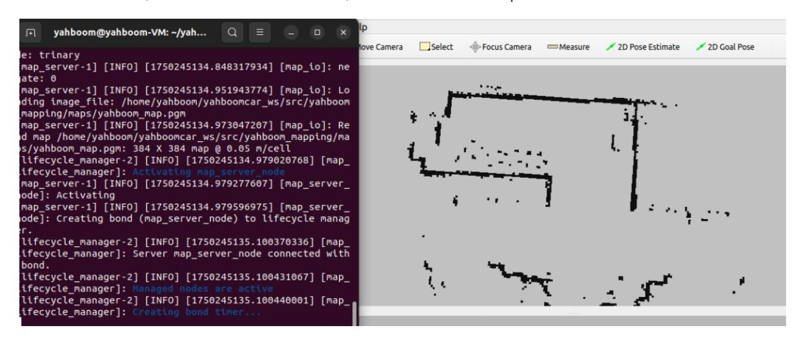

# Multi-Vehicle Formation

## 1. Description

This lesson arranges three robots into a program-defined formation. When the lead robot moves, the other two robots follow and maintain the selected formation at the destination. The program supports three formations:

- Vertical column: the lead robot is in front, and the other two robots follow behind it in a line similar to the number `1`.
- Horizontal row: the lead robot is in the center, and the other two robots are positioned to its left and right.
- Left and right guard: the lead robot is in the center, and the other two robots follow behind it on the left and right, similar to a convoy formation.

This lesson uses `robot1` as the lead robot. `robot2` and `robot3` are the follower robots.

### 1.1 Functional Requirements

This feature requires three robots. All three robots must have namespaces and matching `ROS_DOMAIN_ID` values configured. For setup instructions, see [11.1 Multi-Vehicle Chassis Control](../1.Multi-vehicle%20chassis%20control/README.md#11-functional-requirements).

### 1.2 Site Requirements

Choose a spacious test site. Although the robots have obstacle avoidance, a narrow site can cause poor navigation behavior or navigation planning failure.

### 1.3 Navigation Map

Before starting multi-vehicle formation, place the map files in the virtual machine at:

```text
/home/yahboom/yahboomcar_ws/src/yahboom_mapping/maps
```

The map consists of a `.yaml` parameter file and a `.pgm` image file.

## 2. Implementation Principle

This feature uses Nav2 navigation. When robot1 receives a target point, it publishes two TF transforms: `robot1` to `point2`, and `robot1` to `point3`. `point2` and `point3` are the target points for robot2 and robot3. As robot1 moves, it continues publishing these transforms. Robot2 and robot3 read the positions of `point2` and `point3` on the map, then navigate to those points.

## 3. Program Startup

Because this feature uses multi-vehicle navigation, the virtual machine must be on the same LAN as the three robots, and its `ROS_DOMAIN_ID` must match the robots. For setup instructions, see [11.3 Multi-Vehicle Navigation](../3.Multi-vehicle%20navigation/README.md#2-program-startup).

The terminal location depends on the mainboard type. This lesson uses Raspberry Pi 5 as the example. On Raspberry Pi and Jetson Nano mainboards, open a terminal on the host computer and enter the Docker container before running the commands in this section. For Docker access, see the Configuration and Operation Guide lesson on entering Docker for Jetson Nano and Raspberry Pi 5. On Orin mainboards, open a terminal directly and run the commands there.

### 3.1 Start Chassis Data Fusion

Run the following commands on robot1, robot2, and robot3 to start the robot and chassis data-fusion pipeline:

```bash
# robot1
ros2 launch yahboom_multi yahboom_bringup_multi.xml robot_name:=robot1

# robot2
ros2 launch yahboom_multi yahboom_bringup_multi.xml robot_name:=robot2

# robot3
ros2 launch yahboom_multi yahboom_bringup_multi.xml robot_name:=robot3
```

### 3.2 Start RViz Display and Publish Map Data

In the virtual machine, open two terminals and run the following commands:

```bash
# Open RViz
ros2 launch slam_view formation_rviz.launch.py

# Publish map data
ros2 launch yahboom_mapping map.launch.py
```

After a successful launch, RViz loads the map.



### 3.3 Start AMCL Localization

Run the following commands on robot1, robot2, and robot3 to start AMCL localization:

```bash
# robot1
ros2 launch yahboom_multi robot1_amcl.launch.py

# robot2
ros2 launch yahboom_multi robot2_amcl.launch.py

# robot3
ros2 launch yahboom_multi robot3_amcl.launch.py
```

If the terminal prints `AMCL cannot publish a pose or update the transform. Please set the Initial pose...`, the AMCL localization program is running and waiting for an initial pose.

In RViz, use the `2D Pose Estimate` tools to set each robot's initial pose from its actual position on the map. RViz provides three `2D Pose Estimate` tools; from left to right, they set the initial poses for robot1, robot2, and robot3.

In the figure below, the LiDAR scan areas overlap the black area on the map. The green point cloud is scanned by robot1, the red point cloud is scanned by robot2, and the blue point cloud is scanned by robot3.

### 3.4 Start Nav2 Navigation

Run the following commands on robot1, robot2, and robot3 to start Nav2 navigation:

```bash
# robot1
ros2 launch yahboom_multi robot1_nav.launch.py

# robot2
ros2 launch yahboom_multi robot2_nav.launch.py

# robot3
ros2 launch yahboom_multi robot3_nav.launch.py
```

When the `Creating bond timer...` message appears in all three Nav2 terminals, navigation has started successfully.

### 3.5 Start the Formation Program

In the virtual machine, start the TF publishing program:

```bash
ros2 run yahboom_multi_tf pub_follower_goal
```

After the program starts, use the first `2D Goal Pose` tool in RViz to assign a target pose to robot1. Robot1 navigates to that point. In RViz, `robot1/base_link` points to `point2` and `point3` according to the queue name. The default queue is `convoy`, which creates the left and right guard formation.

In the virtual-machine terminal, start the follower target subscription and navigation program for robot2 and robot3:

```bash
ros2 run yahboom_multi_tf get_follower_point
```

After the program starts, robot2 and robot3 navigate to `point2` and `point3`. When they reach those target points, they form a left and right guard formation with robot1. Use the first `2D Goal Pose` tool in RViz to assign a new target point to robot1. As robot1 navigates, robot2 and robot3 follow.

## 4. Core Code Analysis

### 4.1 `pub_follower_goal.py`

In the virtual machine, the code path is:

```text
/home/yahboom/yahboomcar_ws/src/yahboom_multi_tf/yahboom_multi_tf/pub_follower_goal.py
```

Initialization function:

```python
def __init__(self):
    super().__init__('navigation_client')
    # Subscribe to /robot1/goal_pose. RViz publishes this topic after robot1
    # receives a target point from the 2D Goal Pose tool.
    self.get_goal_pose = self.create_subscription(
        PoseStamped, "/robot1/goal_pose", self.get_GoalPoseCallBack, 1
    )
    # Initialize two static TF broadcasters.
    self.robot1_to_point2_broadcaster = StaticTransformBroadcaster(self)
    self.robot1_to_point3_broadcaster = StaticTransformBroadcaster(self)
```

Topic callback function:

```python
def get_GoalPoseCallBack(self, msg):
    # Create TransformStamped data for the two static transforms.
    robot2_transform = TransformStamped()
    robot3_transform = TransformStamped()

    # Publish transforms from robot1/base_link to point2 and point3.
    robot2_transform.header.stamp = self.get_clock().now().to_msg()
    robot2_transform.header.frame_id = "robot1/base_link"
    robot2_transform.child_frame_id = "point2"
    robot3_transform.header.stamp = self.get_clock().now().to_msg()
    robot3_transform.header.frame_id = "robot1/base_link"
    robot3_transform.child_frame_id = "point3"

    # column: point2 is 0.3 m behind robot1/base_link by default, and point3
    # is 0.6 m behind robot1/base_link.
    if self.queue == "column":
        robot2_transform.transform.translation.x = -self.dist
        robot2_transform.transform.translation.y = 0.0
        robot3_transform.transform.translation.x = -self.dist * 2
        robot3_transform.transform.translation.y = 0.0

    # row: point2 is 0.3 m to the left of robot1/base_link by default, and
    # point3 is 0.3 m to the right.
    elif self.queue == "row":
        robot2_transform.transform.translation.x = 0.0
        robot2_transform.transform.translation.y = -self.dist
        robot3_transform.transform.translation.x = 0.0
        robot3_transform.transform.translation.y = self.dist

    # convoy: point2 is behind-left of robot1/base_link by default, and point3
    # is behind-right.
    elif self.queue == "convoy":
        robot2_transform.transform.translation.x = -self.dist
        robot2_transform.transform.translation.y = -self.dist
        robot3_transform.transform.translation.x = -self.dist
        robot3_transform.transform.translation.y = self.dist

    # w = 1.0 means the transform has translation only and no rotation.
    robot2_transform.transform.rotation.w = 1.0
    robot3_transform.transform.rotation.w = 1.0

    # Publish the two static TF transforms.
    self.robot1_to_point2_broadcaster.sendTransform(robot2_transform)
    self.robot1_to_point3_broadcaster.sendTransform(robot3_transform)
    print("send TF.")
```

### 4.2 `get_follower_point.py`

In the virtual machine, the code path is:

```text
/home/yahboom/yahboomcar_ws/src/yahboom_multi_tf/yahboom_multi_tf/get_follower_point.py
```

Initialization function:

```python
def __init__(self):
    super().__init__('tf_listener_node')
    # Create TF2 buffers and listeners.
    self.tf_buffer_p2 = tf2_ros.Buffer()
    self.tf_listener_p2 = tf2_ros.TransformListener(self.tf_buffer_p2, self)
    self.tf_buffer_p3 = tf2_ros.Buffer()
    self.tf_listener_p3 = tf2_ros.TransformListener(self.tf_buffer_p3, self)

    # Define publishers for robot2 and robot3 target poses.
    self.pub_robot2_pose = self.create_publisher(PoseStamped, "/robot2/goal_pose", 10)
    self.pub_robot3_pose = self.create_publisher(PoseStamped, "/robot3/goal_pose", 10)

    self.p2_goal_pose = PoseStamped()
    self.p2_goal_pose.header.frame_id = "map"
    self.p3_goal_pose = PoseStamped()
    self.p3_goal_pose.header.frame_id = "map"

    # Create a 10 Hz timer and read the transforms on each tick.
    self.timer = self.create_timer(0.1, self.timer_callback)
    self.get_point2()
    self.get_point3()
```

Timer callback function:

```python
def timer_callback(self):
    # Get the map -> point2 transform and publish robot2's target pose.
    self.get_point2()
    # Get the map -> point3 transform and publish robot3's target pose.
    self.get_point3()
```

Get the pose of `point2` and publish robot2's target pose:

```python
def get_point2(self):
    try:
        # Listen for the transform between map and point2.
        transform_p2 = self.tf_buffer_p2.lookup_transform('map', 'point2', rclpy.time.Time())
        print("transform: ", transform_p2.transform.translation)
        print("----------------------")

        # Assign the target data to robot2.
        self.p2_goal_pose.pose.position.x = transform_p2.transform.translation.x
        self.p2_goal_pose.pose.position.y = transform_p2.transform.translation.y
        self.p2_goal_pose.pose.orientation.z = transform_p2.transform.rotation.z
        self.p2_goal_pose.pose.orientation.w = transform_p2.transform.rotation.w

        # Publish the robot2 target point.
        self.pub_robot2_pose.publish(self.p2_goal_pose)
    except (tf2_ros.TransformException, KeyError) as e:
        self.get_logger().warn(f"Could not transform: {e}")
```

## 5. View the TF Tree

Run the following command in the virtual-machine terminal to view the TF tree:

```bash
ros2 run rqt_tf_tree rqt_tf_tree
```
