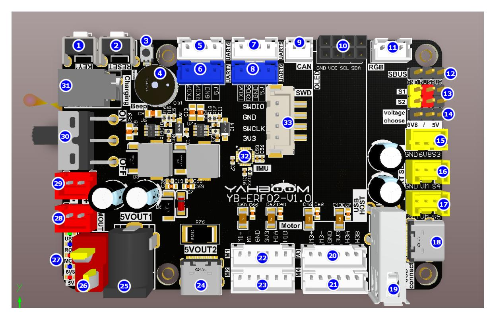
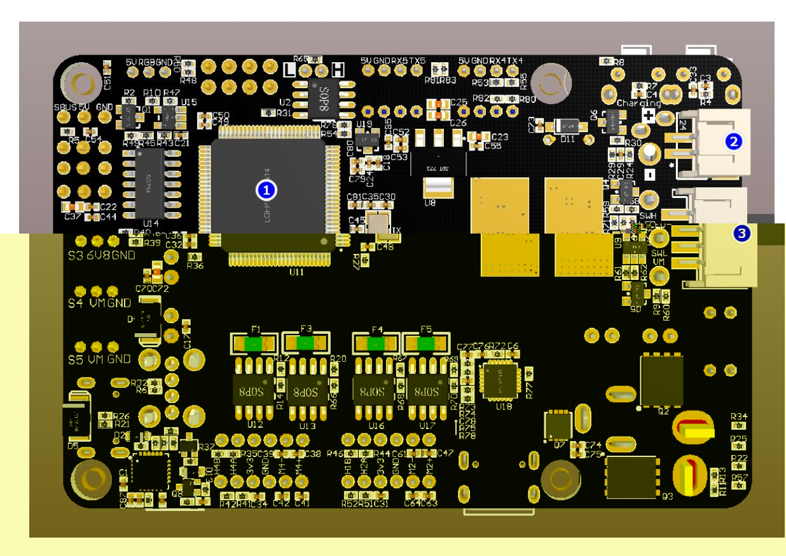
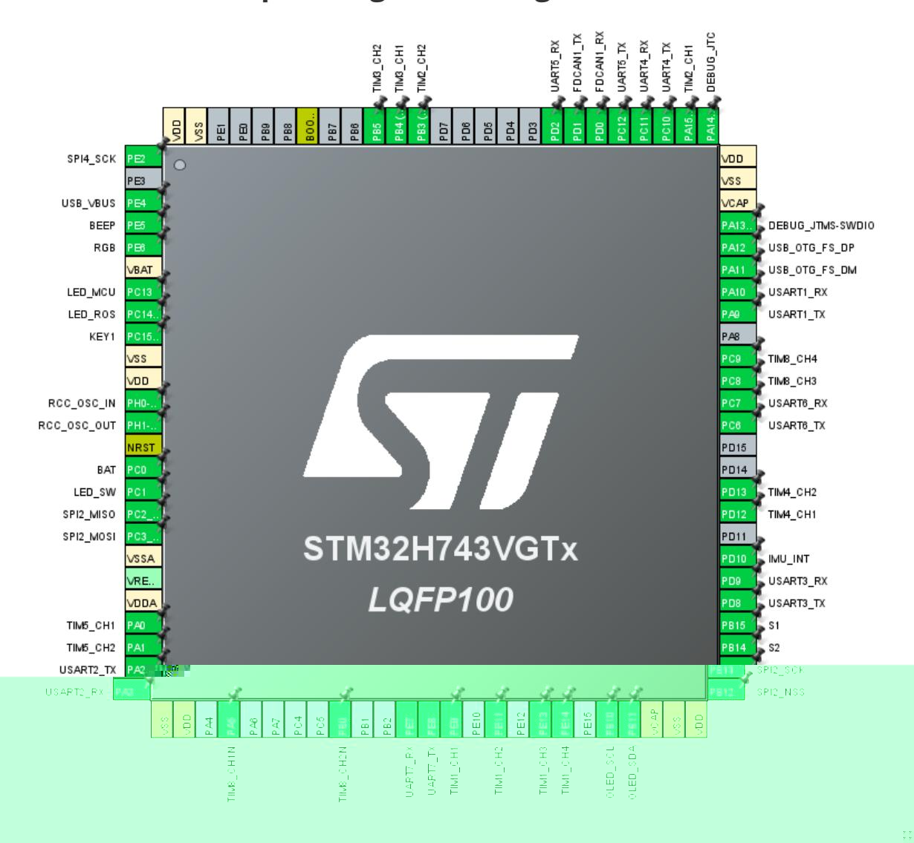

# Introduction to the Control Board

Introduction to the Control Board

- 1. Component distribution diagram on the front of the control board
- 2. Component distribution diagram on the back of the control board
- 3. Control board pin assignment diagram
- 4. Analysis of Common Problems

## 1. Component distribution diagram on the front of the control board

- 1. KEY1 key: User function key, which can realize customized functions through programming.
- 2. RESET button: reset the STM32 microcontroller.
- 3. BOOT0 key: used to enter the burning mode when burning STM32 firmware.
- 4. Active buzzer: whistle and low battery alarm functions.
- 5. Left radar interface: Serial port 4, connected to the left rear radar.
- 6. Debug interface: Serial port 7, can be connected to a TTL module to view log information.
- 7. Right radar interface: Serial port 5, connected to the right front radar.
- 8. Control interface: Serial port 6, can be connected to TTL module and send protocol to control the robot.
- 9. CAN interface: can be connected to CAN bus devices and send protocols to control the robot.
- 10. OLED screen interface: can display the status of the board
- 11. RGB light bar interface: displays the light bar color status
- 12. SBUS interface: connect to SBUS aircraft remote controller
- 13. PWM servo interface: connect to PWM servo
- 14. PWM servo voltage switch: PWM servo voltage can be selected as 5V or 6.8V
- 15. 6.8V serial servo interface: connect to 6.8V serial servo
- 16. 12V serial servo interface: connect to 12V serial servo

- 17. 12V serial servo interface: connect to 12V serial servo
- 18. Communication and firmware burning interface: TYPE-C serial port for burning MCU firmware and data communication
- 19. Handle interface: connect USB handle
- 20. M3 motor: connected to the right front motor of the car
- 21. M4 motor: connected to the right rear motor of the car
- 22. M1 motor: connected to the left front motor of the car
- 23. M2 motor: connected to the left rear motor of the car
- 24. Type-C 5V output interface: 5.1V\5A output, with Raspberry Pi exclusive protocol
- 25. DC 5V output interface: provides 5V voltage output
- 26. T-type DC 12V power input interface: connect to 12V power supply to power the motherboard
- 27. LED indicator: LED indicator to show voltage and function
- 28. DC12V power output: provides 12V voltage output
- 29. DC12V power output: provides 12V voltage output
- 30. Power switch: controls the entire board. Turn the switch to OFF to shut down the board, and turn it to ON to power on the board.
- 31. Charging port: 12.6V charging port
- 32. Nine-axis attitude sensor: including 3-axis accelerometer, 3-axis gyroscope, and 3-axis magnetometer
- 33. SWD debug interface: users can use ST-LINK for debugging

# 2. Component distribution diagram on the back of the control board

- 1. STM32 microcontroller: main chip, controls the function operation of the entire board
- 2. Charging port: 12.6V charging port
- 3. Self-locking switch interface: can be used to connect an external self-locking switch to control the switch of the entire board

#### 3. Control board pin assignment diagram

| Peripheral functions                  | Pins                   | Remark                                                                                                                   |
|------------------------------------------|------------------------|--------------------------------------------------------------------------------------------------------------------------|
| Active buzzer                            | PE5                    | Common GPIO                                                                                                              |
| RGB light strips                         | PE6                    | SPI4_MOSI (SPI4_SCK is the SPI4 clock, which is not needed and has been left floating)                             |
| LED_MCU indicator                     | PC13                   | Ordinary GPIO, status indicator                                                                                          |
| LED_ROS indicator                     | PC14                   | Ordinary GPIO, ROS status indicator                                                                                      |
| KEY1 button                              | PC15                   | Ordinary GPIO, input pull-up                                                                                             |
| 25M crystal oscillator                | PH0/PH1                |                                                                                                                          |
| BAT power supply voltage detection | PC0                    | ADC detection                                                                                                            |
| LED_SW indicator                         | PC1                    | Ordinary GPIO, switch indicator light                                                                                    |
| IMU attitude sensor                   | PC2/PC3/PB13/PB12/PD10 | SPI2 - MISO/MOSI/SCK/NSS/INT                                                                                             |
| M3 motor encoder                      | PA0/PA1                | Encoder mode, Timer 5 channel 1 and channel 2                                                                         |
| SBUS interface                           | PA3                    | Serial port 2 receiving pin (PA2 is the serial port 2 sending pin, which is not needed and has been left floating) |
| M3 motor drive                           | PA5/PB0                | PWM output mode, timer 8 channel 1N and channel 2N                                                                    |
| Debug interface                          | PE7/PE8                | Serial port 7, print log information                                                                                     |
| M2 motor drive                           | PE9/PE11               | PWM output mode, Timer 1 channel 1 and channel 2                                                                      |
| M1 motor drive                           | PE13/PE14              | PWM output mode, timer 1 channel 3 and channel 4                                                                      |
| OLED display                             | PB10/PB11              | I2C interface                                                                                                            |
| PWM servo S1                             | PB15                   | Timer 12 channel 2                                                                                                       |
| PWM servo S2                             | PB14                   | Timer 12 channel 1                                                                                                       |
| Bus Servo                                | PD8/PD9                | Serial port 3                                                                                                            |
| M4 motor encoder                      | PD12/PD13              | Encoder mode, Timer 4 channel 1 and channel 2                                                                         |
| Control interface                        | PC6/PC7                | Serial port 6                                                                                                            |

| Peripheral functions                   | Pins      | Remark                                              |
|-------------------------------------------|-----------|-----------------------------------------------------|
| M4 motor drive                            | PC8/PC9   | PWM output mode, timer 8 channel 3 and channel 4 |
| Burning and communication interface | PA9/PA10  | Serial port 1                                       |
| USB controller interface               | PA11/PA12 | USB Host                                            |
| SWD interface                             | PA13/PA14 | SWDIO/SWCLK                                         |
| M2 motor encoder                       | PA15/PB3  | Encoder mode, Timer 2 channel 1 and channel 2    |
| Left radar interface                   | PC10/PC11 | Serial port 4                                       |
| Right radar interface                  | PC12/PD2  | Serial port 5                                       |
| CAN interface                             | PD0/PD1   |                                                     |
| M1 motor encoder                       | PB4/PB5   | Encoder mode, Timer 3 channel 1 and channel 2    |

#### 4. Analysis of Common Problems

1. How does a main control board (such as Jetson Nano) drive a control board? How do I communicate with the control board?

A: The factory firmware of the control board integrates the Microros framework program. Jetson Nano is connected to the control board through the USB Connect interface, opens the Microros agent and sends the corresponding topic instructions. The microcontroller integrated in the control board receives and parses the data, and then processes the specific commands to be executed.

2. How is the robot powered? Does the main control board need a separate power supply?

A: The car comes with a battery pack. Plug the battery pack into the DC 12V T-type power connector on the control board and turn on the main power switch. The control board has an integrated voltage conversion chip. For the Jetson Nano motherboard, power is supplied via the DC 5V power cable. For the Raspberry Pi 5, power is supplied via the Type-C 5V output power cable with protocol. For the Jetson Orin series, power is supplied via the DC 12V output power cable.

3. How to update the MCU firmware? Why do we need to update the MCU firmware?

A: The MCU integrated into the control board is pre-loaded with factory firmware. You do not need to update the firmware unless necessary. If you need to update the firmware, please refer to the firmware update tutorial to update the MCU firmware. If the control board has been preloaded with a separate hex file, please re-load the firmware to the factory firmware before

running the ROS example.
