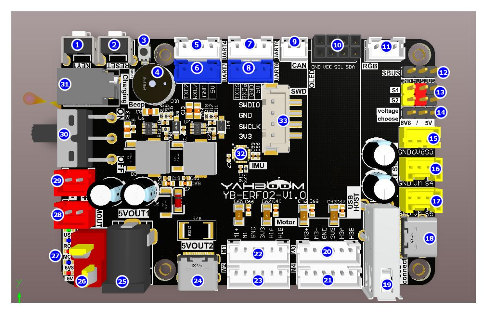
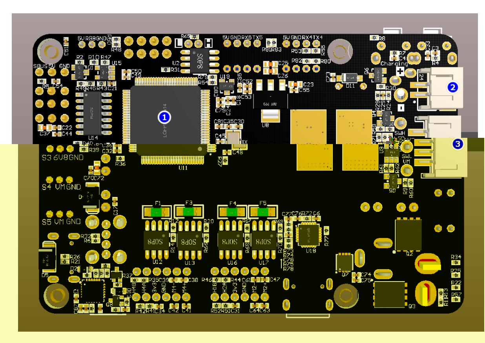
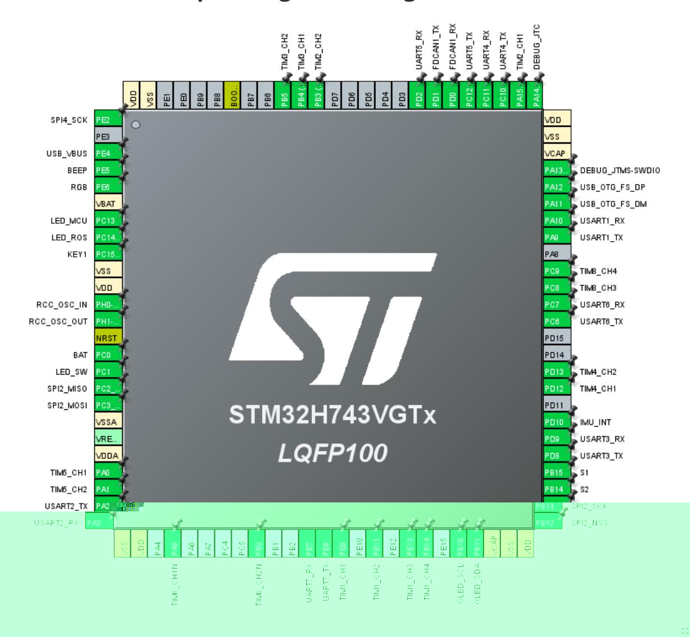

# Introduction to the Control Board

## 1. Front-Side Component Layout

1. KEY1: user function key for custom firmware behavior.
2. RESET: resets the STM32 microcontroller.
3. BOOT0: enters firmware flashing mode.
4. Active buzzer: provides audible prompts and low-battery alarms.
5. Left LiDAR interface: serial port 4, connected to the left-rear LiDAR.
6. Debug interface: serial port 7, used with a TTL module to view log output.
7. Right LiDAR interface: serial port 5, connected to the right-front LiDAR.
8. Control interface: serial port 6, used with a TTL module to send robot-control protocol data.
9. CAN interface: connects to CAN bus devices and sends robot-control protocol data.
10. OLED screen interface: displays board status.
11. RGB light-strip interface: drives the RGB light-strip status display.
12. SBUS interface: connects to an SBUS aircraft remote controller.
13. PWM servo interface: connects to PWM servos.
14. PWM servo voltage switch: selects 5V or 6.8V for the PWM servo interface.
15. 6.8V serial servo interface: connects to 6.8V serial servos.
16. 12V serial servo interface: connects to 12V serial servos.
17. 12V serial servo interface: connects to 12V serial servos.
18. Communication and firmware flashing interface: Type-C serial port for MCU firmware flashing and data communication.
19. Controller interface: connects a USB controller.
20. M3 motor: connects to the robot's right-front motor.
21. M4 motor: connects to the robot's right-rear motor.
22. M1 motor: connects to the robot's left-front motor.
23. M2 motor: connects to the robot's left-rear motor.
24. Type-C 5V output interface: 5.1V\5A output with the Raspberry Pi power protocol.
25. DC 5V output interface: provides 5V output power.
26. T-type DC 12V power input interface: connects the 12V power supply that powers the mainboard.
27. LED indicator: shows voltage and function status.
28. DC12V power output: provides 12V output power.
29. DC12V power output: provides 12V output power.
30. Power switch: controls board power. Turn it to `OFF` to shut down the board and `ON` to power on the board.
31. Charging port: 12.6V charging port.
32. Nine-axis attitude sensor: includes a 3-axis accelerometer, 3-axis gyroscope, and 3-axis magnetometer.
33. SWD debug interface: used with ST-LINK for debugging.

## 2. Back-Side Component Layout

1. STM32 microcontroller: the main chip that controls board functions.
2. Charging port: 12.6V charging port.
3. Self-locking switch interface: connects an external self-locking switch for board power control.

## 3. Control Board Pin Assignment

| Peripheral functions                  | Pins                   | Remark                                                                                                                   |
|------------------------------------------|------------------------|--------------------------------------------------------------------------------------------------------------------------|
| Active buzzer                            | PE5                    | Common GPIO                                                                                                              |
| RGB light strips                         | PE6                    | SPI4_MOSI (SPI4_SCK is the SPI4 clock, which is not needed and has been left floating)                             |
| LED_MCU indicator                     | PC13                   | Ordinary GPIO, status indicator                                                                                          |
| LED_ROS indicator                     | PC14                   | Ordinary GPIO, ROS status indicator                                                                                      |
| KEY1 button                              | PC15                   | Ordinary GPIO, input pull-up                                                                                             |
| 25M crystal oscillator                | PH0/PH1                |                                                                                                                          |
| BAT power supply voltage detection | PC0                    | ADC detection                                                                                                            |
| LED_SW indicator                         | PC1                    | Ordinary GPIO, switch indicator light                                                                                    |
| IMU attitude sensor                   | PC2/PC3/PB13/PB12/PD10 | SPI2 - MISO/MOSI/SCK/NSS/INT                                                                                             |
| M3 motor encoder                      | PA0/PA1                | Encoder mode, Timer 5 channel 1 and channel 2                                                                         |
| SBUS interface                           | PA3                    | Serial port 2 receiving pin (PA2 is the serial port 2 sending pin, which is not needed and has been left floating) |
| M3 motor drive                           | PA5/PB0                | PWM output mode, timer 8 channel 1N and channel 2N                                                                    |
| Debug interface                          | PE7/PE8                | Serial port 7, print log information                                                                                     |
| M2 motor drive                           | PE9/PE11               | PWM output mode, Timer 1 channel 1 and channel 2                                                                      |
| M1 motor drive                           | PE13/PE14              | PWM output mode, timer 1 channel 3 and channel 4                                                                      |
| OLED display                             | PB10/PB11              | I2C interface                                                                                                            |
| PWM servo S1                             | PB15                   | Timer 12 channel 2                                                                                                       |
| PWM servo S2                             | PB14                   | Timer 12 channel 1                                                                                                       |
| Bus Servo                                | PD8/PD9                | Serial port 3                                                                                                            |
| M4 motor encoder                      | PD12/PD13              | Encoder mode, Timer 4 channel 1 and channel 2                                                                         |
| Control interface                        | PC6/PC7                | Serial port 6                                                                                                            |

| Peripheral functions                   | Pins      | Remark                                              |
|-------------------------------------------|-----------|-----------------------------------------------------|
| M4 motor drive                            | PC8/PC9   | PWM output mode, timer 8 channel 3 and channel 4 |
| Flashing and communication interface | PA9/PA10  | Serial port 1                                       |
| USB controller interface               | PA11/PA12 | USB Host                                            |
| SWD interface                             | PA13/PA14 | SWDIO/SWCLK                                         |
| M2 motor encoder                       | PA15/PB3  | Encoder mode, Timer 2 channel 1 and channel 2    |
| Left LiDAR interface                   | PC10/PC11 | Serial port 4                                       |
| Right LiDAR interface                  | PC12/PD2  | Serial port 5                                       |
| CAN interface                             | PD0/PD1   |                                                     |
| M1 motor encoder                       | PB4/PB5   | Encoder mode, Timer 3 channel 1 and channel 2    |

## 4. Common Questions

### 4.1 How does a main control board, such as Jetson Nano, drive and communicate with the control board?

The factory firmware on the control board integrates the micro-ROS framework. The Jetson Nano connects to the control board through the USB Connect interface, starts the micro-ROS agent, and sends the corresponding topic commands. The STM32 microcontroller receives and parses the data, then executes the requested command.

### 4.2 How is the robot powered? Does the main control board need a separate power supply?

The robot includes a battery pack. Connect the battery pack to the DC 12V T-type power connector on the control board and turn on the main power switch. The control board includes voltage-conversion circuitry. Jetson Nano uses the DC 5V power cable, Raspberry Pi 5 uses the Type-C 5V output power cable with protocol support, and Jetson Orin series boards use the DC 12V output power cable.

### 4.3 How do I update MCU firmware, and when is it necessary?

The MCU on the control board is preloaded with factory firmware, so you usually do not need to update it. If an update is required, follow the firmware update tutorial. If the control board has been flashed with a separate `.hex` file, restore the factory firmware before running the ROS examples.
