# Set up the STM32CUBEIDE development environment

## 1. Introduction to STM32CubeIDE

C++ development platform with peripheral configuration, code generation, compilation, and debugging capabilities for STM32 microcontrollers and microprocessors. Based on the Eclipse(R)

## 2. Download the installation package

Open the following link in your computer browser:

<https://www.st.com/en/development-tools/stm32cubeide.html>

Download according to the computer system. Here we take Win10 system as an example to install the current latest version (version 1.19.0). The operations for other versions are similar.

If you have an account on my.st.com, you can log in directly and download the software. If you do not want to log in now, simply provide your name and email address in the form below to download the software.

Unzip the downloaded file, and do not use Chinese characters in the unzip path.

## 3. Start installation

Double-click to open the installation package. Then follow the tutorial.

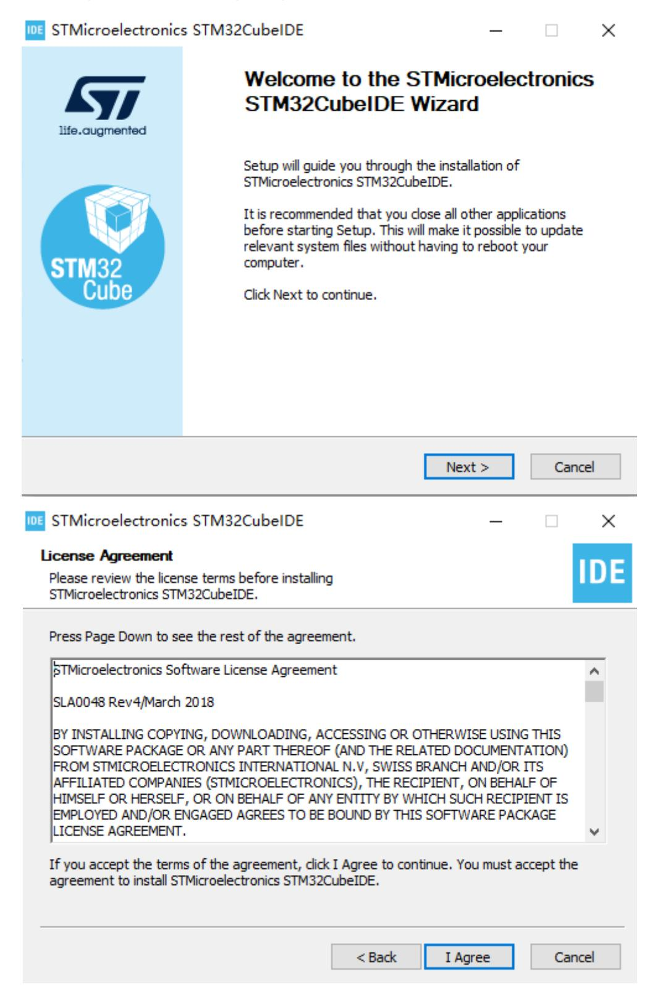

The installation path can be modified according to actual needs. Be careful not to include Chinese characters.

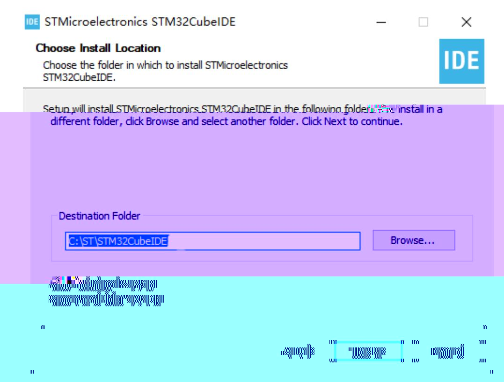

Select the driver and click Install.

Then just wait for the installation to complete.

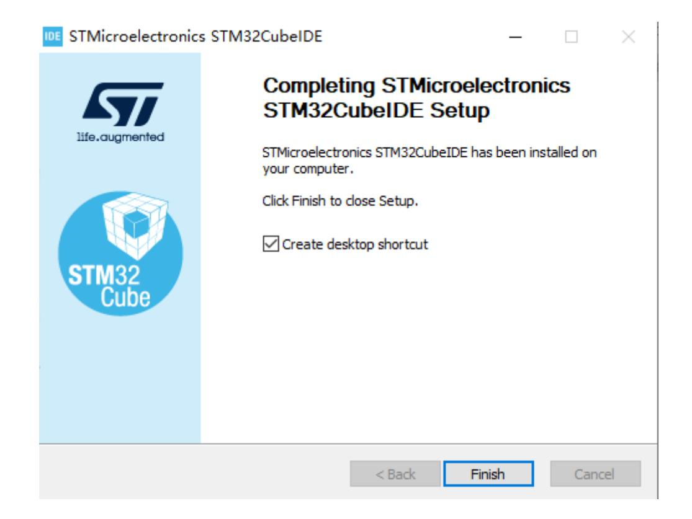

## 4. New construction projects

- 1. Double-click the shortcut on the desktop to open STM32CubeIDE. You need to select a workspace and save it in a different path (without Chinese characters).

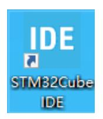

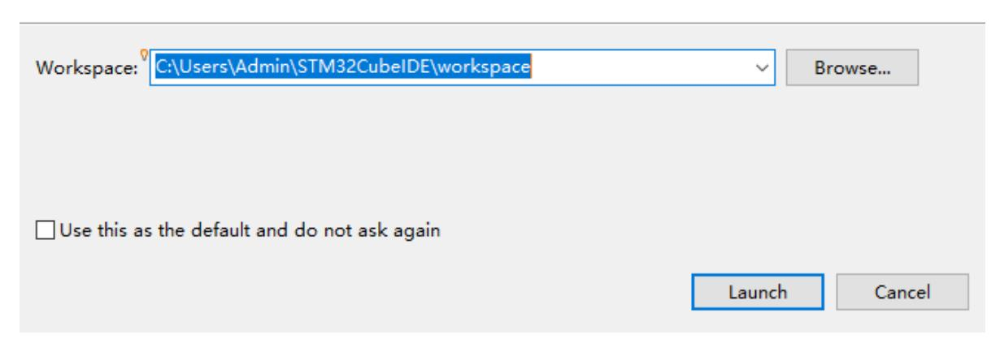

- 2. Click File->New->STM32 Project.

- 3. Search and select the STM32H743VGT6 chip, then click Next in the lower right corner to proceed to the next step.

- 4. Enter the project name. Here we take LED as an example. Other parameters can be left as default.

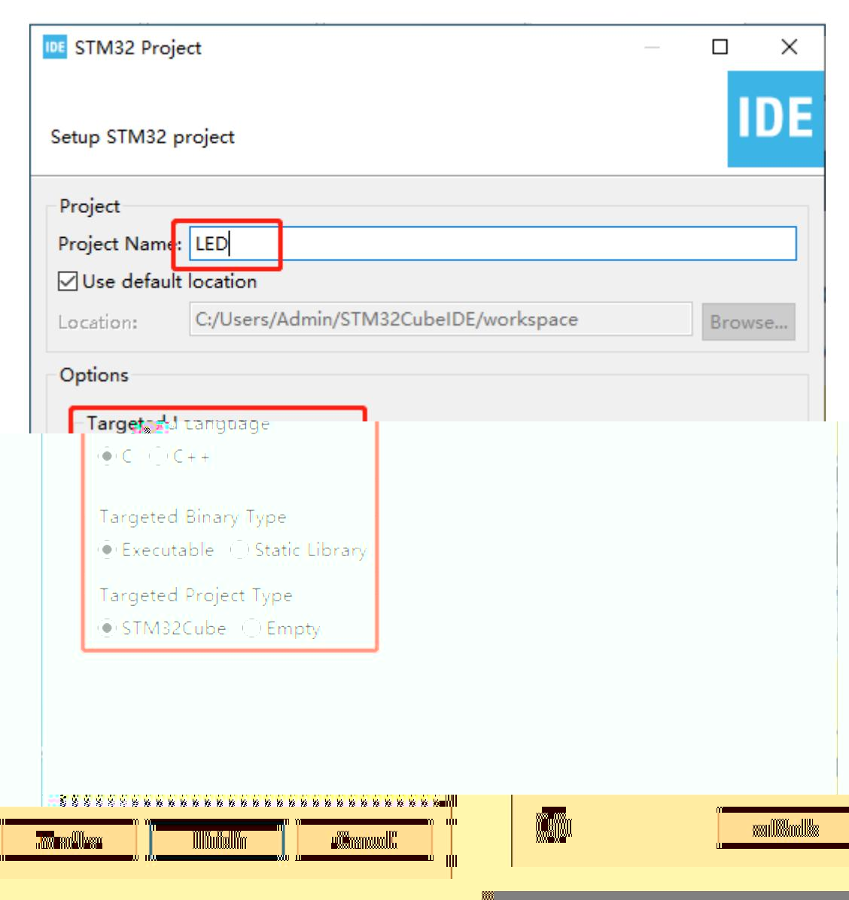

- 5. Click Yes and the graphical content will be loaded.

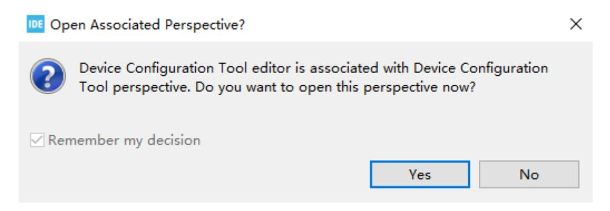

The completion is as shown below:

## 5. Pin configuration

- 1. First, you need debug information. Under Pinout & Configuration, click [Trace and Debug] -> [Debug] and select [Serial Wire].

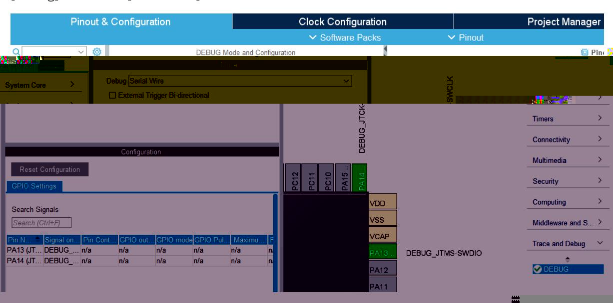

- 2. Modify the system clock of STM32 and the external crystal oscillator 25M frequency.

In Pinout & Configuration, select [RCC] -> [HSE] and select [Crystal/Ceramic Resonator]. HSE is the external clock, and LSE is the internal clock. Using an external clock is more stable and efficient than the internal clock.

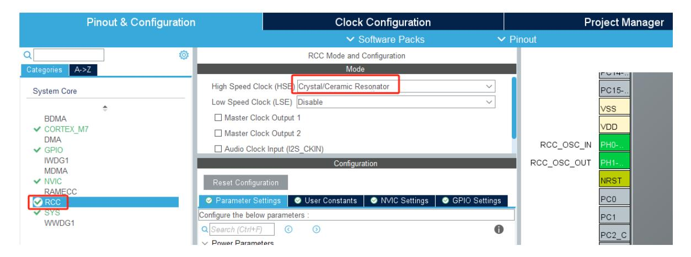

Switch to the [Clock Configuration] interface, set the chip main frequency to 480Mhz, and press Enter to confirm.

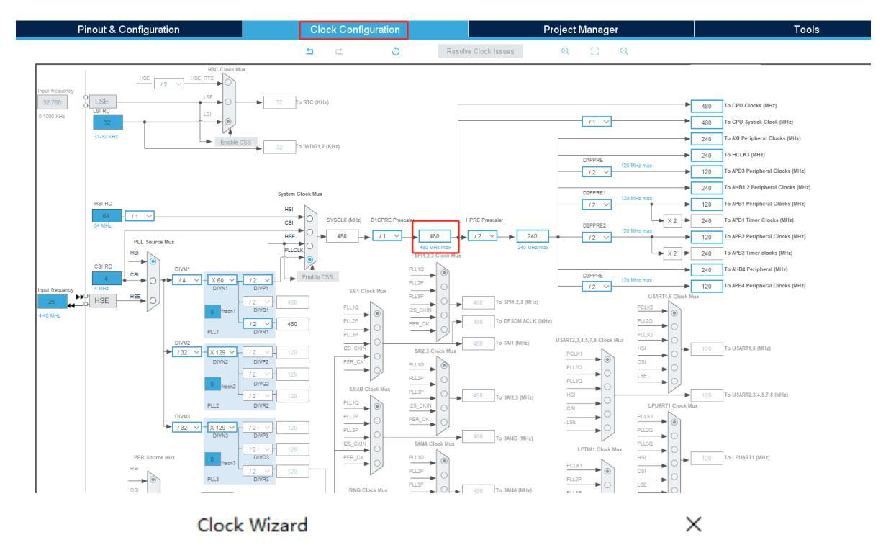

- 3. Add LED_MCU pin configuration. From the pin assignment diagram, we can see that the LED is connected to the PC13 pin.

Set the PC13 pin to GPIO_Output. For convenience, change the Label to LED_MCU.

Then press Ctrl+S to save, check Remember my decision, and click Yes. This will automatically generate code every time you save.

## 6. Write code

- 1. Since the system initialization code has been generated in the previous graphical configuration, we only need to add the functions to be implemented.

Find the main function in the main.c file and add the code below while(1) to control the LED. This will cause the LED to flash every 200 milliseconds. Press Ctrl+S to save the code.

Note: Code content must be added between USER CODE BEGIN and USER CODE END. Otherwise, the code content will be overwritten the next time you generate code using the graphical tool. Code added between USER CODE BEGIN and USER CODE END will not be overwritten. Do not write Chinese comments in this section, as this may result in garbled characters.

## 7. Compile the program

- 1. Add the function of generating HEX file.

Click Project->Properties->C/C++ Build->Settings->MCU Post build outputs, and then check Convert to Intel Hex file (-O ihex), as shown in the figure below.

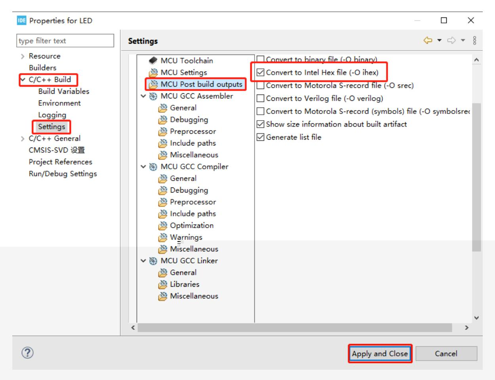

- 2. Click the hammer in the toolbar to start compiling the project.

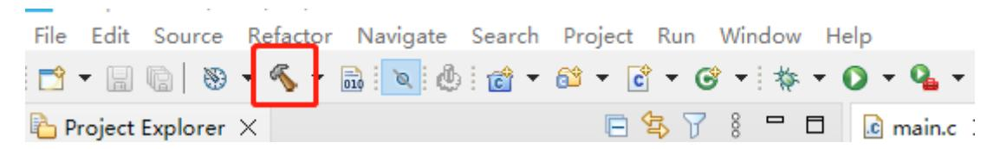

The STM32CubeIDE Console window will pop up. If you see 0 compilation errors and 0 warnings, the compilation is successful. As shown in the figure below, the file generated by the project is named LED.hex and is saved in the Debug folder of the project directory.

