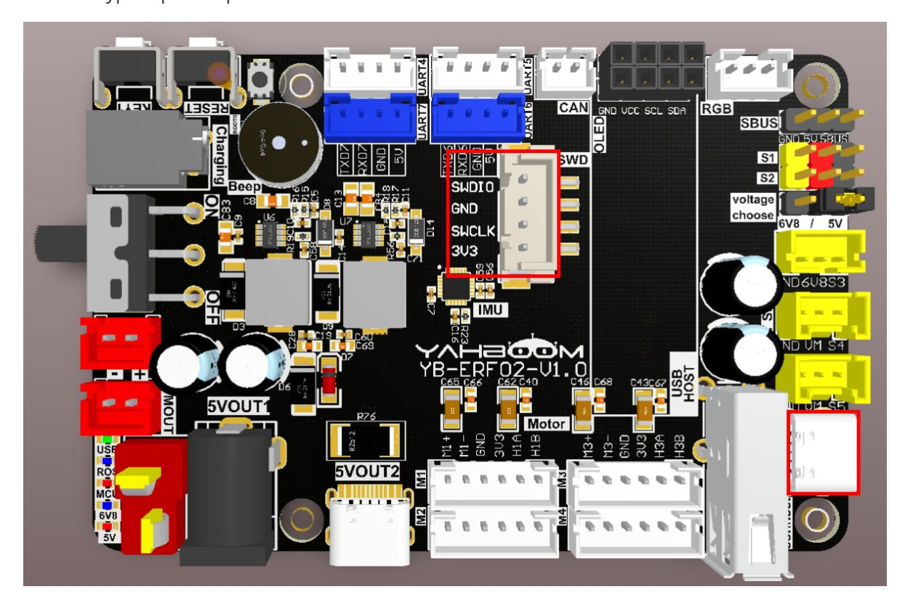
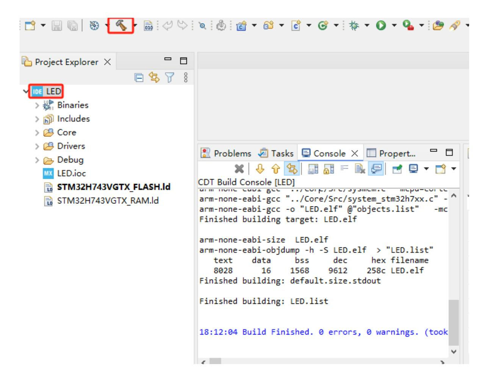
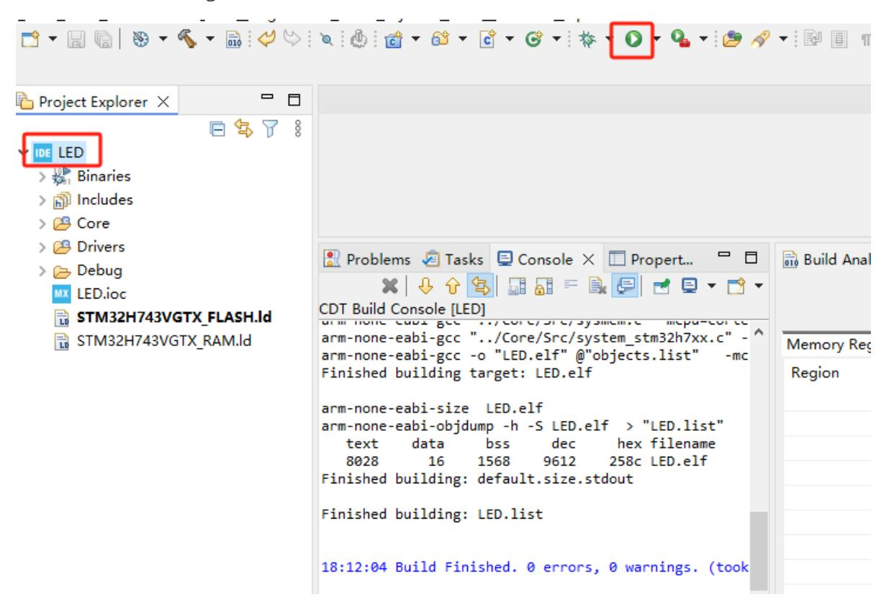
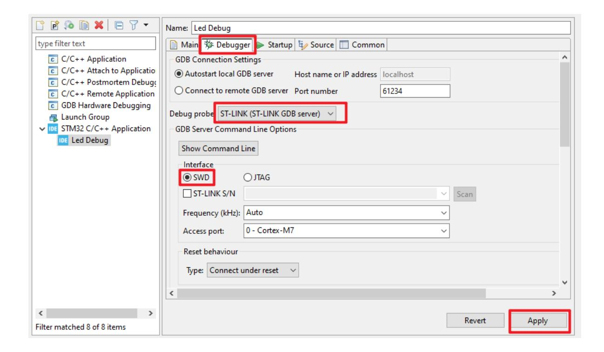
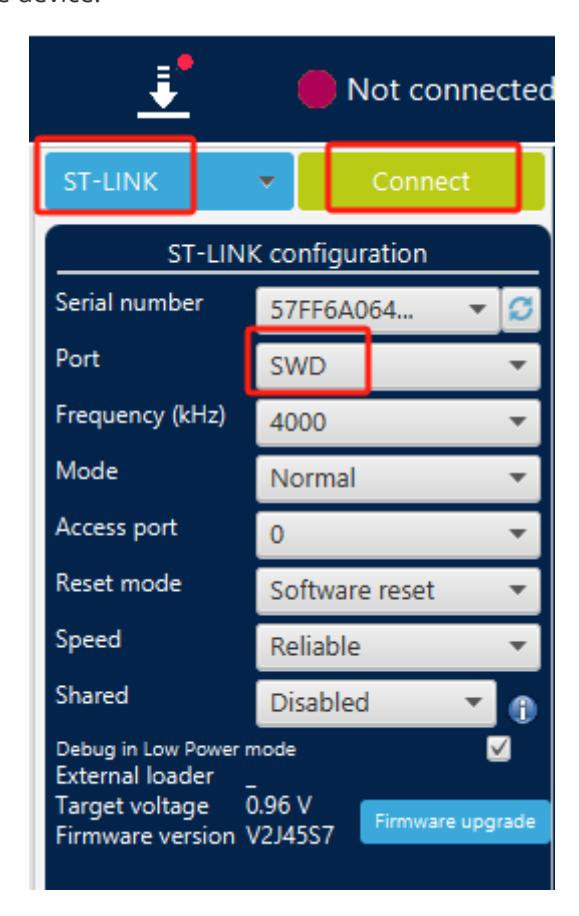
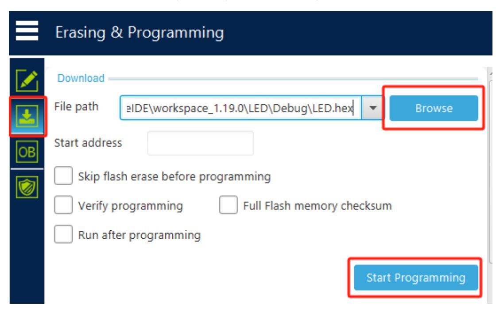

# Burning STM32 firmware using SWD

## 1. Hardware Connection

You need to use a downloader. Here we take ST-LINK as an example and connect it to the SWD interface.

Use the Type-C port to power the control board.

## 2. STM32CUBEIDE burning

Use STM32CUBEIDE to open the project.

Select the project name, press the Compile button, and confirm that the project compiles without errors. Here we take the LED project as an example.

Select the project to be burned and click the green play button. The first time you click the green play button, the configuration debugging parameters will pop up. Select the ST-LINK and SWD interfaces, then click Apply, and then click OK to start burning. After that, just click the green play button to start burning.

## 3. STM32CubeProgrammer burns firmware

If the firmware only has a hex file and does not have the full functional source code, you can use STM32CubeProgrammer to burn the firmware.

Open the STM32CubeProgrammer software, select ST-LINK mode, select SWD for Port, and click Connect to connect to the device.

The status will change if the connection is successful.

Click the download button to enter the download page, click [Browse] to select the hex file to download, and then click [Start Programming] to start burning the firmware.

There will be a prompt after the firmware burning is completed.
