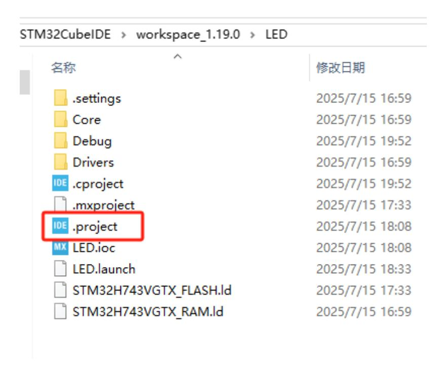
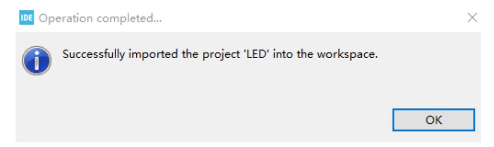
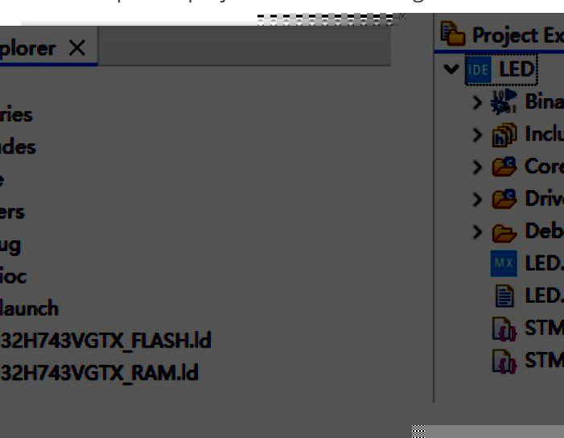

# Import Project

Open STM32CUBEIDE and select a workspace, or create a new one.

Then find the project directory. Here we take the LED project as an example. Double-click the.project file.

The system will prompt that the import is successful, just click OK.

At this point, you can see the imported project in the file management column of STM32CUBEIDE.

