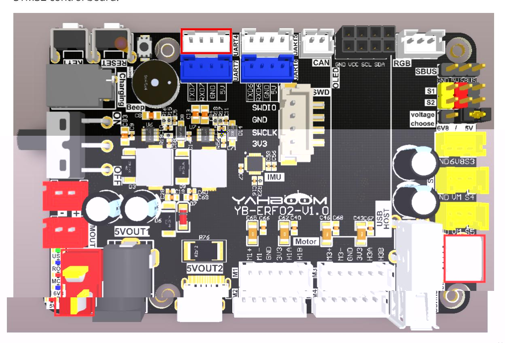
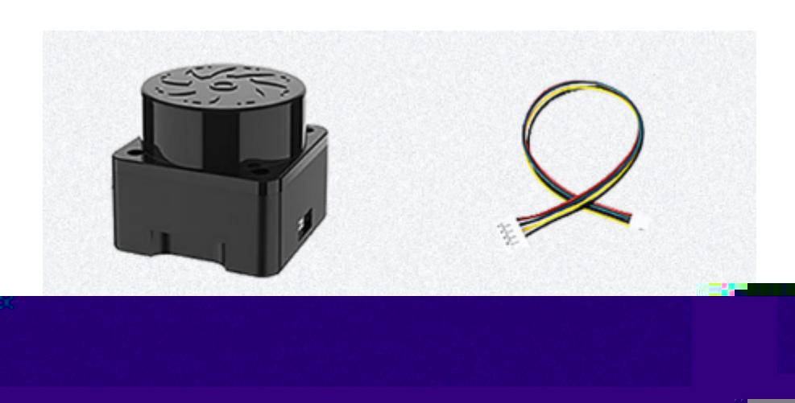
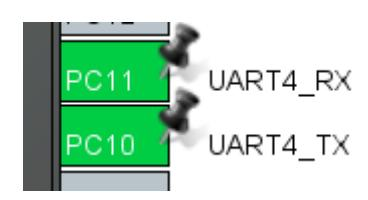
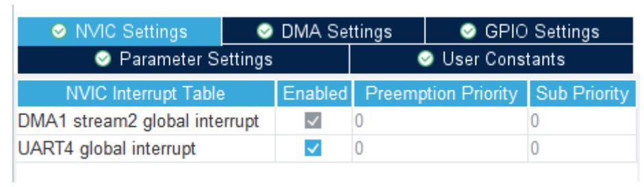
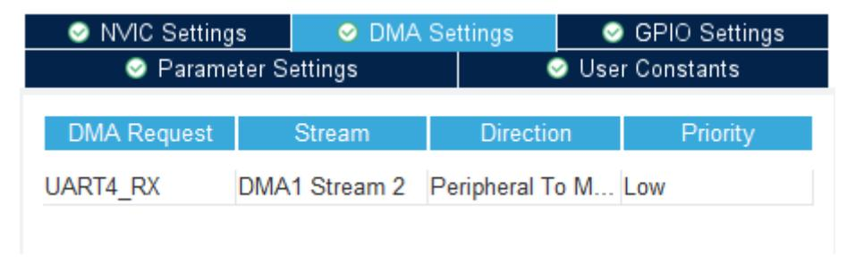
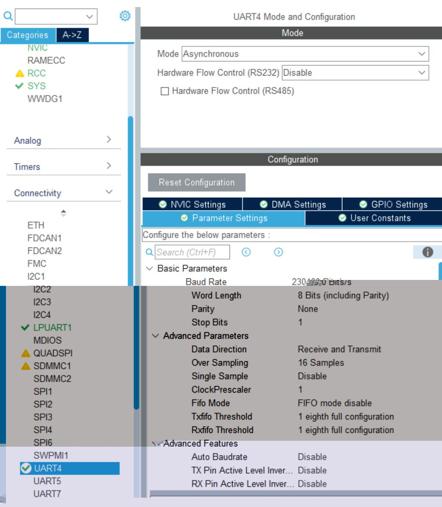
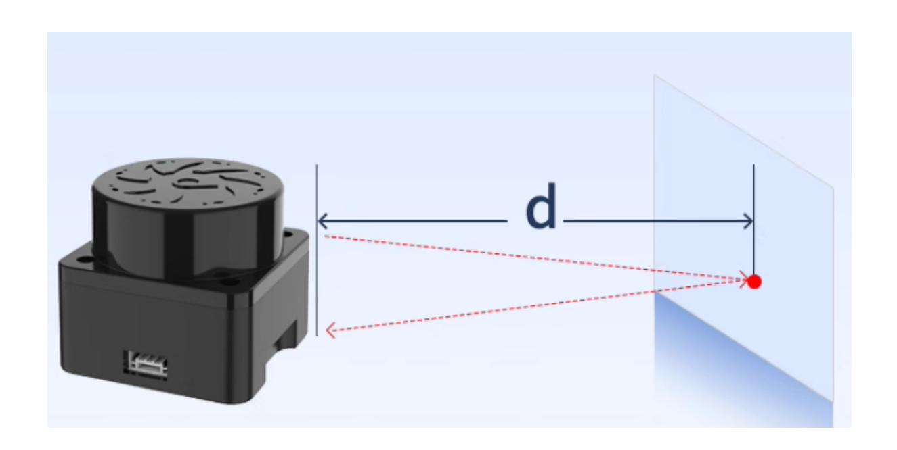

# Read LiDAR data

#### Read LiDAR data

- 1. Experimental Purpose
- 2. Hardware Connection
- 3. Core code analysis
- 4. Compile, download and burn firmware
- 5. Experimental Results

#### 1. Experimental Purpose

Use the radar interface of the STM32 control board to read data from the T-MiniPlus lidar and parse the radar data packets.

### 2. Hardware Connection

As shown in the figure below, the STM32 control board integrates the T-MiniPlus LiDAR interface. You need to connect the T-MiniPlus LiDAR cable to the STM32 control board and the LiDAR.

Please connect the type-C data cable to the computer USB port and the USB Connect port of the STM32 control board.



The T-MiniPlus LiDAR interface cable has an anti-reverse connection function. Just align the interface and insert it into the left LiDAR interface.



#### 3. Core code analysis

The path corresponding to the program source code is:

Board_Samples/STM32_Samples/Read_Lidar

Since the T-MiniPlus LiDAR uses serial communication, select serial port 4 for communication. Serial port 4's TX pin corresponds to PC10, and its RX pin corresponds to PC11. Set the baud rate to 230400, with an 8-bit data length, a 1-bit stop bit, and no parity. Enable the receive DMA channel and serial port interrupt.









```
void MX_UART4_Init(void)
{
  huart4.Instance = UART4;
  huart4.Init.BaudRate = 230400;
  huart4.Init.WordLength = UART_WORDLENGTH_8B;
  huart4.Init.StopBits = UART_STOPBITS_1;
  huart4.Init.Parity = UART_PARITY_NONE;
  huart4.Init.Mode = UART_MODE_TX_RX;
  huart4.Init.HwFlowCtl = UART_HWCONTROL_NONE;
  huart4.Init.OverSampling = UART_OVERSAMPLING_16;
  huart4.Init.OneBitSampling = UART_ONE_BIT_SAMPLE_DISABLE;
  huart4.Init.ClockPrescaler = UART_PRESCALER_DIV1;
  huart4.AdvancedInit.AdvFeatureInit = UART_ADVFEATURE_NO_INIT;
  if (HAL_UART_Init(&huart4) != HAL_OK)
  {
    Error_Handler();
  }
  if (HAL_UARTEx_SetTxFifoThreshold(&huart4, UART_TXFIFO_THRESHOLD_1_8) !=
HAL_OK)
  {
```

```
Error_Handler();
  }
  if (HAL_UARTEx_SetRxFifoThreshold(&huart4, UART_RXFIFO_THRESHOLD_1_8) !=
HAL_OK)
  {
    Error_Handler();
  }
  if (HAL_UARTEx_DisableFifoMode(&huart4) != HAL_OK)
  {
    Error_Handler();
  }
}
```

Initialize the radar. After the radar is successfully initialized, you can start the scanning mode and enable the serial port 4DMA to receive data. At this time, the radar indicator light changes from solid to flashing.

```
void Lidar_Init(void)
{
    HAL_UART_Receive_DMA(&huart4, dma_buffer, UART_DMA_BUFFER_SIZE);
    Lidar_Stop();
    HAL_Delay(200);
    Lidar_Start();
}
```

Receive messages sent back by the T-MiniPlus LiDAR.

```
void Lidar_Recv_Data(uint8_t rxtemp)
{
    static uint8_t step = 0;
    static uint16_t si_len = 0;
    static uint8_t si_index = 0;
    switch (step)
    {
    case 0:
        if (rxtemp == Lidar_HeaderLSB)
        {
            step = 1;
            lidar_recv_buf[0] = Lidar_HeaderLSB;
        }
        break;
    case 1:
        if (rxtemp == Lidar_HeaderMSB)
        {
            step = 2;
            lidar_recv_buf[1] = Lidar_HeaderMSB;
        }
        break;
    case 2:
        lidar_recv_buf[step] = rxtemp;
        step++;
        break; // CT information
    case 3:
        lidar_recv_buf[step] = rxtemp;
        step++;
```

```
si_len = rxtemp * 3; // Number of S
        // When determining whether the data length will be greater than the
cache here
        if (si_len + 10 >= RX_BUF_MAX)
        {
            si_len = 0;
            step = 0;
            memset(lidar_recv_buf, 0, sizeof(lidar_recv_buf));
        }
        break;
    case 4:
        lidar_recv_buf[step] = rxtemp;
        step++;
        break; // Starting angle is 8 digits lower
    case 5:
        lidar_recv_buf[step] = rxtemp;
        step++;
        break; // Starting angle height of 8 digits
    case 6:
        lidar_recv_buf[step] = rxtemp;
        step++;
        break; // end angle is 8 digits lower
    case 7:
        lidar_recv_buf[step] = rxtemp;
        step++;
        break; // End angle height of 8 digits
    case 8:
        lidar_recv_buf[step] = rxtemp;
        step++;
        break; // Low 8 digits of verification code
    case 9:
        lidar_recv_buf[step] = rxtemp;
        step++;
        break; // High 8 digits of verification code
    case 10:
    {
        lidar_recv_buf[step + si_index] = rxtemp;
        si_index++;
        if (si_index >= si_len)
        {
            Lidar_Parse_Data();
            si_index = 0;
            si_len = 0;
            step = 0; // Receive a packet of data
            memset(lidar_recv_buf, 0, sizeof(lidar_recv_buf)); // clear
        }
        break;
    }
    }
}
```

The T-MiniPlus LiDAR parses the point cloud data packet based on the received protocol data.

```
static void Lidar_Parse_Data(void)
{
    Lidar_Data_t *timiplus_msg_p = &lidar_data;
```

```
uint16_t llen = lidar_recv_buf[3] * 3; // length
    uint8_t si_step = 0;
    // Small end to large end
    timiplus_msg_p->PH = lidar_recv_buf[1] << 8 | lidar_recv_buf[0];
    timiplus_msg_p->CT = lidar_recv_buf[2];
    timiplus_msg_p->LSN = lidar_recv_buf[3];
    timiplus_msg_p->FSA = lidar_recv_buf[5] << 8 | lidar_recv_buf[4];
    timiplus_msg_p->LSA = lidar_recv_buf[7] << 8 | lidar_recv_buf[6];
    timiplus_msg_p->CS = lidar_recv_buf[9] << 8 | lidar_recv_buf[8];
    for (uint16_t i = 0; i < llen; i += 3)
    {
        timiplus_msg_p->SI[si_step].Intensity = lidar_recv_buf[10 + i] & 0x00FF;
// Light intensity
        timiplus_msg_p->SI[si_step++].SI_dis = lidar_recv_buf[10 + i + 2] << 8 |
lidar_recv_buf[10 + i + 1]; // Effective value of distance
    }
    // XOR processing
    if (Lidar_Checkout(timiplus_msg_p) != 0) // Verification code error
    {
        memset(timiplus_msg_p, 0, sizeof(lidar_data));
        return;
    }
    lidar_new_data = 1; // One packet of data is correct
}
```

Extract relevant angle data based on the point cloud data package.

```
static void Lidar_Update_Points(Lidar_Data_t *msg, Lidar_Point_t* output)
{
    static uint16_t last_index = 0;
    double start_angle, interval_angle;
    int start_distance;
    uint16_t start_index, index;
    start_angle = Lidar_Get_Start_Stop_Angle(msg->FSA); //Starting angle
    start_distance = Lidar_Get_Distance(msg->SI[0].SI_dis);
    interval_angle = LIDAR_INTERVAL_POINTS;
    start_index = (uint16_t)(start_angle / interval_angle);
    // start_index = last_index + 1;
    start_index = start_index % LIDAR_DATA_LEN;
    if (msg->LSN <= 1)
    {
        last_index = start_index;
        output[0].dis = start_distance;
        output[0].angle = start_angle;
        for (int i = 0; i < start_index; i++)
        {
            output[i].dis = start_distance;
            output[i].angle = start_angle;
            Lidar_Ranges[i] = output[i].dis;
        }
        // printf("start angle:%d, %f\n", start_index, start_angle);
        return;
    }
    if (start_index > (last_index+1))
```

```
{
        uint16_t offset_count = start_index-last_index-1;
        for (int i = 0; i < offset_count; i++)
        {
            output[last_index+1+i].dis = start_distance;
            output[last_index+1+i].angle = start_angle;
            Lidar_Ranges[last_index+1+i] = output[last_index+1+i].dis;
        }
        // printf("index error:%d, %d\n", last_index, start_index);
    }
    output[start_index].dis = start_distance;
    output[start_index].angle = start_angle;
    Lidar_Ranges[start_index] = output[start_index].dis;
    for (uint8_t i = 1; i < msg->LSN; i++)
    {
        index = (start_index + i) % LIDAR_DATA_LEN;
        output[index].dis = Lidar_Get_Distance(msg->SI[i].SI_dis);
        output[index].angle = start_angle + interval_angle * i;
        Lidar_Ranges[index] = output[index].dis;
    }
    last_index = index;
}
```

Process the message data sent by the radar in the loop.

```
void Lidar_Handle(void)
{
    dma_tail = UART_DMA_BUFFER_SIZE - __HAL_DMA_GET_COUNTER((&huart4)->hdmarx);
    rx_count = 0;
    while (dma_head != dma_tail)
    {
        Lidar_Recv_Data(dma_buffer[dma_head]);
        dma_head = (dma_head + 1) % UART_DMA_BUFFER_SIZE;
        if (lidar_new_data) break;
        rx_count++;
        if (rx_count > RX_BUF_MAX) break;
    }
    if (lidar_new_data)
    {
        Lidar_Update_Data();
        lidar_new_data = 0;
    }
}
```

The distance detected by the T-MiniPlus LiDAR at point 0 (pointer direction) is printed every 200 milliseconds in millimeters.

```
void App_Handle(void)
{
    uint32_t lastTick = HAL_GetTick();
    printf("start APP Handle\n");
    Lidar_Init();
```

```
while (1)
    {
        Lidar_Handle();
        if (HAL_GetTick() - lastTick >= 200)
        {
            lastTick = HAL_GetTick();
            App_Led_Mcu_Flash_200ms();
            printf("Lidar range:%ldmm\n", Lidar_Ranges[0]);
        }
    }
}
```

## 4. Compile, download and burn firmware

Select the project to be compiled in the file management interface of STM32CUBEIDE and click the compile button on the toolbar to start compiling.


If there are no errors or warnings, the compilation is complete.

Press and hold the BOOT0 button, then press the RESET button to reset, release the BOOT0 button to enter the serial port burning mode. Then use the serial port burning tool to burn the firmware to the board.

If you have STlink or JLink, you can also use STM32CUBEIDE to burn the firmware with one click, which is more convenient and quick.

# 5. Experimental Results

The MCU_LED light flashes every 200 milliseconds.

Open the serial port assistant and set the baud rate to 115200. You can see that the distance detected by the T-MiniPlus LiDAR at 0 degrees (pointer direction) is printed every 200 milliseconds in millimeters.


