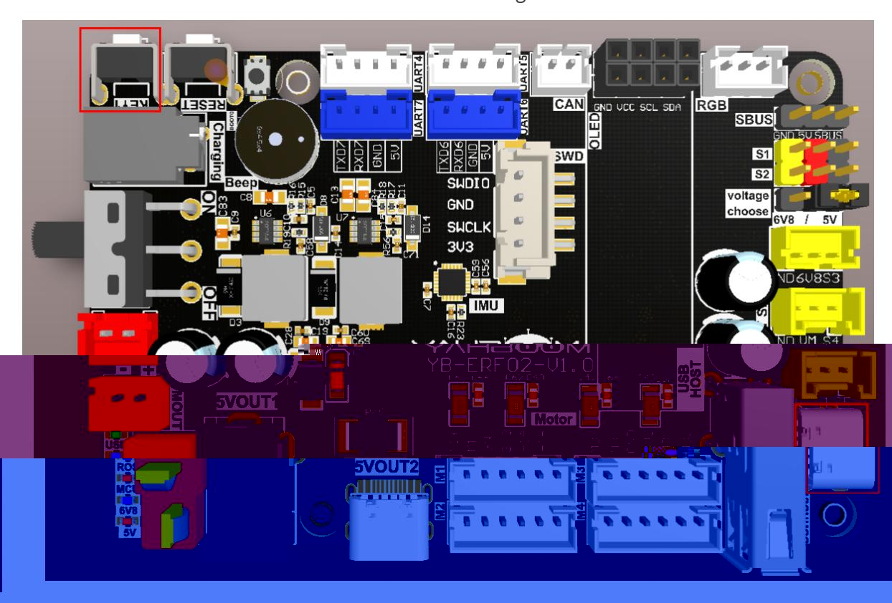
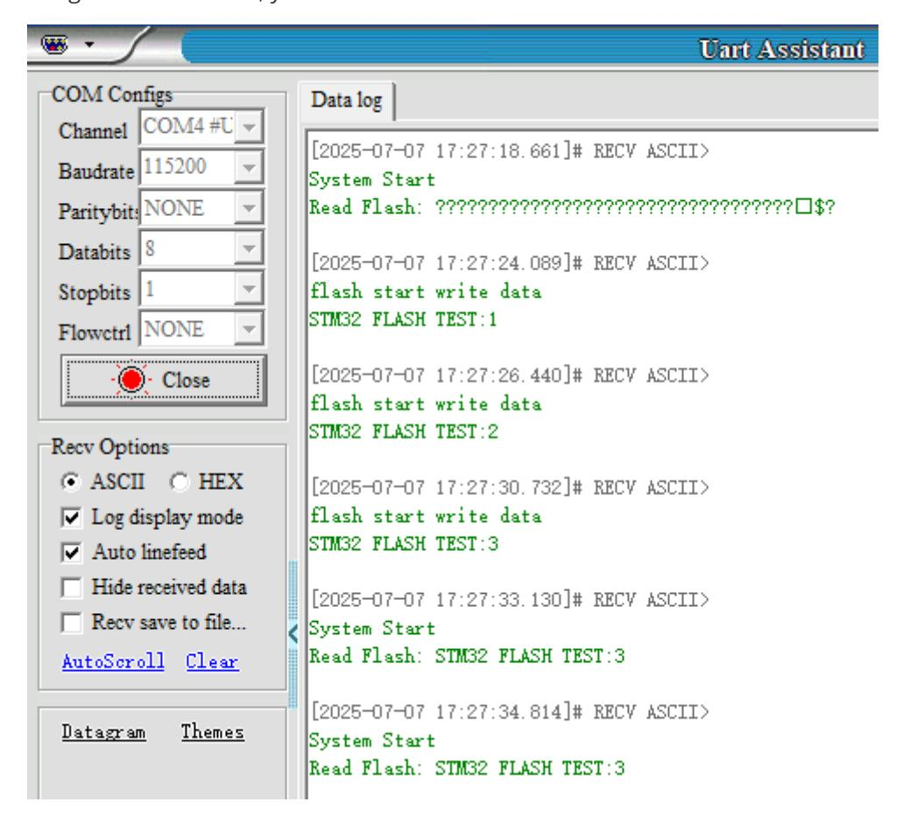

# Flash access data

Flash access data

- 1. Experimental Purpose
- 2. Hardware Connection
- 3. Core code analysis
- 4. Compile, download and burn firmware
- 5. Experimental Results

#### 1. Experimental Purpose

Use the flash storage function of the STM32 control board to learn the power-off saving function.

## 2. Hardware Connection

The STM32 control board integrates the STM32H743 chip and has 2M Flash space. In addition to running programs, part of the space can be allocated as a user data area to save data.

You need to connect the USB-C cable between the computer and the USB Connect port on the STM32 controller board. The KEY1 button is used to change the FLASH data.



### 3. Core code analysis

The path corresponding to the program source code is:

```
Board_Samples/STM32_Samples/Flash
```

According to the Flash storage partition of the STM32H743 chip, it is divided into multiple sectors.

```
#define STM32_FLASH_BASE 0x08000000 //STM32 FLASH starting address
#define STM32_FLASH_END 0x081FFFFF //STM32 FLASH end address
//The starting address of the FLASH sector, divided into 2 banks, each bank 1MB
#define BANK1_FLASH_SECTOR_0 ((uint32_t)0x08000000) //Bank1 sector 0 starting
address, 128 Kbytes
#define BANK1_FLASH_SECTOR_1 ((uint32_t)0x08020000) //Bank1 sector 1 starting
address, 128 Kbytes
#define BANK1_FLASH_SECTOR_2 ((uint32_t)0x08040000) //Bank1 sector 2 starting
address, 128 Kbytes
#define BANK1_FLASH_SECTOR_3 ((uint32_t)0x08060000) //Bank1 sector 3 starting
address, 128 Kbytes
#define BANK1_FLASH_SECTOR_4 ((uint32_t)0x08080000) //Bank1 sector 4 starting
address, 128 Kbytes
#define BANK1_FLASH_SECTOR_5 ((uint32_t)0x080A0000) //Bank1 sector 5 starting
address, 128 Kbytes
#define BANK1_FLASH_SECTOR_6 ((uint32_t)0x080C0000) //Bank1 sector 6 starting
address, 128 Kbytes
#define BANK1_FLASH_SECTOR_7 ((uint32_t)0x080E0000) //Bank1 sector 7 starting
address, 128 Kbytes
#define BANK2_FLASH_SECTOR_0 ((uint32_t)0x08100000) //Bank2 sector 0 starting
address, 128 Kbytes
#define BANK2_FLASH_SECTOR_1 ((uint32_t)0x08120000) //Bank2 sector 1 starting
address, 128 Kbytes
#define BANK2_FLASH_SECTOR_2 ((uint32_t)0x08140000) //Bank2 sector 2 starting
address, 128 Kbytes
#define BANK2_FLASH_SECTOR_3 ((uint32_t)0x08160000) //Bank2 sector 3 starting
address, 128 Kbytes
#define BANK2_FLASH_SECTOR_4 ((uint32_t)0x08180000) //Bank2 sector 4 starting
address, 128 Kbytes
#define BANK2_FLASH_SECTOR_5 ((uint32_t)0x081A0000) //Bank2 sector 5 starting
address, 128 Kbytes
#define BANK2_FLASH_SECTOR_6 ((uint32_t)0x081C0000) //Bank2 sector 6 starting
address, 128 Kbytes
#define BANK2_FLASH_SECTOR_7 ((uint32_t)0x081E0000) //Bank2 sector 7 starting
address, 128 Kbytes
```

Reading data from FLASH is relatively simple. You only need to read the data at the FLASH address. Four bytes of data can be read each time.

```
// Read a word (four bytes) from flash
uint32_t Flash_Read_Word(uint32_t addr)
{
    return *(__IO uint32_t *)addr;
}
```

For ease of reading, a new Flash_Read function is created to read multiple bytes of data. Where addr is the FLASH address, output is the pointer to the byte data to be read, and len is the length.

```
void Flash_Read(uint32_t addr, uint32_t *output, uint32_t len)
{
    uint32_t i;
    for (i = 0; i < len; i++)
    {
        output[i] = Flash_Read_Word(addr); // Read 4 bytes.
        addr += 4; // offset 4 bytes.
    }
}
```

Writing data is relatively complicated. You need to unlock the FLASH before each data writing, and write in groups of 32 bytes. After writing is completed, you need to re-lock the FLASH.

```
int Flash_Write(uint32_t addr, uint32_t *data, uint32_t len)
{
    FLASH_EraseInitTypeDef FlashEraseInit;
    uint32_t SectorError = 0;
    uint32_t addr_start = 0;
    uint32_t addr_end = 0;
    if (addr < STM32_FLASH_BASE || addr > STM32_FLASH_END || addr % 4)
    {
        #if ENABLE_FLASH_DEBUG
        printf("Flash address invalid\n");
        #endif
        return HAL_ERROR;
    }
    HAL_FLASH_Unlock(); // Unlock
    addr_start = addr; // starting address to be written
    addr_end = addr + len * 4; // End address of writing
    #if ENABLE_FLASH_DEBUG
    printf("addr_start:0x%lx, 0x%lx\n", addr_start, addr_end);
    #endif
    while (addr_start < addr_end)
    {
        // Determine whether the sector needs to be erased
        if (Flash_Read_Word(addr_start) != 0XFFFFFFFF)
        {
            FlashEraseInit.TypeErase = FLASH_TYPEERASE_SECTORS; // Erase type
            FlashEraseInit.Sector = Flash_Get_Sector(addr_start); // Sector to be
erased
            FlashEraseInit.Banks = addr_start >= BANK2_FLASH_SECTOR_0 ?
FLASH_BANK_2 : FLASH_BANK_1; // Operation BANK
            FlashEraseInit.NbSectors = 1; // Erase only one sector at a time
            FlashEraseInit.VoltageRange = FLASH_VOLTAGE_RANGE_3; // voltage
range
            if (HAL_FLASHEx_Erase(&FlashEraseInit, &SectorError) != HAL_OK)
            {
                #if ENABLE_FLASH_DEBUG
                printf("Flash erase error\n");
                #endif
                HAL_FLASH_Lock(); // Erase exception, return failure code after
locking
                return HAL_ERROR;
```

```
}
        }
        else
            addr_start += 4;
    }
    printf("flash start write data\n");
    while (addr < addr_end) // write data
    {
        if (Flash_Write_8Word(addr, data))
        {
            #if ENABLE_FLASH_DEBUG
            printf("Flash write8 error\n");
            #endif
            HAL_FLASH_Lock(); // Write exception, return failure code after
locking
            return HAL_ERROR;
        }
        addr += 32;
        data += 8;
    }
    HAL_FLASH_Lock(); // Lock
    return HAL_OK;
}
```

Write 32 bytes of data to the FLASH address.

```
uint8_t Flash_Write_8Word(uint32_t addr, uint32_t *data)
{
    uint8_t nword = 8; // Write 8 words each time, 256 bits
    uint8_t res;
    uint8_t bankx = 0;
    if (addr < BANK2_FLASH_SECTOR_0)
        bankx = 0; // Determine whether the address is in bank0 or bank1
    else
        bankx = 1;
    res = Flash_Wait_Done(bankx, 0XFF);
    if (res == 0) // OK
    {
        if (bankx == 0) // BANK1 programming
        {
            FLASH->CR1 &= ~(3 << 4); // PSIZE1[1:0]=0, clear the original
setting
            FLASH->CR1 |= 2 << 4; // Set to 32-bit width, make sure VCC is
between 2.7 and 3.6V!!
            FLASH->CR1 |= 1 << 1; // PG1=1, programming enabled
        }
        else // BANK2 programming
        {
            FLASH->CR2 &= ~(3 << 4); // PSIZE2[1:0]=0, clear the original
setting
            FLASH->CR2 |= 2 << 4; // Set to 32-bit width, make sure VCC is
between 2.7 and 3.6V!!
            FLASH->CR2 |= 1 << 1; // PG2=1, programming enabled
        }
        while (nword)
```

```
{
            *(uint32_t *)addr = *data; // write data
            addr += 4; // write address + 4
            data++; // offset to the next data first address
            nword--;
        }
        for (int i = 0; i < 10000; i++); // Wait for writing to end
        __DSB(); // After the write operation is completed, shield the data
synchronization and make the CPU re-execute the instruction sequence
        res = Flash_Wait_Done(bankx, 0XFF); // Wait for the operation to
complete, one word programming, up to 100us.
        if (bankx == 0)
            FLASH->CR1 &= ~(1 << 1); // PG1=0, clear sector erase flag
        else
            FLASH->CR2 &= ~(1 << 1); // PG2=0, clear sector erase flag
    }
    return res;
}
```

Add the function of key KEY1. Each time it is pressed, the data is updated to FLASH. The state value records the number of times it is pressed.

```
void App_Key1_Handle(void)
{
    static int state = 0;
    if (Key1_State() == KEY_PRESS)
    {
        state++;
        char TEXT_Buffer[FLASH_LEN];
        sprintf((char*)TEXT_Buffer, "STM32 FLASH TEST:%d", state);
        Flash_Write(FLASH_SAVE_ADDR, (uint32_t*)TEXT_Buffer, 8);
        printf("STM32 FLASH TEST:%d\n", state);
    }
}
```

## 4. Compile, download and burn firmware

Select the project to be compiled in the file management interface of STM32CUBEIDE and click the compile button on the toolbar to start compiling.


If there are no errors or warnings, the compilation is complete.

Press and hold the BOOT0 button, then press the RESET button to reset, release the BOOT0 button to enter the serial port burning mode. Then use the serial port burning tool to burn the firmware to the board.

If you have STlink or JLink, you can also use STM32CUBEIDE to burn the firmware with one click, which is more convenient and quick.

## 5. Experimental Results

The MCU_LED light flashes every 200 milliseconds.

Open the serial port assistant according to the following configuration.

Since the value read from the flash for the first time is unconfirmed data, garbled characters will be read out after the program is burned for the first time. You only need to press KEY1 to refresh the data in the flash, and garbled characters will not be read out the next time you start the computer.

Each time you press KEY1, the final value will automatically increase by 1.

After pressing the reset button, you can see the information read from FLASH.


