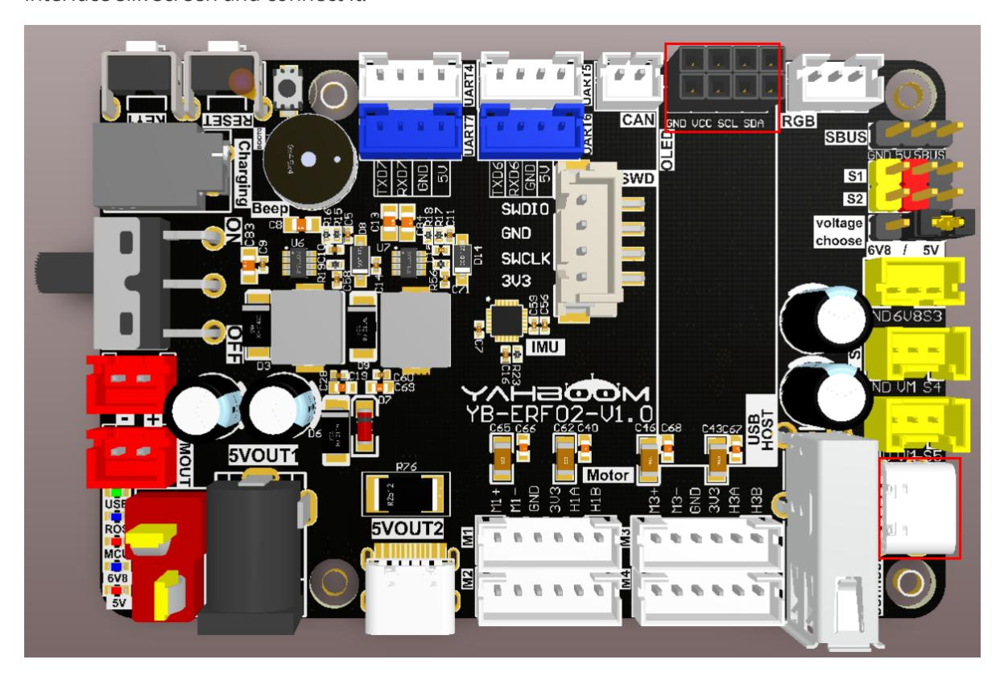
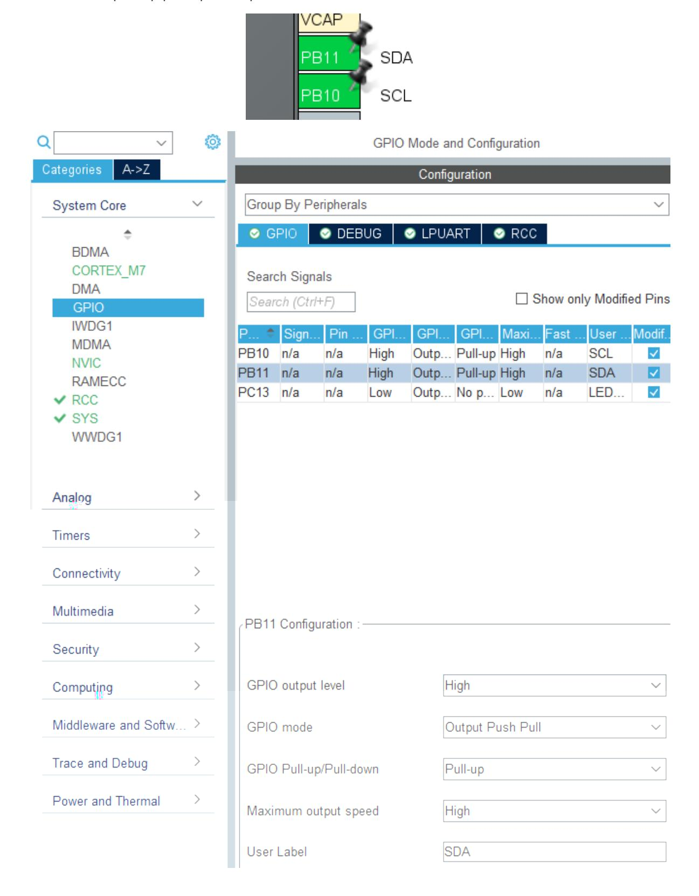
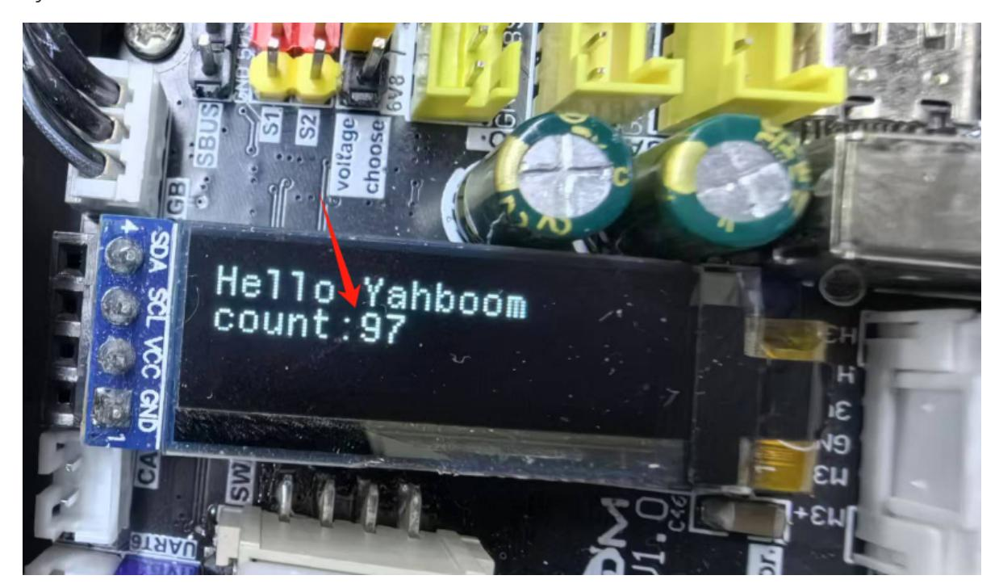

# Driving OLED displays

Driving OLED displays

- 1. Experimental Purpose
- 2. Hardware Connection
- 3. Core code analysis
- 4. Compile, download and burn firmware
- 5. Experimental Results

#### 1. Experimental Purpose

Use the analog I2C function of the STM32 control board to learn how to control the OLED screen.

## 2. Hardware Connection

As shown in the figure below, the STM32 control board integrates an OLED interface, but you need to connect an OLED display separately. You need to prepare your own OLED display and connect a type-C data cable between the computer and the USB Connect interface of the STM32 control board.

Please use a 0.91-inch OLED display with I2C communication protocol.

The two rows of interfaces have the same function. Just choose one of them and align it with the interface silk screen and connect it.



#### 3. Core code analysis

The path corresponding to the program source code is:

Board_Samples/STM32_Samples/OLED

According to the pin assignment, the SCL pin of the OLED screen is connected to PB10, and the SDA pin is connected to PB11. Since the analog I2C method is used, both PB10 and PB11 are initialized to pull-up push-pull output mode.



```
#define SCL_Pin GPIO_PIN_10
#define SCL_GPIO_Port GPIOB
#define SDA_Pin GPIO_PIN_11
#define SDA_GPIO_Port GPIOB
#define SDA_IN() {GPIOB->MODER&=~(3<<(11*2));GPIOB->MODER|=0<<11*2;}
#define SDA_OUT() {GPIOB->MODER&=~(3<<(11*2));GPIOB->MODER|=1<<11*2;}
#define IIC_SCL(a) HAL_GPIO_WritePin(SCL_GPIO_Port, SCL_Pin, a)
#define IIC_SDA(a) HAL_GPIO_WritePin(SDA_GPIO_Port, SDA_Pin, a)
#define READ_SDA HAL_GPIO_ReadPin(SDA_GPIO_Port, SDA_Pin)
```

According to the communication requirements of the OLED screen, software I2C is used here to drive the OLED screen. I2C writes a string of data.

```
uint8_t IIC_Write_Len(uint8_t addr, uint8_t reg, uint8_t len, uint8_t *buf)
{
    uint8_t i;
    IIC_Start();
    IIC_Send_Byte((addr << 1) | 0);
    if (IIC_Wait_Ack())
    {
        IIC_Stop();
        return 1;
    }
    IIC_Send_Byte(reg);
    IIC_Wait_Ack();
    for (i = 0; i < len; i++)
    {
        IIC_Send_Byte(buf[i]);
        if (IIC_Wait_Ack())
        {
            IIC_Stop();
            return 1;
        }
    }
    IIC_Stop();
    return 0;
}
```

I2C writes one byte of data.

```
uint8_t IIC_Write_Byte(uint8_t addr, uint8_t reg, uint8_t data)
{
    IIC_Start();
    IIC_Send_Byte((addr << 1) | 0);
    if (IIC_Wait_Ack())
    {
        IIC_Stop();
        return 1;
    }
    IIC_Send_Byte(reg);
    IIC_Wait_Ack();
    IIC_Send_Byte(data);
    if (IIC_Wait_Ack())
```

```
{
        IIC_Stop();
        return 1;
    }
    IIC_Stop();
    return 0;
}
```

Initialize OLED display parameters.

```
uint8_t SSD1306_Init(void)
{
   /* A little delay */
   uint32_t p = 2500;
   while (p > 0)
       p--;
   /* Init LCD */
   SSD1306_WRITECOMMAND(0xae); // display off
   SSD1306_WRITECOMMAND(0xa6); // Set Normal Display (default)
   SSD1306_WRITECOMMAND(0xAE); // DISPLAYOFF
   SSD1306_WRITECOMMAND(0xD5); // SETDISPLAYCLOCKDIV
   SSD1306_WRITECOMMAND(0x80); // the suggested ratio 0x80
   SSD1306_WRITECOMMAND(0xA8); // SSD1306_SETMULTIPLEX
   SSD1306_WRITECOMMAND(0x1F);
   SSD1306_WRITECOMMAND(0xD3); // SETDISPLAYOFFSET
   SSD1306_WRITECOMMAND(0x00); // no offset
   SSD1306_WRITECOMMAND(0x40 | 0x0); // SETSTARTLINE
   SSD1306_WRITECOMMAND(0x8D); // CHARGEPUMP
   SSD1306_WRITECOMMAND(0x14); // 0x014 enable, 0x010 disable
   SSD1306_WRITECOMMAND(0x20); // com pin HW config, sequential com pin config
(bit 4), disable left/right remap (bit 5),
   SSD1306_WRITECOMMAND(0x02); // 0x12 //128x32 OLED: 0x002, 128x32 OLED 0x012
   SSD1306_WRITECOMMAND(0xa1); // segment remap a0/a1
   SSD1306_WRITECOMMAND(0xc8); // c0: scan dir normal, c8: reverse
   SSD1306_WRITECOMMAND(0xda);
   SSD1306_WRITECOMMAND(0x02); // com pin HW config, sequential com pin config
(bit 4), disable left/right remap (bit 5)
   SSD1306_WRITECOMMAND(0x81);
   SSD1306_WRITECOMMAND(0xcf); // [2] set control contrast
   SSD1306_WRITECOMMAND(0xd9);
   SSD1306_WRITECOMMAND(0xf1); // [2] pre-charge period 0x022/f1
   SSD1306_WRITECOMMAND(0xdb);
   SSD1306_WRITECOMMAND(0x40); // vcomh deselect level
   SSD1306_WRITECOMMAND(0x2e); // Disable scroll
   SSD1306_WRITECOMMAND(0xa4); // output ram to display
   SSD1306_WRITECOMMAND(0xa6); // none inverted normal display mode
   SSD1306_WRITECOMMAND(0xaf); // display on
   /* Clear screen */
   SSD1306_Fill(SSD1306_COLOR_BLACK);
   /* Update screen */
   SSD1306_UpdateScreen();
   /* Set default values */
   SSD1306.CurrentX = 0;
```

```
SSD1306.CurrentY = 0;
    /* Initialized OK */
    SSD1306.Initialized = 1;
    /* Return OK */
    return 1;
}
```

Draw a pixel onto the cached data

```
void SSD1306_DrawPixel(uint16_t x, uint16_t y, SSD1306_COLOR_t color)
{
    if (x >= SSD1306_WIDTH || y >= SSD1306_HEIGHT)
    {
        return; // Error, out of scope
    }
    /* Check if the pixel is Inverted*/
    if (SSD1306.Inverted)
    {
        color = (SSD1306_COLOR_t)!color;
    }
    /* set colors */
    if (color == SSD1306_COLOR_WHITE)
    {
        SSD1306_Buffer[x + (y / 8) * SSD1306_WIDTH] |= 1 << (y % 8);
    }
    else
    {
        SSD1306_Buffer[x + (y / 8) * SSD1306_WIDTH] &= ~(1 << (y % 8));
    }
}
```

Fill all cache data to all off or all on.

```
void SSD1306_Fill(SSD1306_COLOR_t color)
{
    /* Set memory */
    memset(SSD1306_Buffer, (color == SSD1306_COLOR_BLACK) ? 0x00 : 0xFF,
sizeof(SSD1306_Buffer));
}
```

Write the cached data to the OLED screen.

```
void SSD1306_UpdateScreen(void)
{
    uint8_t m;
    for (m = 0; m < 8; m++)
    {
        SSD1306_WRITECOMMAND(0xB0 + m);
        SSD1306_WRITECOMMAND(0x00);
        SSD1306_WRITECOMMAND(0x10);
```

```
/* Write multi data */
        ssd1306_I2C_WriteMulti(SSD1306_I2C_ADDR, 0x40,
&SSD1306_Buffer[SSD1306_WIDTH * m], SSD1306_WIDTH);
    }
}
```

When the device is turned on, it displays "Hello Yahboom" and refreshes the displayed content every 1 second. The count value increases by 1 each time it is refreshed.

```
void App_Handle(void)
{
    int print_count = 0;
    HAL_Delay(100);
    char text_1[] = "Hello Yahboom";
    SSD1306_Init();
    OLED_Draw_Line(text_1, 1, 1, 1);
    printf("Hello Yahboom\n");
    while (1)
    {
        print_count++;
        if (print_count % 100 == 0)
        {
            char text_2[20] = {0};
            sprintf(text_2, "count:%d", print_count/100);
            OLED_Draw_Line(text_1, 1, 1, 0);
            OLED_Draw_Line(text_2, 2, 0, 1);
            printf(text_2);
            printf("\n");
        }
        App_Led_Mcu_Handle();
        HAL_Delay(10);
    }
}
```

## 4. Compile, download and burn firmware

Select the project to be compiled in the file management interface of STM32CUBEIDE and click the compile button on the toolbar to start compiling.


If there are no errors or warnings, the compilation is complete.

Press and hold the BOOT0 button, then press the RESET button to reset, release the BOOT0 button to enter the serial port burning mode. Then use the serial port burning tool to burn the firmware to the board.

If you have STlink or JLink, you can also use STM32CUBEIDE to burn the firmware with one click, which is more convenient and quick.

### 5. Experimental Results

The MCU_LED light flashes every 200 milliseconds.

The information on the OLED screen is refreshed every second, and the count value is increased by 1 each time it is refreshed.


