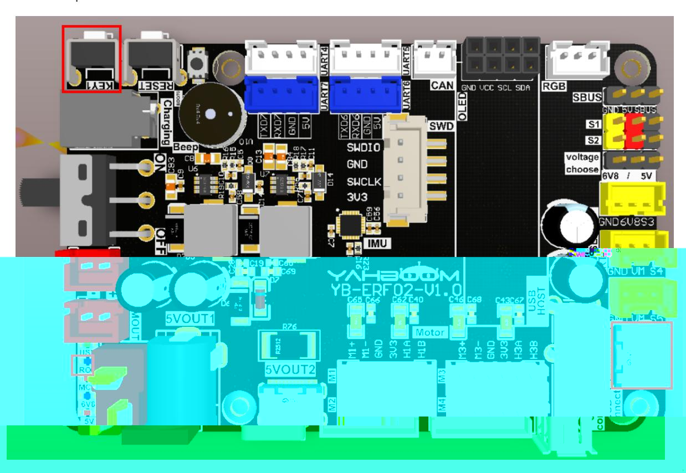
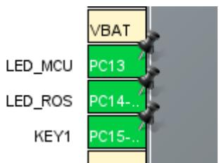
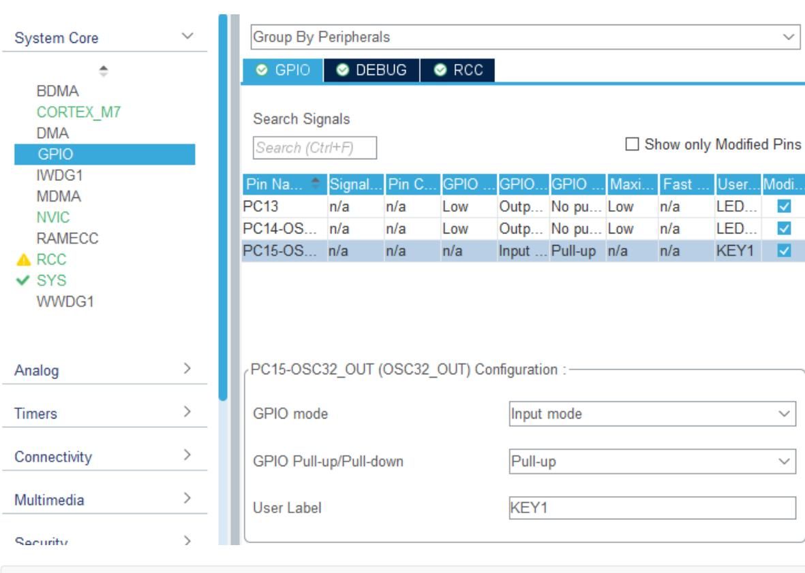
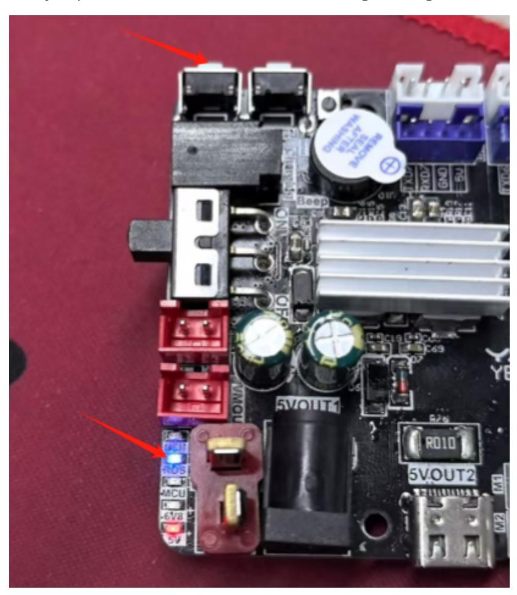

# Button functions

## 1. Experimental Purpose

Read the KEY1 button on the STM32 control board and control the LED indicator light on and off.

## 2. Hardware Connection

As shown in the figure below, the KEY1 button and LED indicator are onboard components, so no external devices are required. Please connect the Type-C data cable to the computer and the USB Connect port on the STM32 control board.



## 3. Core code analysis

Open STM32CUBEIDE and import the project. The path corresponding to the program source code is:

```
Board_Samples/STM32_Samples/Key
```

Initialize the peripheral GPIO, where LED_ROS_GPIO corresponds to PC14 of the hardware circuit, and the GPIO mode is output mode; KEY1_GPIO corresponds to PC15 of the hardware circuit, and the GPIO mode is input pull-up mode.





```
#define LED_MCU_Pin GPIO_PIN_13
#define LED_MCU_GPIO_Port GPIOC
#define LED_ROS_Pin GPIO_PIN_14
#define LED_ROS_GPIO_Port GPIOC
#define KEY1_Pin GPIO_PIN_15
#define KEY1_GPIO_Port GPIOC
void MX_GPIO_Init(void)
{
  GPIO_InitTypeDef GPIO_InitStruct = {0};
  /* GPIO Ports Clock Enable */
  __HAL_RCC_GPIOC_CLK_ENABLE();
  __HAL_RCC_GPIOH_CLK_ENABLE();
  __HAL_RCC_GPIOA_CLK_ENABLE();
```

```
/*Configure GPIO pin Output Level */
  HAL_GPIO_WritePin(GPIOC, LED_MCU_Pin|LED_ROS_Pin, GPIO_PIN_RESET);
  /*Configure GPIO pins : PCPin PCPin */
  GPIO_InitStruct.Pin = LED_MCU_Pin|LED_ROS_Pin;
  GPIO_InitStruct.Mode = GPIO_MODE_OUTPUT_PP;
  GPIO_InitStruct.Pull = GPIO_NOPULL;
  GPIO_InitStruct.Speed = GPIO_SPEED_FREQ_LOW;
  HAL_GPIO_Init(GPIOC, &GPIO_InitStruct);
  /*Configure GPIO pin : PtPin */
  GPIO_InitStruct.Pin = KEY1_Pin;
  GPIO_InitStruct.Mode = GPIO_MODE_INPUT;
  GPIO_InitStruct.Pull = GPIO_PULLUP;
  HAL_GPIO_Init(KEY1_GPIO_Port, &GPIO_InitStruct);
}
```

Turn on the LED light

```
#define LED_MCU_ON() HAL_GPIO_WritePin(LED_MCU_GPIO_Port, LED_MCU_Pin, SET)
#define LED_ROS_ON() HAL_GPIO_WritePin(LED_ROS_GPIO_Port, LED_ROS_Pin, SET)
```

Turn off LED lights

```
#define LED_MCU_OFF() HAL_GPIO_WritePin(LED_MCU_GPIO_Port, LED_MCU_Pin, RESET)
#define LED_ROS_OFF() HAL_GPIO_WritePin(LED_ROS_GPIO_Port, LED_ROS_Pin, RESET)
```

Control the LED light status flip

```
#define LED_MCU_TOGGLE() HAL_GPIO_TogglePin(LED_MCU_GPIO_Port, LED_MCU_Pin)
#define LED_ROS_TOGGLE() HAL_GPIO_TogglePin(LED_ROS_GPIO_Port, LED_ROS_Pin)
```

Read the current state of the key. If pressed, returns KEY_PRESS=1; if released, returns KEY_RELEASE=0.

```
static uint8_t Key1_is_Press(void)
{
    if (!HAL_GPIO_ReadPin(KEY1_GPIO_Port, KEY1_Pin))
    {
        return KEY_PRESS; // If the key is pressed, return KEY_PRESS
    }
    return KEY_RELEASE; // If the key is released, return KEY_RELEASE
}
```

Read the status of key K1 and call it every 10 milliseconds. If KEY1 is pressed, it returns KEY_PRESS; otherwise, it returns KEY_RELEASE.

```
uint8_t Key1_State(void)
{
    static uint16_t key1_state = 0;
    if (Key1_is_Press() == KEY_PRESS)
    {
        if (key1_state < 4)
```

```
{
             key1_state++;
        }
    }
    else
    {
        key1_state = 0;
    }
    if (key1_state == 2)
    {
        return KEY_PRESS;
    }
    return KEY_RELEASE;
}
```

The Key1_State function is called every 10 milliseconds to control the LED_ROS indicator light on and off according to the state value of the KEY1 button.

```
while (1)
{
    if (Key1_State())
    {
        if (led_state)
        {
            led_state = 0;
            LED_ROS_OFF();
        }
        else
        {
            led_state = 1;
            LED_ROS_ON();
        }
    }
    App_Led_Mcu_Handle();
    HAL_Delay(10);
}
```

## 4. Compile, download and burn firmware

Select the project to be compiled in the file management interface of STM32CUBEIDE and click the compile button on the toolbar to start compiling.


If there are no errors or warnings, the compilation is complete.

Press and hold the BOOT0 button, then press the RESET button to reset, release the BOOT0 button to enter the serial port burning mode. Then use the serial port burning tool to burn the firmware to the board.

If you have STlink or JLink, you can also use STM32CUBEIDE to burn the firmware with one click, which is more convenient and quick.

## 5. Experimental Results

The MCU_LED light flashes every 200 milliseconds.

When you press KEY1 once, the LED_ROS light turns on. Press KEY1 again and the LED_ROS light turns off. Each time you press KEY1, the state of the LED_ROS light changes.


