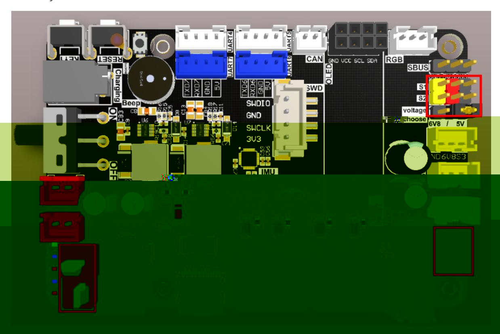
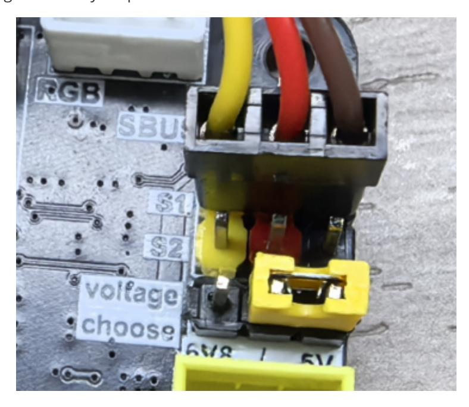
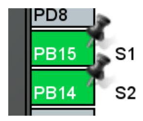
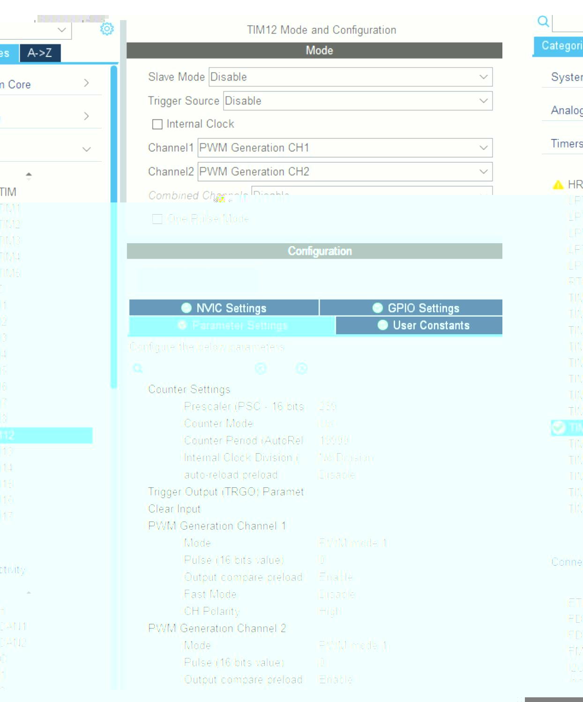
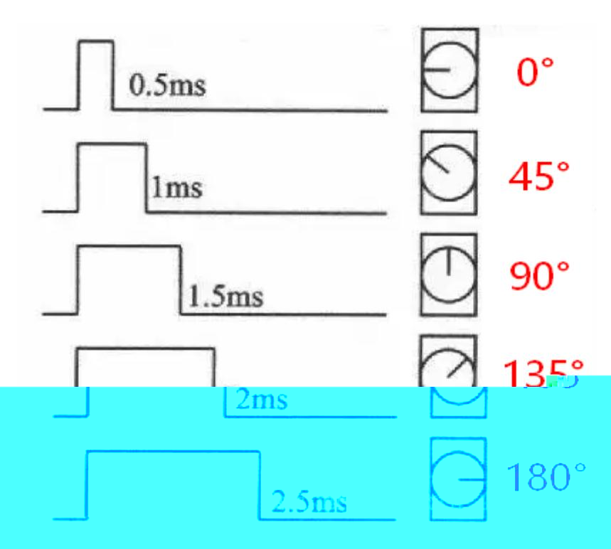
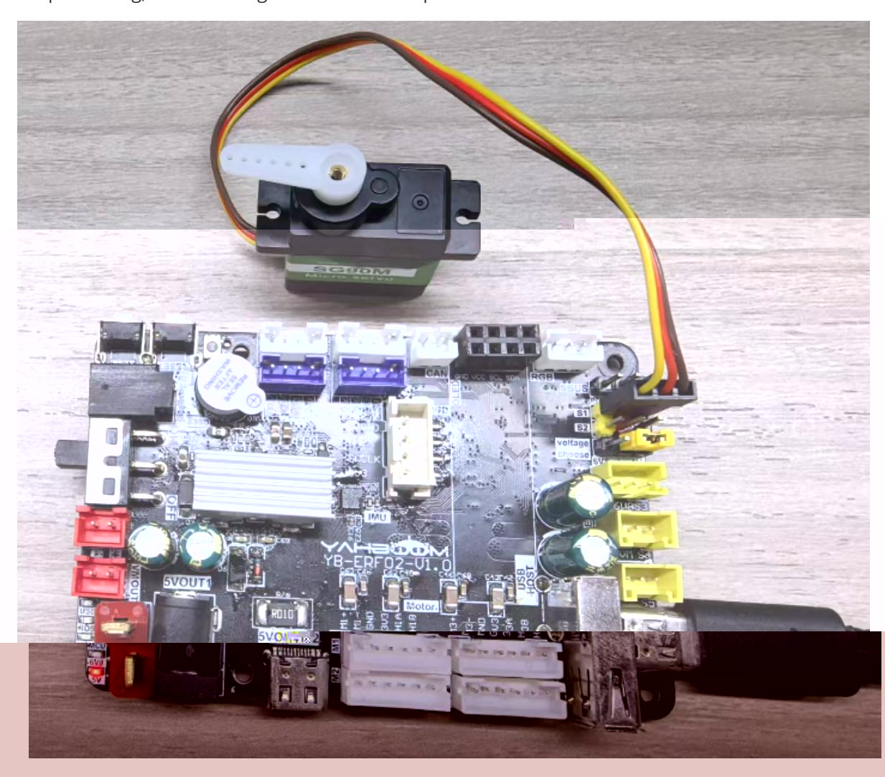

# Driving PWM servos

Driving PWM servos

- 1. Experimental Purpose
- 2. Hardware Connection
- 3. Core code analysis
- 4. Compile, download and burn firmware
- 5. Experimental Results

#### 1. Experimental Purpose

Use the PWM output of the STM32 control board to learn how to control a PWM servo.

## 2. Hardware Connection

As shown in the figure below, the STM32 control board integrates the PWM servo control interface, but it is necessary to connect an additional PWM servo, so the PWM servo must be prepared by yourself.

Please connect the type-C data cable to the computer and the USB Connect port of the STM32 control board.

Since the PWM servo current is relatively large, if there is insufficient power supply, please plug in a battery.



There are two PWM servo ports, S1 and S2, both of which can be connected to PWM servos.

Servo wiring sequence: brown wire connected to GND, red wire connected to 5V, yellow wire connected to S1/S2.

There is a voltage selection function below the PWM servo interface. The default voltage is 5V. If needed, you can change the position of the jumper cap to switch to 6.8V. If you want to use a 6.8V servo, please plug in a battery for power.



## 3. Core code analysis

The path corresponding to the program source code is:

Board_Samples/STM32_Samples/Pwm_Servo

Servo S1 and S2 are assigned to timer TIM12. Servo S1 corresponds to hardware PB15 (TIM12 channel 2), and servo S2 corresponds to hardware PB14 (TIM12 channel 1).





Initialize the timer TIM12 and configure the frequency division coefficient to 239, with a counting range of 0 to 19999. Based on the clock frequency of the timer TIM12 being 240 MHz, the PWM frequency is calculated to be 240000000/(239+1)/(19999+1)=50 Hz.

```
void MX_TIM12_Init(void)
{
  /* USER CODE BEGIN TIM12_Init 0 */
  /* USER CODE END TIM12_Init 0 */
  TIM_MasterConfigTypeDef sMasterConfig = {0};
  TIM_OC_InitTypeDef sConfigOC = {0};
  /* USER CODE BEGIN TIM12_Init 1 */
  /* USER CODE END TIM12_Init 1 */
  htim12.Instance = TIM12;
```

```
htim12.Init.Prescaler = 239;
  htim12.Init.CounterMode = TIM_COUNTERMODE_UP;
  htim12.Init.Period = 19999;
  htim12.Init.ClockDivision = TIM_CLOCKDIVISION_DIV1;
  htim12.Init.AutoReloadPreload = TIM_AUTORELOAD_PRELOAD_DISABLE;
  if (HAL_TIM_PWM_Init(&htim12) != HAL_OK)
  {
    Error_Handler();
  }
  sMasterConfig.MasterOutputTrigger = TIM_TRGO_RESET;
  sMasterConfig.MasterSlaveMode = TIM_MASTERSLAVEMODE_DISABLE;
  if (HAL_TIMEx_MasterConfigSynchronization(&htim12, &sMasterConfig) != HAL_OK)
  {
    Error_Handler();
  }
  sConfigOC.OCMode = TIM_OCMODE_PWM1;
  sConfigOC.Pulse = 0;
  sConfigOC.OCPolarity = TIM_OCPOLARITY_HIGH;
  sConfigOC.OCFastMode = TIM_OCFAST_DISABLE;
  if (HAL_TIM_PWM_ConfigChannel(&htim12, &sConfigOC, TIM_CHANNEL_1) != HAL_OK)
  {
    Error_Handler();
  }
  if (HAL_TIM_PWM_ConfigChannel(&htim12, &sConfigOC, TIM_CHANNEL_2) != HAL_OK)
  {
    Error_Handler();
  }
  /* USER CODE BEGIN TIM12_Init 2 */
  /* USER CODE END TIM12_Init 2 */
  HAL_TIM_MspPostInit(&htim12);
}
```

Initialize the PWM servo, start channel 1 and channel 2 of timer TIM12 to output PWM signals, and set the initial position of the servo to 90 degrees.

```
void PwmServo_Init(void)
{
    // Enable the PWM channel
    HAL_TIM_PWM_Start(&htim12, TIM_CHANNEL_1);
    HAL_TIM_PWM_Start(&htim12, TIM_CHANNEL_2);
    // Set the initial angle to 90 degrees.
    PwmServo_Set_Angle(PWM_SERVO_ID_MAX, 90);
}
```

Convert the servo's input angle into PWM pulse value.

```
static uint32_t Angle_To_Pulse(uint8_t angle)
{
    return (uint32_t)angle * 11 + 500;
}
```

The relationship between the duty cycle and angle of the PWM servo is shown in the figure below:

Note: Different servos may have different angles at the same duty cycle. The calculation method can be adjusted according to actual conditions.



To control the servo angle, you can distinguish the control according to the input servo ID, and then convert the angle value into a PWM pulse value, thereby outputting square waves with different duty cycles to drive the servo to rotate.

```
#define Servo_Set_Pulse_S1(value) TIM12->CCR2=value
#define Servo_Set_Pulse_S2(value) TIM12->CCR1=value
void PwmServo_Set_Angle(uint8_t id, uint8_t angle)
{
    uint16_t pulse = Angle_To_Pulse(angle);
    if (id == PWM_SERVO_ID_1)
    {
        Servo_Set_Pulse_S1(pulse);
        return;
    }
    if (id == PWM_SERVO_ID_2)
    {
        Servo_Set_Pulse_S2(pulse);
        return;
    }
    if (id == PWM_SERVO_ID_MAX)
    {
        Servo_Set_Pulse_S1(pulse);
        Servo_Set_Pulse_S2(pulse);
        return;
    }
}
```

Call the PwmServo_Init function in App_Handle to initialize the servo, and then change the servo angle every 1 second in the loop to make the servo swing back and forth.

```
void App_Handle(void)
```

```
{
    int servo_count = 0;
    int servo_angle = 0;
    PwmServo_Init();
    while (1)
    {
        servo_count++;
        if (servo_count >= 100)
        {
            servo_count = 0;
            if (servo_angle == 0)
            {
                servo_angle = 180;
            }
            else
            {
                servo_angle = 0;
            }
            PwmServo_Set_Angle(PWM_SERVO_ID_MAX, servo_angle);
        }
        App_Led_Mcu_Handle();
        HAL_Delay(10);
    }
}
```

### 4. Compile, download and burn firmware

Select the project to be compiled in the file management interface of STM32CUBEIDE and click the compile button on the toolbar to start compiling.


If there are no errors or warnings, the compilation is complete.

Press and hold the BOOT0 button, then press the RESET button to reset, release the BOOT0 button to enter the serial port burning mode. Then use the serial port burning tool to burn the firmware to the board.

If you have STlink or JLink, you can also use STM32CUBEIDE to burn the firmware with one click, which is more convenient and quick.

#### 5. Experimental Results

The MCU_LED light flashes every 200 milliseconds.

The angle of the servo is changed every second, from 0 to 180, and then from 180 to 0, and it keeps running, thus realizing the function of repeated rotation of the servo.


