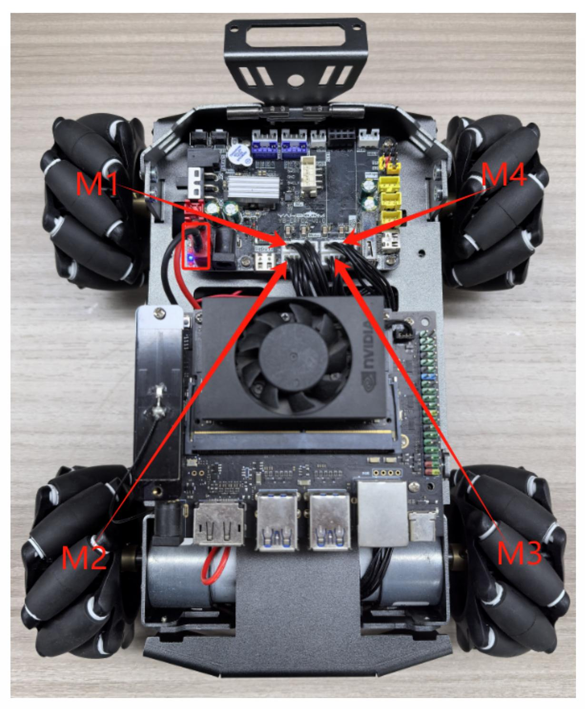
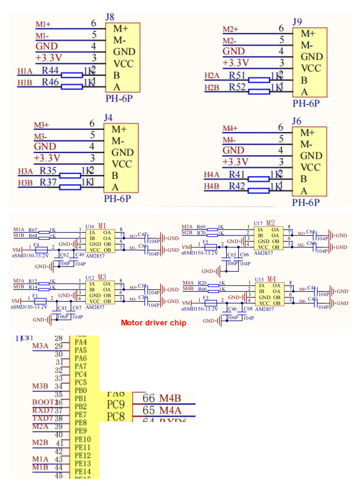
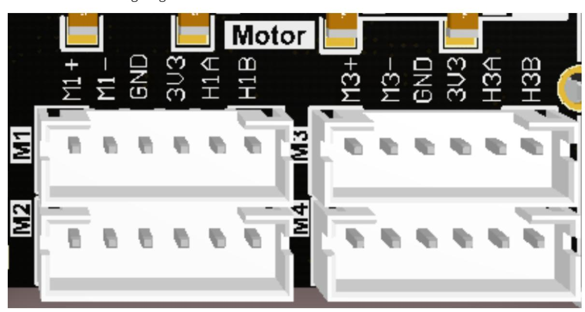
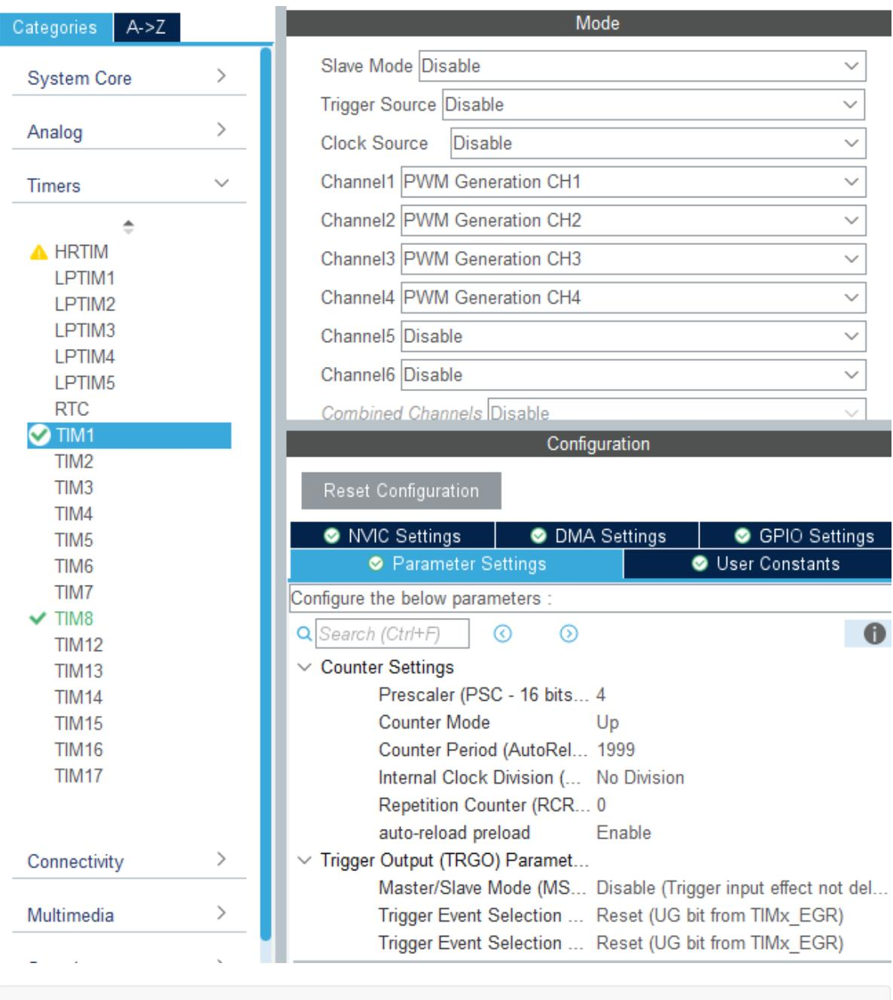
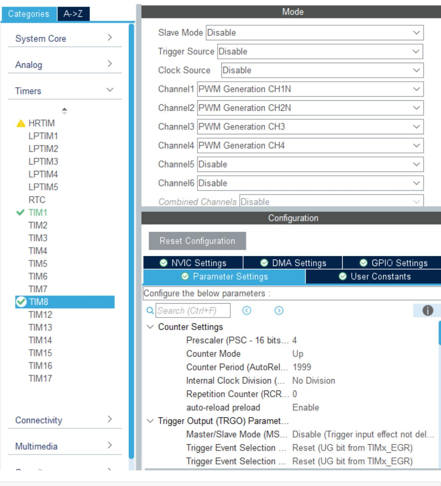

# Drive motor

#### Drive motor

- 1. Experimental Purpose
- 2. Hardware Connection
- 3. Core code analysis
- 4. Compile, download and burn firmware
- 5. Experimental Results

#### 1. Experimental Purpose

Learn how to control motors using the PWM output of the STM32 control board.

**Note: Since the motor starts moving after the program is downloaded, please suspend the car or motor in the air first to avoid the car running around.**

#### 2. Hardware Connection

As shown in the figure below, the STM32 control board integrates four encoder motor control interfaces. This requires additional connection to the encoder motor. The motor control interface supports 520 encoder motors. Because the encoder voltage requires high voltage and high current, a battery must be plugged in for power.

The corresponding names of the four motor interfaces are: left front wheel -> M1, left rear wheel - > M2, right front wheel -> M3, right rear wheel -> M4.



There is a detailed line sequence silk screen near the motor interface. Here we take motor M1 as an example. M1+ and M1- are the interfaces for controlling the rotation of the motor, GND and +3.3V are the power supply circuits for the encoder, and H1A and H1B are the encoder pulse detection pins.



The corresponding relationship between the motor PWM drive GPIO is shown in the following table:

| Motor interface PWM signal | STM32 GPIO numbering | STM32 timer channels |
|----------------------------|----------------------|----------------------|
| M1+(M1A)                   | PE13                 | TIM1_CH3             |
| M1-(M1B)                   | PE14                 | TIM1_CH4             |
| M2+(M2A)                   | PE9                  | TIM1_CH1             |
| M2-(M2B)                   | PE11                 | TIM1_CH2             |
| M3+(M3A)                   | PA5                  | TIM8_CH1N            |
| M3-(M3B)                   | PB0                  | TIM8_CH2N            |
| M4+(M4A)                   | PC8                  | TIM8_CH3             |
| M4-(M4B)                   | PC9                  | TIM8_CH4             |

Motor interface wiring diagram:



## 3. Core code analysis

The path corresponding to the program source code is:

Board_Samples/STM32_Samples/Motor

First, initialize the configuration parameters of timer TIM1, set the division coefficient to 4, and the counting range to 0~1999. Since the clock frequency of timer TIM1 is 240Mhz, the PWM frequency is calculated to be 240000000/(4+1)/(1999+1)=24kHz.



```
void MX_TIM1_Init(void)
{
  TIM_MasterConfigTypeDef sMasterConfig = {0};
  TIM_OC_InitTypeDef sConfigOC = {0};
  TIM_BreakDeadTimeConfigTypeDef sBreakDeadTimeConfig = {0};
  /* USER CODE BEGIN TIM1_Init 1 */
  /* USER CODE END TIM1_Init 1 */
  htim1.Instance = TIM1;
  htim1.Init.Prescaler = 4;
  htim1.Init.CounterMode = TIM_COUNTERMODE_UP;
  htim1.Init.Period = 1999;
  htim1.Init.ClockDivision = TIM_CLOCKDIVISION_DIV1;
  htim1.Init.RepetitionCounter = 0;
  htim1.Init.AutoReloadPreload = TIM_AUTORELOAD_PRELOAD_ENABLE;
  if (HAL_TIM_PWM_Init(&htim1) != HAL_OK)
  {
    Error_Handler();
  }
  sMasterConfig.MasterOutputTrigger = TIM_TRGO_RESET;
```

```
sMasterConfig.MasterOutputTrigger2 = TIM_TRGO2_RESET;
  sMasterConfig.MasterSlaveMode = TIM_MASTERSLAVEMODE_DISABLE;
  if (HAL_TIMEx_MasterConfigSynchronization(&htim1, &sMasterConfig) != HAL_OK)
  {
    Error_Handler();
  }
  sConfigOC.OCMode = TIM_OCMODE_PWM1;
  sConfigOC.Pulse = 0;
  sConfigOC.OCPolarity = TIM_OCPOLARITY_HIGH;
  sConfigOC.OCNPolarity = TIM_OCNPOLARITY_HIGH;
  sConfigOC.OCFastMode = TIM_OCFAST_DISABLE;
  sConfigOC.OCIdleState = TIM_OCIDLESTATE_RESET;
  sConfigOC.OCNIdleState = TIM_OCNIDLESTATE_RESET;
  if (HAL_TIM_PWM_ConfigChannel(&htim1, &sConfigOC, TIM_CHANNEL_1) != HAL_OK)
  {
    Error_Handler();
  }
  if (HAL_TIM_PWM_ConfigChannel(&htim1, &sConfigOC, TIM_CHANNEL_2) != HAL_OK)
  {
    Error_Handler();
  }
  if (HAL_TIM_PWM_ConfigChannel(&htim1, &sConfigOC, TIM_CHANNEL_3) != HAL_OK)
  {
    Error_Handler();
  }
  if (HAL_TIM_PWM_ConfigChannel(&htim1, &sConfigOC, TIM_CHANNEL_4) != HAL_OK)
  {
    Error_Handler();
  }
  sBreakDeadTimeConfig.OffStateRunMode = TIM_OSSR_DISABLE;
  sBreakDeadTimeConfig.OffStateIDLEMode = TIM_OSSI_DISABLE;
  sBreakDeadTimeConfig.LockLevel = TIM_LOCKLEVEL_OFF;
  sBreakDeadTimeConfig.DeadTime = 0;
  sBreakDeadTimeConfig.BreakState = TIM_BREAK_DISABLE;
  sBreakDeadTimeConfig.BreakPolarity = TIM_BREAKPOLARITY_HIGH;
  sBreakDeadTimeConfig.BreakFilter = 0;
  sBreakDeadTimeConfig.Break2State = TIM_BREAK2_DISABLE;
  sBreakDeadTimeConfig.Break2Polarity = TIM_BREAK2POLARITY_HIGH;
  sBreakDeadTimeConfig.Break2Filter = 0;
  sBreakDeadTimeConfig.AutomaticOutput = TIM_AUTOMATICOUTPUT_DISABLE;
  if (HAL_TIMEx_ConfigBreakDeadTime(&htim1, &sBreakDeadTimeConfig) != HAL_OK)
  {
    Error_Handler();
  }
  HAL_TIM_MspPostInit(&htim1);
}
```

定时器TIM8的初始化参数与定时器TIM1的参数一致。



```
void MX_TIM8_Init(void)
{
  TIM_MasterConfigTypeDef sMasterConfig = {0};
  TIM_OC_InitTypeDef sConfigOC = {0};
  TIM_BreakDeadTimeConfigTypeDef sBreakDeadTimeConfig = {0};
  /* USER CODE BEGIN TIM8_Init 1 */
  /* USER CODE END TIM8_Init 1 */
  htim8.Instance = TIM8;
  htim8.Init.Prescaler = 4;
  htim8.Init.CounterMode = TIM_COUNTERMODE_UP;
  htim8.Init.Period = 1999;
  htim8.Init.ClockDivision = TIM_CLOCKDIVISION_DIV1;
  htim8.Init.RepetitionCounter = 0;
  htim8.Init.AutoReloadPreload = TIM_AUTORELOAD_PRELOAD_ENABLE;
  if (HAL_TIM_PWM_Init(&htim8) != HAL_OK)
  {
    Error_Handler();
  }
  sMasterConfig.MasterOutputTrigger = TIM_TRGO_RESET;
  sMasterConfig.MasterOutputTrigger2 = TIM_TRGO2_RESET;
```

```
sMasterConfig.MasterSlaveMode = TIM_MASTERSLAVEMODE_DISABLE;
  if (HAL_TIMEx_MasterConfigSynchronization(&htim8, &sMasterConfig) != HAL_OK)
  {
    Error_Handler();
  }
  sConfigOC.OCMode = TIM_OCMODE_PWM1;
  sConfigOC.Pulse = 0;
  sConfigOC.OCPolarity = TIM_OCPOLARITY_HIGH;
  sConfigOC.OCNPolarity = TIM_OCNPOLARITY_HIGH;
  sConfigOC.OCFastMode = TIM_OCFAST_DISABLE;
  sConfigOC.OCIdleState = TIM_OCIDLESTATE_RESET;
  sConfigOC.OCNIdleState = TIM_OCNIDLESTATE_RESET;
  if (HAL_TIM_PWM_ConfigChannel(&htim8, &sConfigOC, TIM_CHANNEL_1) != HAL_OK)
  {
    Error_Handler();
  }
  if (HAL_TIM_PWM_ConfigChannel(&htim8, &sConfigOC, TIM_CHANNEL_2) != HAL_OK)
  {
    Error_Handler();
  }
  if (HAL_TIM_PWM_ConfigChannel(&htim8, &sConfigOC, TIM_CHANNEL_3) != HAL_OK)
  {
    Error_Handler();
  }
  if (HAL_TIM_PWM_ConfigChannel(&htim8, &sConfigOC, TIM_CHANNEL_4) != HAL_OK)
  {
    Error_Handler();
  }
  sBreakDeadTimeConfig.OffStateRunMode = TIM_OSSR_DISABLE;
  sBreakDeadTimeConfig.OffStateIDLEMode = TIM_OSSI_DISABLE;
  sBreakDeadTimeConfig.LockLevel = TIM_LOCKLEVEL_OFF;
  sBreakDeadTimeConfig.DeadTime = 0;
  sBreakDeadTimeConfig.BreakState = TIM_BREAK_DISABLE;
  sBreakDeadTimeConfig.BreakPolarity = TIM_BREAKPOLARITY_HIGH;
  sBreakDeadTimeConfig.BreakFilter = 0;
  sBreakDeadTimeConfig.Break2State = TIM_BREAK2_DISABLE;
  sBreakDeadTimeConfig.Break2Polarity = TIM_BREAK2POLARITY_HIGH;
  sBreakDeadTimeConfig.Break2Filter = 0;
  sBreakDeadTimeConfig.AutomaticOutput = TIM_AUTOMATICOUTPUT_DISABLE;
  if (HAL_TIMEx_ConfigBreakDeadTime(&htim8, &sBreakDeadTimeConfig) != HAL_OK)
  {
    Error_Handler();
  }
  /* USER CODE BEGIN TIM8_Init 2 */
  /* USER CODE END TIM8_Init 2 */
  HAL_TIM_MspPostInit(&htim8);
}
```

```
void Motor_Init(void)
{
    HAL_TIM_PWM_Start(&htim1, TIM_CHANNEL_1);
    HAL_TIM_PWM_Start(&htim1, TIM_CHANNEL_2);
    HAL_TIM_PWM_Start(&htim1, TIM_CHANNEL_3);
    HAL_TIM_PWM_Start(&htim1, TIM_CHANNEL_4);
    HAL_TIMEx_PWMN_Start(&htim8, TIM_CHANNEL_1);
    HAL_TIMEx_PWMN_Start(&htim8, TIM_CHANNEL_2);
    HAL_TIM_PWM_Start(&htim8, TIM_CHANNEL_3);
    HAL_TIM_PWM_Start(&htim8, TIM_CHANNEL_4);
}
```

将电机PWM通道与定时器的对应关系使用宏定义关联。

```
#define PWM_M1_A TIM1->CCR3
#define PWM_M1_B TIM1->CCR4
#define PWM_M2_A TIM1->CCR1
#define PWM_M2_B TIM1->CCR2
#define PWM_M3_A TIM8->CCR1
#define PWM_M3_B TIM8->CCR2
#define PWM_M4_A TIM8->CCR3
#define PWM_M4_B TIM8->CCR4
```

由于电机的启动电压过低时无法转动,所以需要增加死区过滤,控制电机才更加敏捷。

```
#define MOTOR_IGNORE_PULSE (999)
static int16_t Motor_Ignore_Dead_Zone(int16_t pulse)
{
    if (pulse > 0) return pulse + MOTOR_IGNORE_PULSE;
    if (pulse < 0) return pulse - MOTOR_IGNORE_PULSE;
    return 0;
}
```

需要限制输入的PWM值。

```
#define MOTOR_MAX_PULSE (1999)
static int16_t Motor_Limit_Pulse(int16_t pulse)
{
    if (pulse >= MOTOR_MAX_PULSE) return MOTOR_MAX_PULSE;
    if (pulse <= -MOTOR_MAX_PULSE) return -MOTOR_MAX_PULSE;
    return pulse;
}
```

设置电机速度,传入电机ID值来区分电机,speed用来控制电机的速度,取值范围是 ±MOTOR_MAX_SPEED。

```
#define MOTOR_MAX_SPEED (1000)
```

```
typedef enum {
    MOTOR_ID_M1 = 0,
    MOTOR_ID_M2,
    MOTOR_ID_M3,
    MOTOR_ID_M4,
    MOTOR_ID_MAX
} Motor_ID;
void Motor_Set_Pwm(uint8_t id, int16_t speed)
{
    int16_t pulse = Motor_Ignore_Dead_Zone(speed);
    // Limit input 限制输入
    pulse = Motor_Limit_Pulse(pulse);
    switch (id)
    {
    case MOTOR_ID_M1:
    {
        pulse = -pulse;
        if (pulse >= 0)
        {
            PWM_M1_A = pulse;
            PWM_M1_B = 0;
        }
        else
        {
            PWM_M1_A = 0;
            PWM_M1_B = -pulse;
        }
        break;
    }
    case MOTOR_ID_M2:
    {
        pulse = -pulse;
        if (pulse >= 0)
        {
            PWM_M2_A = pulse;
            PWM_M2_B = 0;
        }
        else
        {
            PWM_M2_A = 0;
            PWM_M2_B = -pulse;
        }
        break;
    }
    case MOTOR_ID_M3:
    {
        if (pulse >= 0)
        {
            PWM_M3_A = pulse;
            PWM_M3_B = 0;
        }
        else
        {
            PWM_M3_A = 0;
            PWM_M3_B = -pulse;
        }
```

```
break;
    }
    case MOTOR_ID_M4:
    {
        if (pulse >= 0)
        {
            PWM_M4_A = pulse;
            PWM_M4_B = 0;
        }
        else
        {
            PWM_M4_A = 0;
            PWM_M4_B = -pulse;
        }
        break;
    }
    case MOTOR_ID_MAX:
    {
        if (pulse >= 0)
        {
            PWM_M1_A = 0;
            PWM_M1_B = Motor_ABS(pulse);
            PWM_M2_A = 0;
            PWM_M2_B = Motor_ABS(pulse);
            PWM_M3_A = Motor_ABS(pulse);
            PWM_M3_B = 0;
            PWM_M4_A = Motor_ABS(pulse);
            PWM_M4_B = 0;
        }
        else
        {
            PWM_M1_A = Motor_ABS(pulse);
            PWM_M1_B = 0;
            PWM_M2_A = Motor_ABS(pulse);
            PWM_M2_B = 0;
            PWM_M3_A = 0;
            PWM_M3_B = Motor_ABS(pulse);
            PWM_M4_A = 0;
            PWM_M4_B = Motor_ABS(pulse);
        }
        break;
    }
    default:
        break;
    }
}
```

电机停止函数,brake函数为停止状态,brake=MOTOR_STOP表示自由停止,brake=MOTOR_BRAKE 表示刹车停止。

```
typedef enum {
    MOTOR_STOP = 0,
    MOTOR_BRAKE=1,
} Motor_Stop_Mode;
```

```
void Motor_Stop(uint8_t brake)
{
    if (brake != 0) brake = 1;
    PWM_M1_A = brake * MOTOR_MAX_PULSE;
    PWM_M1_B = brake * MOTOR_MAX_PULSE;
    PWM_M2_A = brake * MOTOR_MAX_PULSE;
    PWM_M2_B = brake * MOTOR_MAX_PULSE;
    PWM_M3_A = brake * MOTOR_MAX_PULSE;
    PWM_M3_B = brake * MOTOR_MAX_PULSE;
    PWM_M4_A = brake * MOTOR_MAX_PULSE;
    PWM_M4_B = brake * MOTOR_MAX_PULSE;
}
```

在App_Handle函数里控制电机循环执行:前进1秒,停止1秒,后退1秒,停止1秒。

```
void App_Handle(void)
{
    Motor_Init();
    HAL_Delay(1000);
    while (1)
    {
        Motor_Set_Pwm(MOTOR_ID_M1, MOTOR_MAX_PULSE/3);
        Motor_Set_Pwm(MOTOR_ID_M2, MOTOR_MAX_PULSE/3);
        Motor_Set_Pwm(MOTOR_ID_M3, MOTOR_MAX_PULSE/3);
        Motor_Set_Pwm(MOTOR_ID_M4, MOTOR_MAX_PULSE/3);
        HAL_Delay(1000);
        Motor_Stop(MOTOR_STOP);
        HAL_Delay(1000);
        Motor_Set_Pwm(MOTOR_ID_M1, -MOTOR_MAX_PULSE/3);
        Motor_Set_Pwm(MOTOR_ID_M2, -MOTOR_MAX_PULSE/3);
        Motor_Set_Pwm(MOTOR_ID_M3, -MOTOR_MAX_PULSE/3);
        Motor_Set_Pwm(MOTOR_ID_M4, -MOTOR_MAX_PULSE/3);
        HAL_Delay(1000);
        Motor_Stop(MOTOR_BRAKE);
        HAL_Delay(1000);
    }
}
```

## 4. Compile, download and burn firmware

Select the project to be compiled in the file management interface of STM32CUBEIDE and click the compile button on the toolbar to start compiling.


If there are no errors or warnings, the compilation is complete.

Press and hold the BOOT0 button, then press the RESET button to reset, release the BOOT0 button to enter the serial port burning mode. Then use the serial port burning tool to burn the firmware to the board.

If you have STlink or JLink, you can also use STM32CUBEIDE to burn the firmware with one click, which is more convenient and quick.

### 5. Experimental Results

**Note: Since the motor starts moving after the program is downloaded, please suspend the car or motor in the air first to avoid the car running around.**

The MCU_LED light flashes every 200 milliseconds.

The car motor moves forward for 1 second, stops for 1 second, moves backward for 1 second, and stops for 1 second.
