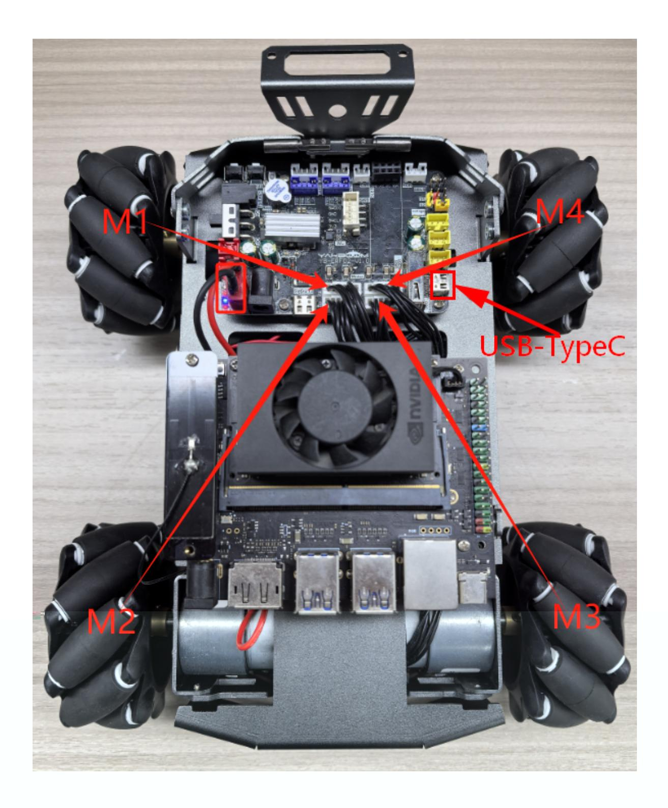
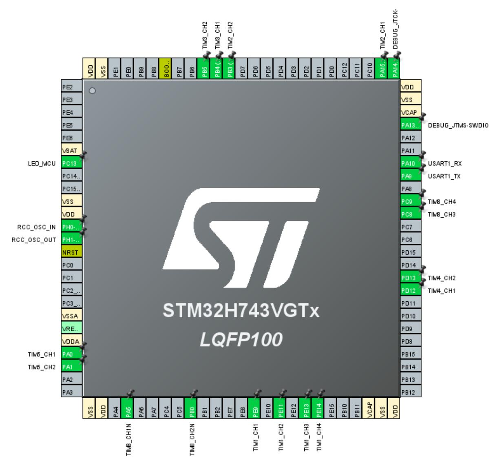

# PID control of motor speed

PID control of motor speed

- 1. Experimental Purpose
- 2. Hardware Connection
- 3. Core code analysis
- 4. Compile, download and burn firmware
- 5. Experimental Results

### 1. Experimental Purpose

Use the encoder motor interface of the STM32 control board to learn how to use the number of motor encoder pulses combined with the PID algorithm to control the speed of the motor.

#### 2. Hardware Connection

As shown in the figure below, the STM32 control board integrates four encoder motor control interfaces. This requires additional connection to an encoder motor. The motor control interface supports 520 encoder motors. Because encoder motors require high voltage and current, they must be powered by a battery.

Use a type-C data cable to connect the computer USB and the USB Connect port of the STM32 control board.

The corresponding names of the four motor interfaces are: left front wheel -> M1, left rear wheel - > M2, right front wheel -> M3, right rear wheel -> M4.



## 3. Core code analysis

The path corresponding to the program source code is:

Board_Samples/STM32_Samples/Motor_PID

The encoder motor hardware configuration is a combination of motor and encoder settings.



This time, the incremental PID algorithm is used to control the motor. A motor_pid_t structure is defined to store PID related parameters. A motor_data_t structure is defined to store motor speed related parameters.

```
typedef struct _pid_t
{
   float target_val; //target value
   float pwm_output; //PWM output value
   float Kp,Ki,Kd; //Define proportional, integral and differential
coefficients
   float err; //define the deviation value
   float err_last; //define the last deviation value
   float err_next; //define the next deviation value, incremental
   float integral; //Define integral value, positional formula
} motor_pid_t;
typedef struct _motor_data_t
{
   float speed_mm_s[4]; // Input value, encoder calculation speed Input value,
encoder calculation speed
   float speed_pwm[4]; // Output value, PID calculates PWM value Output value,
PID calculates PWM value
   int16_t speed_set[4]; // Speed setting value
} motor_data_t;
```

When the motors are initialized, the PID parameters of the four motors are set to the default values.

```
void PID_Param_Init(void)
{
    for (int i = 0; i < MOTOR_ID_MAX; i++)
    {
        pid_motor[i].target_val = 0.0;
        pid_motor[i].pwm_output = 0.0;
        pid_motor[i].err = 0.0;
        pid_motor[i].err_last = 0.0;
        pid_motor[i].err_next = 0.0;
        pid_motor[i].integral = 0.0;
        pid_motor[i].Kp = PID_DEF_KP;
        pid_motor[i].Ki = PID_DEF_KI;
        pid_motor[i].Kd = PID_DEF_KD;
    }
}
```

Implementation function of the incremental PID algorithm.

```
float PID_Incre_Calc(motor_pid_t *pid, float actual_val)
{
    pid->err = pid->target_val - actual_val;
    pid->pwm_output += pid->Kp * (pid->err - pid->err_next)
                    + pid->Ki * pid->err
                    + pid->Kd * (pid->err - 2 * pid->err_next + pid->err_last);
    pid->err_last = pid->err_next;
    pid->err_next = pid->err;
    if (pid->pwm_output > MOTOR_MAX_SPEED) pid->pwm_output = MOTOR_MAX_SPEED;
    if (pid->pwm_output < -MOTOR_MAX_SPEED) pid->pwm_output = -MOTOR_MAX_SPEED;
    return pid->pwm_output;
}
```

The speed parameter obtained by the motor encoder is passed in, and the PWM value of the motor is calculated using the incremental PID algorithm.

```
void PID_Calc_Motor(motor_data_t* motor)
{
    for (int i = 0; i < MOTOR_ID_MAX; i++)
    {
        motor->speed_pwm[i] = PID_Incre_Calc(&pid_motor[i], motor-
>speed_mm_s[i]);
    }
}
```

Set the PID target value.

```
void PID_Set_Motor_Target(uint8_t motor_id, float target)
{
    if (motor_id > MOTOR_ID_MAX) return;
    if (motor_id == MOTOR_ID_MAX)
```

```
{
        for (int i = 0; i < MOTOR_ID_MAX; i++)
        {
            pid_motor[i].target_val = target;
        }
    }
    else
    {
        pid_motor[motor_id].target_val = target;
    }
}
```

Clear PID parameters.

```
void PID_Clear_Motor(uint8_t motor_id)
{
    if (motor_id > MOTOR_ID_MAX) return;
    if (motor_id == MOTOR_ID_MAX)
    {
        for (int i = 0; i < MOTOR_ID_MAX; i++)
        {
            pid_motor[i].pwm_output = 0.0;
            pid_motor[i].err = 0.0;
            pid_motor[i].err_last = 0.0;
            pid_motor[i].err_next = 0.0;
            pid_motor[i].integral = 0.0;
        }
    }
    else
    {
        pid_motor[motor_id].pwm_output = 0.0;
        pid_motor[motor_id].err = 0.0;
        pid_motor[motor_id].err_last = 0.0;
        pid_motor[motor_id].err_next = 0.0;
        pid_motor[motor_id].integral = 0.0;
    }
}
```

Set the encoder motor's operating speed and convert the motor speed parameter into a PID target parameter value. The motor speed parameter range is related to the encoder motor and wheels. For example, the speed_m value range is [-700, 700].

```
void Motion_Set_Speed(int16_t speed_m1, int16_t speed_m2, int16_t speed_m3,
int16_t speed_m4)
{
    g_start_ctrl = 1;
    motor_data.speed_set[0] = speed_m1;
    motor_data.speed_set[1] = speed_m2;
    motor_data.speed_set[2] = speed_m3;
    motor_data.speed_set[3] = speed_m4;
    for (uint8_t i = 0; i < MOTOR_ID_MAX; i++)
    {
        PID_Set_Motor_Target(i, motor_data.speed_set[i]*1.0);
    }
}
```

Read the motor speed, calculate the motor speed based on the data captured by the encoder and the circumference of the wheel, and save the speed value to the speed_motors variable.

```
void Motion_Get_Speed(int16_t* speed_motors)
{
    Motion_Get_Encoder();
    float circle_m = Motion_Get_Circle_M();
    float speed_m1 = (g_Encoder_All_Offset[0]) * 100 * circle_m /
ENCODER_CIRCLE;
    float speed_m2 = (g_Encoder_All_Offset[1]) * 100 * circle_m /
ENCODER_CIRCLE;
    float speed_m3 = (g_Encoder_All_Offset[2]) * 100 * circle_m /
ENCODER_CIRCLE;
    float speed_m4 = (g_Encoder_All_Offset[3]) * 100 * circle_m /
ENCODER_CIRCLE;
    speed_motors[0] = speed_m1 * 1000;
    speed_motors[1] = speed_m2 * 1000;
    speed_motors[2] = speed_m3 * 1000;
    speed_motors[3] = speed_m4 * 1000;
    if (g_start_ctrl)
    {
        motor_data.speed_mm_s[0] = speed_m1*1000;
        motor_data.speed_mm_s[1] = speed_m2*1000;
        motor_data.speed_mm_s[2] = speed_m3*1000;
        motor_data.speed_mm_s[3] = speed_m4*1000;
        PID_Calc_Motor(&motor_data);
    }
}
```

The Motion_Handle function is called every 10 milliseconds in the loop to read, calculate, and control the motor speed. To facilitate display, the function of printing the motor speed value through the serial port is added.

```
void Motion_Handle(void)
{
    Motion_Get_Speed(speed_data);
    debug_count++;
    if (debug_count >= 30)
    {
        debug_count = 0;
        printf("motor speed:%d, %d, %d, %d\n", speed_data[0], speed_data[1],
speed_data[2], speed_data[3]);
    }
    if (g_start_ctrl)
    {
        Motion_Set_Pwm(motor_data.speed_pwm[0], motor_data.speed_pwm[1],
                motor_data.speed_pwm[2], motor_data.speed_pwm[3]);
    }
}
```

Initialize the encoder motor and PID parameters in App_Handle, and then set the speed of the four motors to 300, indicating a forward speed of 0.3m/s.

```
void App_Handle(void)
{
    Motor_Init();
    Encoder_Init();
    PID_Param_Init();
    HAL_Delay(1000);
    Motion_Set_Speed(300, 300, 300, 300);
    while (1)
    {
        App_Led_Mcu_Handle();
        Motion_Handle();
        HAL_Delay(10);
    }
}
```

### 4. Compile, download and burn firmware

Select the project to be compiled in the file management interface of STM32CUBEIDE and click the compile button on the toolbar to start compiling.


If there are no errors or warnings, the compilation is complete.

Press and hold the BOOT0 button, then press the RESET button to reset, release the BOOT0 button to enter the serial port burning mode. Then use the serial port burning tool to burn the firmware to the board.

If you have STlink or JLink, you can also use STM32CUBEIDE to burn the firmware with one click, which is more convenient and quick.

### 5. Experimental Results

**Note: Since the motor starts moving after the program is downloaded, please suspend the car or motor in the air first to avoid the car running around.**

The MCU_LED light flashes every 200 milliseconds.

The car moves forward at a speed of 0.3m/s.

Open the serial port assistant and check that the four motors are running at around 300, which is normal.

Regarding the speed deviation issue: Due to the differences between each motor and hardware issues such as encoder capture accuracy, the PID algorithm is a dynamic process in adjusting the motor PWM, so as long as the speed is close to the set value, it is considered normal.

At this point, you can add some resistance to the wheels to see if the PID algorithm can maintain the speed of the car normally. If it can still be maintained near the set value after adding resistance, it is normal.
