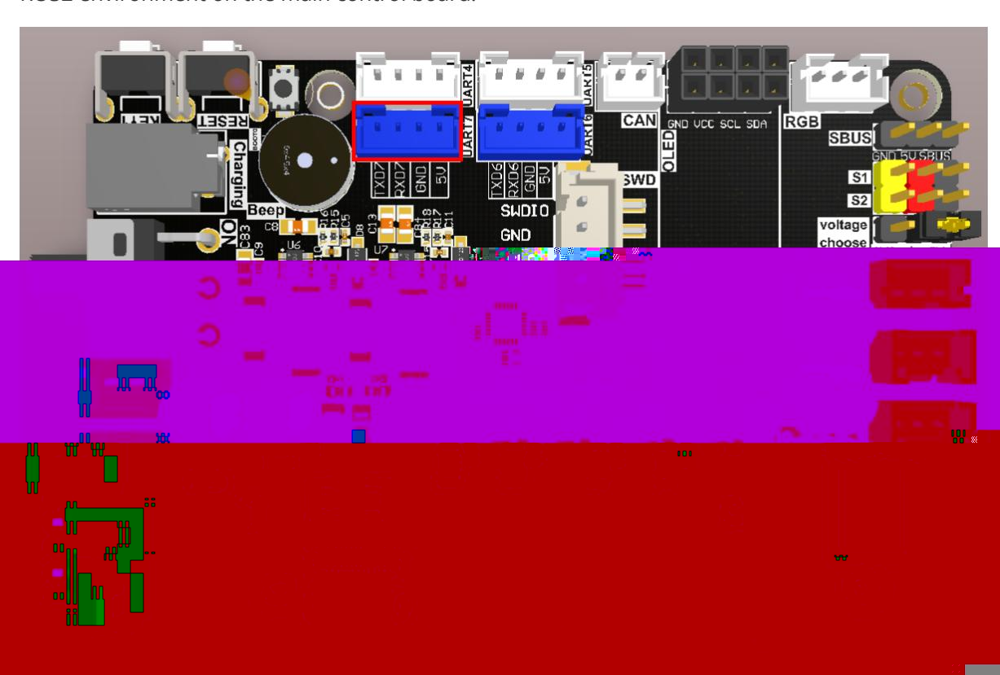
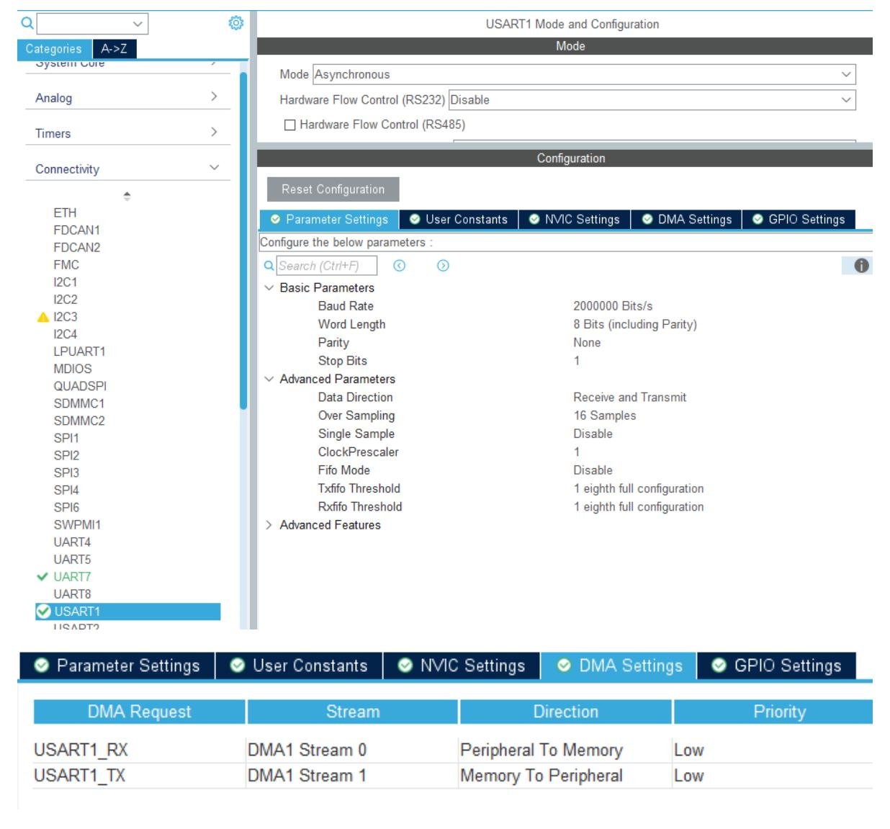
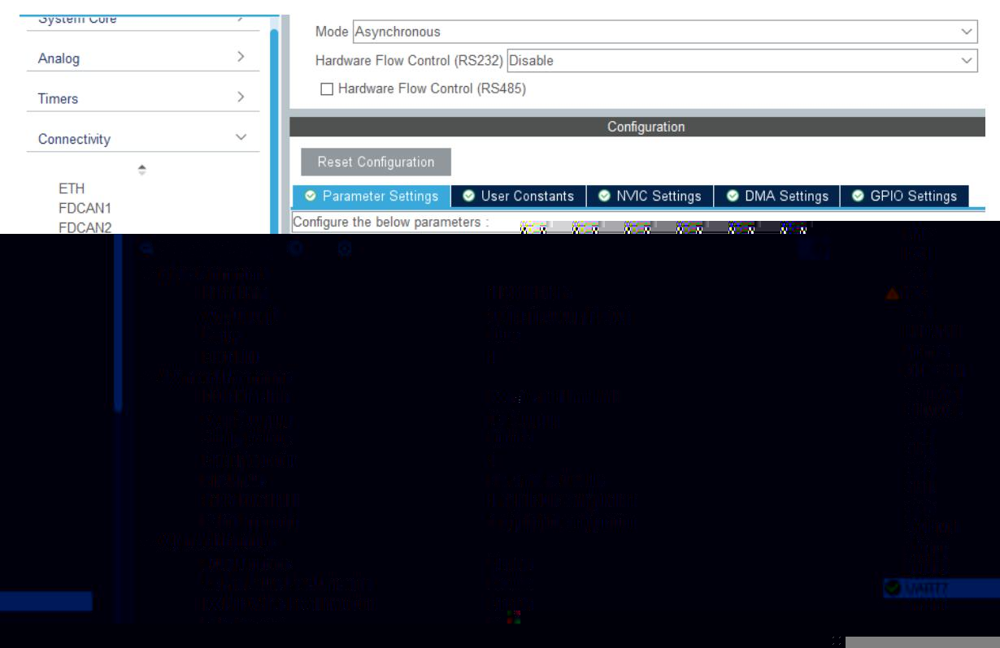
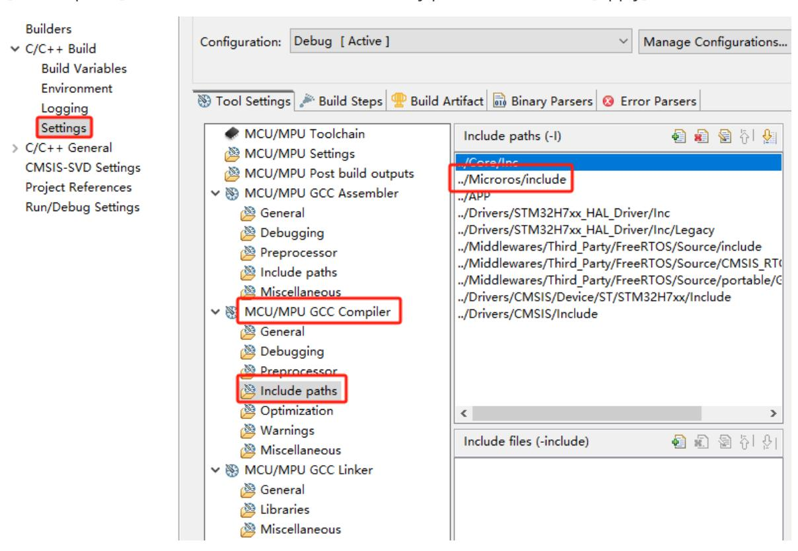
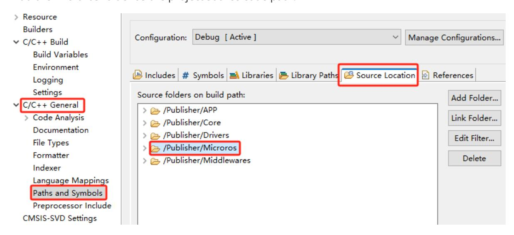
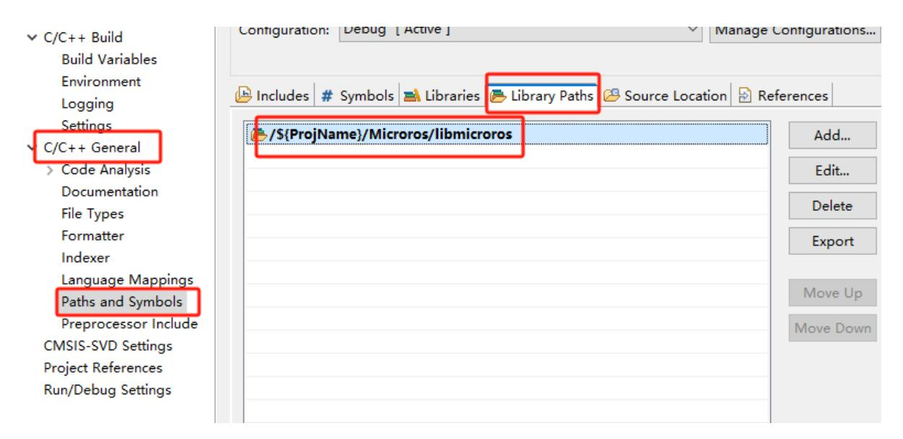

# Subscribe to a topic

## 1. Experimental Purpose

Learn about the STM32-microROS component, access the ROS2 environment, and subscribe to the int32 topic.

## 2. Hardware Connection

As shown in the figure below, the STM32 control board integrates the STM32H743 chip and can use the microros framework program.

Please connect the Type-C data cable to the USB port of the main control board and the USB Connect port of the STM32 control board.

If you have a USB-to-serial module such as CH340, you can connect to the serial port assistant to view debugging information.

Since ROS2 requires the Ubuntu environment, it is recommended to install Ubuntu22.04 and ROS2 environment on the main control board.



Note: There are many types of main control boards. Here we take the Jetson Orin series main control board as an example, with the default factory image burned.

## 3. Core code analysis

The virtual machine path corresponding to the program source code is:

Board_Samples/Microros_Samples/Subscriber

Since microros needs to handle more complex tasks, it is recommended to enable the FREERTOS function of STM32 and create a new microros processing task.


Since the FreeRTOS component is used, in order to avoid warnings, the system basic clock source needs to be replaced with a timer, here it is replaced with timer 7.


Since Microros needs to transmit a large amount of data, the baud rate is changed to 2Mbps and the DMA channels of TX and RX are enabled.



Since serial port 1 is used for Microros communication, the debug information printing is changed to serial port 7. Set the baud rate to 115200, 8-bit data, no parity, and 1 stop bit.



For ease of viewing, the debugging serial port of subsequent microros routines is redefined as serial port 7.

```
int _write(int file, char*p, int len)
{
  HAL_UART_Transmit(&huart7, (uint8_t *)p, len, 0xFF);
  return len;
}
```

Right-click to open the project properties, then click [Settings]->[MCU/MPU GCC Compiler]-> [include paths] to add the microros include directory path, and then click [Apply] to take effect.



Add the microros folder as the project source code path.



Import the microros library path



Link the microros library file to the project. Make sure the name matches the libmicroros.a static library file name (excluding the prefix and suffix "microros").


Initialize the configuration of microROS. The default value of ros2_domain_id is 30, which is consistent with the factory image configuration. If the DOMAINID of the ROS2 environment is changed to another value, the ros2_domain_id variable must also be changed to the same value for normal communication.

```
allocator = rcl_get_default_allocator();
    rcl_init_options_t init_options = rcl_get_zero_initialized_init_options();
    RCCHECK(rcl_init_options_init(&init_options, allocator));
    RCCHECK(rcl_init_options_set_domain_id(&init_options, ros2_domain_id));
    rmw_init_options_t *rmw_options =
rcl_init_options_get_rmw_init_options(&init_options);
```

Set the microros communication serial port and specify it as serial port 1.

```
int32_t set_microros_serial_transports_with_options(rmw_init_options_t *
rmw_options)
{
    int32_t ret = 0;
    ret = rmw_uros_options_set_custom_transport(
```

```
true,
        (void *) &huart1,
        cubemx_transport_open,
        cubemx_transport_close,
        cubemx_transport_write,
        cubemx_transport_read,
        rmw_options
    );
    return ret;
}
```

Set the method for requesting memory in the Microros system.

```
int set_microros_freeRTOS_allocator(void)
{
    rcl_allocator_t freeRTOS_allocator =
rcutils_get_zero_initialized_allocator();
    freeRTOS_allocator.allocate = microros_allocate;
    freeRTOS_allocator.deallocate = microros_deallocate;
    freeRTOS_allocator.reallocate = microros_reallocate;
    freeRTOS_allocator.zero_allocate = microros_zero_allocate;
    if (!rcutils_set_default_allocator(&freeRTOS_allocator)) {
        printf("Error on default allocators (line %d)\n", __LINE__);
        return -1;
    }
    return 0;
}
```

Try to connect to the proxy. Only proceed to the next step if the connection is successful. If the connection to the proxy fails, it will remain in the connecting state. In this case, you need to enable the proxy script on the control panel to connect.

```
while (1)
    {
        osDelay(500);
        state = rclc_support_init_with_options(&support, 0, NULL, &init_options,
&allocator);
        if (state == RCL_RET_OK) break;
        printf("Reconnecting agent...\n");
    }
```

After connecting to the proxy, create the node "YB_Example_Node" where ros2_namespace is empty by default, indicating the namespace of the node.

```
printf("Start YB_Example_Node\n");
    node = rcl_get_zero_initialized_node();
    RCCHECK(rclc_node_init_default(&node, "YB_Example_Node",
(char*)ros2_namespace, &support));
```

To create a publisher "int32_subscriber", you need to specify that the publisher's information is of type std_msgs/msg/Int32.

```
RCCHECK(rclc_subscription_init_default(
        &subscriber,
        &node,
        ROSIDL_GET_MSG_TYPE_SUPPORT(std_msgs, msg, Int32),
        "int32_subscriber"));
```

Create an executor, where the executor_count parameter is the number of executors controlled by the executor, which must be greater than or equal to the sum of the number of subscribers and publishers added to the executor.

```
printf("executor_count:%d\n", executor_count);
    executor = rclc_executor_get_zero_initialized_executor();
    RCCHECK(rclc_executor_init(&executor, &support.context, executor_count,
&allocator));
```

Add the publisher's timer to the executor and call the subscriber callback function if data arrives.

```
RCCHECK(rclc_executor_add_subscription(
        &executor,
        &subscriber,
        &msg,
        &subscriber_callback,
        ON_NEW_DATA));
```

If data is received, it is printed in the callback function.

```
void subscriber_callback(const void *msgin)
{
    const std_msgs__msg__Int32 * msg = (const std_msgs__msg__Int32 *)msgin;
    int32_t msg_data = msg->data;
    printf("data:%ld\n", msg_data);
}
```

The node and topic are processed, and the power LED_MCU indicator is on. Call rclc_executor_spin_some in the loop to make Microros work normally.

```
LED_ROS_ON();
    uint32_t lastWakeTime = xTaskGetTickCount();
    while (ros_error < 3)
    {
        rclc_executor_spin_some(&executor, RCL_MS_TO_NS(ROS2_SPIN_TIMEOUT_MS));
        if (ping_microros_agent() != RMW_RET_OK) break;
        vTaskDelayUntil(&lastWakeTime, 10);
        // vTaskDelay(pdMS_TO_TICKS(100));
    }
```

The ping_microros_agent function checks if the agent is connected and ends the loop if the connection is lost.

```
int32_t ping_microros_agent(void)
{
    static int ping_count = 0;
    ping_count++;
    if(ping_count > 100)
    {
        ping_count = 0;
        return rmw_uros_ping_agent(100, 1);
    }
    return RMW_RET_OK;
}
```

If the agent is disconnected or the topic is abnormal, the system will automatically restart the microcontroller.

```
printf("ROS Task End\n");
    printf("Restart System!!!\n");
    vTaskDelay(pdMS_TO_TICKS(10));
    HAL_NVIC_SystemReset();
```

## 4. Compile, download and burn firmware

Select the project to be compiled in the file management interface of STM32CUBEIDE and click the compile button on the toolbar to start compiling.


If there are no errors or warnings, the compilation is complete.

Since the Type-C communication serial port used by the microros agent is multiplexed with the burning serial port, it is recommended to use the STlink tool to burn the firmware.

If you are using the serial port to burn, you need to first plug the Type-C data cable into the computer's USB port, enter the serial port download mode, burn the firmware, and then plug it back into the USB port of the main control board.

## 5. Experimental Results

The MCU_LED light flashes every 200 milliseconds.

If the proxy is not enabled on the main control board terminal, enter the following command to enable it. If the proxy is already enabled, disable it and then re-enable it.

```
sh ~/start_agent.sh
```

After the connection is successful, a node and a subscriber are created.

At this point, you can open another terminal in the virtual machine/computer to view the /YB_Example_Node node.

```bash
ros2 node list
ros2 node info /YB_Example_Node
```

Send data to the /int32_subscriber topic

```bash
ros2 topic pub --once /int32_subscriber std_msgs/msg/Int32 "data: 100"
```

Open the serial port assistant and check the debugging information of serial port 7. You can see the received data printed.
