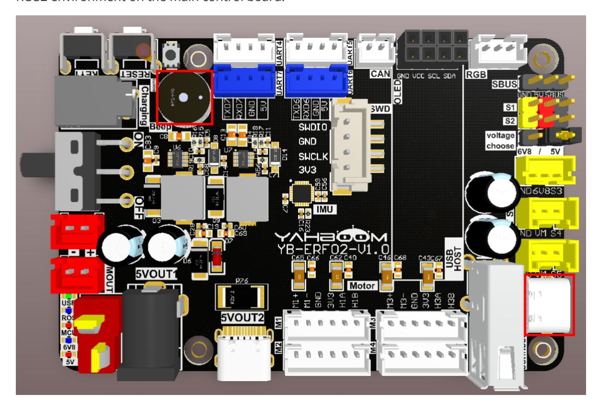

# Subscribe to the Buzzer Topic

## 1. Experimental Purpose

Learn about the STM32 micro-ROS component, access the ROS 2 environment, and subscribe to the topic of controlling the buzzer switch.

## 2. Hardware Connection

As shown in the figure below, the STM32 control board integrates an active buzzer.

Use a Type-C data cable to connect the USB port of the main control board and the USB Connect port of the STM32 control board.

Since ROS 2 requires the Ubuntu environment, it is recommended to install Ubuntu 22.04 and a ROS 2 environment on the main control board.



Note: There are many types of main control boards. Here we take the Jetson Orin series main control board as an example, with the default factory image flashed.

## 3. Core Code Analysis

The program source code is located at:

```
Board_Samples/Microros_Samples/Subscriber_beep
```

Create a subscriber beep, the message type is UInt16.

```
RCCHECK(rclc_subscription_init_default(
        &beep_subscriber,
        &node,
        ROSIDL_GET_MSG_TYPE_SUPPORT(std_msgs, msg, UInt16),
        "beep"));
```

Add a subscriber beep to the executor.

```
RCCHECK(rclc_executor_add_subscription(
        &executor,
        &beep_subscriber,
        &beep_msg,
        &beep_Callback,
        ON_NEW_DATA));
```

The buzzer receives data callback function and controls the buzzer switch.

```
void beep_Callback(const void *msgin)
{
    const std_msgs__msg__UInt16 * msg = (const std_msgs__msg__UInt16 *)msgin;
    uint16_t beep_time = msg->data;
    printf("beep:%d\n", beep_time);
    Beep_On_Time(beep_time);
}
```

Call rclc_executor_spin_some in a loop to make micro-ROS work properly.

```
while (ros_error < 3)
{
    rclc_executor_spin_some(&executor, RCL_MS_TO_NS(ROS2_SPIN_TIMEOUT_MS));
    if (ping_microros_agent() != RMW_RET_OK) break;
    vTaskDelayUntil(&lastWakeTime, 10);
    // vTaskDelay(pdMS_TO_TICKS(100));
}
```

## 4. Compile, Download, and Flash Firmware

In STM32CubeIDE, select the project in the file browser and click the compile button on the toolbar.


Compilation is complete when no errors or warnings are reported.

Since the Type-C communication serial port used by the micro-ROS agent is shared with the flashing serial port, it is recommended to use the ST-LINK tool to flash the firmware.

If you flash through the serial port, first plug the Type-C data cable into the computer's USB port, enter serial-port download mode, flash the firmware, and then plug it back into the USB port of the main control board.

## 5. Experimental Results

The MCU_LED light flashes every 200 milliseconds.

If the agent is not enabled on the main control board terminal, enter the following command to enable it. If the agent is already enabled, disable it and then re-enable it.

```
sh ~/start_agent.sh
```

After the connection is successful, a node and a subscriber are created.

Open another terminal and view the /YB_Example_Node node.

```bash
ros2 node list
ros2 node info /YB_Example_Node
```

Publish data to the /beep topic to control the buzzer to keep beeping.

```bash
ros2 topic pub --once /beep std_msgs/msg/UInt16 "data: 1"
```

Publish data to the /beep topic to turn off the buzzer.

```bash
ros2 topic pub --once /beep std_msgs/msg/UInt16 "data: 0"
```

Publish data to the /beep topic to control the buzzer to sound for 300 milliseconds and then turn off automatically.

```bash
ros2 topic pub --once /beep std_msgs/msg/UInt16 "data: 300"
```
